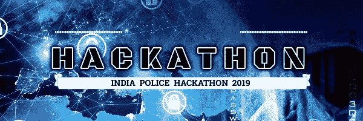
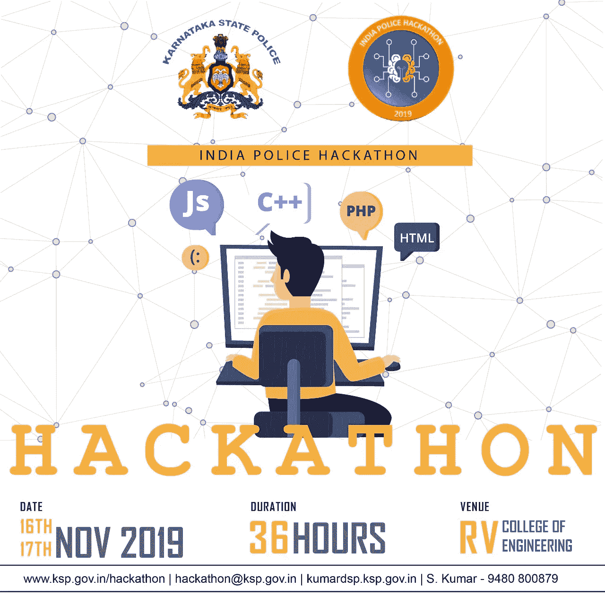
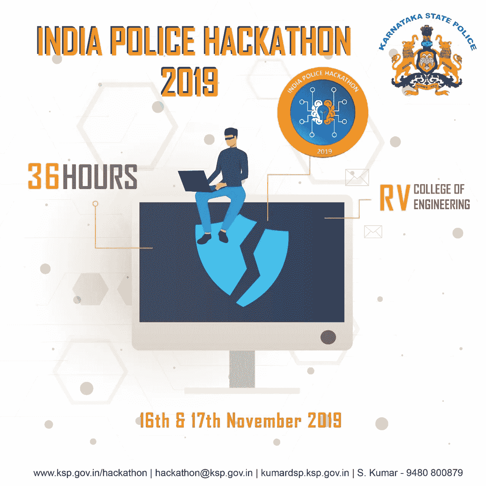
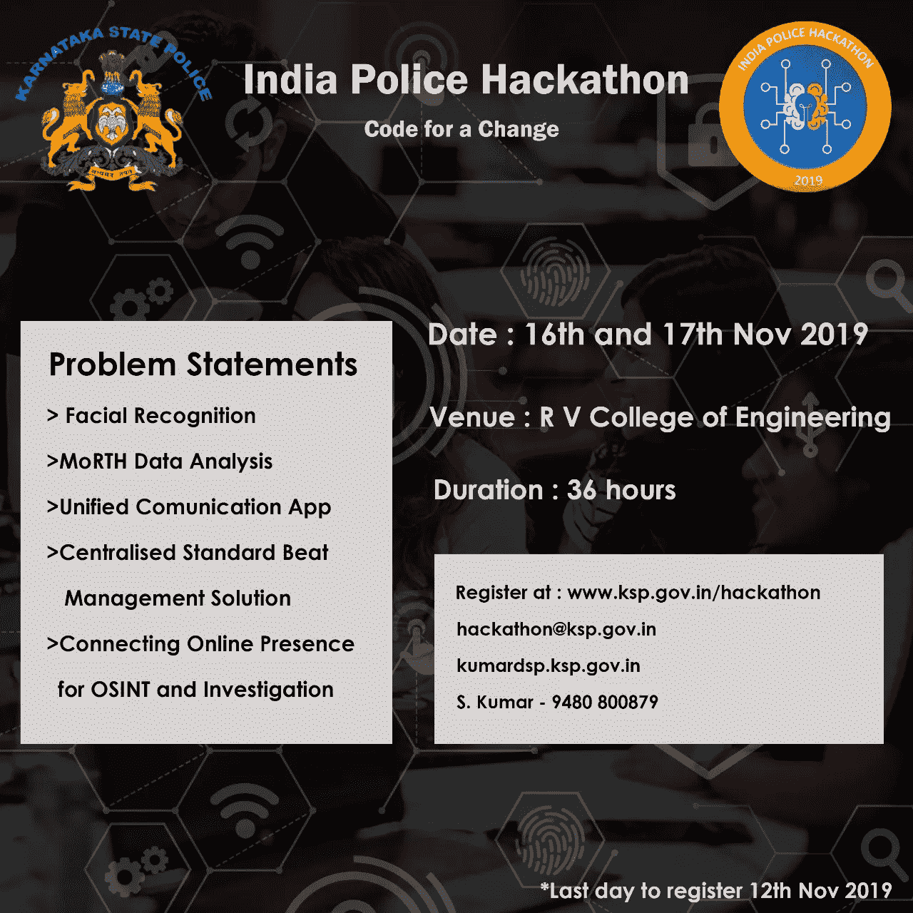
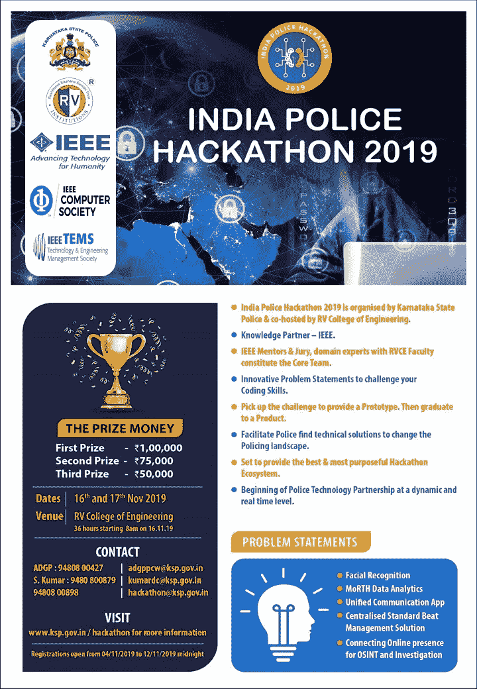

# 印度警察黑客马拉松 2019

> 原文：<https://medium.com/analytics-vidhya/india-police-hackathon-2019-d318dd77b329?source=collection_archive---------16----------------------->

一个人有多少机会与印度政府合作来帮助国家进步？如果政府和人民之间不存在伙伴关系，这个机构就会失败。

牢记这一目标，由 RV 工程学院、Bengaluru 和 IEEE the knowledge partner 共同主办的**卡纳塔克邦警察局**正在组织一场国家级**印度警察黑客马拉松 2019** 公益活动。36 小时的黑客马拉松将于 11 月 16 日和 17 日在孟加拉鲁鲁的 RV 工程学院举行。它对所有人开放，不收任何注册费。大学生、IT 行业、研究人员、警察和政府都被邀请参与。、国防和公共部门。

该活动的目标是从参与者那里获得问题陈述的编码解决方案，如面部识别、数据分析、开发统一的通信应用程序、集中式标准节拍管理解决方案，以及连接在线状态以进行开源情报和调查。获奖的编码解决方案将是原型，警方将在此基础上设计技术产品，以改善警察职能。让这次黑客马拉松脱颖而出的是，爱好者将有机会创新想法，改变公共服务的面貌。

为了激励公众，**价值约 30 万卢比**的现金奖励可供争夺。黑客马拉松也为参与者提供了体验与政府长期合作的机会。

**问题陈述:**

**1。** **面部识别:**必须开发一个应用程序来捕捉照片，并使用优化的面部识别算法在官方网站/警察数据库/互联网上搜索相同的照片

**2。** **MoRTH 数据分析:**警察部门正在寻找一个用户友好的应用程序来分享他们的思想、媒体、信息和想法，就像你在 WhatsApp 上做的一样！必须开发数据分析工具，以发现影响印度道路交通事故的不同原因/因素的相互作用。

**3。** **统一通信应用:**必须开发一个应用程序，将支持端到端的加密通信与审计跟踪。警察局正在寻找一个用户友好的应用程序来分享他们的想法，媒体，信息和想法，就像你在 WhatsApp 上做的那样！

**4。** **集中式标准巡逻管理解决方案:**必须开发巡逻管理工具，以确保更好的巡逻监控系统，根据犯罪数据模式降低巡逻区的犯罪率。它应该能够控制、监测、监督和策划对 beats 的监视。

**5。** **连接在线信息和调查:**根据给定的输入数据、姓名或照片，必须通过整理网络上的所有可用信息来建立个人的数字足迹。

这项团队活动(3-5 人)将进行一轮在线筛选，将派出 25 支队伍于 2019 年 11 月 16 日和 17 日在 RV 工程学院进行角逐。**官方网站的在线注册将于 11 月 13 日午夜截止**。

点击[http://www.ksp.gov.in/hackathon](http://www.ksp.gov.in/hackathon)，了解更多事件和问题陈述

赶紧赶快报名吧！

**警察的代号。印度代码**

**印度警察黑客马拉松 2019**