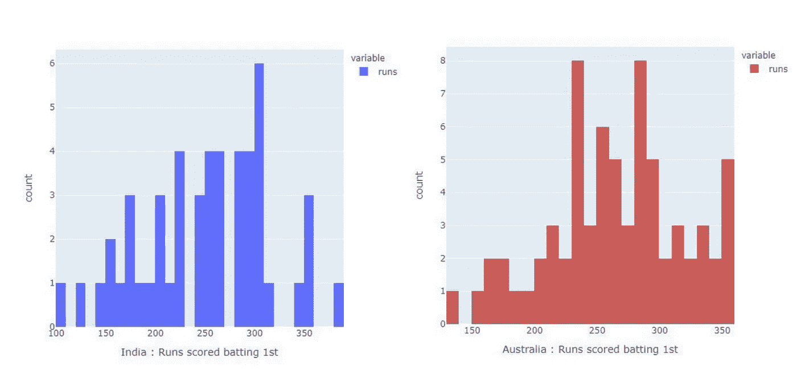
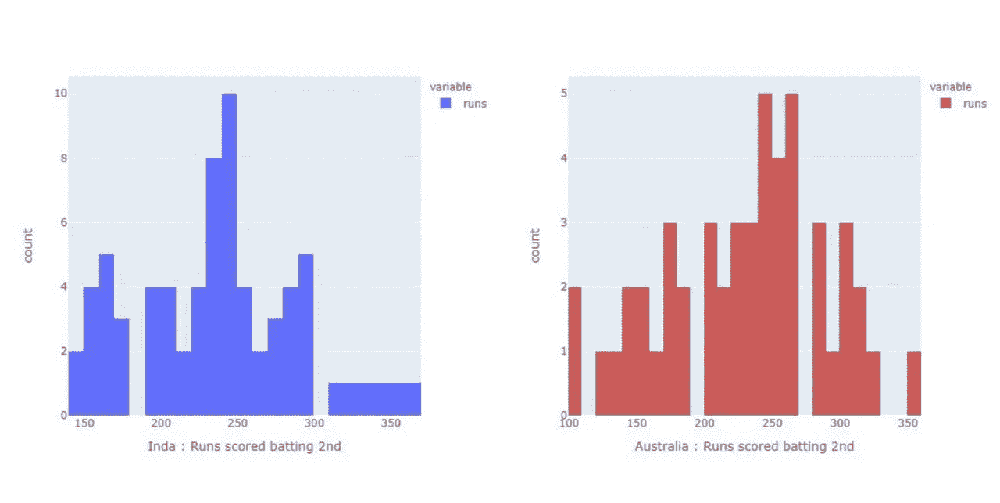
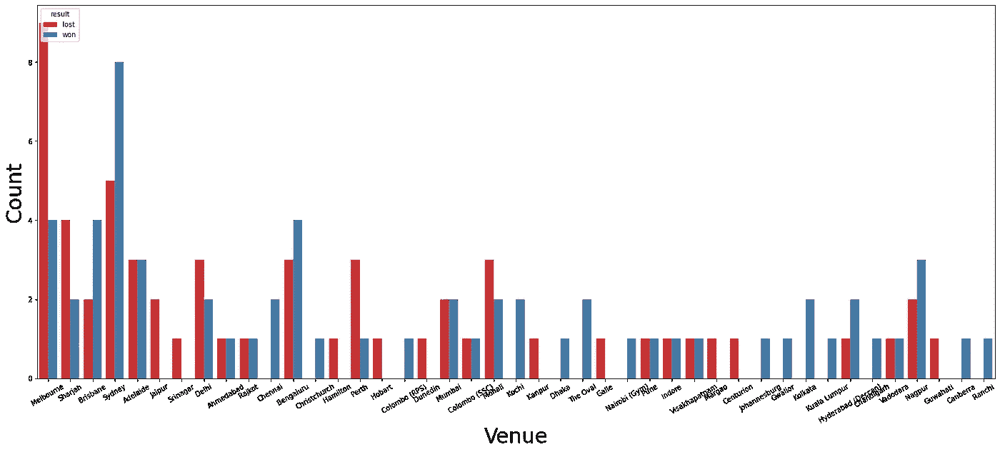
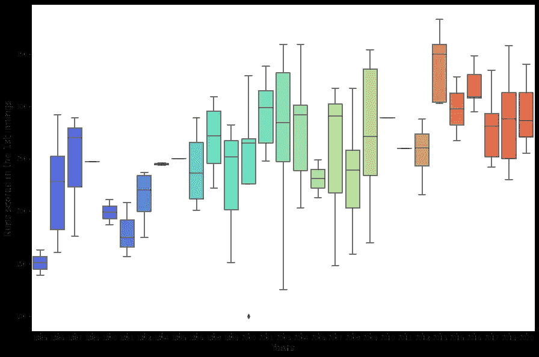
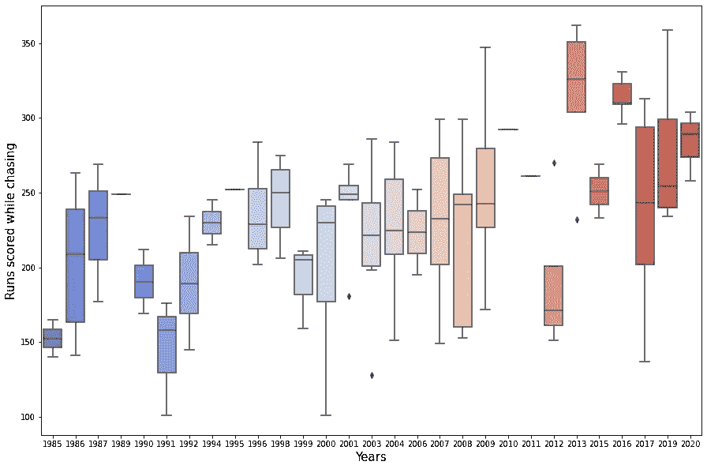
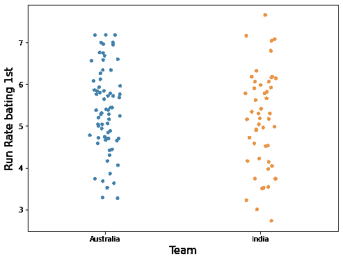
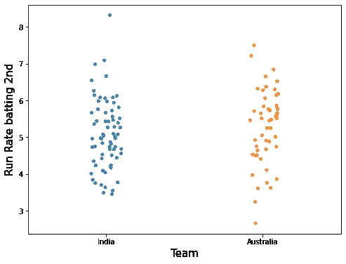
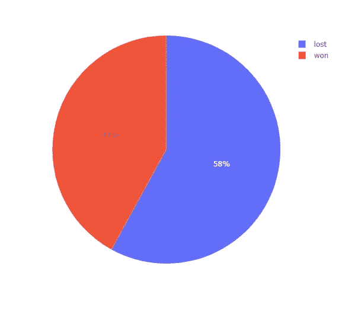
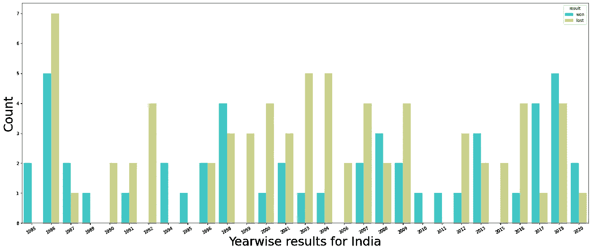

# 印度 vs 澳大利亚 ODI 板球赛数据可视化分析

> 原文：<https://medium.com/analytics-vidhya/india-vs-australia-odi-cricket-analysis-using-data-visualization-4644d0dab2da?source=collection_archive---------9----------------------->

在这篇博文中，我将对过去 35 年印度对澳大利亚的比赛做一个简短的分析。数据集取自 Kaggle。我的用于以下分析和数据可视化的 python 代码-[https://www . ka ggle . com/yashk 07/ind-vs-aus-ODI-cricket-analysis-data-viz](https://www.kaggle.com/yashk07/ind-vs-aus-odi-cricket-analysis-data-viz)

**数据集-**【https://www.kaggle.com/palashiitk/cricket-odi-results】T4

数据集包含曾经玩过一天国际板球的 27 个队的比赛记录，包括 24 个国家和 3 个比赛队:- ICC 世界 XI，亚洲 XI 和非洲 XI。我使用了印度对澳大利亚 ODI 比赛的数据进行分析。

# **为什么印度 vs 澳大利亚？**

印度对澳大利亚是国际板球最大的竞争之一。双方之间的有限回合比赛形式一直是一场激动人心的比赛，因此产生了一些有趣的统计数据。

# 我们开始吧！

*对于下面的数据可视化，我使用了这些 python 库——Matplotlib、Seaborn 和 Plotly。*

## 条形图、计数图和分布图

让我们看看第一次击球和追逐目标时的团队得分。

印度对澳大利亚比赛第一局的击球数据

12 次印度队在比赛中第一次击球时就打出了 300+分。而澳大利亚在第一局比赛中以 17 次 300+的成绩领先。显示出印度保龄球队在对抗澳大利亚人时并没有真正发挥作用。

在印度和澳大利亚比赛中追逐时的击球统计

印度追了 18 次 275+跑，而澳大利亚追了 11 次 275+跑。像 Dhoni 女士，Virat Kohli 和其他许多现代板球大师一样，印度一直在追求大比分。

**在不同场地第一次击球时，印度与澳大利亚比赛结果的趋势-**

大多数比赛都是印度的客场比赛。该图还显示了球场如何在不同的场地偏向于比赛结果。

**箱线图和剥离图**

第一局得分与第二年得分

第二局得分与年得分

这些情节描述了游戏多年来的变化。虽然 1985 年的平均击球得分为 150，但 2013 年后一直接近 300。因此，观看印度对澳大利亚的比赛是令人兴奋的！

虽然印度一直在以更高的跑分率(相当多的比赛中为 5-7 和 7+)追逐分数，并达到巨大的目标，这从前面的情节中可以明显看出，但澳大利亚在比赛的第一局中更加坚持不懈地击球。

## 饼状图

结果为印度，而击球第一对澳大利亚

印度在与澳大利亚比赛中的成绩

澳大利亚在追逐比赛中赢得了 70 场比赛中的 41 场，在防守比赛中赢得了 50 场比赛中的 29 场，胜率为 58%或以上。这显示了在 ODI 板球的 35 年中，黄方是多么的平衡。

# 最终计数图

很明显，澳大利亚在 ODI 板球的早期和 2000 - 2011 年间(通常被称为里奇·庞廷领导下的澳大利亚人的“黄金时代”)盖过了印度。但在最近几年，印度已经将澳大利亚的统治地位从一日赛的形式上赶了下来。总的来说，这是一场艰苦的比赛。