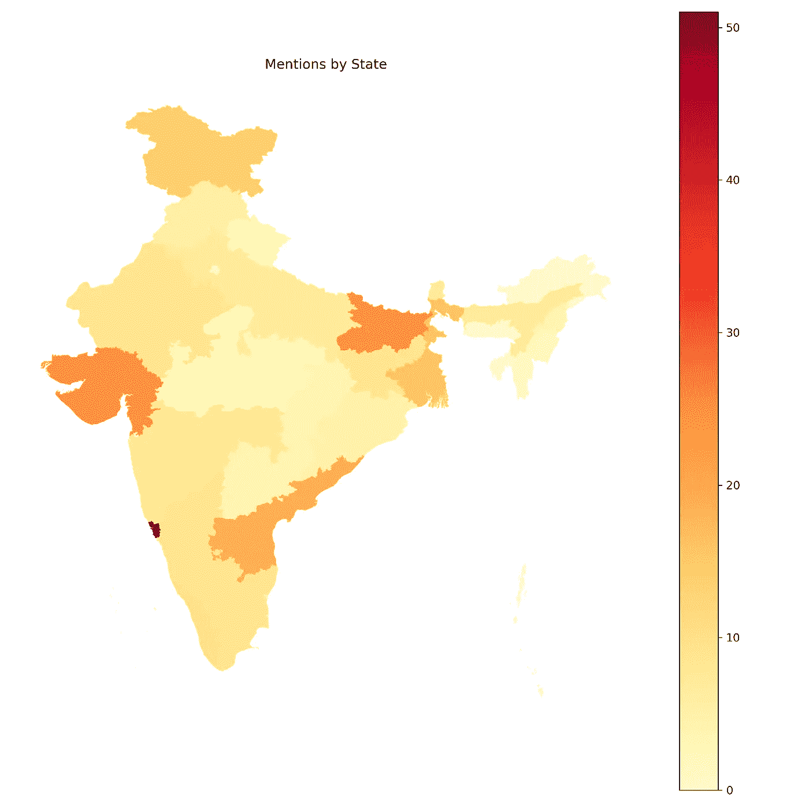

# 印度预算分析:第 1 部分

> 原文：<https://medium.com/analytics-vidhya/indian-budget-analysis-part-1-e5824c3b4dd1?source=collection_archive---------21----------------------->

## 印度预算数据是供数据科学家探索的数据矿

在一个日益资本主义化的世界里，金融和经济事务是我刻意回避的事情，因为它的多样性(由于我父亲是银行家，这也加倍困难)。然而，如果一些数字(尽管是非常重要的数字)吓到了你，你不能骄傲地称自己为数据科学家，于是我开始了与金融数据的第一次约会。

受 PhantomInsights 的墨西哥政府报告的启发，我决定将我的数据科学技能应用于印度的预算数据。我对印度政府保存的数字数据有点怀疑，但是他们已经做了出色的工作，汇编了所有相关的财政预算数据，一直追溯到 1947 年。令人惊讶的是，只有很少人探索过这个数据矿。

我的数据来源:【indiabudget.gov.in 

我把我的预算分析分成两篇文章，因为这是一个比较长的过程。然而，让我通过展示我在文章结尾所做的两个(许多)精彩的分析来激励你。

2000 年至 2019 年累计预算最高的部委

2000-2019 年财政部长支出比较

> “经济学太重要了，不能留给经济学家”
> 
> -埃丝特·杜弗洛和阿比吉特·班纳吉(2019 年诺贝尔经济学奖得主)

就这样，我们开始吧。

政府保存了从 1947 年到 2019 年的[预算数字记录。然而，旧的方法不够标准化，无法提取大量信息。为了我的分析，我将主要从两个不同的来源收集数据:**预算演讲**和**预算拨款**以及仅来自**2000-2019 的数据。**](https://www.indiabudget.gov.in/budget2019-20/previous_union_budget.php)

让我们首先使用*请求*库抓取预算演讲，并将它们存储在 pdf 文件中。

刮完了，我们来对这些发言做一些基本的分析。为此，我们将首先使用 [PyPDF2](https://pypi.org/project/PyPDF2/) 库将所有的演讲合并到一个文件中，对其进行标记并删除停用词。

现在让我们创建一个简单的单词云，它将给出演讲中最常用单词的概念。

预算演讲词云

> 预算案演辞中关键词的使用频率，让人们大致了解到几十年来经济政策重点的转变。

不出所料，像政府、计划、印度和克罗尔这样的词出现了很多次。然而，也有很多提到发展，就业，农村，生计(这也许是一个指标，事实上，印度仍然是一个发展中国家？).另一个令人兴奋的应用是将其与其他国家的预算词频(例如[澳大利亚](https://www.abc.net.au/news/specials/federal-budget-2012/2012-05-15/budget-talk-most-used-words-in-budget-speeches/4011824))进行比较，以了解偏好。

接下来让我们看看另一个有趣的分析，这是印度预算中提到的。为此，我们将使用 [geopandas](https://geopandas.org/) 库以及[印第安人形状文件](https://www.kaggle.com/somacodes/india-states)用于状态图。

预算中提到的国家

果阿邦、古吉拉特邦、安得拉邦和比哈尔邦是被提及最多的邦，而东北部各邦是最少被提及的。这就引出了预算分配中各州偏好的非常有趣的问题(各州是否分配了更多资金用于投票？分配较少的州在资金方面管理得很好吗？)

由于其非结构化的本质，语音数据本身并没有留下太多的分析空间。为了获得更多的见解，我们需要收集更多的数据，特别是预算拨款，如下所示。

在本博客的下一部分，我们将探讨同样的问题，并试图对我们政府财政的运作有更多的了解。

你可以在我的 [Github repo](https://github.com/volcas/indian_budget_analysis) 中找到我写的全部代码。请随意评论你对我所做的分析的任何见解或问题。

> 世界是一个大数据问题。”—安德鲁·迈克菲(麻省理工学院项目联合主任)

下次见！