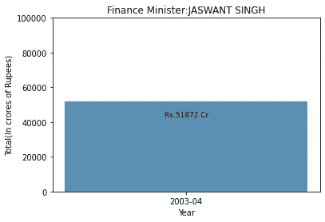

# 印度预算分析:第二部分

> 原文：<https://medium.com/analytics-vidhya/indian-budget-analysis-part-2-a3599bd3ff46?source=collection_archive---------28----------------------->

## 如果你有耐心去挖掘，印度的预算数据是一个数据矿

这是两部分系列的第二部分。你应该先读一下 [*这里的第一部分*](/analytics-vidhya/indian-budget-analysis-part-1-e5824c3b4dd1) *。*

在我试图解决金融数据科学问题的过程中，我选择了分析印度的预算数据。在第一部分，我从预算案演辞中搜集数据，发现了一些很好的见解

为了更好地了解情况，我们现在将削减预算拨款(这是指定给每个支出项目的资金数额)。

我们将使用" *requests"* 库来抓取它们，并将它们存储在 PDF 文件中。

您可以看到的数据已经是表格格式了。好消息是您有 python 库可以直接从 PDF 读取表格。我将使用 [tabula](https://pypi.org/project/tabula-py/) 库读取数据并转换成 CSV 文件。

坏消息是它们并不完全有效

PDF 数据

这是 excel 结果

整个数据被抓取，但不在我们想要的列和行中(注意“资本总收入”是一列，有三个不同列的值)。这意味着我们需要做清洁和大量的工作

> "从互联网上获取信息就像从消防水管中取水喝一样."

为了清理这个表，我们将它加载到一个 pandas 数据框中，并使用一些强大的 pandas 操作，我们将输出一个更好的表(注意:下面的代码很长，可能需要一段时间才能完全掌握)

如果你认为上面的代码很难，我还有一些坏消息要告诉你。我们搜集的预算条款的 pdf 文件在不同的年份使用了不同的字体和大小，这意味着我们将需要针对所有不同的变化稍微调整我们的代码。我编写了七个不同的函数来清理 18 个不同的 pdf 文件(存档中缺少 2008-09 年的文件)。

你可以在这里找到清洗代码[以及标准化不同部委名称所需的某些假设。](https://github.com/volcas/indian_budget_analysis/blob/master/Notebooks/Budget%20Provision%20Cleaning.ipynb)

以下是您花费 **12 天**编码和清理后得到的最终数据:

清理预算数据

做完这些，让我们开始有趣的部分。

我们将从每年预算最高和最低的部委开始

2009-2010 年度预算最高和最低的部委

您可以在此找到每年预算最高和最低的部委图表

顶部和底部的部委本身并没有增加多少价值，所以让我们绘制一个条形图，找出过去 20 年的累计顶部和底部的部委(即，当你将 20 年的资金相加时，哪些部委仍然在顶部和底部)。

首先，让我们画出预算最高的部委。

过去 20 年预算最高的部委

财政部和 T2 国防部显然是获得拨款最多的赢家。然而，话虽如此，你一定也很惊讶，我们的一大部分资金都流向了财政部。从表面上看，这听起来一定很荒谬，但这是用来创造更多货币的钱。你可以在这里了解更多

同样地，我们可以为预算最低的部门做一个(因为明显的原因，我只包括了这些年来一直存在的部门。像**地球科学部**、**食品加工工业部**等新的部委没有在图表中考虑)

过去 20 年预算最低的部委

几个预算较低的部委与自然资源的使用有关(**煤炭和矿产部**、**钢铁部**、**新能源和可再生能源部**等)。或许是因为这些资源得到了大型企业集团的大力支持，所以不需要明确的政府资助。其他各部(**议会事务**、**联合公共服务委员会**等)根据其需求获得适当资助。

接下来，让我们分析与财政部长及其支出相关的数据。

现在由于通货膨胀(T21 ),物价普遍上涨，货币购买力逐年下降。因此，要真正比较不同地区的金融数据，我们需要转换通胀数据。在这个过程中，我碰到了这个叫做“ [Easy Money](https://pypi.org/project/easymoney/) ”的奇妙的包，它帮助我们将按时间(通货膨胀)分离的数据标准化。

为此，我们将创建一个新的列“标准化总计”,其中将包含我们的校正数据。

下一步是将财政部长信息添加到数据框架中。为此，我们将使用我们的预算演讲数据(每个预算演讲文件都有提出预算的财政部长的名字)。使用文本规则和一些快速的技巧，我们将提取名字。

下一步是根据财政部长对我们的总数进行分组，将它们相加，然后绘制在柱状图上进行比较

财政部长及其支出

虽然这是一种有趣的方式来总结每个部长的支出，但由于每个人担任该职位的任期数量不同，它没有给出任何具体的比较。

理解每位财政部长支出的另一个有趣的方法是单独看他们。

在我看来，这要整洁得多。这也有助于发现一个异常现象，即 2012-2013 财年的支出。我找不到任何关于此事的政治新闻，所以很可能是因为我们清理数据导致了一些数据丢失。幸运的是，有了这些图表，你可以正确地假设这段时间的花费在 75-80 亿之间(做 ML 预测，是吗？)

如此多的数据，如此多的见解

至此，我结束了对印度预算这个惊人广阔世界的介绍性分析。这整个过程不仅帮助我更好地理解印度的预算支出，而且在这个过程中让我探索了一些奇妙的新技术和库，我将在未来更多地使用它们。

你可以在这里找到这个博客的全部代码。

请随意将我提到的数据和技术用于您自己的学习和分析

> “数字有一个重要的故事要讲。他们依靠你给他们一个声音。”—斯蒂芬·诺(感知边缘创始人)

感谢您阅读并参与我的数据科学冒险。

下次见！