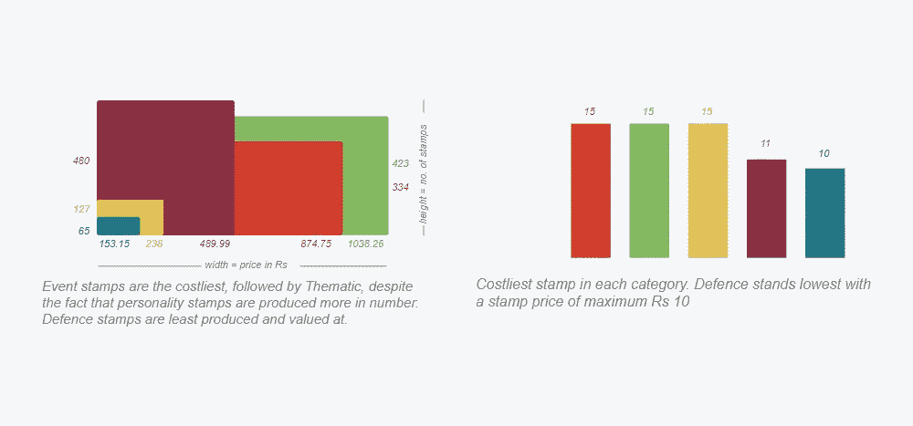

# 印度纪念邮票:数据可视化

> 原文：<https://medium.com/analytics-vidhya/indian-commemorative-postage-stamps-a-data-visualization-2efbea76a2e9?source=collection_archive---------24----------------------->

对于在 NID 学习信息设计的人来说，信息/数据可视化是一个非常期待的话题。在等待了整整一个学期和第二学期的几个星期后，我们被要求对一个选择的主题进行数据可视化。

巧合的是，对我来说，我开始对给远方的朋友写明信片和阅读邮票产生兴趣。在一周的失败尝试之后，我突然意识到，嘿，为什么不想象一下邮票，印度邮票。因此，这个可视化被创造出来，以探索从印度独立到 2000 年发行的印度纪念邮票的类型和增长。

**什么是纪念邮票？**

[纪念邮票](https://en.wikipedia.org/wiki/List_of_postage_stamps_of_India#List_of_commemorative_stamps_by_years)是一种邮票，通常在周年纪念日等重要日期发行，以纪念或纪念某个地方、事件、人物或物体。纪念邮票的主题通常用印刷体拼写出来，不像通用邮票通常只描述主题、面额和国名。

**这个视觉化是关于什么的？**

可视化试图探索自印度独立以来每年发行的邮票数量。它将不同类别、价格值..并对不同类别的邮票进行比较分析。

**可视化**

下面是邮票的全图(纪念版)。下面详细解释创建的过程。

A0 大小的印度纪念邮票图像

**怎么读？**

可视化图例

**放大**

我们从可视化的底部开始，它展示了所讨论的**年份**和圆圈的**大小**和年份下方的**数字**是该年发行的所有邮票的**综合价格值**(以印度卢比、派萨和安纳斯为单位)。

我们沿着时间线向上移动**类别圆**。每个类别都有颜色编码，类别圆圈周围的**小圆圈**就是当年发行的邮票的**号。**

然后我们得到水平线，根据**月份、**排列，每个邮票被绘制成一个圆(气泡)，其大小等于其**价格值**。

在最后一个月的月末，我们有一个特定的**类别**的**组合价格值**。

放大 1947 年至 1965 年

**真知灼见汇聚**

一些有趣的见解如下:

收集的见解

**数据来源和抓取**

数据是从这里的[和这里的](http://postagestamps.gov.in/Stamps_List.aspx)采集的。由于邮票的数量非常多，手工收集数据是不可能的。这时，我作为 python 开发人员的三年经验派上了用场。

我用[硒](https://selenium-python.readthedocs.io/)和[美汤](https://www.crummy.com/software/BeautifulSoup/bs4/doc/)写了一个 python 脚本，来刮上面提到的网站。收集的数据以 CSV 格式存储，稍后用于可视化。

python 脚本抓取的数据以 csv 格式存储

没有什么是容易的，数据也是如此。好像写一个 Python Scraper 还不够难，**清理**同样骇人听闻。

数据中的**面额栏**是一个字符串，价格值和货币附加在一起。除此之外，column 有多个货币值，所有的东西都必须转换成一个共同的分母/货币。对熊猫 T21 的快速操控给我带来了奇迹。

故事与**日期列**相同，是一个字符串，后来转换为 python 日期时间格式。

**D3.js 在行动**

我知道 tableau，但我不确定如何实现我脑海中的这种可视化形式。我想要的东西…我有完整的，像素级的控制。我正在学习 D3.js，当时我认为这是一个试验它的绝佳时机。

我想要一个分支/分叉的树状结构。根是一年，叶子是邮票的种类。用 D3 的[分层](https://observablehq.com/@d3/d3-stratify#:~:text=d3.,from%20link%20representation%20to%20hierarchy.&text=Here's%20a%20typical%20tree%2C%20visualized,labels%20from%20parent%20to%20child.)和[树](https://bl.ocks.org/d3noob/8375092)方法，我能够做到。

其余的 SVG 元素是圆和线，我能够成功地可视化一年的邮票。后来，使用了一个快速 while 循环，生成了从 1947 年到 2000 年所有年份的类似可视化。

D3 生成的基于 SVG 的可视化

这些年生成的可视化效果后来使用 Adobe Illustrator 进行了改进和调整。

总而言之，我真的很喜欢:

*   数据有多详细
*   用蟒蛇、硒和美人汤刮它
*   熊猫来构造它
*   使用 D3.js 生成完美的像素可视化

我还没有准备好放弃这个话题，所以，我创建了一个邮票可视化的邮票，只是为了好玩。

邮票的可视化

总之，这是我在信息/数据可视化方面的第一次尝试，在这个美丽的研究领域有很多东西有待发现。我很想听听你的建议、想法和提高自己的方法。谢谢你一路滚动。

下面是相同的 A0 打印模型。

A0 打印模型