# 印度货币分类器

> 原文：<https://medium.com/analytics-vidhya/indian-currency-classifier-e4b22ae2580?source=collection_archive---------11----------------------->

## 网络和安卓应用

我们的目标是对 10 英镑、20 英镑、50 英镑、100 英镑、500 英镑和 1000 英镑的印度纸币进行分类(没错，是旧款纸币——在非通用化之前)。

让我们不要过多地谈论理论，让我们开始实施吧。

你可以在这里找到所有的代码和相关文档:- [Github 仓库](https://github.com/piyushdavda007/indian-currency-classification)

# 环境:

## 对于模型创建:-

**语言** :- Python

**库** :- Tensorflow，Keras，Pillow，Matplotlotlib，Numpy

**IDE:-** Jupyter 笔记本，Google Colab，Pycharm

## 对于模型部署:-

> ***网络应用:***

**语言:-** Python

**库:-** 细流

**IDE:-** Visual Studio 代码

**浏览器(用于测试):-** 浏览器

> **安卓应用:**

**语言:-** 镖

**框架:-** 颤振

**包(Flutter 插件):-** tflite

**IDE:-** 安卓工作室

**安卓设备(用于测试):-** Nexus 6(模拟器)

# 让我们开始吧

首先，我们看了数据集。

你可以在这里找到数据集:- [数据集](https://github.com/piyushdavda007/indian-currency-classification/tree/master/Dataset)

我们将数据集分为训练和测试两部分。我们将 85%用于培训，15%用于测试部分。

你可以在这里找到分割数据集:- [分割数据集](https://github.com/piyushdavda007/indian-currency-classification/tree/master/Divided_Dataset)

分割数据集中的样本数量如下。

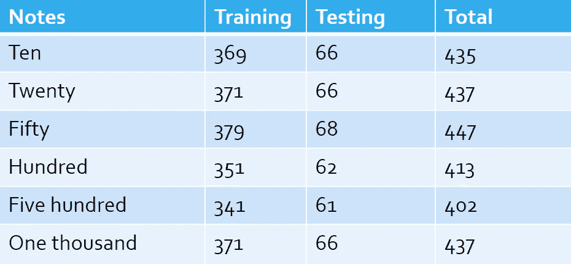

现在实际的编码来了，所以这些都是图像，所以 CNN 更适合图像，所以我们用 CNN。

在 CNN，如果我们想使用预先训练好的模型，我们必须使用一种叫做迁移学习的方法。

在这里了解更多关于转学的知识:- [转学博客](https://towardsdatascience.com/a-comprehensive-hands-on-guide-to-transfer-learning-with-real-world-applications-in-deep-learning-212bf3b2f27a)

有许多模型可以用于迁移学习，如 vgg16、vgg19、resnet、efficientnet、mobilenet、inception、xception 等。

我们尝试了具有不同超参数的所有模型，因为 mobilenet 提供了最大的准确性，所以我们选择了它。

在这里了解更多关于 mobilenet 的信息:- [Mobilenet 博客](https://machinethink.net/blog/mobilenet-v2/#:~:text=The%20full%20architecture%20of%20MobileNet,between%20these%20depthwise%20separable%20blocks)

所有型号的代码:- [Github](https://github.com/piyushdavda007/indian-currency-classification/tree/master/Model_Creation)

因此，我们采用超参数，这为我们的数据集提供了最佳的准确性。

> 模型的架构:

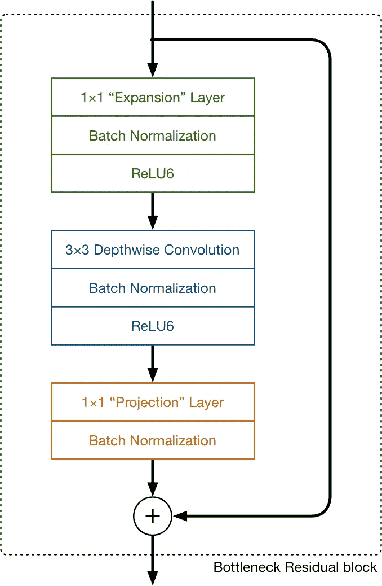

这是超参数。

> 纪元:- 100
> 
> 批量:- 16
> 
> 学习率:- 0.0001

这是准确度和损失的图表。

**精度图**

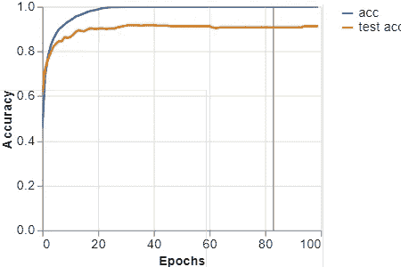

**损失曲线图**

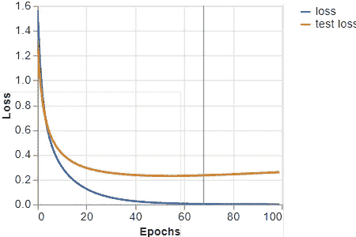

## 每类精度:-

使用测试样本计算每类的准确度。

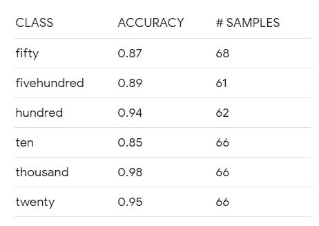

现在，我们的模型已经过训练，我们必须部署该模型，使其对最终用户可用。

因此，为了部署，我们同时开发了 web 应用和 android 应用。

## 使用 web 应用程序部署

因此，对于 web 应用程序，我们使用 python 中名为 streamlit 的库。

> 如何使用 streamlit，什么是 streamlit。

Streamlit 是一个开源的 Python 库，可以轻松地为机器学习和数据科学构建漂亮的定制 web 应用。

要使用它，只需 pip 安装 **streamlit** ，然后导入它，写几行代码，用 **streamlit** run【文件名】运行您的脚本。

你可以在这里获得更多关于 streamlit 的信息:- [Streamlit 文档](https://docs.streamlit.io/en/stable/)

我们应用的后端代码在这里:- [Github](https://github.com/piyushdavda007/indian-currency-classification/tree/master/Deployment/web-app)

所以现在是时候看看网络应用了。

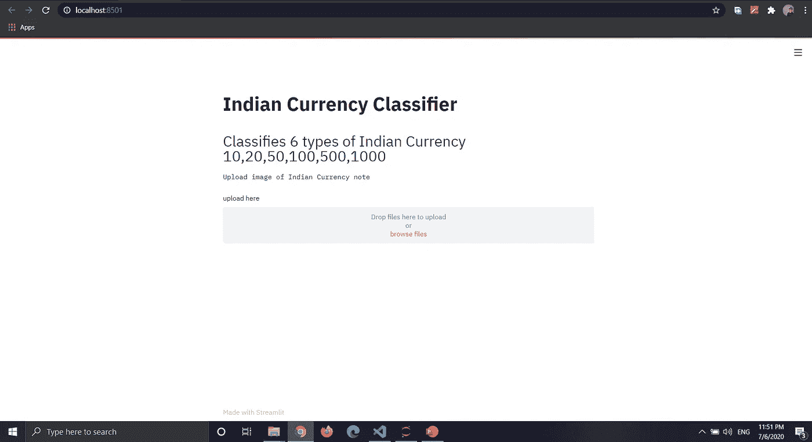

在这里你可以上传印度纸币的图片，它会告诉你这张纸币是什么样子的。

所以首先点击浏览文件。

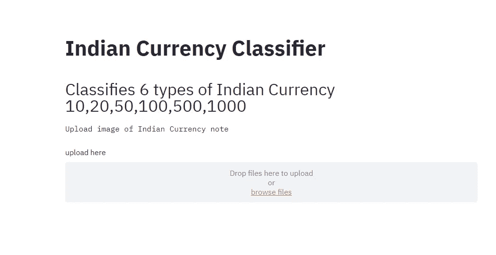

然后它会打开一个窗口来选择图像，就像这样。

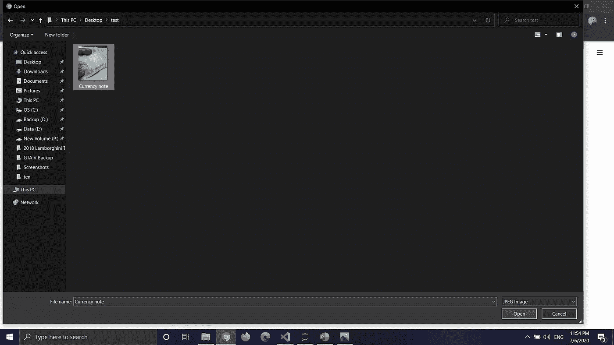

然后去你的图像所在的地方，

然后点击窗口左下角的打开。

现在你可以看到这样的屏幕

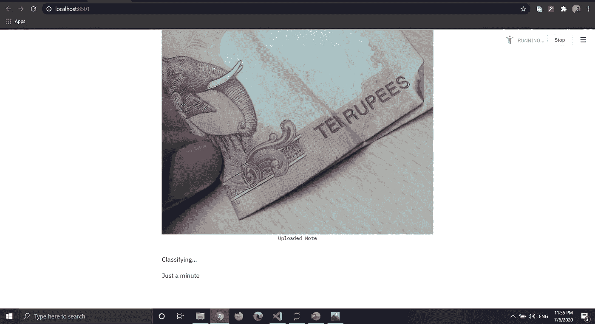

你可以看到它显示了你上传的图像，并说等一下(在后端模型正在对该图像进行分类)。

所以 30-40 秒后，你会得到这样的输出。

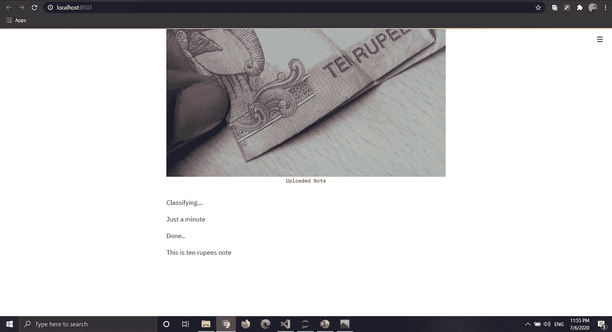

你可以看到它成功地将图像分类。

现在是安卓应用的时候了。

## 使用 Android 应用程序部署

对于 android 应用程序，我们使用了 google 开发的框架 flutter 和运行在 dart 语言上的框架。

> 什么是颤振？

**Flutter** 是一款应用 SDK，用于从单一代码库为 iOS、Android、web 和桌面构建高性能、高保真的应用。目标是让开发者能够在不同的平台上交付感觉自然的高性能应用。

现在你想知道它也适用于网络和桌面，那么为什么我们没有用于网络应用程序。

所以 web 的 flutter 目前是测试版，桌面的 flutter 还处于技术预览阶段，这就是为什么我们还没有使用 flutter。

所以在这里了解更多关于 flutter 的知识:- [Flutter 文档](https://flutter.dev/docs)

我们使用名为 tflite 的包将我们的 flutter 应用程序与我们的模型集成在一起。

> tflite 是什么？

一个访问 TensorFlow Lite API 的 Flutter 插件。在 iOS 和 Android 上都支持图像分类、物体检测( [SSD](https://github.com/tensorflow/models/tree/master/research/object_detection) 和 [YOLO](https://pjreddie.com/darknet/yolov2/) )、 [Pix2Pix](https://phillipi.github.io/pix2pix/) 和 [Deeplab](https://github.com/tensorflow/models/tree/master/research/deeplab) 和 [PoseNet](https://www.tensorflow.org/lite/models/pose_estimation/overview) )。

了解更多关于 flutter 的 tflite 包:- [tflite](https://pub.dev/packages/tflite)

我们的 flutter 应用程序的代码在这里:- [Github](https://github.com/piyushdavda007/indian-currency-classification/tree/master/Deployment/android-app/currency_predictor)

现在让我们浏览一下我们的 android 应用程序。

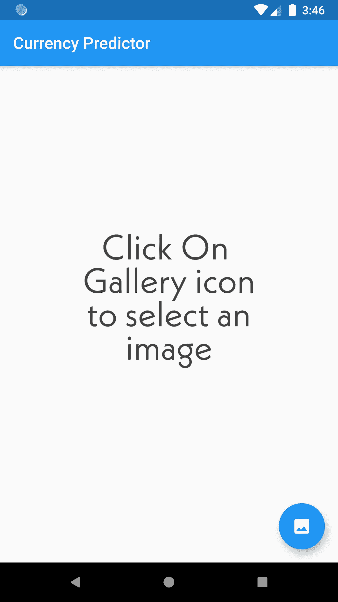

所以当你点击画廊图标，你会看到这样的。

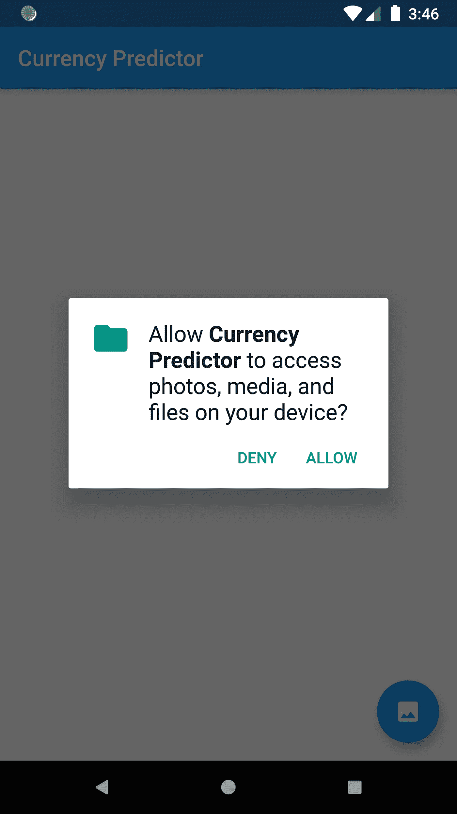

单击“允许”以授予访问您的图库的权限。

选择您想要识别的照片。

像这样它会给你输出。

您也可以通过再次点击该图库图标来上传另一张图片。

你知道这个应用程序最好的部分是什么吗- **它是在没有互联网连接的情况下运行的。**

就是这样。

所以你还在等什么，你也可以像这样建立模型和应用程序。

# 未来的可能性:

在 web 应用程序中，它运行在本地机器上，因此我们可以将它上传到云中并将其公开。

这个数据集有旧的印度纸币，所以我们可以用新的纸币制作数据集，并建立这个模型。

我们可以使用 auto-keras 来寻找最佳模型。

我们还可以与 jenkins 和 docker 等 devops 工具集成，以增加部署的自动化。

我们还可以让我们的 UI 部分更好地为 web 和 android 应用程序服务。

我们也可以只用 flutter 做 iOS app。

## 参考资料:-

1.  [https://towards data science . com/a-comprehensive-hands-on-guide-transfer-learning-with real-world-applications-in-deep-learning-212 BF3 B2 f27a](https://towardsdatascience.com/a-comprehensive-hands-on-guide-to-transfer-learning-with-real-world-applications-in-deep-learning-212bf3b2f27a)
2.  https://machine think . net/blog/mobilenet-v2/#:~:text = The % 20 full % 20 architecture % 20 of % 20 mobilenet，between % 20 these % 20 depth wise % 20 separable % 20 blocks。
3.  https://research.google.com/colaboratory/faq.html
4.  【https://docs.streamlit.io/en/stable/ 
5.  [https://flutter.dev/docs](https://flutter.dev/docs)
6.  [https://www . festivalclaca . cat/pics/b/31/318432 _ Indian-currency-png . png](https://www.festivalclaca.cat/pics/b/31/318432_indian-currency-png.png)
7.  [https://pub.dev/packages/tflite](https://pub.dev/packages/tflite)
8.  [https://appicon.co/](https://appicon.co/)

谢谢你一直陪我们到这里。

如果你想和我联系，这里是我的 LinkedIn:-[https://www.linkedin.com/in/piyushdavda/](https://www.linkedin.com/in/piyushdavda/)