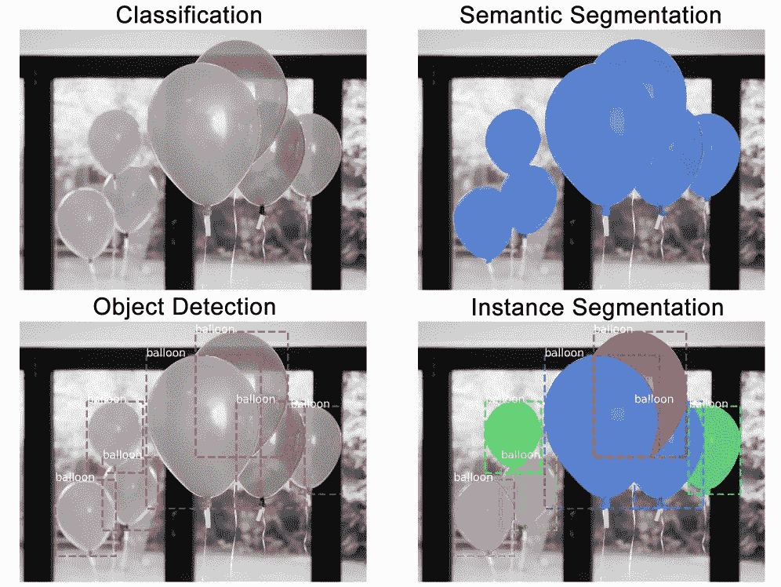
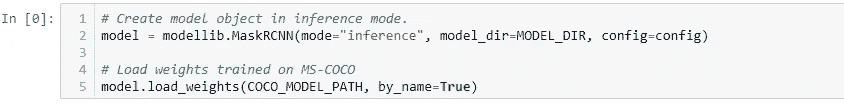

# 印度驾驶数据集:使用掩模 R-CNN 和张量流的实例分割

> 原文：<https://medium.com/analytics-vidhya/indian-driving-dataset-instance-segmentation-with-mask-r-cnn-and-tensorflow-b03617156d44?source=collection_archive---------4----------------------->

印度的道路混乱、危险，人类很难掌握。对于让一些自动驾驶成为可能的算法来说，这甚至更难，因为没有足够的印度路况数据可供学习。

但这种情况即将改变。IIIT-海德拉巴大学的一名计算机视觉科学家和他的团队已经准备好了世界上第一个印度驾驶状况的公共数据集(也是同类中最大的数据集)，该大学是该国 24 个国际信息技术研究所之一。目前正在公开的数据集将帮助世界各地的计算机视觉研究人员根据印度的驾驶条件训练他们的算法，最终找到可以使道路更加安全的解决方案。

**内容:**

1.  简介数据集
2.  细分类型
3.  屏蔽 R-CNN
4.  装置
5.  OpenCV 和屏蔽图像中的 R-CNN
6.  在 Python 中实现掩码 R-CNN
7.  COCO 配置
8.  创建模型并加载训练过的重量
9.  类名
10.  在 IDD 上执行屏蔽 R-CNN
11.  Mask R-CNN 可以实时运行吗？
12.  摘要

# **1。简介**

该项目由英特尔([链接](https://www.intel.ai/iiit-hyderabad-and-intel-release-worlds-first-dataset-for-driving-in-india/))资助，于 2017 年 11 月与特伦甘纳邦和卡纳塔克邦政府合作启动。IIIT·海德拉巴的团队开车绕过海德拉巴和本加卢鲁，这两个地区因交通拥堵而闻名。

在这个数据集中有不同的标签。但是我们的数据规模更大，由 10，004 个带有精细实例级边界的标记图像组成

城市景观中的道路边界非常明确，通常两侧都有护栏或人行道。然而，在我们的环境中情况并非如此。道路两侧可能有泥泞的地形，但在某种程度上也是可驾驶的。道路本身可能会被泥土覆盖，使得界限非常模糊。另一方面，城市景观模型通常会识别道路旁边的平坦区域，这些区域不需要像道路一样安全驾驶。

这些数据是从印度的班加罗尔和海德拉巴及其郊区收集的。这些位置混合了城市和农村地区、高速公路、单车道和双车道道路，交通状况各不相同。由于多种原因，这些地区的驾驶条件非常不规范。

# 2.细分类型？

实例分割是在像素级识别对象轮廓的任务。与类似的计算机视觉任务相比，这是最难的视觉任务之一。考虑以下问题:

*   **分类:**本图中有一个气球。
*   **语义分割:**这些都是气球像素。
*   **物体检测:**此图像中这些位置有 7 个气球。我们开始考虑重叠的物体。
*   **实例分割**:这些位置有 7 个气球，这些是属于每一个的像素。

# 3.屏蔽 R-CNN

掩模区域卷积神经网络(R-CNN)是更快的 R-CNN 对象检测算法的扩展，增加了额外的功能，如实例分割和额外的掩模头。这允许我们在每个对象的像素级别上形成分段，并且还将每个对象从其背景中分离出来。

Mask R-CNN 的框架基于两个阶段:首先，它扫描图像以生成提议；这些区域很可能包含物体。其次，它对这些建议进行分类，并创建边界框和遮罩。

这是一个用作特征提取器的标准卷积神经网络(通常为 ResNet101)。早期的层检测低级特征(边缘和拐角)，而后期的层连续检测高级特征(汽车、人、天空)。

通过主干网，图像从 1024x1024px x 3 (RGB)转换为 32x32x2048 形状的特征图。

根据其研究论文，与其前身 fast R-CNN 类似，它是一个两阶段框架:第一阶段负责生成对象提议，而第二阶段对提议进行分类，以生成边界框和遮罩。检测分支(分类和边界框偏移)和遮罩分支彼此并行运行。对特定类别的分类不依赖于掩码预测。然而，我们认为它是一个三阶段框架，盒子和掩码的生成是两个不同的阶段，因为我们不在 RPN 的所有建议上生成掩码，而只在我们从盒子头得到的检测上生成掩码。

我不打算详细说明 Mask R-CNN 是如何工作的，但这是该方法遵循的一般步骤:

1.  **骨干模型**:标准的卷积神经网络，作为特征提取器。例如，它会将 1024x1024x3 的影像转换为 32x32x2048 的要素地图，作为后续图层的输入。
2.  **区域提议网络(RPN)** :使用由多达 20 万个锚盒定义的区域，RPN 扫描每个区域并预测是否有物体存在。RPN 的一个很大的优点是不扫描实际的图像，网络扫描特征地图，使它更快。
3.  **感兴趣区域分类和包围盒:**在该步骤中，该算法将 RPN 提出的感兴趣区域作为输入，并输出分类(softmax)和包围盒(回归量)。
4.  **分割掩模**:在最后一步中，算法将正 ROI 区域作为输入，并生成具有浮点值的 28×28 像素掩模作为对象的输出。在推断过程中，这些遮罩会按比例放大。

# **4。安装**

以下是掩码 R-CNN 的所有依赖项列表:

*   *numpy*
*   *scipy*
*   *枕头*
*   *cython*
*   *matplotlib*
*   *scikit-image*
*   *张量流> =1.3.0*
*   *keras > =2.0.8*
*   *opencv-python*
*   *h5py*
*   伊姆格
*   *IPython*

在使用 Mask R-CNN 框架之前，您必须安装所有这些依赖项。

# 5. **OpenCV 和屏蔽图像中的 R-CNN**

既然我们已经看到了 Mask R-CNN 是如何工作的，那么让我们用一些 Python 代码来体验一下吧。

在我们开始之前，确保您的 Python 环境安装了 OpenCV 3.4.2/3.4.3 或更高版本。如果您想在 5 分钟或更短的时间内启动并运行，您可以考虑用 pip 安装 OpenCV。如果您有一些其他需求，您可能希望从源代码编译 OpenCV。

# 6.在 Python 中实现掩码 R-CNN

为了执行我将在本节中介绍的所有代码块，在克隆的 Mask_RCNN 存储库的“samples”文件夹中创建一个新的 Python 笔记本。

让我们从导入所需的库开始:

导入库

# 7.COCO 配置

我们将使用在 MS-COCO 数据集上训练的模型。这个模型的配置在 coco.py 的 CocoConfig 类中。

对于推理，稍微修改一下配置以适应任务。为此，子类化 CocoConfig 类并覆盖您需要更改的属性。

coco 工具配置

因此，主干是 resnet101，我们之前也讨论过。该模型将返回的遮罩形状是 28X28，因为它是在 COCO 数据集上训练的。而且我们一共 81 节课(包括后台)。

我们还可以看到其他各种统计数据，例如:

*   输入形状
*   要使用的 GPU 数量
*   验证步骤等等。

您应该花一些时间来理解这些规范。如果你对这些规范有任何疑问，欢迎在下面的评论区问我。

# 8.创建模型并加载训练过的重量

装载重量

modellib.maskRCNN:基本上它用于初始化 mask R-CNN 模型

接下来，我们将创建我们的模型并加载我们之前下载的预训练权重。确保预训练的砝码与笔记本放在同一个文件夹中，否则您必须给出砝码文件的位置。

# 9.类名

该模型对对象进行分类并返回类 id，类 id 是标识每个类的整数值。要获得类名列表，您需要加载数据集，然后像这样使用 class_names 属性。

类名

# 10.在 IDD 上执行屏蔽 R-CNN

面具 R-CNN 是一个相当大的模型。尤其是我们的实现使用了 ResNet101 和 FPN。所以你需要一个 10GB 内存的现代 GPU。它可能对更少的工作，但我没有试过。我使用谷歌联合实验室来训练这个模型，鉴于数据集很小，训练时间不到一个小时。

从 IDD 目录运行这个命令，开始训练。在这里，我们指定训练应该从预先训练的可可重量开始。代码将自动从我们的存储库中下载重量:

使用掩模 R-CNN 执行一个图像分割

让我们加载一个图像，并尝试查看模型的执行情况。您可以使用您的任何图像来测试模型。图像的输入和输出是

我们使用了掩模 R-CNN 模型和预训练的权重，并观察了它如何很好地分割图像中的对象。我们将首先从模型中获取预测，然后绘制结果以将其可视化。您可以看到图像是用标签名称进行实例分段的。

有意思。该模型在分割图像中的汽车和摩托车方面做得非常好。

使用掩码 R-CNN 的 idd 数据集的 gif 输出

gif 输出

# 11.Mask R-CNN 可以实时运行吗？

此时你可能想知道是否有可能实时运行 Keras + Mask R-CNN，对吗？

是的，我们可以跑。如你所知，Mask R-CNN 是基于更快的 R-CNN 物体探测器。更快的 R-CNN 在计算上非常昂贵，并且当您在对象检测之上添加实例分割时，该模型只会变得在计算上更加昂贵，因此:

*   **在 CPU 上，**一个 Mask R-CNN 无法实时运行。
*   **但是在 GPU 上，** Mask R-CNN 最高可以达到 5-8 FPS。

# 摘要

*   在印度驾驶数据集上执行实例分割。
*   我是用 Mask_RCNN 执行的
*   为了做到这一点，你需要安装一些工具
*   以及克隆用于分割的 Mask_RCNN 和 coco 工具
*   因此，我在 google colab 上执行的这整个事情首先我检查了 google colab 上的 GPU(如果它启用或不启用，如果不启用)
*   然后我安装 cython 和 utils
*   克隆 coco 工具，安装 setuptools 并设置 coco 工具
*   然后克隆 Mask_RCNN
*   在此之前，您必须加载 Mask_RCNN 的权重
*   之后，配置 coco 工具
*   并创建模型和装载列车重量
*   接下来我给出了类名
*   之后，我从 idd 数据集加载单个图像
*   然后我们得到检测图像标签的输出
*   之后我给出了所有的图片(我已经把它们合成了视频)
*   然后它检测所有的图像
*   所以在那之后，我把它们组合成视频
*   使用 Mask_RCNN，我们可以检测所有图像标签。
*   对于代码，我给我的 github 链接，请检查。

**|参考**

 [## ravitejarj/Instance-segmentation-on-IDD-use-mask-rcnn

### 屏蔽 rcnn。为 ravitejarj/Instance-segmentation-on-IDD-using-mask-rcnn 的开发作出贡献

github.com](https://github.com/ravitejarj/Instance-segmentation-on-idd-using-mask-rcnn)  [## matterport/Mask_RCNN

### 这是 Mask R-CNN 在 Python 3、Keras 和 TensorFlow 上的实现。该模型生成边界框和…

github.com](https://github.com/matterport/Mask_RCNN) 

[https://www . analyticsvidhya . com/blog/2019/07/computer-vision-implementing-mask-r-CNN-image-segmentation](https://www.analyticsvidhya.com/blog/2019/07/computer-vision-implementing-mask-r-cnn-image-segmentation/)

 [## cocodataset/cocoapi

### 此时您不能执行该操作。您已使用另一个标签页或窗口登录。您已在另一个选项卡中注销，或者…

github.com](https://github.com/cocodataset/cocoapi/tree/master/PythonAPI/pycocotools)