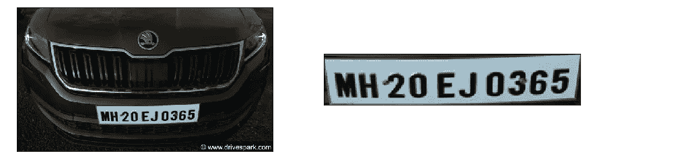
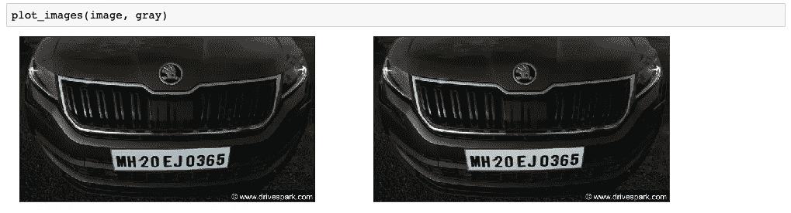
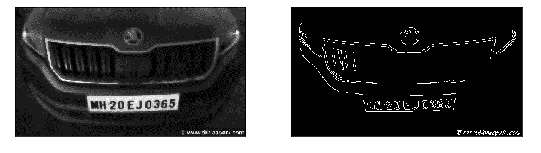
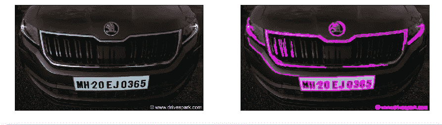
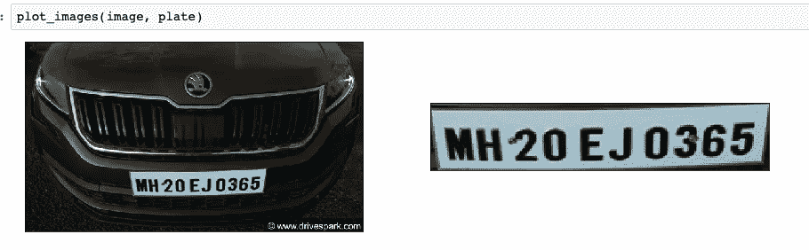

# 使用 OpenCV & Pytesseract 检测印度车牌

> 原文：<https://medium.com/analytics-vidhya/indian-license-plate-detection-using-opencv-pytesseract-ee347d2ff8f7?source=collection_archive---------19----------------------->



有了这个循序渐进的教程，你将能够接受用户的图像，检测车牌，然后识别写在车牌上的文字。在本教程中，我们将使用一些库:

OpenCV(用于基本图像处理)

Pytesseract(用于从图像中提取文本)

首先:确保你有一个清晰的图像，以便正确提取车牌

为了尽可能准确地处理图像，我们需要将图像转换成灰度。这可以通过以下方式轻松实现:

```
image = cv2.imread(image_path)
gray = cv2.cvtColor(image, cv2.COLOR_BGR2GRAY)
```

为了让我们的步骤更直观，一个显示我们前进过程的功能可能会派上用场。这个功能所做的就是以并排的方式显示照片，这样更容易跟踪进度。(注:这部分绝对可选)

```
def plot_images(img1, img2, title1="", title2=""):
    fig = plt.figure(figsize=[15,15])
    ax1 = fig.add_subplot(121)
    ax1.imshow(img1, cmap="gray")
    ax1.set(xticks=[], yticks=[], title=title1)ax2 = fig.add_subplot(122)
    ax2.imshow(img2, cmap="gray")
    ax2.set(xticks=[], yticks=[], title=title2)
```

所以我们可以看到这样的图像:



现在，我们需要平滑图像，但我们同时需要确保边缘完好无损。OpenCV 中有一个函数可以做到这一点:`cv2.bilateralFilter(img, d, sigmaColor1, sigmaColor2)`其中 d 是它周围每个像素的直径。

借助 OpenCV 中的 Canny，我们可以很容易地从图像中检测出边缘。这借助于给定像素周围的 BGR 的差异而发生。在这之后，图像应该看起来像这样:



现在我们有了边缘，让我们把它们转换成轮廓(轮廓基本上是连接沿着图像边界具有相同强度的所有点的线)。这是通过 findContours()函数实现的，该函数将边作为参数。如果我们要找出一条直线的轮廓。我们只需要这条线的两个端点。这就是`cv2.CHAIN_APPROX_SIMPLE`的作用。它删除所有冗余点并压缩轮廓，从而节省内存。

```
cnts, new = cv2.findContours(edges.copy(), cv2.RETR_LIST, cv2.CHAIN_APPROX_SIMPLE)
```

轮廓应该是这样的:



由于我们可以清楚地看到轮廓，让我们使用 drawContours()将它们绘制到我们的图像上。我们在这里所要做的就是在第二个参数中传递-1，以表明我们想要绘制所有检测到的轮廓:

```
_ = cv2.drawContours(image_copy, cnts, -1, (255,0,255),2)
```

轮廓的坐标现在已经存储，我们需要做的就是用存储的坐标裁剪图像，瞧！我们有车牌。

```
plate = None
for c in cnts:
 perimeter = cv2.arcLength(c, True)
 edges_count = cv2.approxPolyDP(c, 0.02 * perimeter, True)
 if len(edges_count) == 4:
 x,y,w,h = cv2.boundingRect(c)
 plate = image[y:y+h, x:x+w]
 breakcv2.imwrite(“plate.png”, plate)
```



我们还需要从 pytesseract 支持的图像中提取文本:

```
text = p.image_to_string(plate, lang=”eng”)
```

# 正文:MH20EJ0365

希望这篇教程在某种程度上帮助了你，现在你对我们如何在它们的帮助下找到轮廓和探测物体有了更清晰的理解。

为了你的参考，我在下面也提到了我的 GitHub 链接，你可以随意浏览整个代码来更清楚地理解它。

[T3【https://github.com/kunjshah2511/License-Plate-Detection】T5](https://github.com/kunjshah2511/License-Plate-Detection)