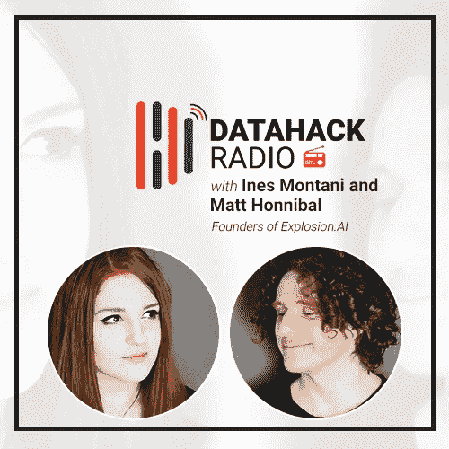
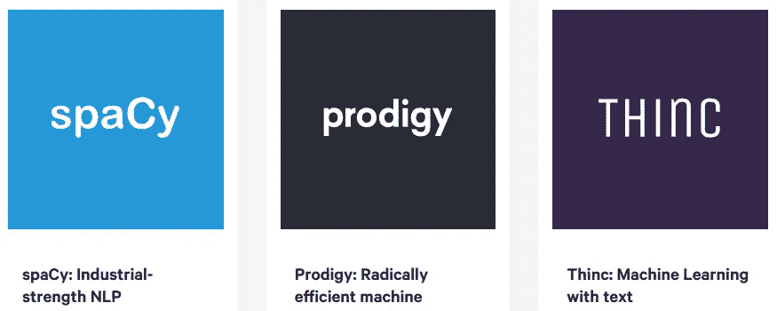

# 伊内斯·蒙塔尼和马修·霍尼巴尔——斯帕西背后的大脑

> 原文：<https://medium.com/analytics-vidhya/ines-montani-and-matthew-honnibal-the-brains-behind-spacy-c1411a47312d?source=collection_archive---------2----------------------->

# 介绍

如果你有机会为我们这个时代最受欢迎的自然语言处理库之一出谋划策，你会怎么做？一个帮助引领了当前 NLP 应用热潮并培养了大量 NLP 科学家的库？

好吧——你邀请我们广受欢迎的 DataHack 电台播客的创作者，让他们来说吧！我们非常高兴地欢迎 Ines Montani 和 Matt Honnibal，他们是 spaCy——NLP 的一个强大而先进的库——的开发人员。

没错——你想知道的关于奇妙的空间图书馆的一切都在最新的 DataHack 广播播客中。

这个播客是一个 40 分钟以上的 NLP 爱好者和从业者的富矿。Ines 和 Matt 谈到了 spaCy 和 NLP 的所有内容，包括:

*   开发空间背后的想法
*   spaCy 从第一个 alpha 版本到当前版本 2.1 的惊人发展
*   spaCy 的使用案例包括几个令人惊讶的应用
*   Ines 和 Matt 给 NLP 爱好者的建议

还有很多很多！

我在这篇文章中总结了关键要点和亮点。**享受这一集，不要忘记在以下任何平台上订阅分析 Vidhya 的 DataHack 广播播客:**

*   [**音云**](https://soundcloud.com/datahack-radio)
*   [**分析 Vidhya**](https://www.analyticsvidhya.com/blog/category/podcast/?utm_source=blog&utm_medium=datahack-radio-ines-montani-matthew-honnibal-brains-behind-spacy)
*   [**iTunes**](https://itunes.apple.com/in/podcast/datahack-radio/id1397786677?mt=2)
*   [**谷歌播客**](https://www.google.com/podcasts?feed=aHR0cDovL2ZlZWRzLnNvdW5kY2xvdWQuY29tL3VzZXJzL3NvdW5kY2xvdWQ6dXNlcnM6NDU5MzM1NzYwL3NvdW5kcy5yc3M%3D)

# 空间图书馆背后的大脑

《T21》背后的故事是这样的。在他毕业的日子里，Matt 为一个特定的自然语言处理(NLP)任务编写了代码。他已经在 NLP 工作了很长时间，有几家公司想使用他的研究代码。

然而，该代码还不能用于通用目的(它更适合于执行特定的任务)。Matt 希望构建一些可以用于更广泛的 NLP 功能的东西。由此，空间的概念诞生了。

在 spaCy 的第一个 alpha 版本发布后不久，Matt 遇到了 Ines。此后，他们在 spaCy 上进行了合作，并成立了他们的公司——Explosion . AI。Explosion AI 是一家专注于人工智能和自然语言处理的数字工作室。他们的三个主要产品是:

我真的很喜欢 Ines 和 Matt 最初在 spaCy 工作的故事。Ines 对 spaCy 工作的计算语言学方面以及公司可以用它来建立真正重要的系统的想法很感兴趣。

关于 Ines 当时理解 NLP 任务背后的算法的第一反应，有一个有趣的轶事。我不会在这里破坏它——所以一定要听这一节！

# 发展空间的动力和理念

NLTK 库在 spaCy 开发出来之前就存在了。那么，为什么首先要创造空间呢？创建不同的 NLP 库背后的动机是什么？我相信 spaCy 出来的时候你们大多数人肯定都问过这个问题。

正如 Matt 所说，在我们回答这些问题之前，理解 NLTK 库是很重要的。NLTK 是用不同的代码库开发的，更多的是从教授 NLP 主题的角度出发。

> “对商业 NLP 的需求来自不同的优先级。其中最重要的优先事项之一是效率。获得有效的 Python 可用的东西的最好方法是用 Cython 编写 C 扩展——语言空间最终是用它实现的。”—马特·洪尼巴尔

Matt 开始研究 spaCy 时，线性模型曾经非常流行，因为:

*   这些型号使用了大量的机器内存
*   它们可以使用 C 或 Cython 快速实现

没有可能为 NLTK 编写这些 C 扩展。此外，Matt 希望开发一个采用不同方法的不同 NLP 库。因此 spaCy 旨在填补这些空白，并为在 NLP 工作的人们提供不同的视角。

# spaCy 和 Prodigy 的商业方面

从一开始就存在从空间中创建业务方面的空间。问题是它是否必须来自咨询方面或其他方面。

Ines 和 Matt 在旅程开始时选定了注释工具。根据 Ines 的说法，这个问题不断出现。所以问题是——人们在用什么，什么对他们有效？有两个突出的特点:

*   命名实体识别
*   创建标记数据和运行实验

我相信大多数在 NLP 工作的人都会有同感！由于这些特点，Ines 和 Matt 实际上提出了 Prodigy 背后的概念。Prodigy 是一个注释工具，数据科学家可以使用它自己进行注释，实现新水平的快速迭代。无论您是在进行实体识别、意图检测还是图像分类，Prodigy 都可以帮助您更快地训练和评估您的模型。谁不想这样呢？

# 空间的演变(从 v1 到 v2.1)

> “这在很大程度上受到围绕 NLP 的研究和开发的影响。”

spaCy 的第一个版本是用我们上面看到的线性模型技术构建的。这是在神经网络仍处于婴儿期的时候，还没有准备好席卷机器学习世界。

一旦革命到来，当神经网络变得越来越主流时，spaCy 就从版本 1 切换到版本 2。spaCy 2.0 中的许多关键特性都围绕着各种 ML 管道组件(如即插即用架构)，受到不断发展的机器学习社区的启发和影响。

spaCy 2.1，当前版本，更倾向于稳定性和性能。它的突出特点之一是处理迁移学习和语言模型——这两个概念加速了 NLP 领域的研究和进展。

那么 spaCy 的下一步是什么？我们可以从未来的更新中期待什么样的新功能？马特说:

> *“spaCy 的核心用途之一是信息提取。基本上，从非结构化文本到结构化知识。* ***我们正在做的是一个新的实体链接组件****——将名称解析为基于知识的条目。我们目前正在进行开发，应该会在 7 月 spaCy 会议召开时准备好。”*

他们正在进一步将各种地区语言整合到 spaCy 环境中。激动人心的时刻即将到来！

# spaCy 的一些令人惊讶的使用案例

机器学习的美妙之处在于其庞大的范围和复杂性。即使是库或包的创建者有时也会惊讶地发现它的用例。下面是一些 Ines 和 Matt 没有想到的 spaCy 的使用案例:

*   从简历中提取信息(PDF 解析)
*   使用网络日志

我很想听听我们社区的意见——你遇到过什么独特的空间使用案例吗？或者你已经用自己做了实验？请在下面的评论区告诉我！

# 自然语言处理和空间的未来趋势

在过去的 12-18 个月中，随着突破性框架的发布，如 OpenAI 的 GPT-2、Google 的 BERT、fast.ai 的 ULMFiT 等，NLP 取得了突飞猛进的发展。那么，NLP 和 spaCy 在接下来的 2-5 年将会怎样呢？

Ines 和 Matt 对此提供了相当深入和有见地的答案。以下是我的要点:

*   使 NLP 模型变得更小、更高效。换句话说，哪些算法将能够随着越来越大的数据大小和不断增长的数据集而扩展？
*   考虑到这些未来的趋势，Ines 和 Matt 已经在致力于提高 spaCy 和 Prodigy
*   我们可以期待很快在 spaCy 中看到很多迁移学习方面的内容(你好预训练模型！).在训练我们的 NLP 模型上花费少得多的时间，并且不必永远等待它收敛，对我来说听起来很完美

# 在接下来的 3-4 年里，你想在 NLP 中解决的一个问题是什么？

我喜欢 Kunal 的这个问题，下面是 Matt 的完整回答:

> *“一个更好的信息提取过程，可以针对自定义问题进行训练，并且还支持实体链接。并且具有用于注释的集成过程。*
> 
> *人们现在最终会制造临时系统。spaCy 有一些有用的组件，但我们可以做得更好。”*

这是 Ines 的想法:

> *“建立一套最佳实践，并将我们所学所见的一切整合在一起。目前，很多都是试错法。很难推荐什么东西，因为每个用例都不一样。*
> 
> 在接下来的 203 年里，我希望我们能够更好地理解最佳实践、工作流程，以及如何构建能够很好地适用于不同用例的端到端系统。”

# 给 NLP 爱好者和有抱负的数据科学家的建议

以下是 Ines 和 Matt 对 NLP 爱好者和有抱负的数据科学家的黄金建议的总结:

*   磨练你现有的技能，加工你正在学习的东西，这样你就可以为一个已经在这个领域交付成功项目的团队做出贡献。不要一开始就说“我想成为一名 NLP 专家”。这可能会导致你运行可能会失败的项目，因为你不太可能对领导层和其他决策者有足够的影响力
*   NLP 不仅仅是吸引有抱负的数据科学家的现代深度学习算法。它有许多组件，例如:
*   建筑软件
*   建筑应用/产品
*   理解自然语言处理问题的逻辑、结构和规则，而不是找到一种放之四海而皆准的方法来建立模型

# 结束注释和资源

我们在 Analytics Vidhya 的数据科学家是 spaCy 的忠实粉丝和用户。自从它推出以来，我们就一直在使用它，并将其融入我们的研究和课程中。对于 NLP 任务来说，这是一个真正优秀的库。

总结一下，这里有一些你可能会觉得有用的资源:

*原载于 2019 年 6 月 3 日 https://www.analyticsvidhya.com***。**