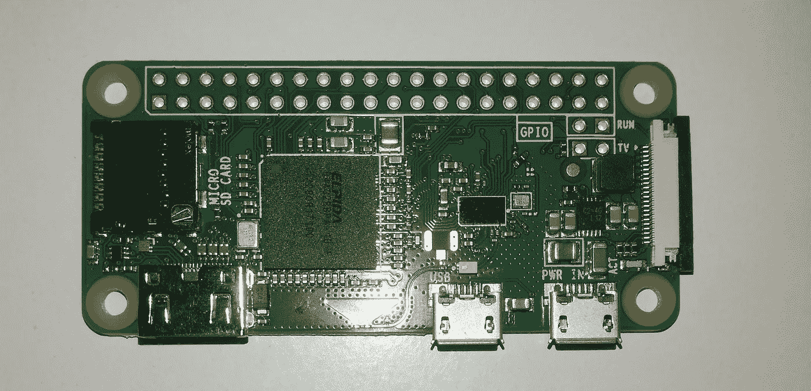
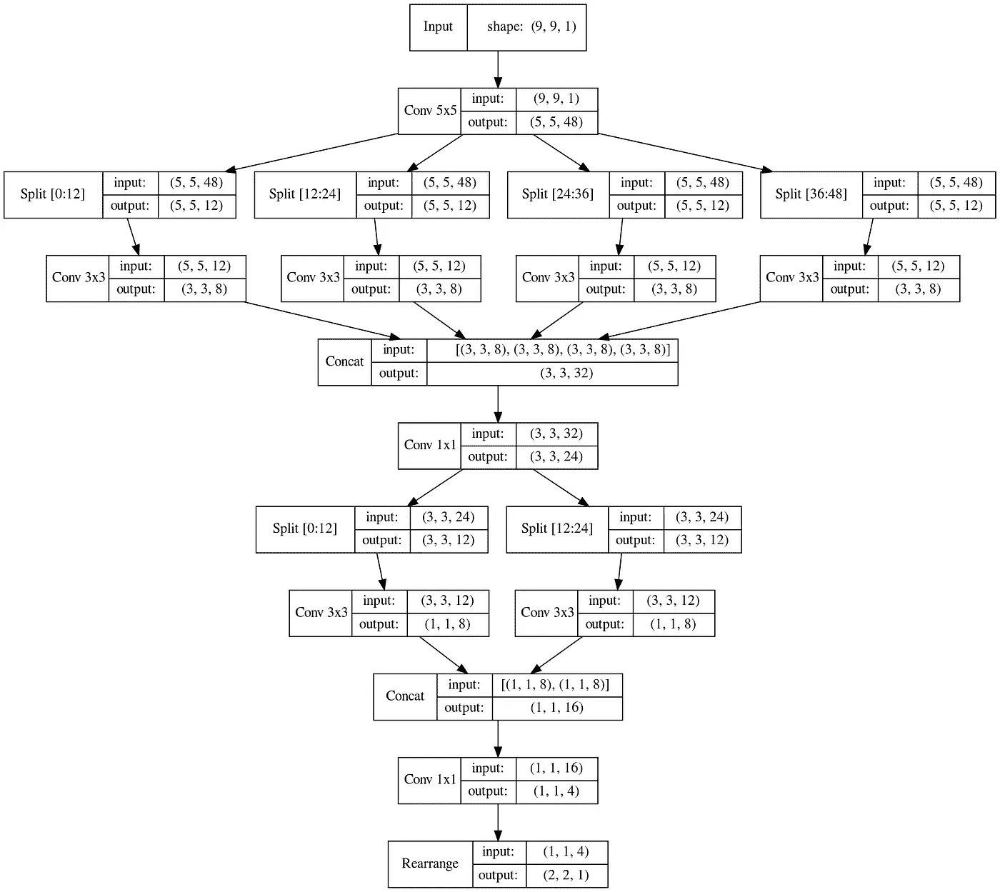
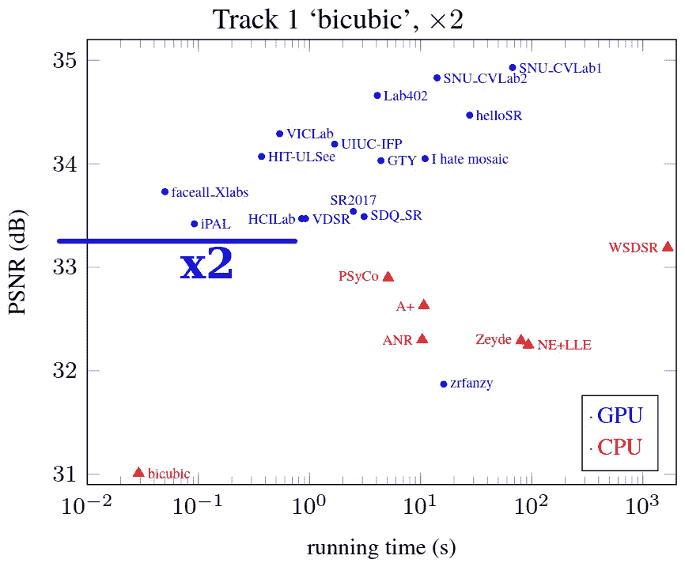
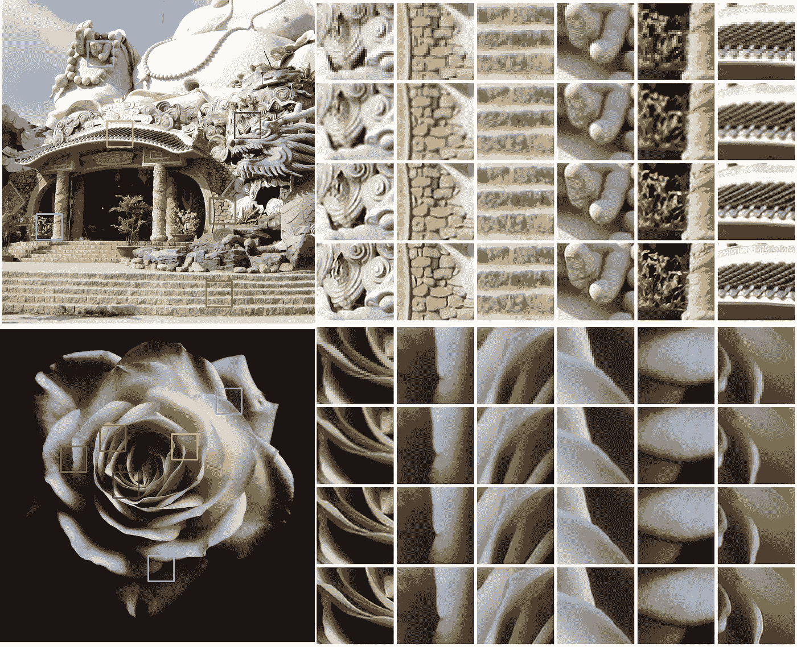
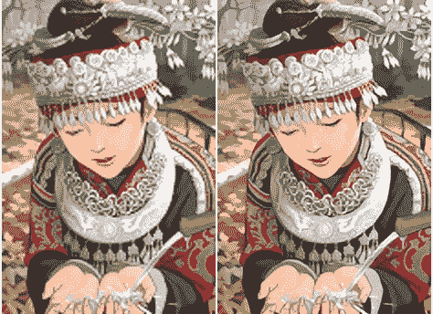
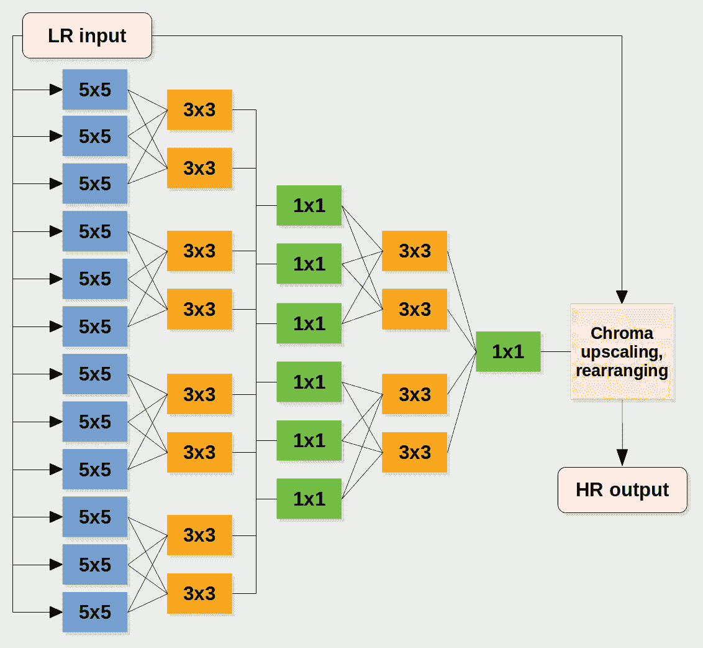
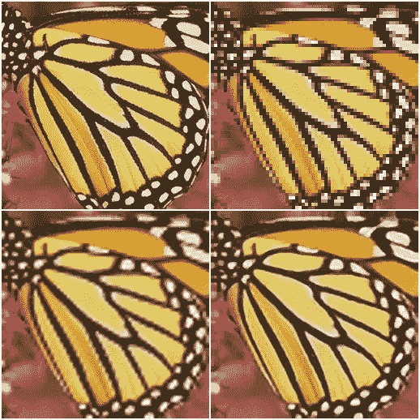
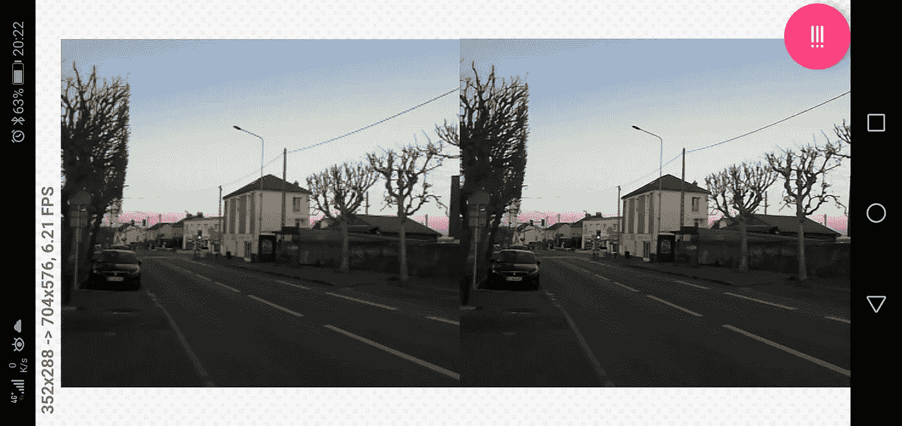

# 在 Raspberry Pi GPU 上运行超分辨率神经网络

> 原文：<https://medium.com/analytics-vidhya/inferring-a-super-resolution-neural-network-on-raspberry-pi-gpu-89b5456d21ef?source=collection_archive---------2----------------------->

向 Raspberry Pi Zero W 问好，这是一台 10 美元的计算机，具有可编程的 GPU。在接下来的大约 3700 字中，我们将抑制它推断神经网络的能力，以便以一种好的方式放大图片。

假设你有一张图像，比如说 4K (3840*2160 像素)被重采样到一个更小的分辨率，比如全高清(1920*1080)。较小的图像占用较少的存储空间，处理和通过互联网发送速度更快。然而，当要在你的 4K 屏幕上显示这个图像时，你可能更喜欢原始的 4K 图像。

你确实可以使用标准的插值方法(双线性、双三次等)将全高清图像插值到 4K 分辨率。)无论如何，当画面被拉伸到整个屏幕时都会发生这种情况。这肯定不会产生最好的结果，尽管在全高清/4K 比例下，除非你的屏幕非常大或者你放大了，否则你可能感觉不到差别。尽管如此，如果你有一个 4K/8K 屏幕，你可能会关心视觉质量。因此，对您来说，放大图像的一个选择是一种更精细的方法，以增加处理时间为代价来呈现更好的图片。这篇文章就是关于这种方法的。

在没有其他输入的情况下从低分辨率图像( *LR* )重建较高分辨率图像( *HR* )的问题是不适定的，因为从 HR 图像产生 LR 图像的下采样过程通常会导致信息损失，因此对于给定的 LR 图像和插值方法，有许多 HR 图像可能导致相同的 LR 输出。标准插值方法重建一个可能的 HR 对应物，不一定是最自然出现的那个。为了重建视觉上更好的 HR 图像，可能需要引入先验知识，而这正是神经网络所擅长的。

这些不恰当的问题，加上容易获得的数据，以及为购买 8K 屏幕的人提供更清晰图片的某种情感背景，导致了数千篇论文，每篇都声称自己是最好的。

本文讨论

*   **一个小型的易于训练的全卷积架构**渲染 2 倍高分辨率的图像受到 Twitter 工程师的启发 [*ESPCN network*](https://arxiv.org/pdf/1609.05158.pdf) ，
*   一种仅使用 OpenGL ES 2.0 兼容着色器实现推理的方法，完全不需要 CPU 计算。后者允许**在笔记本电脑、Android 智能手机和** **Raspberry Pi 上运行该模型，所有这些都在 GPU 上运行。**

我没有 8K 屏幕，但我有一个树莓派。在接下来的内容中，我不会试图超越最先进的结果，所以不会有很高的 PSNR 数字。相反，这里的重点是让事情变得实用。在 Raspberry Pi GPU 上运行推理是这个项目的目标，因此主要成果是在大量设备上使用 OpenGL 进行神经网络的推理:如果 Raspberry Pi GPU 做到了这一点，那么几乎任何像样的 GPU 都可以做到。

下面有图像、PSNR 和时间测量以及一些代码。让我们开始吧。

# 体系结构

这里的模型是 ESPCN 的化身。使用 OpenGL ES 2.0 作为推理后端和它的 Raspberry Pi 实现对架构施加了一些限制，使得网络根据现代 ML 实践有些不常见，但是让我们暂时接受它，稍后讨论这个问题。

与 ESPCN 的主要区别在于:

*   使用分组卷积，然后是逐点(1×1)卷积，
*   激活函数是在[0，1]范围内*有界的 ReLU* 。它应用于所有卷积的顶部。

提议的架构。主要成分是 5x5、分组 3x3、1x1 卷积和 BReLU 激活。

该模型对 LR 图像中给定像素的 9x9 像素邻域进行操作，并以如下所示的方式在输出中产生 2x2 像素。我们处理灰度图像:训练是在亮度(Y)通道上进行的，而推理可以分别在 R、G、B 通道上进行，或者只在 Y 通道上进行，并且色度分量通过标准内插进行放大。后一种技巧非常常见:基本原理是任何图像或视频编码器都会忽略色度分量，并对其进行额外的缩减，这一切都是因为我们的眼睛对色度分辨率不太敏感。

# 培训和验证

有完整 TensorFlow 2 / Keras 食谱的食谱可以在[这里](https://gist.github.com/lnstadrum/0e2fec1e96bc6791f0ee3487969632ee)找到。

**该模型只有 7340 个可训练参数。**不需要数十亿的图像来训练这样一个微小的东西，没有过拟合的风险，所以[一个非常经典的超分辨率数据集 DIV2K](https://data.vision.ee.ethz.ch/cvl/DIV2K/) 被用于训练。它包含 800 HR 图像和它们的 LR 对应物。由于图像大小不同，我将它们切割成固定大小的小块，例如 LR 域中的 128x128 像素。使用均方误差作为损失函数是一种简单的方法，并且只要 PSNR 被用作质量度量，它就非常合适。

然后以一种简单的方式进行训练:使用 Adam optimizer，做大约 200+200 个周期，中间学习率从 1e-3 下降到 1e-4。在我的 GeForce RTX2070 上花了大约 12 个小时。

**训练好的模型在 DIV2K 验证集上达到 33.26 dB。**这不是一个非常好的分数，尽管对于一个 7K 可训练参数的模型来说，这已经很了不起了。下面是一个图表来定位这个结果在最先进的状态。另一个图表: [EDSR+网络](http://openaccess.thecvf.com/content_cvpr_2017_workshops/w12/papers/Lim_Enhanced_Deep_Residual_CVPR_2017_paper.pdf)在同一数据集上达到 35.12 dB，这是当今最高的分数之一，有大约 4300 万个参数。我们正处于双三次和 EDSR+的中间，模型容量如此之小！

相同验证集(DIV2K x2 双三次)上的 PSNR/推理时间记分板。我们的模型位于蓝线上的某处，这取决于哪个 GPU 用于推理。但是等等，这在下一章。原图来自 [NITRE2017 挑战论文](http://openaccess.thecvf.com/content_cvpr_2017_workshops/w12/papers/Agustsson_NTIRE_2017_Challenge_CVPR_2017_paper.pdf)顺便说一下。

现在让我们来看看图片。

超分辨率很像锐化，所以我们可以认为我们的模型是向上扩展+锐化的(奇怪的是，它实际上是在最后向上扩展)。我们的网络渲染的图像看起来更清晰，即使你必须放大很多才能看到差异。

DIV2K 的一些图片的结果。在列中，从上到下是:(1) LR 输入，(2) OpenCV 的双三次上界(基线)，(3)我们的结果和(4) HR 地面实况。我们的模型在这两幅图像上分别达到了比基线高 **2.83** 和 **2.92** dB 的 PSNR。不完美，但也不坏:在大多数情况下，我们的结果比基线更接近 HR 图像。

## 微调

现在让我们考虑一下**在我们没有真实的 HR 图像时的真实应用。**然而，为了执行一些客观的(基于 PSNR 的)比较，我们可以将任何图像视为 HR，产生其 LR 代表，然后用不同的方法对其进行放大并进行比较。

在这里，我们使用另一个非常经典的 SR 数据集， [Set5 和 Set14](https://www.kaggle.com/ll01dm/set-5-14-super-resolution-dataset) 。例如，我们将蝴蝶图像作为 HR，并用手头的双三次缩减器(OpenCV `resize`函数中有一个)将其缩小。这就变成了 LR 图像。然后我们用同样的双三次插值和训练好的模型把它放大。我们得到的结果令人惊讶地失望:图像是丑陋的夏普和 PSNR 比双三次结果更糟！

结果是，我们的训练集中的 LR 和 HR 图像由另一个双三次插值器[相关，可能是来自 Matlab 的插值器，](https://www.mathworks.com/help/images/ref/imresize.html)其前面可以是抗混叠滤波器，并且网络在学习近似其反演时自然会对其产生影响。这个问题非常普遍:OpenCV 的双三次[确实不同于 Matlab one 的](https://stackoverflow.com/questions/22092744/what-is-the-difference-between-opencvs-and-matlabs-bicubic-algorithm)(人们[试图用 Python 重新实现它](https://github.com/fatheral/matlab_imresize))，我们的模型并不是唯一遭受这种差异的模型:例如，超分辨率场景中的明星 [ESRGAN](https://github.com/xinntao/ESRGAN) ，[可能会产生伪像](https://github.com/xinntao/ESRGAN/tree/master/models)，如果你的双三次插值器不同于训练中使用的插值器。

从左到右:原始图像(HR)，双三次插值结果，我们在 DIV2K 上训练的模型的输出，以及我们在用一堆退化内核扩展的相同数据上微调的模型的输出(细节如下)。双三次插值达到 **26.90 dB** 。如果不进行微调，我们的模型无法产生这种严重锐化的图像( **25.05 dB** )，但一旦进行微调( **29.92 dB** )，就会赶上并超过基线。

从研究的角度来看，这一切都是有意义的……但却令人沮丧地不切实际。如果您没有参考 HR 图像，并且您没有掌握整个图像形成过程，您很可能没有任何种类的“退化内核”。在一个非常普通的环境中，你只有一个以清晰的视觉愉悦的方式放大的图像，你不知道它被重新采样了多少次，也不知道它在模糊的过去还经历了什么。

为了以简单的方式解决这个问题，我用尽可能多的退化内核产生的 LR 图像扩展了训练集，简单地采用 OpenCV 的`resize`中提供的东西:双线性、双三次和 Lanczos 插值器，渲染新的 LR 图像并将它们添加到原始图像中。然后，预训练模型以同样的方式重新适应新的更大的数据。这使得在 Set5 和 Set14 上的性能优于双三次基线，但仍有轻微的增益，产生了明显的视觉差异(并且没有难看的锐化图像)。付出的代价是原始 DIV2K 验证集上的 PSNR:微调后的模型只达到了 **32.57 dB** 而不是 33.26 dB。

使用多个降级内核进行微调对 Set5 和 Set14 上的 PSNR 的影响。

Set14 中图像的双三次基线(左，24.99 dB)与微调模型(右，26.11 dB)。当进行双三次缩减时，没有应用抗锯齿，因此我们的网络学习校正锯齿伪像并产生平滑的边缘。不用放大就能看出区别，对吧？

虽然模型及其训练可以在许多方面进一步探索和改进，但这将是我们最终的模型。所以让我在这里停下来，机器学习部分，并进行推理实现。

# 使用 OpenGL 实现推理

在图像上推断卷积神经网络通常需要大量的计算。幸运的是，它很容易并行化，因此适合 GPU。

GPU 本来就是来渲染图片的。很久以前，图形流水线是固定的 T4(不可编程的),能够执行一组预定义的标准计算机图形操作。但是用它们来做更多的通用计算让我们很多人感到困惑。曾经有一个专门的术语叫“GPGPU”，今天你几乎找不到了。

这是因为事情发生了变化，现在我们通过 CUDA、OpenGL 计算着色器、OpenCL 等特定接口使用 GPU 来计算几乎任何东西。比如 TensorFlow 用 CUDA 和 GPU 说话。CUDA 是 Nvidia 的专有技术，所以如果你有另一家供应商的显卡，你可能不会很快通过 TensorFlow 充分利用你的硬件。但也许我太悲观了:前一段时间 [TensorFlow Lite 为一些模型和应用程序引入了 OpenGL 计算着色器支持](https://blog.tensorflow.org/2019/01/tensorflow-lite-now-faster-with-mobile.html)。这使得在没有大量使用 Nvidia GPU 的 Android 设备上进行人脸检测时，可以帮助 CPU。

OpenGL 无处不在。来自任何厂商的任何像样的 GPU 都符合通常提供某种程度的可编程性的某种版本的 OpenGL。

树莓派也是。我说的不是目前最新的 Pi 模型， *4 Model B* ，它的 [GPU 符合 OpenGL ES 3.1 标准](https://www.khronos.org/conformance/adopters/conformant-products/opengles#submission_882)，这使得它几乎能够完成一部像样的 Android 智能手机能够完成的任何事情。我在这里说的是所有其他型号的 Pi 只符合 OpenGL ES 2.0 标准。这意味着:没有计算着色器，只有顶点和片段着色器，没有输入/输出浮点，无法在单个着色器中产生多维输出(只有四个 8 位标量)…

不管怎样，运行我们刚刚建立的模型的推论就足够了。

值得注意的是，如果你爱上了 Raspberry Pi，有更高效的方法可以在没有 OpenGL 开销的情况下访问它的 GPU 计算能力:[这里](https://petewarden.com/2014/08/07/how-to-optimize-raspberry-pi-code-using-its-gpu/)、[这里](https://rpiplayground.wordpress.com/2014/05/03/hacking-the-gpu-for-fun-and-profit-pt-1/)甚至是一个在 Pi 上做 GPU 的 Python 库[这里](https://github.com/nineties/py-videocore)。这变得非常特定于 Pi，但是您可能会运行得更快。在这里，我继续使用 OpenGL，愿意在其他设备上运行推理。

## 概观

简单来说，**我们用 GLSL** ( *OpenGL 着色语言*)编写的小程序(着色器)的形式实现推理过程中执行的操作。着色器还将包含硬编码的训练网络权重。所有的图像和特征图变成*纹理*，所有的输入 LR 图像分辨率。

GLSL 很像 C，只是有一些语法差异和限制。着色器在运行时由 GPU 驱动程序编译成 GPU 能够执行的硬件特定的二进制代码，就像 CPU 一样。但是还是有区别的，主要是由于 GPU 背后的硬件的 SIMD 性质。例如，GLSL 不是一种图灵完全语言，所以你不能像在 C++或 Python 中那样在 GLSL 代码中递归。幸运的是，对于前馈卷积神经网络的推断，我们不需要这一点。

由于在 OpenGL ES 2.0 标准中没有计算着色器，我们以传统的方式进行，我们需要一个顶点着色器和一个片段着色器来执行渲染过程。

*   我们的顶点着色器很简单:它们渲染一个四边形，将整个输入投影到整个视口。我不会在这里详述它们的代码。
*   **碎片着色器是神奇发生的地方。**他们将对包含 LR 输入(用于输入层)或特征映射(用于隐藏和输出层)的输入纹理进行采样，并计算输出特征映射。片段着色器的 GLSL 代码由来自训练模型的 Python 脚本生成。

要运行 GLSL 着色器，通常需要编写一些讨厌的平台相关代码来设置 OpenGL 上下文，并实现所有机器来执行渲染过程。我在这里跳过细节；反正整个代码是[可用](https://github.com/lnstadrum/beatmup)。

我们以上面解释的方式进行:输入的 Y 分量被神经网络放大，而 Cb 和 Cr 色度通道被放大为常规纹理。OpenGL 天生支持双线性插值和最近邻插值(顺便说一下，最近邻插值用于采样所有的特征图)，因此色度可以双线性插值。这不是唯一的方法；可以在着色器中实现双三次色度插值，或者对 R、G 和 B 输入连续应用神经网络。

这是我们的模型，每个砖块都是一个着色器。他们总共有 32 人。每个着色器的输出是一个包含 4 个特征映射的纹理。它们都是输入 LR 分辨率，除了输出图像。

## 限制

如上所述，我们的模型是由来自 Raspberry Pi OpenGL ES 实现的约束形成的。让我最后解释一下。

*   片段着色器是为每个像素执行的程序。它有一个单独的输出，四分量像素颜色写入`gl_FragColor` 变量。因此**我们只能在一个着色器中计算(最多)四个特征通道。它增加了我们需要的着色器的数量，但没有限制模型的大小，所以我们可以接受。这也极大地增加了内存带宽，因为特征贴图纹理被采样了很多次…但是据我所知，在 Raspberry Pi 上使用 GL ES 2.0 没有其他方法。**
*   所有特征映射值都用[0，1]范围内的 8 位定点值采样。克服这一点的方法是使用一个激活函数，其输出范围适合[0，1]。这就是为什么**我们处处用[0，1]-有界的 ReLU 作为激活函数**。实际上，写入`gl_FragColor`的简单事实将值限制在[0，1]范围内，因此我们甚至不需要显式实现它:GLSL 无论如何都会应用有界 ReLU。酷！
*   片段着色器的输入纹理数量有限，根据标准至少为 8 个。对于树莓派，它正好是 8。由于纹理(最多)是包含 RGBA 颜色的 4 通道图像，我们最终在输入上最多有 8*4=32 个特征地图。这是一个实际的约束:为了计算 2D 卷积，我们需要在一个着色器中访问所有的特征映射。否则，我们必须在不同的着色器之间分割卷积，每个着色器最多采样 32 个通道，然后使用另一个着色器将部分结果放在一起…这很快就会变得一团糟，并且可能由于 8 位着色器输出采样限制而不可行。因此，**所有的特征地图最多可以有 32 个通道**。
*   有两个额外的条件限制了输入通道的数量。首先，每个着色器的纹理采样操作数量有限制(Pi 为 64)。为了计算 3×3 卷积，每个纹理被采样 3×3 次。在 64 个样本的限制下，我们最多可以有 7 个纹理，也就是 28 个特征图。但是对于 1x1 卷积，这不是问题。
*   其次，每个着色器的指令总数是有限制的。在这个意义上，多个输入特征映射的 3×3 卷积是最贪婪的。一个具有 12 个输入和 8 个输出特征映射的实现通过了我手头的所有硬件(尽管它可能会进一步调整)。可能有一种方法可以像 MobileNet 一样通过深度方向的卷积获得更多的特征通道，但它会导致一个容量更小的模型，这在我所做的几次测试中似乎表现不佳。因此**我们依靠 12 个特征映射的分组 3×3 卷积**将逐点卷积放在分组块的顶部来混合它们的特征通道。这是塑造模型并在输出中给出 48–32–24–16 个特征图的关键设计决策。

就是这样，**我们现在有了一个适合硬件的经过训练的模型。要让它运行起来，剩下的事情不多了！**

## GLSL 实施

一旦考虑到硬件限制，将这样一个完全卷积的模型转换成一堆 GLSL 着色器就变得简单了:我们所需要的就是从经过训练的模型中获取权重和偏差，并在片段着色器中实现卷积。在您最喜欢的机器学习框架中访问层的训练参数通常不是问题(就像在 TensorFlow 2 / Keras 中使用`layer.kernel.numpy()`和`layer.bias.numpy()`获得 Numpy 数组一样简单)，因此 Python 脚本可以完成这项工作。

至于在 GLSL 中存储网络参数，有不同的选择，例如将它们放入单独的纹理或统一的变量中。然而，这个模型很小，所以最简单的选择是将权重和偏差作为硬编码的常数在 GLSL 代码中公开。这可能也是最有效的方法。

这是最后一个 1x1 卷积着色器(模型的第五层)的样子。就代码大小而言，它是 32 个着色器中最小的。它所做的只是采样 16 个输入特征图(每个 4 个通道的 4 个纹理)，将它们与学习的内核卷积，添加偏差并将结果写入片段颜色变量。

我使用`dot` GLSL 函数来实现卷积。在我对 Raspberry Pi 进行的一些初步试验中，它看起来非常有效，但确实有其他方法来组织计算。

与卷积着色器一起，我们需要的最后一个片段着色器是一个合并了良好的上采样亮度和廉价的上采样色度的着色器(上面方案中的鲑鱼色着色器)。事实上，第五层输出是 LR 输入大小的 4 通道纹理；在每个像素位置，其 4 个通道包含输出 HR 亮度的 4 个像素值。因此，我们使用`gl_FragCoord` GLSL 变量对这些值进行解复用，并在最后一个片段着色器中添加来自输入图像的色度:

# 有趣的部分:在所有硬件上进行测试

## 树莓派

整个事情被设计成在 Pi 上运行，所以让测试在 Pi 上开始吧！

为了将 256*256 的输入图像放大到 512*512 像素， **Raspberry Pi 3 Model B+平均在大约 130 ms** 内运行推断(10 次重复的标准偏差为 9.5 ms)。Raspberry Pi Zero W 运行速度稍慢(171 毫秒)，拥有相同的 Broadcom video core IV GPU 板载[以更低的时钟频率运行](https://en.wikipedia.org/wiki/VideoCore#Table_of_SoCs_adopting_VideoCore_SIP_blocks)。着色器在 3.5 到 4 秒内完成编译(提醒一下，这是一次性完成的，并不是针对我们可能需要处理的每张图像)。

这样慢吗？嗯，是的。但我们刚刚设法在 Raspberry Pi GPU 上运行了神经网络的推理，这仍然很棒。

为了便于查看，Set5(左上)的图像在这里缩小了四倍(右上)。然后，使用双三次插值(左下)或应用我们的模型两次(右下)，将它放大。我们得到了 22.82 分贝，双三次完成 21.41 分贝。是的，**右下角的图片直接来自树莓派**。

## 安卓智能手机

Android 智能手机也有符合 OpenGL ES 的 GPU，因此它们没有办法逃脱我们的测试。下面是在一些 Android 手机上执行同样的 256*256 到 512*512 上采样测试的图。

我没有把任何 PSNR 数字放在这里:来自不同 GPU 的图像之间没有明显的区别。在不同的硬件上，结果可能确实不同，但它们仍然非常相似。因此，在 Pi(一台 Android 智能手机和一台高端桌面 GPU)上从同一来源渲染的三幅图像中，两个最不同的图像彼此相差 45.8 dB。

另一个测试是通过网络实时传递小分辨率的相机预览。在没有任何额外像素传输的情况下，相机图像可以通过 GLSL 的`samplerExternalOES`采样器以 OpenGL 纹理的形式访问，所以我们可以直接将其插入我们的网络。

*华为 P20 Lite* 设法以 6 到 7 FPS 的速度将 352*288 的输入上采样到 704*576 的输出。我的老款*华硕 K016 (Fonepad 8)* 以~13.2 FPS 做同样的工作。 ***华为 P10* 运行速度 30 FPS！**

在华为 P20 Lite 上运行 352*288 相机预览图像的推理。左:本机(双语)升级相机预览；右图:我们的网络结果。仔细看看中间的灯柱，右边的电缆，屋顶轮廓，纤细的树枝，路标。事实上，这个应用程序有点可笑，因为相机能够有更好的分辨率。尽管如此，将相机预览实时传递给 Android GPU 上的 SR 神经网络还是很花哨的，不是吗？

## 桌面

桌面 GPU 通常更强大。因此，除了向他们提供来自 Set5 的 256*256 蝴蝶图像，我们还向他们提出了更大的挑战:**全高清输入，以升级到 4K** 。

以下是一些数字:

在桌面 GPU 的数字中，也有 Nvidia Jetson Nano 的推理时间。它更像是一个移动 GPU，而不是桌面 GPU，但在这次测试中，它很容易与集成桌面显卡竞争。

运行时间实际上是一个相当可变的量，不仅取决于 GPU 型号和硬件特性。例如，当系统使用相同的 GPU 来渲染 GUI 时，当笔记本电脑上的电源线没有插好时，速度会变慢。

# 包扎

> 如果你的洗衣机有 GPU，我们这里设计的神经网络很有可能可以在上面运行。

到目前为止，我所知道的就是一个运行在(几乎)你能找到的任何 GPU 上的小巧可爱的神经上采样器。为了到达那里，

*   我们首先训练了一个小型(7.3K 参数)神经网络，用于受 ESPCN 论文启发的 x2 向上扩展。虽然 PSNR 没有岩石相比，奶油顶端的艺术状态，图像相当不错(比双三次基线好得多)。模型设计、训练、微调都有改进的空间。
*   然后我们把它转换成一堆 OpenGL 着色器。推论运行在 Raspberry Pi、Android 智能手机和台式机上，它只使用 GPU 进行计算。低端 GPU 并不太快，但一个好的桌面 GPU 可以将全高清实时提升到 4K(约 100 FPS) 。你可以想象现在在你的 4K 屏幕上看一部全高清编码的电影被你的 GPU 实时升级。

Tensorflow/Keras 实现在这里[可用](https://gist.github.com/lnstadrum/0e2fec1e96bc6791f0ee3487969632ee)，推理实现在这里[可用](https://github.com/lnstadrum/beatmup)。