# 机器学习中的信息熵

> 原文：<https://medium.com/analytics-vidhya/information-entropy-in-machine-learning-199c0f12ff4?source=collection_archive---------13----------------------->

*在机器学习领域，交叉熵和 KL 散度是分类算法中广泛使用的代价函数。在本文中，我们将通过一些有趣的例子来讨论它的来源。*

信息科学诞生于 20 世纪 50 年代，源于一位杰出人士的工作:克劳德·e·香农。1948 年，在贝尔实验室写的一篇里程碑式的论文《通信的数学理论》中，香农用数学术语定义了什么是信息，以及如何在有噪声的情况下有效地传输信息。

克劳德·香农

这是“信息理论”科学的开端，这是一套允许我们建立互联网、数字计算机和电信系统的思想。
*熵是这种信息理论的量度。*

# 信息和不确定性

就交流而言，信息可以通过信息的内容或通过直接或间接的观察来表达。在我们的数字世界中，这些信息由“比特”组成。
你们很多人都知道，二进制数包含 0 或 1。

> 信息是不确定性的解决方案。

让我们用一个例子来理解:

在公平的硬币中，我们有 50–50%的机会得到正面或反面。抛完硬币后，我们要么得到正面要么得到反面，这样我们的不确定性减少了 2。为什么？因为在投掷之前，我们有 50%的把握会收到一条尾巴，但是在收到一条尾巴之后，我们现在 100%的把握结果是尾巴。

> 因为在公平硬币的情况下，有两种可能的结果以相等的概率发生，所以了解实际结果包含一位信息。

那么我们如何计算收到的这 1 比特信息呢？但是首先，让我们看另一个例子，这次是一枚有偏见的硬币。让我们假设头部出现的概率是 75%，尾部出现的概率是 25%。如果我们抛硬币，再次收到尾巴，那么我们的不确定性减少了 4 倍。为什么这次是 4？我想我们已经知道了。以前只有 25%的机会得到尾巴，但现在我们有了 100%的结果，所以我们现在有 4 倍的把握。

这个实验清楚地表明“不确定性的减少是事件概率的倒数”。

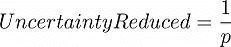

其中 p 是事件在分布中发生的概率

> 事件越不确定，解决该事件的不确定性所需的信息就越多。

**发送/接收的信息比特数与不确定度降低成正比，表示为不确定度降低的二进制对数。**

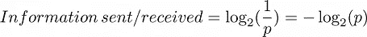

发送/接收的信息

*请注意，一位是典型的信息单位，但也可以使用其他单位，如 nat 或 ban，其中我们分别采用 e 或 10 的自然对数，而不是二进制对数。*

所以，在公平硬币的情况下，我们有 1/2 的概率得到一条尾巴，所以根据公式，我们得到 1 比特的信息。

同样的，一枚 75%正面，25%反面的有偏硬币，我们接收到多少比特的信息？

如果我们收到一个尾部，收到的信息= -log₂(0.25) = 2 比特

如果我们接收一个报头，那么接收的信息= -log₂(0.75) = 0.41 比特

但是，我们平均收到多少信息呢？所以，有

= 0.41 位的 75%几率+ 2 位的 25%几率

=0.75*0.41+0.25*2

=0.81 位

> 我们刚刚收到的这个平均信息实际上就是我们所知的熵。

# 熵

艺术噪音 GIF 由 Adambanaszek

我希望到目前为止你对此已经有所了解。

在一个更正式的定义中，熵是你从一个给定的概率分布 p 中抽取的样本中获得的平均信息量。

具有可能值{x₁、x₂、x₃…xₙ}以及{p(x₁、p(x₂、p(x₃),… p(xₙ)}的相应概率分布的离散随机变量 x 的熵η(p)可以用比特表示为:

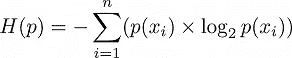

熵

它也可以用来自每个结果(I)的信息 received(Iᵢ表示为:

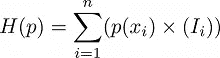

Iᵢ是从结果 I 发送/接收的信息

# 交叉熵

交叉熵是平均消息长度。让我们用一个例子来了解更多。

嘻哈舞蹈 GIF 由克里斯蒂蒙斯

考虑一个有偏差的骰子，其结果的概率分布如下:

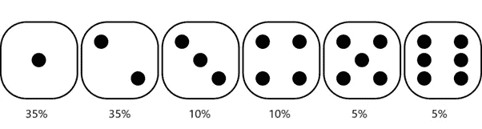

每个结果都有概率分布的有偏骰子

这个骰子的熵=

= -[0.35*log₂(0.35)+0.35*log₂(0.35)+0.10*log₂(0.10)+0.10*log₂(0.10)+ 0.05*log₂(0.05)+0.05*log₂(0.05)]

= 2.16 位

现在，让我们为每个结果定义 3 位编码，如下所示:

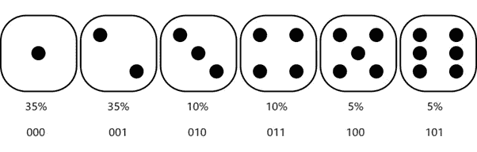

真实百分比分布，每个结果的假定消息长度以位为单位

> *通过假设每个结果的* k *比特编码，我们隐含地声明在得到这个结果之后接收的信息是* k *。*

此估计分布的熵= [35%的(3 位)+35%的(3 位)+10%的(3 位)+10%的(3 位)+5%的(3 位)+5%的(3 位)]

= 3 位

因此，根据估计的分布，平均消息长度或接收的信息是 3 位，但只有 2.16 位是有用的信息(根据实际分布)，其余的 0.84(3–2.16)位是噪声。

我们需要更好的编码。

不是假设每个结果 3 位，让我们这样编码:

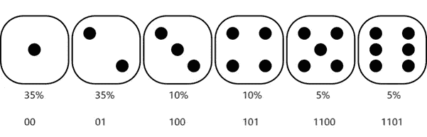

真实百分比分布，每个结果的假定消息长度以位为单位

现在，平均来说，收到的信息是

= [0.35*(2)+0.35*(2)+0.10*(3)+ 0.10*(3)+ 0.05*(4)+0.05*(4)]

=2.40 位，比 3 位好得多

现在，我们接收到的噪声仅为 0.24，即(2.40–2.16)位。

但是为什么会这样呢？

当我们考虑一个 2 比特的信息时，我们暗示这个结果有 25%的可能性发生。

这可以用公式来表示:

收到的信息= 2 位

=> -log₂(p) = 2

=> p =或 25%

同样，对于其他结果，

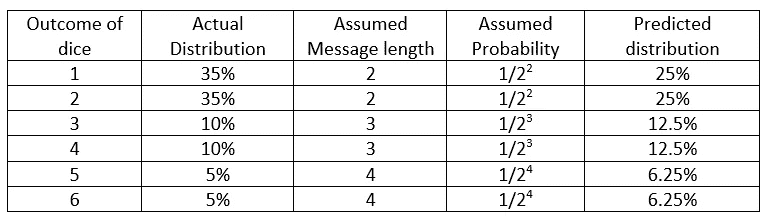

有偏骰子的实际和预测分布

*这个预测分布的熵就是交叉熵。*

交叉熵是一种测量两个概率分布之间“距离”的方法，这里是 p 和 q。

交叉熵可以表示为:

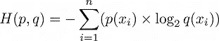

交叉熵，其中 p 为真，q 为预测分布

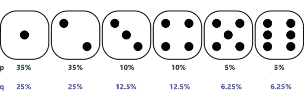

p 和 q 分别是真实分布和预测分布

# 每次都是同样的编码？

但是，我们可以对每个骰子使用相同的编码吗？

让我们看看，如果我们用新的概率分布(p1)和相同的预测分布 q 来取新的有偏骰子，会发生什么。

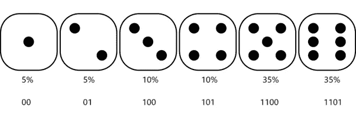

真实百分比分布 p1，假设每个结果的消息长度为比特

估计分布接收的平均信息=[0.05 *(2)+0.05 *(2)+0.10 *(3)+0.10 *(3)+0.35 *(4)+0.35 *(4)]

= 3.60 位

因此，我们平均接收 3.60 比特的信息，其中只有 2.16 比特是有用的，其余的 1.44 比特是噪声。这是非常低效的。

同样的，

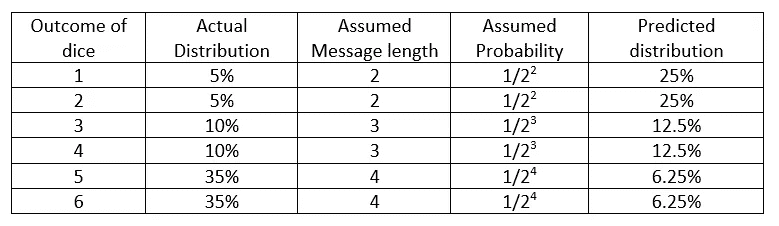

有偏骰子的实际和预测分布

所以，你能看出区别吗，我们预测结果“1”有 25%的机会，而实际上只有 5%的机会。

*所以对于不同的分布，我们需要对结果进行相应的编码，否则就要以交叉熵的形式承担高昂的代价。*

> 如果预测结果与真实结果完全匹配，交叉熵本身就是熵。

# 库尔贝克-莱布勒散度

当交叉熵不等于熵时，它们的差称为相对熵或 kull back–lei bler 散度。

更正式地说，KL 散度是一个概率分布与第二个参考概率分布如何不同的度量。

KL 散度表示为:

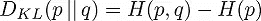

H(p，q)和 H(p)分别是交叉熵和熵

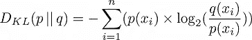

从 q -> p 的 kull back-lei bler 散度

在机器学习的背景下，如果使用 q 而不是 p，KL 散度通常被称为获得的[信息增益](https://en.wikipedia.org/wiki/Information_gain_in_decision_trees)

同样，总的来说，

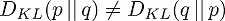

# 分类中的交叉熵

考虑这个图像。通过观察，我们知道这是一只可爱的狗的形象。

现在考虑一个图像分类器，它将一幅图像作为输入，输出 10 个不同类别的预测概率。我们知道这幅图像中“狗”的真实概率是 1，其余的是 0。

当我们将此图像输入分类器时，它将为每个类别产生以下概率。

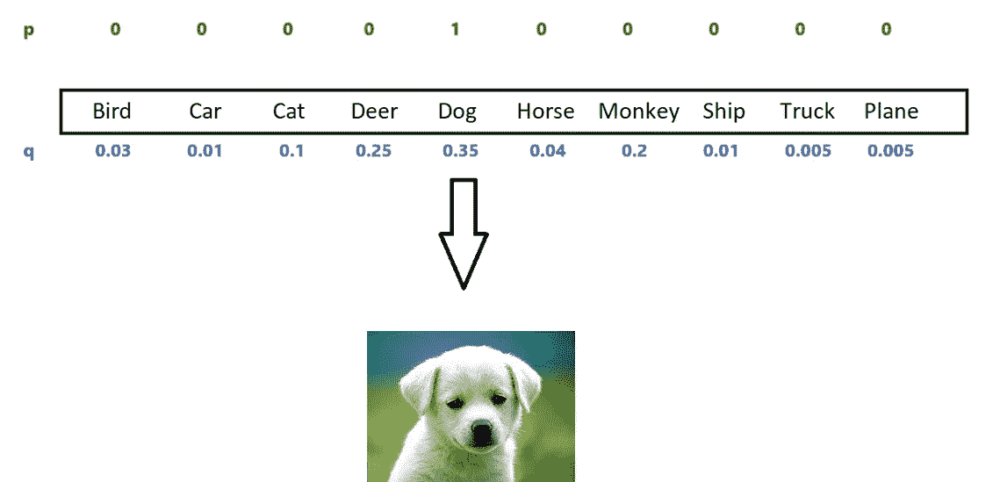

p 作为一个热编码向量，正确的类别为 dog，q 作为来自分类器的每个类别的预测概率

我们可以使用交叉熵作为损失函数来测量两个分布 p 和 q 之间的距离，这也被称为**交叉熵损失**或**对数损失**。

这可以类似于交叉熵来计算，但是通常使用自然对数而不是二进制对数。

交叉熵损失= -(1)*ln(0.35) = 1.05

*在真分布中，除了正确的类，所有类的概率都是 0。因此，我们只考虑正确类别的预测概率。*

> *如果真实类(此处为 dog)的预测概率接近于 0，则意味着高成本，而如果接近于 1，则成本将变得等于真实分布的熵，在这种情况下，真实分布的熵为零，因为真实分布是独热向量。*

对于分类，KL 散度也可以用作损失函数来代替交叉熵损失。如果通过梯度优化方法训练，假定真实分布是恒定的，两者给出相同的优化结果。

感谢您的阅读:)

**欢迎任何建议、纠正或批评。**

请给我发电子邮件到 nikitagupta585@gmail.com。

祝您愉快！！

参考资料:

1.  [https://en.wikipedia.org/wiki/Claude_Shannon](https://en.wikipedia.org/wiki/Claude_Shannon)
2.  [https://www . NYU . edu/pages/linguistic/courses/v 610003/shan . html](https://www.nyu.edu/pages/linguistics/courses/v610003/shan.html)
3.  [https://en.wikipedia.org/wiki/Information](https://en.wikipedia.org/wiki/Entropy_(information_theory))
4.  [https://en.wikipedia.org/wiki/Information_theory](https://en.wikipedia.org/wiki/Information_theory)
5.  [https://www.youtube.com/watch?v=ErfnhcEV1O8&t = 1s](https://www.youtube.com/watch?v=ErfnhcEV1O8&t=1s)
6.  [https://www.youtube.com/watch?v=R4OlXb9aTvQ](https://www.youtube.com/watch?v=R4OlXb9aTvQ)