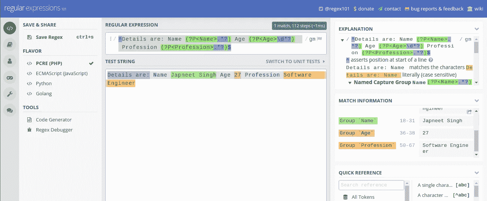

# 使用 GROKs 和 REGEX 从文本中提取信息

> 原文：<https://medium.com/analytics-vidhya/information-extraction-from-text-using-groks-and-regex-c181da07bb4e?source=collection_archive---------13----------------------->


# 什么是从文本中提取信息？？？

处理文本数据的一个关键部分是从原始文本数据中提取信息。

我们举一个文本句子的例子，它属于某个数据，有如下形式的数据。

```
Details are: Name Japneet Singh Age 27 Profession Software Engineer
```

从该文本中提取的信息如下所示

```
Name: Japneet Singh
Age: 27
Profession: Software Engineer
```

然后，这些信息可以在任何机器学习模型中进一步使用。

一般来说，我们在数据预处理的非常早期的阶段执行这一步骤，并且可以有许多高级的方法来处理它，但是使用 regex 的老方法仍然是不败的冠军。

每当我们处理文本数据时，正则表达式都扮演着重要的角色。这里，我们将讨论提取信息的两种方法:

1.  正则表达式
2.  神交

来处理这个数据提取。

# 正则表达式方法

Regex 由 [regular-expression.info](https://www.regular-expressions.info/) 定义为 ***一个正则表达式(简称 regex 或 regexp)，是一个描述搜索模式的特殊文本字符串。你可以把正则表达式想象成类固醇上的通配符。***

如果你不熟悉 regex，这个[站点](https://www.regular-expressions.info/)有一些非常好的学习 regex 的资源。

现在，我们将创建一个正则表达式，并使用命名组来提取这些信息，我们将使用一个非常有用的工具来构建和测试您的正则表达式，它就是 [regx101](https://regex101.com/) 。

```
^Details are: Name (?P<Name>.*?) Age (?P<Age>\d*?) Profession (?P<Profession>.*?)$
```

这将按预期从文本中提取信息



正则表达式的一个问题是，它会变得非常复杂，会妨碍可读性，进而影响代码的质量。

正则表达式的一个干净的替代品是 GROK 模式

# GROK 方法

根据 [ELK](https://www.elastic.co/guide/en/logstash/current/plugins-filters-grok.html) 的说法，Grok 是将非结构化日志数据解析成结构化和可查询数据的一种很好的方式。这个工具非常适合 Syslog 日志、apache 和其他 web 服务器日志、MySQL 日志，以及通常为人类而非计算机使用而编写的任何日志格式。

太专业了吧？？

让我们看看如何为上面使用的相同数据编写 GROKS

```
Details are: Name %{DATA:Name} Age %{NUMBER:Age} Profession %{GREEDYDATA:Profession}
```

在内部，GROK 的工作方式与 regex 相同，但在这里，它使模式更具可读性，人们不必理解正则表达式来构建 GROK(尽管构建好的 GROK 需要它)。

人们可以使用简单的英语符号给定正则表达式来解析数据。

在这个[链接](https://grokdebug.herokuapp.com/patterns#)上有一个很大的可用模式列表，并且可以使用合适的工具进一步扩展这个列表。

一旦我们准备好了 GROK，我们就可以使用 [GROK 调试器](https://grokdebug.herokuapp.com/)来查找 GROK 中的任何错误。


我会再写一篇文章解释 python 中 GROKs 的用法。

我希望你喜欢阅读。

不断学习。

订阅我的[博客](https://techscouter.blogspot.com/)，阅读更多关于这些话题的内容:

[单词矢量化](https://techscouter.blogspot.com/2017/10/word-vectorization.html)

[主题建模](https://techscouter.blogspot.com/2017/08/text-analytics-part-2.html)

[使用手套矢量化](https://techscouter.blogspot.com/2018/04/getting-started-with-glove.html)

[文本分析](https://techscouter.blogspot.com/2017/08/text-analysis-part-1.html)