# 来自部分词的信息:子词模型

> 原文：<https://medium.com/analytics-vidhya/information-from-parts-of-words-subword-models-e5353d1dbc79?source=collection_archive---------10----------------------->

## 这个故事包括 4 个部分:纯字符级模型的动机，子词模型:字节对编码和朋友，混合字符和词级模型，以及快速文本嵌入。这个故事是对[斯坦福 CS224N: NLP 与深度学习| Winter 2019 |第 12 讲—子词模型](https://www.youtube.com/watch?v=9oTHFx0Gg3Q&list=PLoROMvodv4rOhcuXMZkNm7j3fVwBBY42z&index=12)的总结。

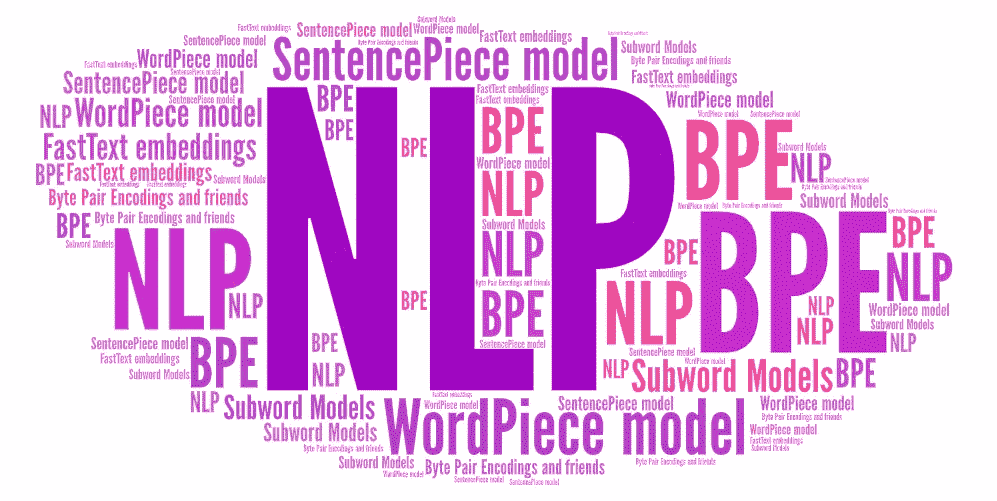

这个故事包括四个部分。:纯字符级模型、子词模型的动机:字节对编码和友元、混合字符和词级模型以及快速文本嵌入。这个故事是[Stanford cs 224n:NLP with Deep Learning | Winter 2019 |讲座 12 —子词模型](https://www.youtube.com/watch?v=9oTHFx0Gg3Q&list=PLoROMvodv4rOhcuXMZkNm7j3fVwBBY42z&index=12)的总结。

# 1.纯角色级别的模型

*为什么我们需要角色级别的模型？因为有些语言没有分词，*比如中文。即使是有词段的语言，他们也以不同的方式分割词，比如德语和荷兰语包含许多复合词。此外，我们需要处理大量的、开放的词汇，比如在线评论包含大量常见的非正式拼写。

**在字符级模型中，单词嵌入可以由字符嵌入组成。**角色级模型至少有 3 个好处 **: 1)。它可以为未知单词生成嵌入；2).相似的拼写共享相似的嵌入；3).它解决了 OOV 问题。**字符级模型在某些情况下工作成功，这有点令人惊讶，因为传统上，音素或字母不是语义单位。

# 2.子字模型:字节对编码和朋友

## 2.1 字节对编码

*字节对编码(BPE)最初是一种压缩算法*，它将最常见的字节对编码成一个新的字节。字节对编码的起源和字节对这个名称与自然语言处理或神经网络无关，但 BPE 的使用已经成为一种非常标准和成功的方式，用于向 ***表示单词片段，允许你在实际使用有限词汇的同时拥有无限的有效词汇。***

在压缩中，你用 BPE 做的是，你有一个字节的东西的集合，你寻找最频繁的 2 字节序列，然后你把这个 2 字节序列作为一个新元素添加到你的可能值的字典中。这意味着你可以有 257 个不同的字节值

所以从本质上来说，这项工作建议我们可以应用这种压缩算法，并把它作为一种产生有用单词的方式，不严格地用字节来做，尽管有名字，而是用字符和字符 n-grams 来做。

最常见的处理字符和字符 n-gram 的方法是，有 Unicode，你可以表示所有这些可爱的字母，像加拿大因纽特人的音节之类的。但是 Unicode 实际上有一个问题，那就是实际上有很多 Unicode 字符(可能有 200，000 个),而且有点多。所以我们只挑选最常见的字符 n 元语法。

**BPE 是一种分词算法**，尽管它是以自底向上聚类的方式完成的。 ***它以数据中所有(Unicode)字符的单字词汇表开始。它将最频繁的 n 元语法对封装到一个新的 n 元语法中。BPE 有一个目标词汇量，当你达到它的时候就会停下来。它对单词进行确定性的最长分段，而分段仅在由一些先前的分词器(通常是用于机器翻译的 Moses 分词器)识别的单词内进行。 ***BPE 自动为系统决定词汇。******

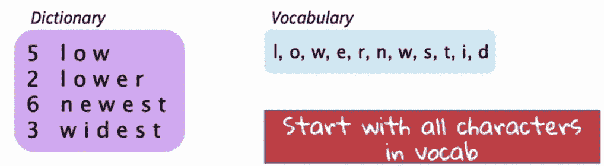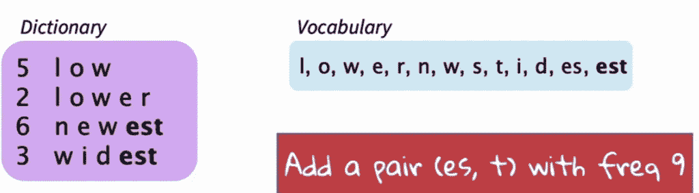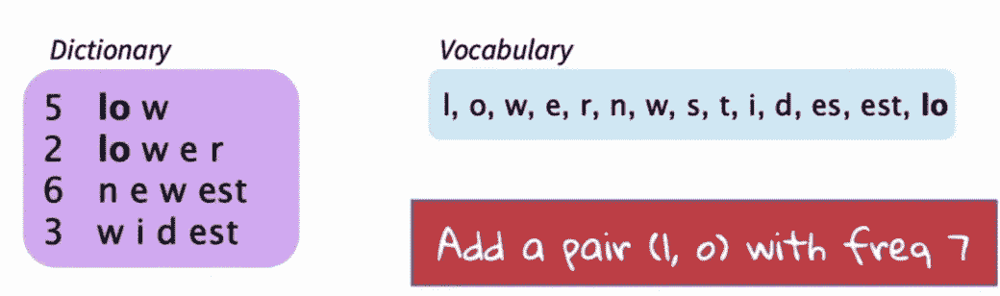

来源:[课程幻灯片](https://www.youtube.com/watch?v=9oTHFx0Gg3Q&list=PLoROMvodv4rOhcuXMZkNm7j3fVwBBY42z&index=12)

例如，我们开始构建这些常见的字母序列，因此像`est`这样的常见位，但也只是常见的单词，像英语中的`that`这样的东西将很快聚集在一起，成为我们词汇的一个单元。所以通常我们所做的是决定我们想要使用的词汇量。例如，我想使用 8000 个单词的词汇量。我们一直这样做，直到我们的词汇量达到 8000 个。这意味着我们的词汇中会有所有的单个字母，因为我们是从它们开始的，它会有像`es`、`est`这样的单词的共同序列，但也有完整的单词，只要有共同的单词，像`the`、`too`、`with`等等，都是我们词汇的一部分。

因此，当我们有了一段文本，*我们可以做一个确定性的最长的单词分段。在这种情况下，我们将假定*是我们的`eest`字块。到目前为止，一段输入文本，我们变成了单词段。例如，我们想做一个机器翻译(MT)任务，然后我们就像使用单词一样在我们的 MT 系统中运行它，但实际上它是单词的片段，然后在输出端，我们只是根据需要将它们连接起来。

# 2.子字模型:字节对编码和朋友

## 2.2 词块模型和句子块模型

谷歌 NMT(GNMT)使用 BPE 模型的变体:**单词块模型和句子块模型**。t ***不是 char n-gram 计数，而是使用贪婪近似来最大化语言模型对数似然来选择片段*** 和*添加 n-gram，最大程度地减少困惑*。

**词块模型对词内进行分词:首先对词进行分词，然后应用 BPE。**如果我们需要先标记成单词，这可能会有问题，因为*然后我们需要为每种语言准备一个标记器*，这是一项繁重的工作。因此，也许我们可以从字符序列出发，保留空白，并将其视为成簇过程的一部分，你只需构建你的单词片段，这些片段通常在它们的一侧或另一侧有空格，因为单词中的内容通常是更常见的簇，你可以构建这些簇，这被证明是非常成功的。**所以在 SentencePiece 模型中，空白作为一个特殊的标记(_)被保留，并正常分组。** *你可以通过将碎片连接起来并记录到空格中来反转事情的结局*。

BERT 使用了工件模型的变体。BERT 不处理单词，而是处理单词片段。所以它的词汇量很大，比较常见的词都在词汇表里，比如 Fairfax。不过它涵盖了所有的词，对于 OOV 来说，它使用了词块的概念。因此，如果我想要一个代表 OOV 单词`hypatia`的符号，我会把它拼凑起来。 ***有一个*** `***h***` ***的表示，然后在 BERT 版本中，不同于 Google NMT 版本，非起始词段在开始用两个哈希表示*** ，所以我可以把它和`h``##yp`等放在一起，所以`h`、`##yp`、`##ati`、`##a`将是我对`hypatia`的表示。所以实际上，我有单词向量，四个单词的片段，然后我必须知道如何处理它们。最简单也是最常见的方法是，我对其中的 4 个进行平均。很明显你还可以做其他事情。你可以用 ConvNet 和 max-pool 或者你可以运行一个小 LSTM 或者别的什么来组合一个表示。

# 3.混合字符和单词级模型

## 3.1 CNN +人物层面的公路网

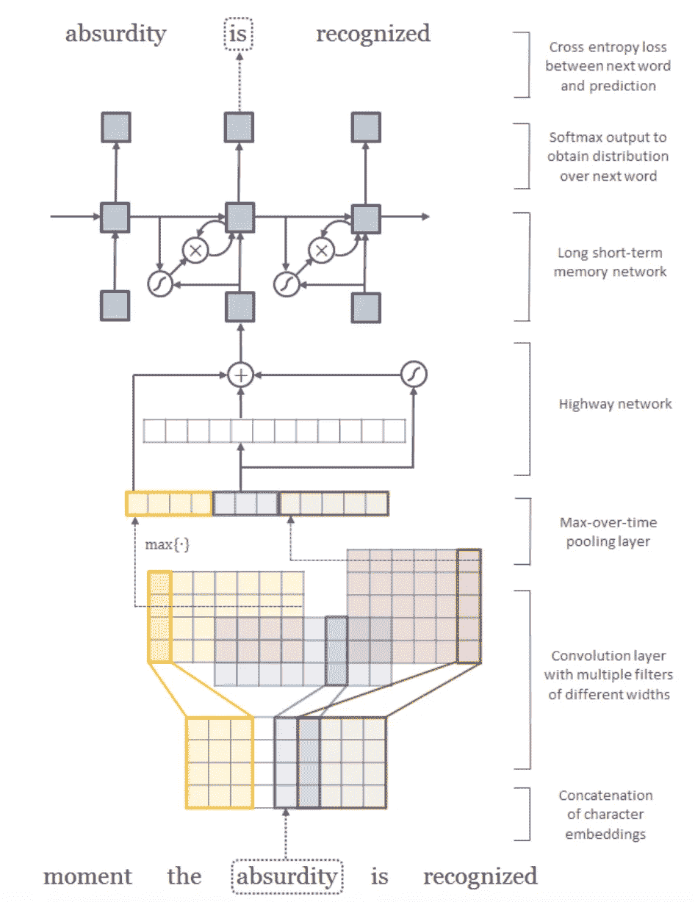

模型架构。来源:[课程幻灯片](https://www.youtube.com/watch?v=9oTHFx0Gg3Q&list=PLoROMvodv4rOhcuXMZkNm7j3fVwBBY42z&index=12)

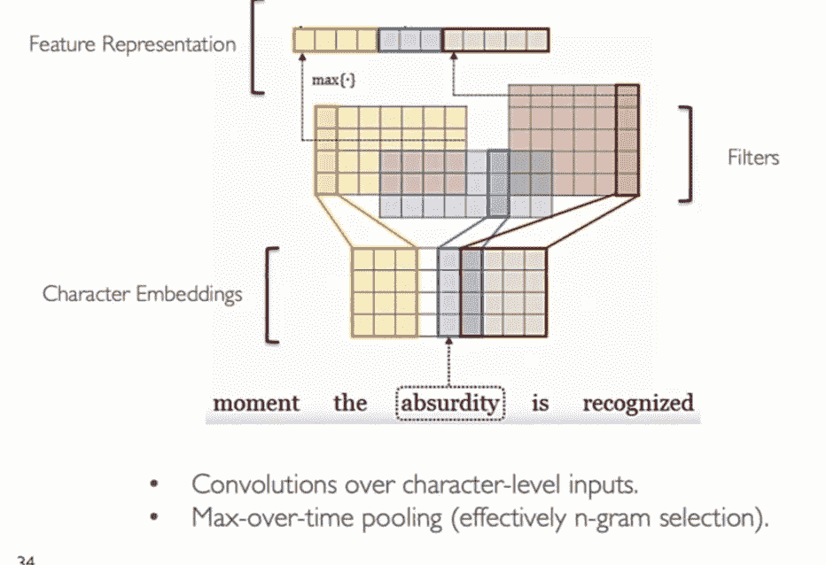

来源:[课程幻灯片](https://www.youtube.com/watch?v=9oTHFx0Gg3Q&list=PLoROMvodv4rOhcuXMZkNm7j3fVwBBY42z&index=12)

让我们研究一下论文<[字符感知神经语言模型](http://arxiv.org/abs/1508.06615) >。为了编码子词相关性，解决词级模型的稀有词问题，用更少的参数获得可比较的表达能力，并导出跨多种语言有效的强大、健壮的语言模型，作者试图通过从字符开始并想要利用相关子词和稀有词的排序来建立良好的语言模型。

我们从用字符表示的单词开始。我们有嵌入到卷积网络中的字符，然后我们有向上的字符。因此，如果我们一次一个字符，每个字符都有一个字符嵌入，那么就会有一个卷积层，它有各种滤波器，可以处理 2、3 和 4 克字符的字符序列，所以你会得到单词部分的表示。然后，从这些卷积网络中，随时间推移进行最大轮询，这实际上有点像选择这些 n 元语法中的哪一个最能代表一个单词的含义。

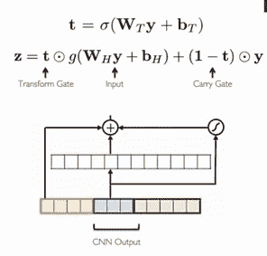

高速公路网。来源:[课程幻灯片](https://www.youtube.com/watch?v=9oTHFx0Gg3Q&list=PLoROMvodv4rOhcuXMZkNm7j3fVwBBY42z&index=12)

然后，字符 n-grams 的输出表示被输入到**高速公路网。**一个[高速公路网](https://arxiv.org/abs/1505.00387)模拟 n 元语法交互并应用转换，同时传递原始信息。它的功能类似于 LSTM 记忆细胞。

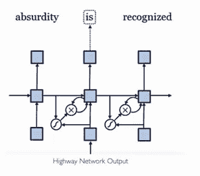

来源:[课程幻灯片](https://www.youtube.com/watch?v=9oTHFx0Gg3Q&list=PLoROMvodv4rOhcuXMZkNm7j3fVwBBY42z&index=12)

然后，高速公路网络在单词级别的输出进入长短期记忆网络，在该网络中，分层 softmax 处理大量输出词汇，并通过时间对其进行截短的反向传播训练。

结果显示，高速公路网络确实捕捉到了单词的语义。

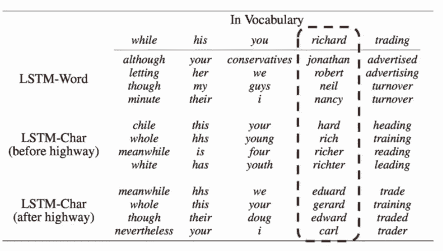

来源:[课程幻灯片](https://www.youtube.com/watch?v=9oTHFx0Gg3Q&list=PLoROMvodv4rOhcuXMZkNm7j3fVwBBY42z&index=12)

左图中，五个字上到最上面:`while`、`his`、`you`、`richard`、`trading`。根据计算出的单词表示，它会询问还有哪些单词与它最相似。顶部是单词级 LSTM 模型的输出。有趣的是，首先，你记得他们有一些字符嵌入，通过卷积层和最大池。如果在那个时候你问什么东西是最相似的(第二部分，LSTM-查尔(高速公路之前))，那基本上它仍然是记住关于人物的事情。所以和`while`最相似的词就是`chile`、`whole`、`meanwhile`、`white`。至少对于第一类来说，它们都以`LE`结尾。*所以你只是得到了这个字符序列的相似度*。根本不是真的在做有意义的事。*但有趣的是，当他们通过高速公路层时，高速公路层成功地学会了如何将这些字符序列表示转换成能够捕捉含义的东西*。对于单词`while`，其最相似的单词是`meanwhile`、`whole`、`though`和`nevertheless`。

本文的要点是:1)本文质疑了使用单词嵌入作为神经语言建模输入的必要性； **2) CNN 加公路网超过字符可以提取丰富的语义和结构信息；** 3)您可以构建“积木”来获得细致入微且功能强大的模型！

# 3.混合字符和单词级模型

## 3.2 混合神经机器翻译(NMT)

[混合 NMT](https://arxiv.org/abs/1604.00788) 大部分在单词层面翻译，只在需要的时候才转到字符层面。

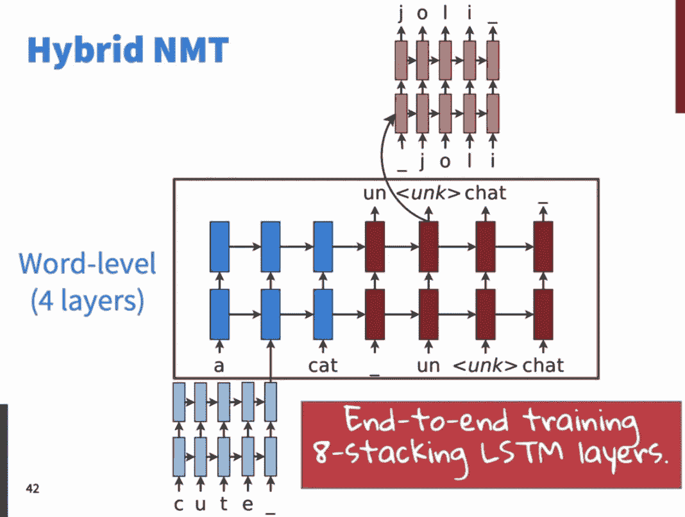

混合 NMT 模型结构。来源:[课程幻灯片](https://www.youtube.com/watch?v=9oTHFx0Gg3Q&list=PLoROMvodv4rOhcuXMZkNm7j3fVwBBY42z&index=12)

这是一个混合架构，具有单词级和字符级。我们想要建立一个混合模型，因为看起来建立一个翻译起来相对更快更好的东西更实际。

因此，我们的想法是主要建立一个单词级别的神经机器翻译系统，但是当我们遇到罕见或看不见的单词时，我们也可以处理字符级别的东西。事实证明，它能成功地提高性能。*所以我们的想法是这样的，我们要运行一个相当标准的，关注 LSTM 神经机器翻译系统的序列对序列。它实际上是一个 4 级深度系统。*我们将在*用合理的 16，000 个单词来运行这个。*因此，对于常见的单词，我们只有输入到神经机器翻译模型中的单词表示，但对于不在词汇表中的单词，我们将通过使用字符级 LSTM 为它们计算出单词表示，相反，当我们开始在另一边生成单词时，我们有一个词汇量为 16，000 的 softmax。

它可能只会产生像“un <unk>chat”、*这样的词，但其中一个词是 UNK 符号。如果它生成了 UNK 符号，我们就把这个* ***隐藏的表示*** *作为初始输入输入到字符级 LSTM，然后我们有字符级 LSTM，*然后我们有字符级 LSTM 生成一个字符序列，直到它生成一个停止符号，我们用它来生成单词。因此，我们最终得到了这种由 8 个 LSTM 层组成的混合堆栈。</unk>

这是一项决定性的技术，在训练时你知道来源和目标，这意味着在训练时，我们已经决定了我们的词汇。所以对于输入端和输出端，我们都知道哪些单词不在我们的词汇表中。因此，如果它不在我们的词汇表中，对于输入，我们运行左上角的蓝色 lstm，对于输出，我们运行上图中右上角的红色 lstm。

解码包含两个阶段:用于<unk>的字级波束搜索和字符级波束搜索。</unk>

[论文](https://arxiv.org/abs/1604.00788)中的结果显示，它在尝试填充生僻字方面比复制机制实现了超过 2 BLEU 的改进。

# 4.单词嵌入的字符

## 4.1 快速文本嵌入

对于单词嵌入，您应该能够使用字符或单词片段做一些有用的事情。这就是快速文本嵌入的用武之地。 [FastText](https://arxiv.org/pdf/1607.04606.pdf) 的目标是下一代高效的类似 word2vec 的单词表示库，**，但更适用于生僻字和有大量词法的语言。** ***它是 word2vec 跳格模型的扩展，带有字符 n-grams。*** FastText 嵌入将一个单词表示为用边界符号扩充的 char n-grams 以及整个单词。例如，单词“where”被表示成`<wh`、`whe`、`her`、`ere`、`re>`和`<where>`。注意`<her>`或`<her`与‘她’不同。前缀、后缀和整个单词是特殊的。它将单词表示为这些表示的总和。

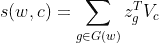

上下文中的单词分数。

上下文得分中单词的等式表明，它不是共享表示或所有 n 元语法，而是使用“散列轨迹”来具有固定数量的向量。例如，您将单词“where”表示为一组 n-gram。你需要一个边界符号(分别是`<`和`>`)来表示单词的开始和结束。所以单词`where`的三个字母可以是`<wh`、`whe`、`her`、`ere`和`re>`。此外，还有一个用于整个单词的额外按钮，即`<where>`。所以`where`用 6 个向量表示。记住，word2vec 计算上下文表示向量和中心单词表示向量之间的点积。FastText 完全做同样的事情，但是中心单词表示向量将是这 6 个向量。在计算完每个向量后，FasText 最终将它们相加，生成用于`where`的单词嵌入。

*[***论文***](https://arxiv.org/pdf/1607.04606.pdf) ***中的结果表明，对于英语来说，FastText 嵌入并不比 CBOW 得到更好的效果。但是对于另一种有更多词法的语言(s.t. German)，快速文本嵌入表现更好*** 。*

# *参考*

1.  *[斯坦福 CS224N: NLP 与深度学习| Winter 2019 |讲座 12 —子词模型](https://www.youtube.com/watch?v=9oTHFx0Gg3Q&list=PLoROMvodv4rOhcuXMZkNm7j3fVwBBY42z&index=12)*

*2.[具有子词单元的生僻字的神经机器翻译](https://arxiv.org/abs/1508.07909)*

*3. [SentencePiece:一个简单且独立于语言的子词记号化器和去记号化器，用于神经文本处理](https://arxiv.org/abs/1808.06226)*

*4.[字符感知神经语言模型](https://arxiv.org/abs/1508.06615)*

*5.[用混合单词-字符模型实现开放词汇神经机器翻译](https://arxiv.org/abs/1604.00788)*

*6.[用子词信息丰富词向量](https://arxiv.org/pdf/1607.04606.pdf)*