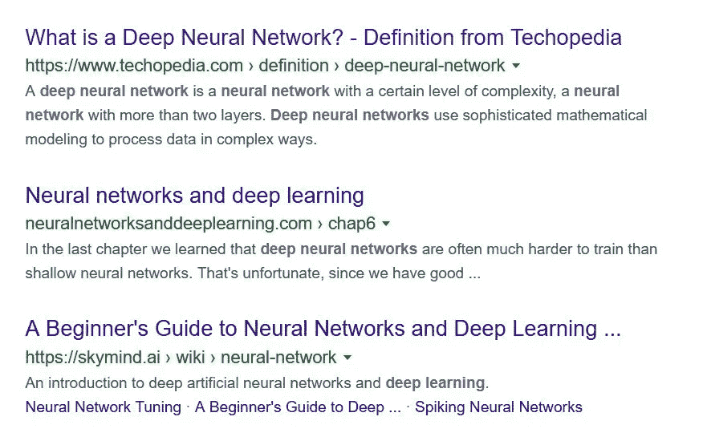
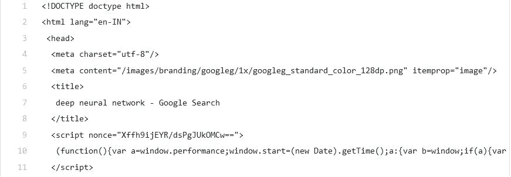

# 信息检索(第一部分):提取网页

> 原文：<https://medium.com/analytics-vidhya/information-retrieval-part-1-extracting-webpages-a9d0b715535d?source=collection_archive---------14----------------------->


由[塞缪尔·泽勒](https://unsplash.com/@samuelzeller?utm_source=medium&utm_medium=referral)在 [Unsplash](https://unsplash.com?utm_source=medium&utm_medium=referral) 上拍摄的照片

> 信息检索是从这些资源的集合中获取与信息需求相关的信息系统资源的活动。

在我们继续从数据中提取相关信息之前，让我提供一个关于如何从互联网上搜集信息的简短教程。

首先，我们看一下 Python 中需要导入的库:

**注:我用过 Python 3.6.5**

*   要求
*   美丽的声音

```
import requests #for making HTTP requests in Python
from bs4 import BeautifulSoup # pulling data from HTML or XML files
```

接下来，我们设置一个查询，这是我们感兴趣的提取网页的主题。

```
query = "deep neural network"
```

让我们驾驭**请求**的力量

```
r = requests.get('[https://www.google.com/search?q={}'.format(query))](https://www.google.com/search?q={}'.format(query)))
```

现在，我们有一个名为`r`的`[Response](https://2.python-requests.org/en/master/api/#requests.Response)`对象。我们可以从这个物体中得到我们需要的所有信息。

***注意:您可能会遇到如下错误***

```
IOPub data rate exceeded.
The notebook server will temporarily stop sending output
to the client in order to avoid crashing it.
```

要解决这个问题，请参考 **stackoverflow:** 上的答案

[**https://stackoverflow.com/a/43420383/8385813**](https://stackoverflow.com/a/43420383/8385813)

这就是美丽的 T21 派上用场的地方。

```
soup = BeautifulSoup(r.text, "html.parser")
```

在透露**汤**储存什么之前，先看看下图



在谷歌上搜索“深度神经网络”的前三个结果

继续， **soup** 变量存储了上述 web 页面的 HTML 代码。

```
soup
```

很糟糕，对吧？让我们美化这个..

```
print(soup.prettify())
```



在 HTML 中，属性为我们提供了网页的链接。为了获得所有这样的链接，我们运行下面几行代码:

```
links = []
for item in soup.find_all('a'):
    links.append(item.get('href'))
```

对于本文，我们的目标是只提取第一个搜索页面的所有链接。

第三方网页的链接看起来与上图中的相似，以下列字符开头，“/url？q= "，所以我们需要过滤掉这样的字符串。

上述任务的代码如下所示:

```
final = []
for item in links:
    str = item[0:7]
    if str=="/url?q=":
        final.append(item)
```

这是变量**最终**存储的内容:

假设我们想从第一个网页中访问所有的

属性，并将它们连接成一个字符串**文本**。下面几行代码实现了这一点

```
webpage1 = requests.get('[https://www.google.com/'](https://www.google.com/') + final[0]) #final[0] refers to the first web page link
webpagetext = BeautifulSoup(webpage1.text, "html.parser")
all_p = webpagetext.find_all('p')
text = ""
for item in all_p:
    text = text + item.get_text()
print(text)
```

该文本可能包含许多不必要的内容，如空格、特殊字符等。我们可能不需要提取任何信息。处理它们的技术将在下一个教程中介绍。

在下面找到本教程的第 2 部分:

[](/analytics-vidhya/information-retrieval-part-2-simplifying-the-information-53880b930ebd) [## 信息检索(第二部分):简化信息

### 在前一篇文章中，我们探索了一种提取信息的技术。现在让我们看看一些关键术语…

medium.com](/analytics-vidhya/information-retrieval-part-2-simplifying-the-information-53880b930ebd) 

本文的完整代码发布在以下链接中:

[](https://github.com/arnabsinha99/MListheroxx/blob/master/Mini_Projects/WebPageExtraction/Extract.py) [## arnabsinha99/MListheroxx

### 此时您不能执行该操作。您已使用另一个标签页或窗口登录。您已在另一个选项卡中注销，或者…

github.com](https://github.com/arnabsinha99/MListheroxx/blob/master/Mini_Projects/WebPageExtraction/Extract.py)