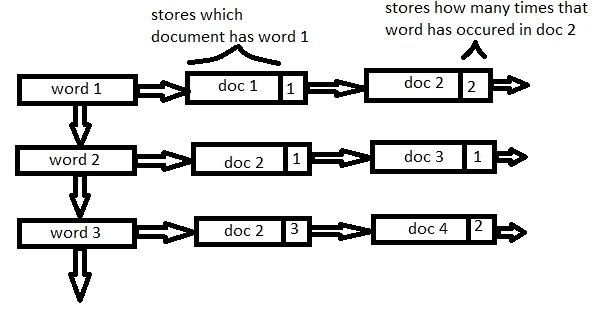

# 信息检索(第二部分):简化信息

> 原文：<https://medium.com/analytics-vidhya/information-retrieval-part-2-simplifying-the-information-53880b930ebd?source=collection_archive---------4----------------------->


在前一篇文章中，我们探索了一种提取信息的技术。现在，在继续进行编码部分之前，让我们来看一些需要理解的关键术语。

# **标记化**

给定一个字符序列和一个已定义的文档单元，标记化就是将它分割成多个部分的任务，称为*标记*，可能同时丢弃某些字符，如标点符号。

标记化有两种类型:

1.  *将段落分词成句子*

例如，假设给定一个具有以下文本的文档:“山姆是一个好学生。他本性善良，乐于助人。”

标记化的句子会是列表:[“山姆是个好学生。”，“他本性善良，乐于助人。”]

1.  *将句子分词成单个单词*

例如，如果我们想对上一段的第一句话进行标记，标记的形式应该是下面的列表:["Sam "，" is "，" a "，" good "，" student "，]. "]

# **停用词**

停用词是任何自然语言中最常用的词的列表。出于分析文本数据和构建 NLP 模型的目的，这些停用词可能不会给文档的含义增加太多价值，因此我们将它们排除在分析之外。

如果要查看英文的停用词列表，可以运行以下代码:

# **词汇化 v/s 词干**

定义这两个术语，

> 词干化是文本规范化技术的一个基本的基于规则的过程，它通过考虑在一个单词中可能找到的一系列常见前缀或后缀来删除该单词的结尾或开头
> 
> 词汇化是获得单词词根形式的一种有组织的方法。它**利用了词汇**(单词的词典重要性)和**词法分析**(单词结构和语法关系)。

炮泥是一种**快**但**脏的方法**劈起来的话。

词汇化是一种使用特定语言词典的智能操作。

因此，词汇化有助于形成更好的特征。

# 倒排索引

文档集合的倒排索引基本上是一种数据结构，它将每个独特的术语与包含该术语的所有文档的列表联系起来。

它的一个修改版本可以是这样的:我们将单词在特定文档中的出现频率与文档编号一起附加上去。下图将阐明直觉。



现在，我们可以继续构建倒排索引了。

要导入的一些有用的库包括:

```
import nltk
from nltk.tokenize import word_tokenize
from nltk.corpus import stopwords
from nltk.stem import WordNetLemmatizer
```

对于每个文档，我们首先将文档标记为单个单词。

为了有效的标记化，我们同时忽略停用词。

然后我们使用 nltk 导入的库 **WordNetLemmatizer** 对单个单词进行词汇化

最后，我们创建一个倒排索引。我们维护一个名为 **ispresent** 的二级列表，存储已经存在于倒排索引中的单词。变量**in find**存储反向索引。

[https://gist . github . com/arnabsinha 99/b5 ca 8 a2 cdd 7 c 83295 a 26867 FEA 237 bb 6](https://gist.github.com/arnabsinha99/b5ca8a2cdd7c83295a26867fea237bb6)

正如您所看到的，[y，1]意味着我们正在存储一个文档编号的元组和那个文档 **y** 中**单词**的词频。

我们终于有了倒排索引，可以用它来进行进一步的文本分析。

倒排索引有以下优点:

*   它允许**快速全文搜索**，代价是当一个文档被添加到数据库时，处理时间会增加。
*   开发很容易**。**
*   它是在文档检索系统中使用的最流行的数据结构，例如在搜索引擎中大规模使用。

一个显著的缺点是，它带来了巨大的存储开销**以及更新、删除和插入**的高额维护**成本**。

完整的代码包括网页抓取，请点击下面的链接。

[](https://github.com/arnabsinha99/MListheroxx/blob/master/Mini_Projects/Information%20Retrieval/IR%20Assignment%201.ipynb) [## arnabsinha99/MListheroxx

### 此时您不能执行该操作。您已使用另一个标签页或窗口登录。您已在另一个选项卡中注销，或者…

github.c](https://github.com/arnabsinha99/MListheroxx/blob/master/Mini_Projects/Information%20Retrieval/IR%20Assignment%201.ipynb)