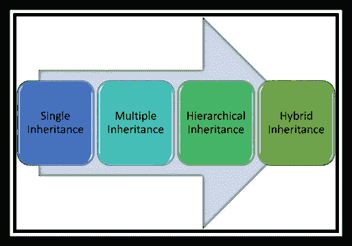
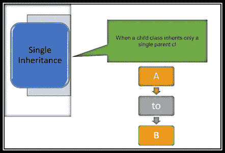
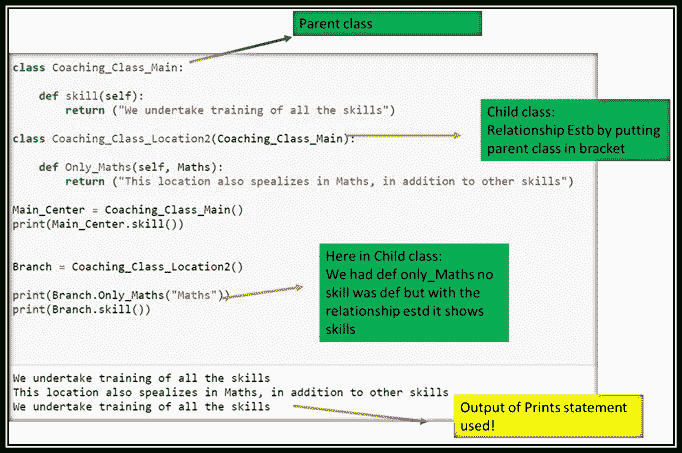
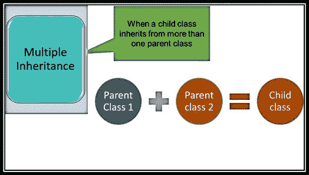
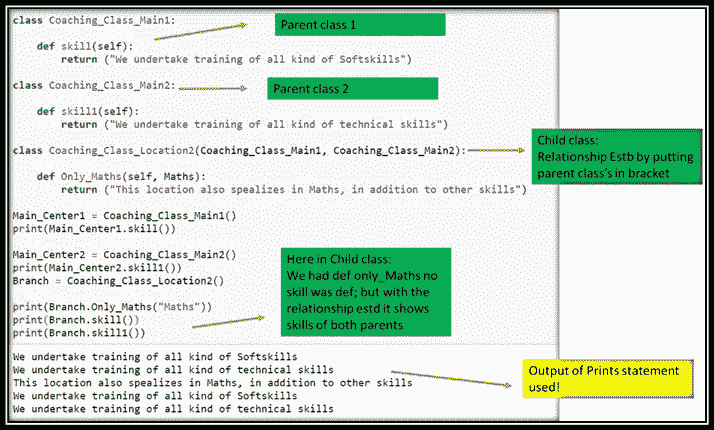
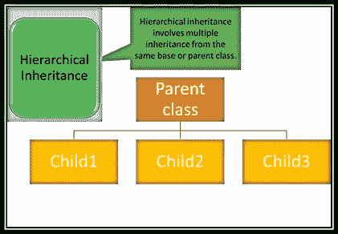
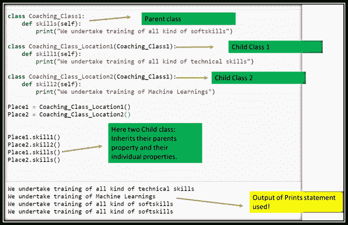
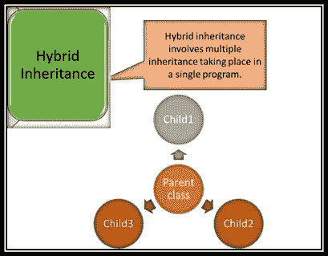
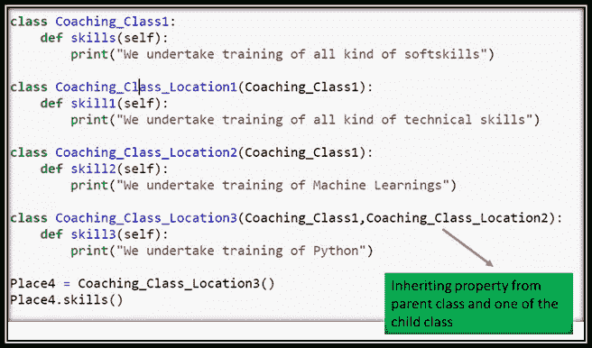

# PYTHON 中的继承

> 原文：<https://medium.com/analytics-vidhya/inheritence-in-python-ad07138202a6?source=collection_archive---------11----------------------->

[Data Folkz](https://medium.com/u/77222b949e2?source=post_page-----ad07138202a6--------------------------------) @trepend.com

哎呀处理以下概念。

*   遗产
*   多态性
*   包装
*   抽象

**那么让我们从继承开始。**

**PYTHON 中的继承**

这个术语的意思是继承意味着延续，继承意味着拥有被继承的所有属性。因此 python 被认为是当一个类接受另一个类的属性和方法时。因此，已经拥有所有属性的类称为父类，新创建的类称为子类。

***同继承:***

*1。t 很好地代表了现实世界的关系。*

*2。* *它提供了代码的可重用性。我们不必一遍又一遍地写同样的代码。此外，它允许我们在不修改类的情况下向类中添加更多的特性。*

*3。它本质上是可传递的，这意味着如果类 B 从另一个类 A 继承，那么 B 的所有子类将自动从类 A 继承*

**遗产的种类**

基本上，继承的类型取决于所创建的子关系和父关系的数量。

***我们有 4 种类型的继承:***

## 单一继承:-

*在 Python 中:下面是代码:*

## 多重继承:-

*在 Python 中:下面是代码*

## 分层继承:-

*在 Python 中:下面是代码*

## 混合遗传:-

*在 Python 中:下面是代码*

请继续关注关于多态性的下一篇文章..