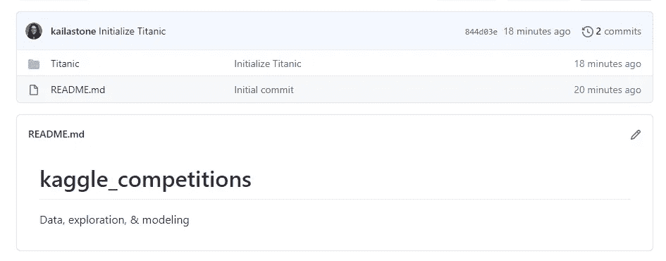
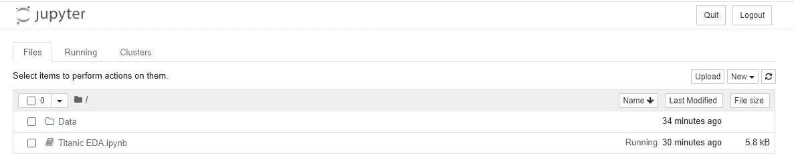
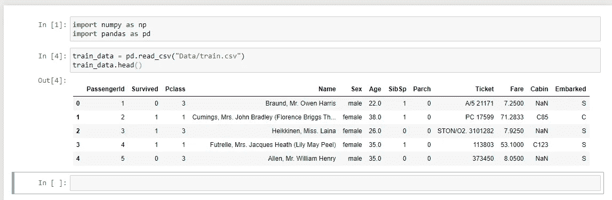
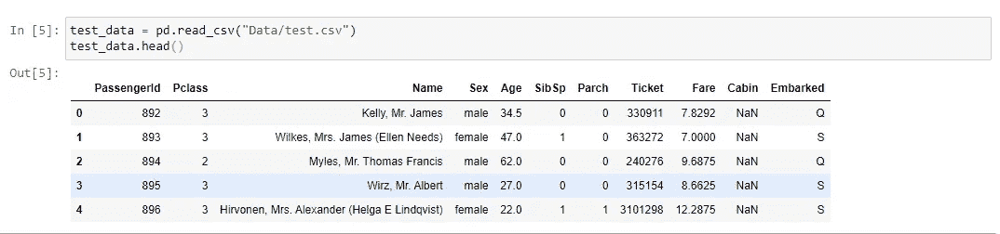

# 初始化数据科学项目

> 原文：<https://medium.com/analytics-vidhya/initializing-a-data-science-project-d6a0891d750b?source=collection_archive---------15----------------------->

在这一系列文章中，我们将介绍 Kaggle 的一个简单的入门级数据科学项目；利用[泰坦尼克号](https://www.kaggle.com/c/titanic/overview)数据集。如果这是你第一次完成一个端到端的项目，或者如果它是一个热点分钟-不要担心！在下一篇文章深入研究任何特性之前，我们将一步一步地介绍如何下载和组织您的数据。

# 需要什么:

*   GitHub 帐户
*   卡格尔账户
*   Git Bash ( [安装&安装指南](https://docs.github.com/en/free-pro-team@latest/github/getting-started-with-github/set-up-git)
*   Jupyter 笔记本([安装指南](https://jupyterlab.readthedocs.io/en/stable/getting_started/installation.html)

# 第一步:

登录 GitHub 并创建一个新的资源库。你如何组织你的工作空间和流程是完全个人化的，但是我将分享我是如何选择开始我的工作的。

因为我计划做多个小项目，所以我创建了一个名为“kaggle_competitions”的 repo，然后我将利用文件夹来按单个竞赛进行组织。下面是我目前为止的进度截图:

## 我们是怎么到这里的？

初始化 repo 后，我使用在 [GitHub Docs](https://docs.github.com/en/free-pro-team@latest/github/creating-cloning-and-archiving-repositories/cloning-a-repository) 上找到的方法将其克隆到我的本地源文件中。

接下来，我从 Kaggle 下载了我的所有数据集，并将它们移动到包含上面克隆的 repo 的本地文件夹中。所以我完成的文件路径是:

用户→我→“来源”→“ka ggle _ 比赛”→“泰坦尼克号”→“数据”

最后，我利用 Git Bash 将这些更改和新文件推送到我的 GitHub repo 中。

# 导入数据

在 Jupyter 笔记本中打开 Titanic 数据后，我创建了一个名为“Titanic EDA”的新 Python 笔记本。

在开始之前，我需要通过导入 NumPy 和 Pandas 来读入数据集；然后为数据集设置一个变量名——在本例中是“train_data”。下面的屏幕截图显示了成功导入的前 5 行数据:

最后，我使用与训练数据相同的方法导入测试数据。现在，每个数据集都被分配到一个唯一的变量，以便在项目的剩余部分使用！

请注意两个数据集之间的差异:测试数据缺少“幸存”列。这是我们基于未来的分析和研究预测的特性！

**我希望这篇文章对你有用！**

*在网络上找到我:* [媒介](/@kailastone) | [推特](https://twitter.com/stone_kode)|[LinkedIn](https://www.linkedin.com/in/kaila-stone/)|[GitHub](https://github.com/kailastone)

谢谢大家！—凯拉