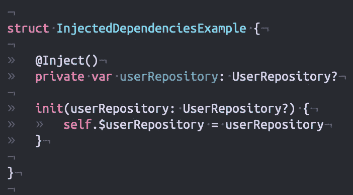
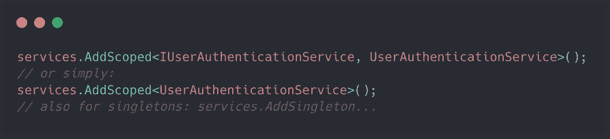
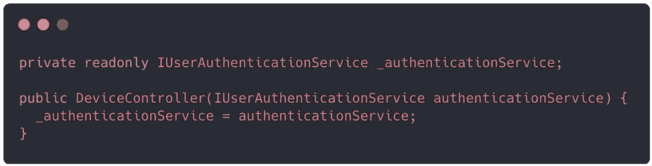
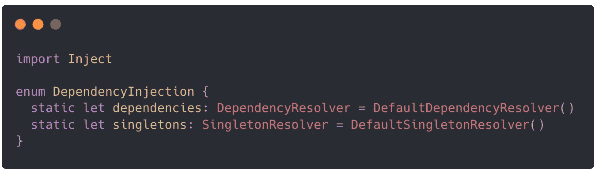
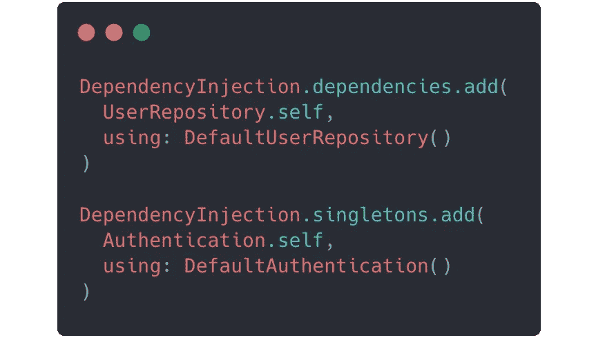
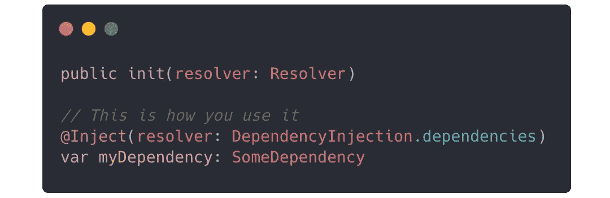
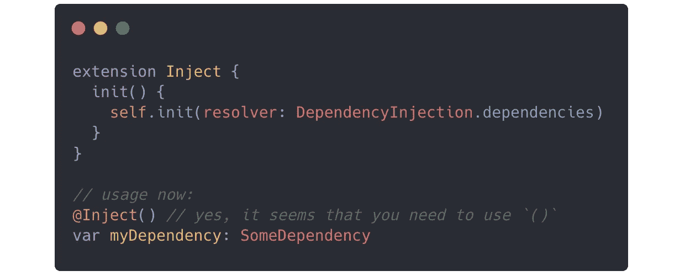
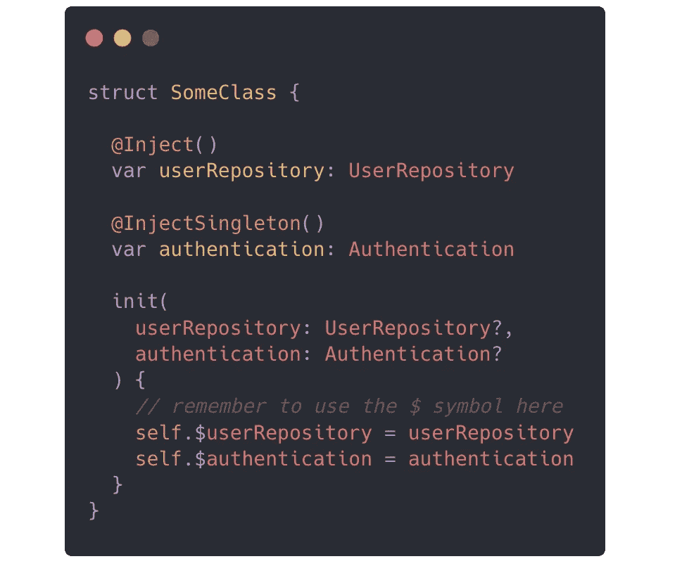

# inject—Swift 的依赖注入库，支持单例

> 原文：<https://medium.com/analytics-vidhya/inject-dependency-injection-library-for-swift-with-support-for-singletons-492a78022144?source=collection_archive---------27----------------------->

Swift 的“注入”示例

**大家好，受到最近一篇** [**文章**](https://link.medium.com/ZT3o3zkPD6) **的启发，我在 ASP.NET 上做了一些关于依赖注入的练习，不过我想创建一个小库来缓解 Swift(包括 iOS、macOS 等)的依赖注入。**

# 这个想法

首先，这是一个如何在 C#上的**ASP.NET**内核上实现的示例:

ASP 上的依赖注入。网

很简单，对吧？你只需添加你想要注入的类型，然后创建一个接受该类型的构造函数，你就拥有了它。

有一些方法和选项可以做到这一点，包括添加单件，但这是想法。

# 在 Swift-Inject 上实施

如前所述，要在 Swift 上实施，首先要存储您的依赖关系。我在内部使用了一个字典，其中的键是一个类型，值是一个函数，用来构建想要的值。这都是在“依赖解析器”中完成的；我们需要首先在应用程序中实例化该类型的静态值:

依赖注入解析器

那么你的应用程序需要做的第一件事就是添加依赖关系。在这种情况下，我们使用一个协议和一个实现该协议的值:

添加依赖项—注入

这就是我们如何在代码中注入依赖关系。首先，您需要向它传递一个依赖解析器，这样它就可以在内部查找如何构建所需的类型。

要使用注入值，您只需像使用任何其他属性一样使用该属性，您还可以更改它的值，以便它使用一个特定的值来代替注入值。

注入 init 以及如何使用它

在实践中，您可能想避免一直传递解析器，所以您可以在本地创建这个扩展:

用于注入的有用扩展

# 使用

这是一个使用注入值的类的完整示例。

注射用法的完整示例

这是使用 Inject 的推荐方式。您创建自己的属性，然后创建一个接受可选依赖项的构造函数，最后将它赋给自己的属性。通过这样做，如果您传递 nil，它将使用注入的值，但是如果您传递一个有效值，它将使用该值。

正如你已经看到的，这个库也支持**单例**，用法是一样的，但是内部行为有点不同，对于单例，我们保存了一个惰性变量，它的值将在你的应用中使用。

# 更大的

**您现在可以通过导入 swift 包来使用这个库:**[**https://github.com/illescasDaniel/Inject-Swift.git**](https://github.com/illescasDaniel/Inject-Swift.git)

为了获得更多信息和示例，我创建了一个示例项目:

 [## illes cas Daniel/Inject-Swift-example

### 注入 Swift 示例。通过在 GitHub 上创建一个帐户，为 illescasDaniel/Inject-Swift-example 开发做出贡献。

github.com](https://github.com/illescasDaniel/Inject-Swift-example) 

这是官方的注入回购:

 [## illescasDaniel/Inject-Swift

### swift 的简单依赖注入，兼容结构和类。定义您的协议定义一个类(或…

github.com](https://github.com/illescasDaniel/Inject-Swift) 

感谢阅读这篇文章！