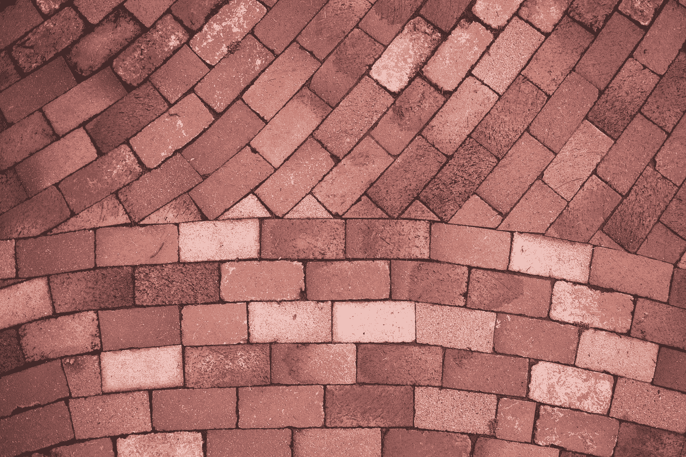
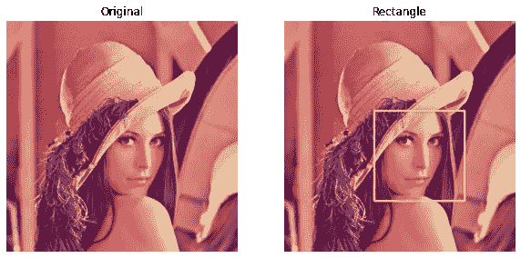
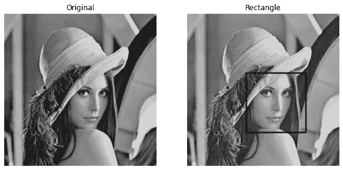
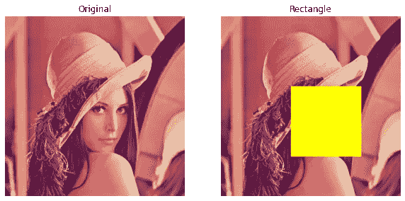
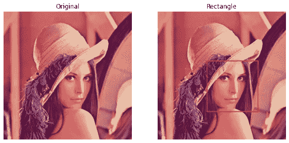
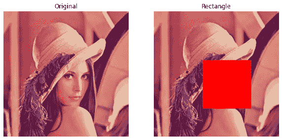

# 使用 NumPy 对 cv2.rectangle()进行内部处理

> 原文：<https://medium.com/analytics-vidhya/inner-working-of-cv2-rectangle-using-numpy-b7bcdf333ef8?source=collection_archive---------9----------------------->

在本文中，我们将尝试使用 Python 中的 NumPy 模块来理解 ***cv2.rectangle()*** 的内部工作原理。

照片由[蒂姆·莫斯霍尔德](https://unsplash.com/@timmossholder?utm_source=medium&utm_medium=referral)在 [Unsplash](https://unsplash.com?utm_source=medium&utm_medium=referral) 上拍摄

***cv2 . rectangle()***是 OpenCV 的方法——用来在图像上画一个矩形。我们可以选择决定矩形的厚度和颜色。但是我们需要确保颜色是以 ***RGB*** 码(R，G，B)传入的。在这篇博客文章中，我们将努力集中理解这个方法的内部工作原理，并使用 NumPy 模块从头开始实现它。

矩形就是我们想要在图像的指定位置绘制的形状。我们可以通过两点 ***pt1*** 和 ***pt2*** 来进行位置的绘制。图像矩阵被认为是一个 2D 平面，以便我们确定矩形的位置。我们先来了解一下库方法。

上述方法的论据是:

*   ***img*** →画矩形的图像。
*   ***pt1*** →点 1 决定矩形的位置。
*   ***pt2*** →点 2 也决定矩形的位置。
*   ***颜色*** →作为 ***RGB*** 代码传递的矩形的颜色。
*   ***粗细*** →矩形的线条粗细。

其他论点及其重要性可以通过查看***help(cv2 . rectangle)***了解。首先，我们将实现库方法，然后我们将从头开始实现代码。

# 编码时间到了

我们主要使用的软件包有:

*   NumPy
*   Matplotlib
*   OpenCV →仅用于读取图像。

作者图片

## 导入包

## 阅读图像

上述函数读取灰度或 RGB 图像，并返回图像矩阵。

## 用库实现代码

我们将使用***cv2 . rectangle()***方法。但是为了更好的可视化，我们可以将下面的函数作为参数:

*   ***start_pos*** →要知道要绘制的矩形的起始位置。
*   ***长度*** →矩形的长度(考虑绝对值)。
*   ***宽度*** →矩形的宽度(考虑绝对值)。

从以上三个论点，我们可以得出***【pt1】***和 ***pt2*** 点实际上是在传递库函数。

*   ***粗细*** →矩形的粗细。
*   ***color_name*** →不用传递 ***RGB*** 代码，我们可以从***color _ names _ data . JSON***文件中提取(R，G，B)值，我在这个文件中已经分别存储了所有可能的颜色名称及其(R，G，B)值。颜色数据的样本可以在下面查看。

该功能适用于彩色图像和灰度图像。但是对于灰度图像，考虑默认颜色 ***黑色*** 。

上面的函数比我们自己指定点更容易实现。我们可以简单地提到三个重要的论点，并在此基础上确定要点。让我们测试一下功能。

**对于彩色图像:**

作者图片

**对于灰度图像:**

作者图片

对于 thickness (-1)，有一种特殊情况，即根据指定的颜色对整个矩形区域进行着色。

作者图片

以上案例都是使用库方法实现的。很明显，库方法肯定有效。是时候靠我们自己从零开始做点什么了。

## 从头开始代码实现

我们将使用在上述函数***rectangle _ lib()***中使用的相同参数。但是我们遵循的技术是不同的。在这里， ***厚度*** 的说法与 ***start_pos*** 、 ***长度*** 、宽度**起着重要的作用。**

**实现背后的逻辑:**

1.  **我们要根据 ***start_pos*** ， ***长度*** ， ***宽度*** 来抓取子图。基本上，我们必须裁剪图像。这个裁剪的图像将是矩形的内部部分(请阅读这篇[文章](/analytics-vidhya/crop-the-image-intuitively-numpy-d19ef55c2207)以了解更多信息)。**
2.  **我们需要用颜色值填充图像矩阵(从颜色名称获得)。如果图像是灰度的，那么我们将填充黑色值，即 ***0*** 。否则，我们将在分离 ***R*** 像素、 ***G*** 像素和 ***B*** 像素并最终将它们合并以形成单个图像之后填充 3 次。基本上，我们在裁剪图像的边缘(请阅读这篇文章[以了解更多信息)。](/analytics-vidhya/adding-a-border-to-the-image-using-numpy-efa23f7f1cdf)**
3.  **最后，我们需要在原始图像中替换这个带边框的、裁剪过的图像，并显示该图像。**

**我们将使用来自文件***color _ names _ data . JSON***的相同颜色数据来获得颜色值。让我们编写逻辑代码。**

**在这里，我们不处理决定矩形位置的点。我们是用 ***裁剪*** 、*、用 ***代替*** 的手法来达到主要动机。我们来测试一下上面的函数。***

*****对于彩色图像:*****

******

***作者图片***

*****对于灰度图像:*****

******

***作者图片***

***对于 thickness (-1)，有一种特殊情况，即根据指定的颜色对整个矩形区域进行着色。***

******

***作者图片***

# ***就是这个！***

***我们终于得到了我们想要的。我们试图在 NumPy 矩阵运算的帮助下从头开始实现代码。我们使用了 NumPy 方法，如:***

*   ******pad()*** →用常数值填充矩阵。***
*   ******zeros()*** →我们将此用于 ***厚度*** 为-1 的特殊情况。这仅在以灰度模式读取图像时使用。***
*   ******满()*** →我们用来获得一个相同值的矩阵。在以彩色模式读取图像的情况下，当 ***厚度*** 为-1 时，也可以使用该选项。***

***就我个人而言，我从实施该方法中学到了很多。我希望你觉得这很有见地。你一定要看看我在个人资料中关于同一主题的其他文章。***

***如果你喜欢，你可以在这里给我买咖啡。***

******