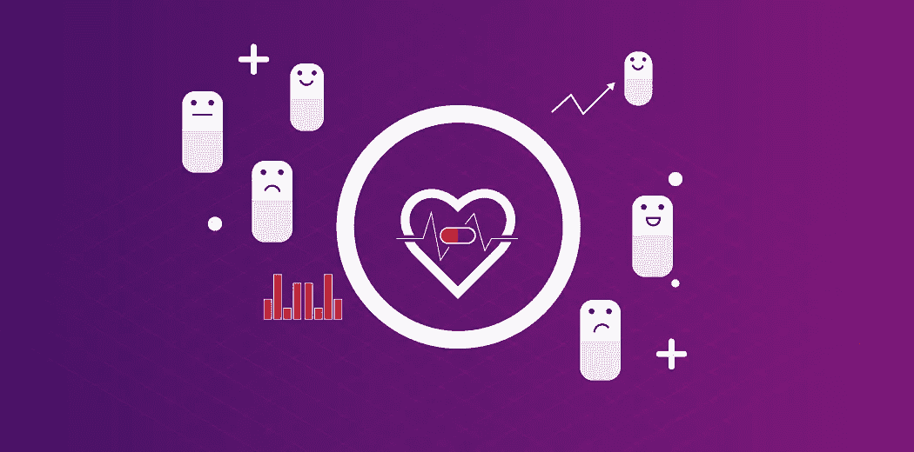
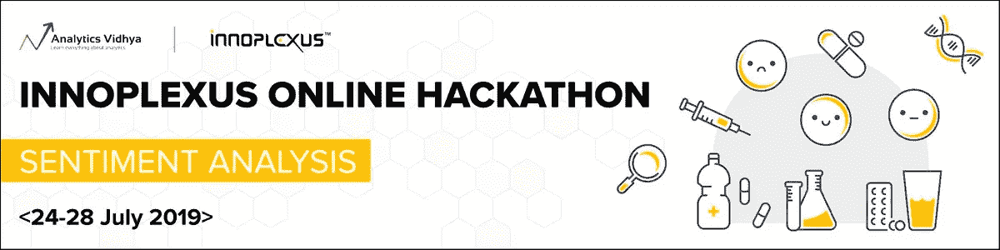

# Innoplexus 情感分析黑客马拉松:前 3 名开箱即用的获胜方法

> 原文：<https://medium.com/analytics-vidhya/innoplexus-sentiment-analysis-hackathon-top-3-out-of-the-box-winning-approaches-de2f2a9deab8?source=collection_archive---------8----------------------->

# 介绍

我是黑客马拉松的忠实粉丝。在过去的几年里，我从[参加的这些黑客马拉松](https://datahack.analyticsvidhya.com/contest/all/?utm_source=blog&utm_medium=innoplexus-sentiment-analysis-hackathon-top-3-out-of-the-box-winning-approaches)中学到了很多关于[数据科学](https://courses.analyticsvidhya.com/courses/introduction-to-data-science-2?utm_source=blog&utm_medium=innoplexus-sentiment-analysis-hackathon-top-3-out-of-the-box-winning-approaches)的知识。我承认——我通过这种媒介获得了很多知识，这反过来又加速了我的职业生涯。

这带有一个警告——赢得数据科学黑客马拉松真的很难。想想你前进的道路上有多少障碍:

*   一个全新的问题陈述，我们以前从未做过
*   众多顶尖数据科学家竞相攀升排行榜
*   时间紧迫！我们必须理解问题陈述，构建一个框架，清理数据，探索数据，并在几个小时内建立模型
*   然后重复这个过程！

一个小数点就可能是前 10 名和前 50 名的差距。这难道不是我们最初热爱黑客马拉松的原因吗？看到我们的努力得到了回报，排行榜排名上升，这种激动是无与伦比的。

因此，我们很高兴为您带来 Innoplexus 情绪分析黑客马拉松的前 3 名获胜方法！这三位顶级数据科学家是如何思考他们的解决方案并提出他们自己独特的框架的，这将让你惊叹不已。

从这些方法中可以学到很多东西。相信我，花点时间来完成这些步骤，并理解它们的来源。然后想一想你是否会做些不同的事情。然后——在我们的 [DataHack 平台](https://datahack.analyticsvidhya.com/contest/all/?utm_source=blog&utm_medium=innoplexus-sentiment-analysis-hackathon-top-3-out-of-the-box-winning-approaches)上亲自参加这些黑客马拉松吧！

我们开始吧，好吗？

# 关于 Innoplexus 情感分析黑客马拉松

与我们的合作伙伴 Innoplexus 一起举办黑客马拉松，这总是一个令人兴奋的前景。每次他们提出基于自然语言处理(NLP)的问题陈述，这是一个非常受欢迎的领域。我们已经看到 NLP 的巨大发展，这要归功于[迁移学习](https://www.analyticsvidhya.com/blog/2017/06/transfer-learning-the-art-of-fine-tuning-a-pre-trained-model/?utm_source=blog&utm_medium=innoplexus-sentiment-analysis-hackathon-top-3-out-of-the-box-winning-approaches)模型，如 BERT、XLNet、 [GPT-2](https://www.analyticsvidhya.com/blog/2019/07/openai-gpt2-text-generator-python/?utm_source=blog&utm_medium=innoplexus-sentiment-analysis-hackathon-top-3-out-of-the-box-winning-approaches) 等。

此外，[情感分析](https://datahack.analyticsvidhya.com/contest/practice-problem-twitter-sentiment-analysis/?utm_source=blog&utm_medium=innoplexus-sentiment-analysis-hackathon-top-3-out-of-the-box-winning-approaches)是数据科学家最常从事的 [NLP 项目之一。**此次 Innolpexus 黑客马拉松是一场为期 5 天的竞赛，来自全球的 3200 多名数据科学家参加了竞赛，争夺 Innoplexus 提供的工作机会和激动人心的奖品。**](https://courses.analyticsvidhya.com/courses/natural-language-processing-nlp?utm_source=blog&utm_medium=innoplexus-sentiment-analysis-hackathon-top-3-out-of-the-box-winning-approaches)

这是一场艰苦的比赛，总共有 8000 多份提交材料，行业中的佼佼者采用了各种方法来占据榜首。

对于那些没能成功登顶或者没有时间解决这个问题的人，我们整理了获胜者的方法和解决方案，以帮助你欣赏并从中学习。所以现在开始。

# Innoplexus 情感分析黑客马拉松的问题陈述

构建品牌的叙事有很多组成部分。它不仅仅是由拥有该品牌的公司建造和控制的。想想你熟悉的任何一个大品牌，你就会立刻明白我在说什么。

出于这个原因，公司一直在寻找各种平台，如博客、论坛、社交媒体等。用于检查他们的各种产品以及竞争对手产品的情绪，以了解他们的品牌如何在市场上产生共鸣。这种分析有助于他们上市后市场研究的各个方面。

这与许多行业相关，包括制药公司及其药品。

但是这也带来了一些挑战。首先，这类内容中使用的语言在语法上并不完全正确。我们经常遇到人们使用讽刺。其他人在一篇文章中涵盖了几个不同观点的主题。其他用户发表评论来表明他们对这个话题的看法。

概括地说，情绪可以分为三大类——积极、消极和中性情绪。

> *在 Innoplexus 情感分析黑客马拉松中，参与者被提供了包含文本样本的数据。该文本可能包含一个或多个药物提及。每一行都包含文本和药物名称的独特组合。请注意，相同的文本也可能对不同的药物有不同的看法。*

给定文本和药物名称，任务是预测测试数据集中包含的文本的情感。以下是数据集中的文本示例:

示例:

*Stelara 对克罗恩病的治疗还是相当陌生的。这就是为什么你可能得不到很多回复。我做了一些研究，但大多数“工作时间”的答案都来自牛皮癣委员会。对于银屑病，似乎需要大约 4-12 周才能达到强有力的治疗水平。好消息是，Stelara 似乎得到了克罗恩病患者的好评。这似乎是自 Remicade 以来最好的医学了。我希望你能成功。我女儿于 2007 年 2 月 19 日确诊，(13 岁。诊断时为老年)，患有终末期回肠克罗恩病。用过强的松和喷他沙。开始使用 IMU ran(2009 年 2 月)，出现腹部脓肿(2008 年 12 月)。狭窄 2 厘米。2014 年 2 月开始服用 Remicade，同时服用 100mgs。伊穆兰的。*

以上文字对 *Stelara* 为正，对 *Remicade* 为负。现在，我们已经对眼前的问题有了一个坚实的了解，让我们深入到成功的方法！

# Innoplexus 情绪分析黑客马拉松的获胜者

正如我前面提到的，赢得一场黑客马拉松是极其困难的。我喜欢浏览我们的获胜者提供的这些顶级解决方案和方法。首先，让我们看看谁赢了，并祝贺他们:

以下是所有参与者在[排行榜](https://datahack.analyticsvidhya.com/contest/innoplexus-online-hiring-hackathon/pvt_lb)上的最终排名。

前 3 名获奖者分享了他们在比赛中的详细方法。我相信你很想知道他们的秘密，所以让我们开始吧。

# 排名 3: [穆赫辛哈桑汗](https://datahack.analyticsvidhya.com/user/profile/Tezdhar) (ML 工程师@HealthifyMe)

以下是 Mohsin 与我们分享的内容:

## 方法

> ***“我最终的解决方案是 BERT 和 XLNet 运行的集合。”***

*   我对数据的第一印象表明，根据我对消极和积极情绪的看法，有许多错误的标签。所以，我觉得手工制作这些特征真的很难。我决定**最好坚持使用最先进的 NLP 模型**来学习有噪声的数据。
*   我从一个简单的 TF-IDF 加逻辑回归模型开始，它给了我 0.5 的交叉验证(CV)分数。在查看文本数据后，我意识到有许多行包含许多与药物无关的行。
*   因此，我决定只使用含有药物名称的句子。 **TF-IDF 加上仅含药物名称句子的逻辑回归得出我的 CV 值为 0.54**
*   此时，我决定用伯特。没有任何微调，只拿到了 0.45 的 CV 分。但是，一旦我让 BERT 对训练数据进行微调，它给出的验证分数为 0.60，排行榜分数为 0.59。然后，我添加了出现在药物句子前后的句子——这稍微增加了 CV 分数。然后，我使用 BERT-large 并对其进行了微调，这使我的 CV 值为 0.65，排行榜得分为 0.61。同样，我微调了 XLNet 基数，CV 值为 0.64，排行榜为 0.58。**我的最终解决方案是 BERT 和 XLNet 运行的集合**
*   *注:由于类别分布不平衡，5 倍分层 K 倍*

# 排名 2: [哈里尼·文加拉](https://datahack.analyticsvidhya.com/user/profile/Harini)(统计分析师@印度沃尔玛实验室)

以下是 Harini 与我们分享的内容:

## 方法

> “我最终的模型是 3 个伯特和 1 个 AEN 的合奏。”

*   我的第一个基线方法是使用计数矢量器。这让我在公开排行榜上获得了 0.42 分。我删除了数字、表情符号、网址、标点符号，并将文本转换成小写。
*   我尝试了 BERT，并针对给定的数据集进行了调整。接下来，我从文本中删除了停用词，因为如果我在整篇文章中运行它，BERT 需要更多的内存。我将序列长度设为 150，但是我意识到在这种方法中大多数重要的信息都被忽略了。我没有越过公开排行榜上的 0.50 分。
*   那么，我还能尝试什么呢？我只选取了出现特定药物的句子，并再次使用 BERT 对情绪进行分类。这让我在公开排行榜上得了 0.60 分。我还实现了注意力编码器网络(AEN ),用于目标情感分类，得到了 0.56 分
*   我最终的模型是 3 个伯特和 1 个 AEN 的合奏。我使用的损失函数是 *CrossEntropyLoss* ，类别权重= 1/每个相应类别中的观察数量。
*   **我的关键建议——尝试不同的东西，根据数据检查什么有效。**花点时间列出你在黑客马拉松中可以尝试的所有事情。

# 排名 1: [梅尔文·巴布](https://datahack.analyticsvidhya.com/user/profile/exMortal)(数据科学家@nference)

以下是梅尔文与我们分享的内容:

## 方法

> *“我很早就注意到，增加最大序列长度可以充分提高分数。这个观察或多或少决定了我的方法。我使用了一个基本的 XLNet 模型，几乎没有任何功能工程。”*

*   我**小写了所有句子，并屏蔽了句子**中的相关药物。然后，在句子片段标记化之后，我开始获取前 1380 个标记。
*   我选择用尽可能多的最大序列长度填充 GPU RAM，并且**避免使用额外的功能**。我试图向数据中添加变量，但却犯了实现错误，时间不够了。
*   **在最终模型中，我使用了 6 个种子来平均 XLNet 基础案例模型的预测**。时间不允许我进行任何其他的超参数调整。
*   真的很惊讶**在深度学习可能是最佳解决方案的竞争中，我可以用一台 8 GB 的 GPU RAM 机器来竞争**
*   识别训练和测试分布的差异可能是至关重要的。大多数事情和其他黑客马拉松是一样的。

# 结束注释

在比赛过程中，与这些获胜者互动并了解他们的方法非常有趣。这是一场竞争激烈的黑客马拉松，正如你已经看到的，获胜的方法非常棒。

我鼓励你今天前往 [DataHack platform](https://datahack.analyticsvidhya.com/?utm_source=blog&utm_medium=innoplexus-sentiment-analysis-hackathon-top-3-out-of-the-box-winning-approaches) 并参加正在进行和即将举行的黑客马拉松。这将是一次无价的学习经历！

*原载于 2019 年 8 月 16 日 https://www.analyticsvidhya.com**的* [*。*](https://www.analyticsvidhya.com/blog/2019/08/innoplexus-sentiment-analysis-hackathon-top-3-out-of-the-box-winning-approaches/)