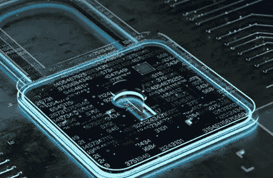
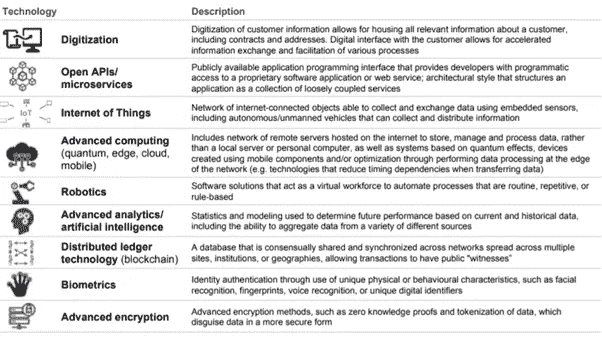
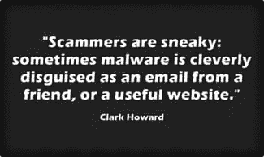
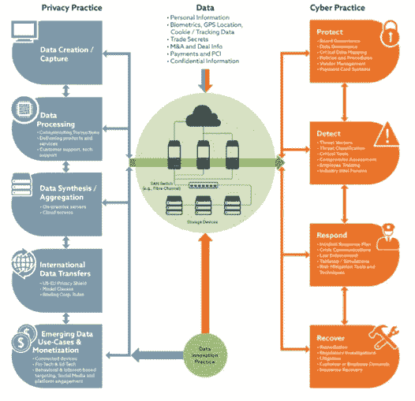
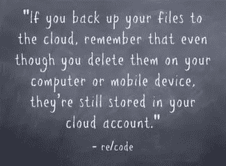
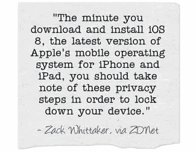

# 面向数字化世界的创新网络安全和数据保护实践

> 原文：<https://medium.com/analytics-vidhya/innovative-cybersecurity-and-data-protection-practices-for-the-digitally-driven-world-ce1ac6a0a651?source=collection_archive---------31----------------------->

在当今世界，我们这一代人通过他们的小工具在互联网上和互联网外做着大量的事情，在任何情况下，数据都是这样产生的，并且这样产生的数据必须存储在某个地方，因为我们都喜欢，因此，会希望在以后的阶段访问我们的数据。此外，该行业的所有组织也希望获得这些数据，以使他们的公司盈利(商业用途)，因为正如他们所说的“数据是新的黄金”，这表明如果我们知道如何正确利用数据，它可以为您赚取大量的金钱。由于这些数据如此重要，其安全性也同样非常重要，因为这些数据对黑客来说就像黄金一样，他们试图窃取所有易受攻击的信息，然后在黑暗网络等地方出售这些信息以赚取大量金钱。这导致用户关键信息的泄露，在某些情况下这些信息对他们来说太重要了。因此，消费者的安全同样非常重要，不仅对于生成数据的人来说如此，对于消费者信任的权威机构、管理机构和数据维护公司来说也是如此。对于这些情况，数据的安全性对所有机构来说都是最重要的。

随着越来越多的商业和社会领域越来越多地使用数字技术以及合成智能、物联网、云计算等。一切事物的连接性越来越强，大数据量不断增加，对这些记录的安全性的需求也在不断增长。在这些因素的作用下，网络安全在当今世界非常重要。网络安全是由网络和安全这两个短语组成的，暗示着互联网上的安全。

这种网络安全无法通过临时和有限的打印解决方案等传统策略来解决。它已经成为在线业务的一个关键战略优先事项，也是我们希望公开的一个话题(以及合规性和数据使用)，无论我们是否希望实现数字化发展。此外，为了能够进行创新并了解他们在任何给定业务和客户目标方面的数字潜力，组织需要安全策略来认识他们的企业，这一现象正在改变网络安全行业的面貌。

有了这些，我们需要专注于如何屏蔽我们的统计数据。过去，亚马逊和索尼的 Playstation Network 等企业遭到了无数次不必要的入侵。此外，因为事实证明，97 %的攻击是不可避免的。这些都不是“内部人员”所为。他们是被外部黑客利用保护漏洞执行的。

最重要的是，你的公司可能会遵循越来越多的信息安全战略标准。这些来源于各种行政法规，如萨班斯-奥克斯利法案(SOX)和由支付卡行业数据安全标准(PCI-DSS)组成的私有来源。因此，现在我们将讨论一些质量事实和安全实践，它们可能被植入这个数字化的世界。它们如下:

1.**拥有真实的标准:**首先，我们需要一份您的信息保护政策的专业书面副本。除了在发现保护缺陷时处理这些缺陷的补救策略之外，还应该有记录完善、明确无误的精确指导方针。

2.**员工培训:**从根本上说，大部分保护问题都是因为用户的过错。我们的社区管理员应该在特殊的记录保存标准方面接受严格的培训，我们的工作人员应该掌握管理非公开事实的知识。

3.**异地备份:**

将您的文档转移到可靠的异地服务器上，包括通过云车库解决方案，可以确保您有一个安全的记录副本，以便在出现保护困难时进行修复或比较。

4.**以访问限制为中心的安全措施:**

除非需要，否则任何人都不应该进入安全文件。默认情况下，当怀疑用户的真实性时，应该总是阻止 get 进入。

5.**强大的跟踪和报告:**

必须定期测试和探查安全指南，以验证其有效性。所有的网络行为都希望被记录，最好包括一个只读副本，即使是管理者也不能改变。可靠的报告将有助于我们在早期发现任何潜在的入侵。

我们从所有这些中得出的主要结论是，今天信息安全覆盖不是非强制性的；这是必须的。我们需要不断检查我们的信息，确保它是安全的，并持有法规，以确保他们屏蔽重要数据，避免入侵者。透明的指导方针和严格的监督将确保你的繁荣。

现在，让我们交流一下我们可以采取的革命性做法，以确保我们的网络安全。

1.**区块链:**区块链只是区块的链。当我们在本文中使用短语“块”和“链”时，我们指的是存储在公共数据库(“链”)中的数字信息(“块”)。要改变任何一个人块中的事实，我们需要告诉整个链，如果信息不真实，这是不可能的。其最新的例子是 NPCI 的金刚。

2.**云提供了一个可行的备份选项**

当你使用云的时候，你必须使用可靠的保护措施，它可以为备份你的记录提供一个完美的答案。由于事实并不总是保存在本地设备上，所以即使您的硬件受到威胁，访问它也没有任何困难。

3.**反恶意软件安全是必须的**

恶意软件是困扰许多计算机消费者的严重问题，它被认为是在用户不知道的情况下出现在不显眼的地方。防恶意软件保护对于为您的设备奠定安全基础至关重要。“恶意软件(恶意软件的缩写)是一种软件程序，旨在未经您同意的情况下渗透或损害计算机。恶意软件包括笔记本电脑病毒、蠕虫、特洛伊木马、间谍软件、scareware 和 extra。它可能是网站和电子邮件上的礼物，或者隐藏在可下载的文件、照片、视频、免费软件或共享软件中。

3.**让你的旧电脑硬盘无法读取**

许多数据可以通过旧的计算设备收集，但你可以在丢弃硬盘之前，通过使硬盘不可读来保护你的私人信息。“让古董电脑的硬盘无法读取。在你再次整理你的资料并将文件转移到其他地方后，你应该通过粉碎磁盘、磁性清洗磁盘或使用软件程序将磁盘擦除干净来进行清理。销毁旧的电脑磁盘和备份磁带。

4.**实践最小特权原则(PoLP)**

印第安纳大学信息技术学院建议遵循最小特权原则(PoLP)。不要以管理员权限登录电脑，除非您必须这样做才能执行特定任务。以管理员身份(或在 Windows 中以超级用户身份)运行您的计算机会使您的 pc 面临安全风险和漏洞。只需使用这些高重要性帐户访问一个未知的互联网网站，就可以对您的笔记本电脑造成极大的损害，包括重新格式化您的硬盘、删除您的所有文件，以及开发一个具有管理权限的新个人帐户。

5.使用“通行短语”而不是“密码”

有什么区别？“……我们建议您使用密码——一串随机单词或一句话。您的密码包含的字符越多，far 就越强。好处是，考虑和确定这些问题的难度要小得多，但网络攻击者很难破解。

6.**加密 USB 驱动器和 SIM 卡上的记录**

加密可拆卸车库设备上的统计数据会使犯罪分子更难(尽管不再不可能)将您的统计数据解读为需要您的工具丢失或被盗。USB 驱动器和 SIM 卡是可移动车库小工具的令人难以置信的例子，它们可以插入另一个设备，允许用户访问存储在其上的所有信息。当然，除非加密了。“您的 USB 电源可以毫无困难地被盗并放入另一台笔记本电脑中，他们可以窃取您的所有文件，甚至在您的 flash force 上安装恶意软件或病毒，目的是感染它所连接的任何 pc。

7.**覆盖已删除的文件**

在极少数情况下，删除计算工具上的信息会导致永久删除。通常，这些数据仍然存在于磁盘上，并且可以通过使用一个知道他们在做什么的人来恢复(例如，一个决心找到你的私人统计数据的精明的罪犯)。确保您的旧信息永远消失的唯一方法是覆盖它。

8.**不要忘记删除云备份中的旧文件**

如果你勤于备份信息，并使用安全的云车库服务来实现这一点，那么你正朝着正确的方向前进。也就是说，云备份和任何事实备份实际上都创建了删除旧事实的交付步骤。除了删除(或覆盖)到本地小工具的文档之外，不要忘记删除备份服务中的文档。如果你上传你的文件到云端，在你的记忆中回忆一下，即使你在你的电脑或移动设备上删除了它们，它们仍然存储在你的云端账户上。

9.**启用远程区域和设备擦除**

“如果你的手机丢失或被盗，监控应用程序可以通知你手机的确切位置。这些应用程序还允许你远程擦除敏感信息。如果你的电话落入坏人手中，你至少可以确保他们不会得到你的个人信息。

10.**设置完毕后立即进行保密设置**

当配置新工具或删除设备时，配置隐私设置应该是企业的第一步。这可以确保您在安装广泛应用和服务时，不会无意中共享敏感记录。一旦你下载并安装了 IOS，这个苹果手机操作小工具的现代版本，你就应该注意这些秘密的步骤来锁定你的小工具。

如果我们适当地遵循这些创新实践和安全技术，我们将在一定程度上免受黑客攻击。这将确保我们的互联网安全。

希望你能理解我的想法，并将其应用到你的日常生活中。如果你喜欢这个博客，一定要为它鼓掌，并在我的社交媒体上关注我，将来会有更多类似的东西。

参考资料:

[https://www。ABC services . Com/5-fine-practices-for-your-records-safety-approach](https://www.Abcservices.Com/5-fine-practices-for-your-records-safety-approach/)/

[https://www。information week . Com/strategic-CIO/it-strategy/云如何转变数据中心/a/d-id/1332329](https://www.Informationweek.Com/strategic-cio/it-strategy/how-cloud-is-transforming-the-data-center/a/d-id/1332329)

【https://www.I-scoop.Eu/cyber-security-cyber-dangers-dx/ 

[http://www3。Weforum.Org/docs/WEF_Cyber_Risk_to_Customer_Data.Pdf](http://www3.Weforum.Org/docs/WEF_Cyber_Risk_to_Customer_Data.Pdf)

[https://数字卫士。com/blog/101-信息-安全-提示-如何保护你的密码-财务-个人-事实-安全](https://digitalguardian.Com/blog/101-information-safety-tips-how-keep-your-passwords-financial-personal-facts-safe)

[https://www.statistics-age。com/three-new-way-doing-commercial enterprise-enabled-区块链-123488501/](https://www.statistics-age.Com/three-new-ways-doing-commercial%20enterprise-enabled-blockchain-123488501/)