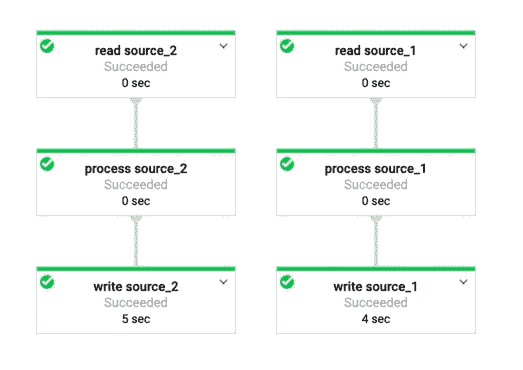
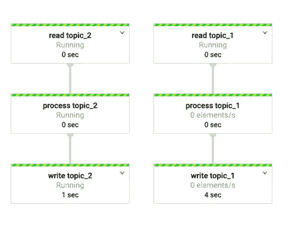
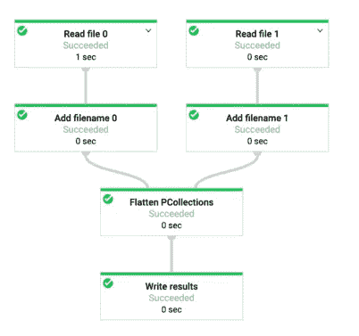
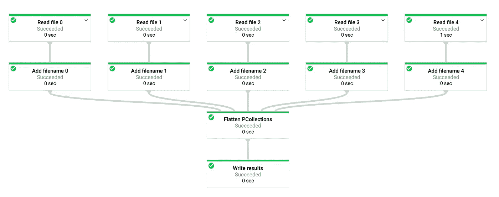
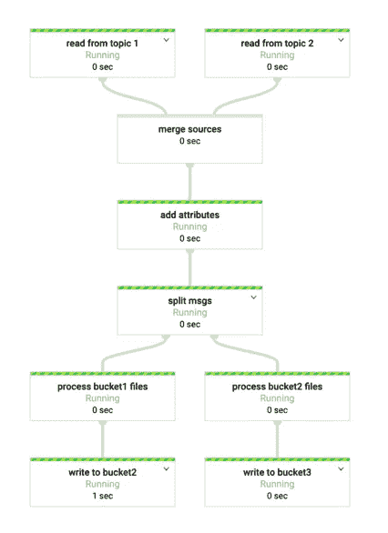
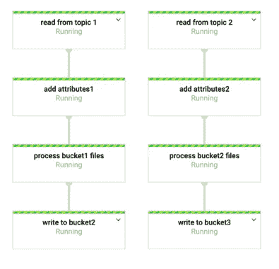

# Google Cloud 数据流中的输入源阅读模式(第 2 部分)

> 原文：<https://medium.com/analytics-vidhya/input-source-reading-patterns-in-google-cloud-dataflow-part-2-41cbcb38e6b4?source=collection_archive---------14----------------------->

这是我上一篇博客的续篇，解释了使用数据流管道从 Google 云存储或云发布/订阅中读取数据时的一些其他模式。如果你是数据流的新手，或者如果你还没有查看之前的[第一部分博客](/@pavankumarkattamuri/input-source-reading-patterns-in-google-cloud-dataflow-4c1aeade6831?source=friends_link&sk=c40148c86a13775fa16ab54305cf3287)，请这样做。如果你已经有了，谢谢！！

> *这里我列出了几个* ***不常见的*** *源阅读模式，重点放在云存储和 Pub/Sub 上。这并不侧重于利用不同的 GCP 服务作为源/汇，也不侧重于进行复杂的转换，我只重复源读取模式。*

**注意**:对于以下模式，***—experiments = allow _ non _ updatable _ job***在调用数据流作业时也应作为参数传递，否则您将收到以下错误“由于您的管道的形状，云数据流作业优化器使用— update pipeline 选项生成了不可更新的作业图”。

> 完整代码可以在我的 [github repo](https://github.com/pavan-kattamuri/dataflow_input_patterns_2) 找到

## **分别读取多个 GCS 源**

*最初，这可能看起来像两个不同的数据流作业，但令你惊讶的是，它不是。在[上一篇博客](/@pavankumarkattamuri/input-source-reading-patterns-in-google-cloud-dataflow-4c1aeade6831?source=friends_link&sk=c40148c86a13775fa16ab54305cf3287)中解释的 *List GCS & Create* 选项在所有输入文件都具有相同的结构/模式时非常有用，因为它会在 *ReadAllFromText* 之后创建一个 *single PCollection* 元素。然而，如果您出于某种原因想要不同的 PCollections，您仍然可以使用 Dataflow 来实现。下面的方法假设您有一个要转换的输入源的有限列表。*

**

## *分别读取多个发布订阅源*

*与上面的模式类似，您也可以对多个 PubSub 源做同样的事情，分别处理它们。*

**

## *从可变数量的源读取*

*使用 GCS match 检索匹配前缀模式的文件列表，我们可以动态地为每个文件创建一个*p 集合*。因为数据流中的每一步都应该有一个唯一的步骤名，所以每一步的标签也是动态创建的。*

*当只有两个文件匹配该模式时，管道创建了两个 p collection，当有五个文件匹配该模式时，管道创建了五个 p collection。*

****

## *类似处理的云功能*

*云功能和云存储触发器帮助您实现异步、无服务器和轻量级处理。例如，一个文件已经被上传到桶 1 >触发云功能 1 >进行一些处理>将处理过的文件上传到桶 2 >云功能 2 触发>再次进行一些处理>将处理过的文件上传到桶 3。如果你想做一些由于内存和存储限制而在云功能上不支持的繁重处理，那么 saviour Dataflow 就来了。*

*与上述方法一样，这可以使用云存储桶上的 pubsub 通知来实现，或者实际上只使用 pubsub。您可以使用下面的任何一种实现，第一种方法是合并&拆分来自不同主题的 pubsub 消息，第二种方法是分别处理来自不同主题的消息。第二种方法给出了数据处理的更清晰和更好的可视化，消除了合并和分割阶段的需要*

***实现**:启用发布主题 1 的桶 1 通知和发布主题 2 的桶 2 通知。数据流是这样进行的:文件已经上传到桶 1 >通知到**从主题 1 读取**步骤>处理桶 1 文件将进行一些处理 **>写入桶 2** 通知到**从主题 2 读取**步骤>处理桶 2 文件将再次进行一些处理 **>写入桶 3***

**

*一样的东西，但是更好:)*

**