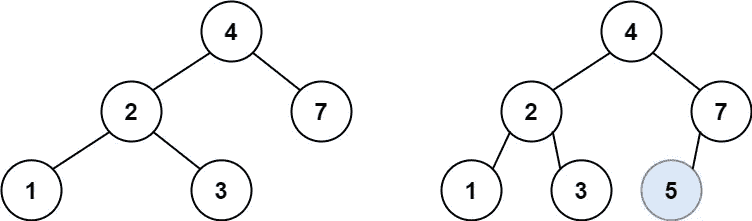

# 插入二叉查找树—第 12 天(蟒蛇皮)

> 原文：<https://medium.com/analytics-vidhya/insert-into-a-binary-search-tree-day-12-python-69a44d7c6063?source=collection_archive---------12----------------------->


格雷格·罗森克在 [Unsplash](https://unsplash.com?utm_source=medium&utm_medium=referral) 上拍摄的照片

今天我们将讨论 leetcode 十月份每日编码挑战问题中的一个。

在我进入这个问题之前，我们需要了解二叉查找树的一些特点。

二叉查找树是一种树状数据结构，具有如下新增功能。

1.  根节点左侧的子树将总是小于根节点。
2.  根节点右侧的子树将总是大于根节点。
3.  根节点的左右子树必须是二叉查找树。

[**701**](https://leetcode.com/problems/insert-into-a-binary-search-tree/) **。插入二叉查找树**

给你一个二叉查找树(BST)的`root`节点和一个要插入到树中的`value`。在插入之后返回*BST 的根节点。**保证**新值不存在于原始 BST 中。*

**注意**可能存在多种有效的插入方式，只要树在插入后仍然是 BST。你可以退回**其中任何一个**。

**例 1:**



```
**Input:** root = [4,2,7,1,3], val = 5
**Output:** [4,2,7,1,3,5]
**Explanation:** Another accepted tree is:
```


**例二:**

```
**Input:** root = [40,20,60,10,30,50,70], val = 25
**Output:** [40,20,60,10,30,50,70,null,null,25]
```

**例 3:**

```
**Input:** root = [4,2,7,1,3,null,null,null,null,null,null], val = 5
**Output:** [4,2,7,1,3,5]
```

**约束:**

*   树中节点的数量将在`[0, 104]`范围内。
*   `-108 <= Node.val <= 108.`
*   所有的值`Node.val`都是**唯一的**。
*   `-108 <= val <= 108.`
*   **保证**原来的 BST 里没有`val`。

如果我们记得 BST 的特性，想出一个解决方案会更简单。我们需要将给定的数字与根节点的值进行比较。如果根节点的值高于给定的数字，我们移动到根的左侧。否则，我们移动到根节点的右侧。我们将递归执行上述步骤，直到基本条件。

让我们深入算法。

1.  我们使用递归算法，所以我们需要确定基本条件。当根节点为 none 时，我们满足基本条件。
2.  将给定的数字与根节点进行比较，如果根节点的值大于给定的数字，则移动到根节点的左侧。
3.  如果根节点的值低于给定的数字，则移动到根节点的右侧。

```
class BSTInserter:
    def insertIntoBST(self, root: TreeNode, val: int) -> TreeNode:
        if root == None:
            root = TreeNode(val)
            return root
        if val < root.val:
            root.left = self.insertIntoBST(root.left, val)
        else:
            root.right = self.insertIntoBST(root.right, val)

        return root
```

复杂性分析。

**时间复杂度**

在一般情况下，如果给定的 BST 是一棵平衡树，那么我们将访问树的一边，因此时间复杂度是 O(logN)。在最坏的情况下，如果树是倾斜的 BST，时间复杂度将是 O(N)，其中 N 表示节点的数量。

**空间复杂度**

在一般情况下，如果给定的 BST 是一棵平衡树，那么我们将递归地访问树的一边，因此空间复杂度是 O(logN)。在最坏的情况下，如果树是倾斜的 BST，空间复杂度将是 O(N)，其中 N 表示节点的数量。

如果对这篇文章有任何反馈或建议，请务必告诉我。