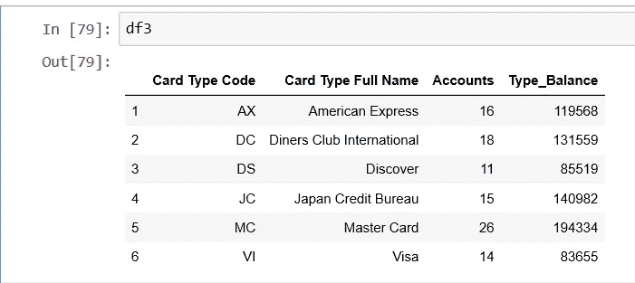
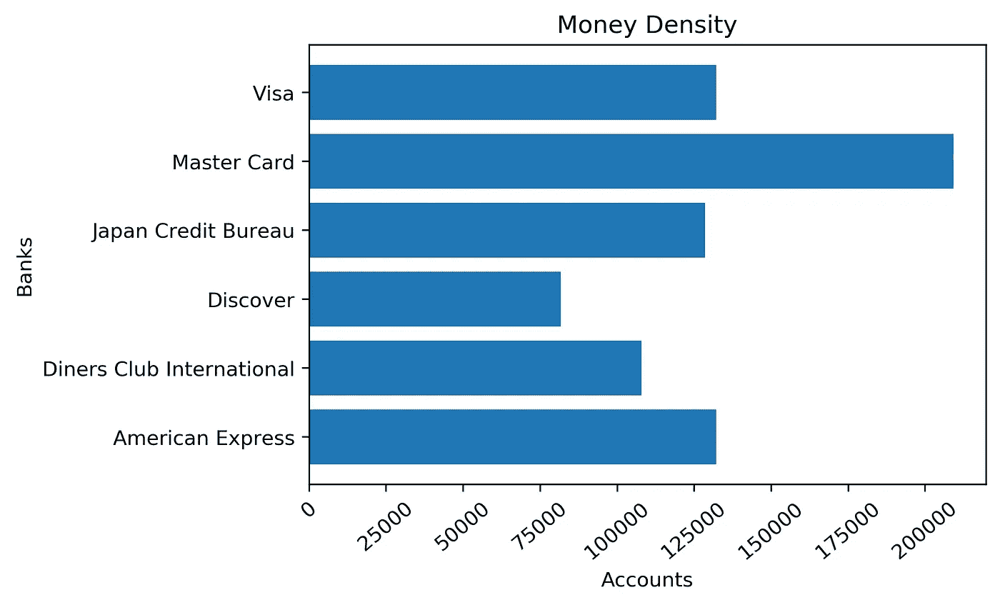
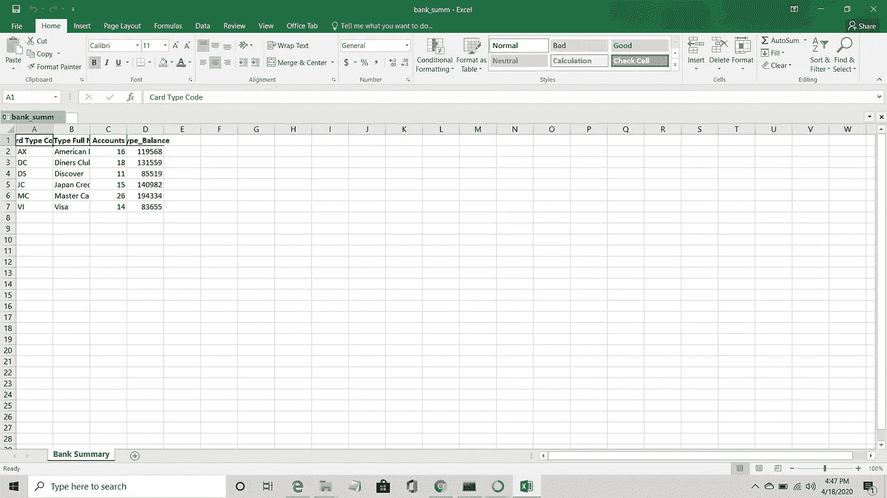
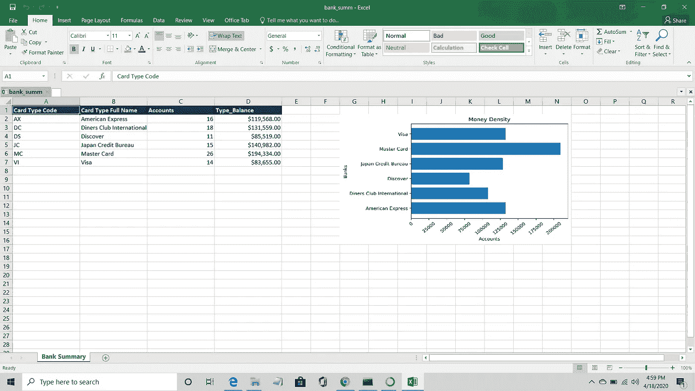

# 使用 pandas 和 SQL 在 excel 文件中插入图像

> 原文：<https://medium.com/analytics-vidhya/inserting-an-image-in-an-excel-file-using-pandas-and-sql-e88826680b05?source=collection_archive---------3----------------------->

在这篇文章中，我们将做以下事情:-

*   通过对数据帧执行 SQL 查询来创建汇总表。
*   使用 *matplotlib 生成一个图。*
*   使用 *ExcelWriter* 编写汇总表并将绘图插入 excel 文件

为了达到以上几点，我将使用我以前的[文章](/@songaraankit/exporting-a-data-frame-to-custom-formatted-excel-a82a35116e92)中的数据集。

[](/@songaraankit/exporting-a-data-frame-to-custom-formatted-excel-a82a35116e92) [## 将数据框导出到自定义格式的 Excel

### 介绍

medium.com](/@songaraankit/exporting-a-data-frame-to-custom-formatted-excel-a82a35116e92) 

## 好的，让我们从导入必要的包开始:

```
#importing necessary modules
import sqlite3
import pandas as pd
import matplotlib.pyplot as plt
%matplotlib inline
from PIL import Image
```

您可能对上面的包很熟悉。我使用 sqlite3 编写 sql 查询 Pillow 来调整绘图的大小。

## 创建数据库:

```
#Creating a data base with name df_Summary
connection =  sqlite3.connect("df_Summary.db")
```

上面的命令将在***C:\ Users \ username***位置创建一个***df _ summary . db****文件。*

*现在，我们将读取 excel 文件，并使用 dataframe 将内容存储到上面的 df_summary.db 文件中。与我在下面代码中所做的不同，您还可以直接将数据文件名和位置保存到一个变量中。使用 *read_excel()* 方法将数据文件的内容导入到 dataframe *df 中。*为了将数据从 dataframe 导入到 df_Summary.db，我使用了 *to_sql()* 方法。*

```
*loc = "Y:\\test\\"df = pd.read_excel(loc+"test_Records_modified_2.xlsx")df.to_sql("df_Summary",con=connection)*
```

## *SQL 查询:*

*现在，使用下面的命令，我们将从 df_Summary 中提取一些特定的信息。如果列名中没有空格，就没有必要将列名放在方括号中。*

```
*df2= pd.read_sql_query("select 
[Card Type Code],
[Card Type Full Name],
count (*) as Accounts,
sum(Balance) as Type_Balance
from df_Summary
group by 1;",connection)connection.commit()
connection.close()
df3 = df2.dropna()*
```

**commit()* 保存所有修改，而 *close()* 将关闭与数据库的连接。 *dropna()* 删除数据帧中所有缺失的值。*

**

## *生成绘图:*

*这里，我们正在生成水平条形图，并将其保存为 png 图像。*

```
*plt.barh(df3["Card Type Full Name"],  df3["Type_Balance"], linewidth=2.0)plt.ylabel("Banks")
plt.xlabel("Accounts")
plt.title("Money Density")plt.xticks(rotation =40)plt.savefig(loc+"Money Density.png",dpi=300, bbox_inches='tight')
plt.show()*
```

**

*金钱 Density.png*

*到这里为止，我们已经有了所有想要放入 excel 文件的内容。现在，我们将使用 *ExcelWriter* 创建一个新的 excel 文件，使用 *to_excel* 在其中写入 df3，并使用 *insert_image 插入“Money Density.png”。**

```
**#Creating a new excel file "bank_summ.xlsx"*
writer_4 = pd.ExcelWriter(loc+"bank_summ.xlsx", engine= "xlsxwriter")*#Writing df3 to writer_4\. The name of the sheet of the workbook will be "Bank Summary"*
df3.to_excel(writer_4, index=False, sheet_name= "Bank Summary")*#Below command should be the last one. It physically saves the file.*
writer_4.save()*
```

**

*bank_summ.xlsx*

*如果你看上面的文件，它看起来一点也不整洁，因为它目前还没有格式化。让我们稍微格式化一下，以改善数据的外观。您必须在没有 writer_4.save()命令的情况下运行以上语句，然后运行以下命令。*

```
*workbook_4 = writer_4.book
worksheet_4 = writer_4.sheets["Bank Summary"]*#Defining formats and storing them in variables so that they can be used further in the code.*fmt_currency = workbook_4.add_format({
    "num_format" : "$#,##0.00" ,"bold" :False
    })fmt_header = workbook_4.add_format({
    'bold': True,
    'text_wrap': True,
    'valign': 'top',
    'fg_color': '#093159',
    'font_color': '#FFFFFF',
    'border': 2})*#Applying the above created formats on the excel file*
worksheet_4.set_column("A:D", 20)
worksheet_4.set_column("D:D", 20, fmt_currency)
for col , value in enumerate(df3.columns.values):
    worksheet_4.write(0, col, value, fmt_header)*
```

*在上面的代码中，我们没有使用 save()，因为我们仍然需要将绘图插入 bank_summ.xlsx 文件。我们将首先改变图像的尺寸。完全是可选的。在我的例子中，图像对于桌子来说太大了。*

```
*#Changing dimensions a bit. 
img=Image.open(loc+"Money Density.png")
new_img= img.resize((512,300))
new_img.save(loc+"new_img.png")*
```

*最后保存文件。*

*insert_image()的第一个参数是 *1* ,它显示了您希望图形开始的行号。第二个参数是列号。df3.shape[1]将返回 *4* ，因此第二个参数将变成 *6* 。第三个是你想要插入的图片的名字。*

```
*worksheet_4.insert_image(1, df3.shape[1]+2, loc+"new_img.png")
writer_4.save()*
```

**

*以下是完整的代码:*

```
*#importing necessary modules
import sqlite3
import pandas as pd
import os
import matplotlib.pyplot as plt
%matplotlib inline
from PIL import Image#Creating a data base with name Summary
connection =  sqlite3.connect("df_Summary.db")loc = "Y:\\test\\"df = pd.read_excel(loc+"test_Records_modified_2.xlsx")df.to_sql("df_Summary",con=connection)
df2= pd.read_sql_query("select [Card Type Code], [Card Type Full Name],count (*) as Accounts, sum(Balance) as Type_Balance from df_Summary group by 1;",connection)connection.commit()
connection.close()plt.barh(df3["Card Type Full Name"],  df3["Type_Balance"], linewidth=2.0)plt.ylabel("Banks")
plt.xlabel("Accounts")
plt.title("Money Density")plt.xticks(rotation =40)plt.savefig(loc+"Money Density.png",dpi=300, bbox_inches='tight')
plt.show()writer_4 = pd.ExcelWriter(loc+"bank_summ.xlsx", engine= "xlsxwriter")
df3.to_excel(writer_4, index=False, sheet_name= "Bank Summary")workbook_4 = writer_4.book
worksheet_4 = writer_4.sheets["Bank Summary"]fmt_currency = workbook_4.add_format({
    "num_format" : "$#,##0.00" ,"bold" :False
    })fmt_header = workbook_4.add_format({
    'bold': True,
    'text_wrap': True,
    'valign': 'top',
    'fg_color': '#093159',
    'font_color': '#FFFFFF',
    'border': 2})img=Image.open(loc+"Money Density.png")
new_img= img.resize((512,300))
new_img.save(loc+"new_img.png")worksheet_4.insert_image(1, df3.shape[1]+2, loc+"new_img.png")
writer_4.save()*
```

# *谢谢！！*