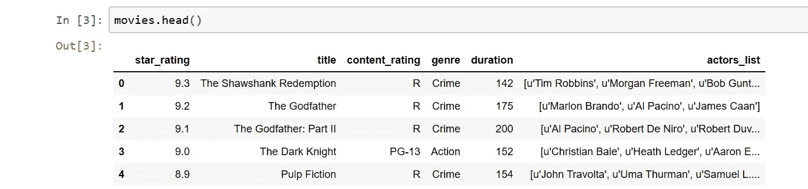

# 使用 INSERT 将 Pandas 数据帧插入数据库

> 原文：<https://medium.com/analytics-vidhya/inserting-pandas-dataframes-into-database-using-insert-815f0e4e6361?source=collection_archive---------0----------------------->

当在 Python 中处理数据时，我们使用 pandas，并且我们经常将数据存储为 pandas 数据帧。令人欣慰的是，如果我们想对数据帧使用 SQL，我们不需要做任何转换；我们可以使用 insert 将熊猫数据帧直接插入 MySQL 数据库。

以下是相同的步骤:

步骤 1:我们可以在这里使用字典创建我们自己的数据框架。我们还可以从 CSV 文件中导入数据，或者以任何其他方式创建数据帧，但是出于本例的目的，我们将只导入电影数据，如下所示:

```
**import pandas as pd 
movies = pd.read_csv(‘http://bit.ly/imdbratings')
movies.head()**
```



步骤 2:在我们的 MySQL 数据库中创建一个表。

在将数据插入 MySQL 之前，我们将在 MySQL 中创建一个 movies 表来保存我们的数据。如果这样的表已经存在，我们可以跳过这一步。

*注意*:使用 CREATE TABLE 语句创建一个表，后跟表名，然后列出每一列及其数据类型。例如。

```
 **CREATE TABLE movies_details(
                               star_rating float(2,1),
                               title varchar2(100),
                               content_rating varchar2(10),
                               ……);**
```

第 4 步:接下来，我们将创建一个列列表，通过遍历每一行并使用 INSERT INTO 将该行的值插入到数据库中，将我们的 dataframe 行逐个插入到数据库中。

```
**# creating column list for insertion 
cols = “`,`”.join([str(i) for i in data.columns.tolist()])
# Insert DataFrame records one by one. 
for i,row in data.iterrows():
    sql = “INSERT INTO `movies_details` (`” +cols + “`) VALUES (“ + “%s,”*(len(row)-1) + “%s)” 
    cursor.execute(sql, tuple(row)) 
# the connection is not autocommitted by default, so we must commit to save our # changes 
    connection.commit()**
```

第 5 步:同样，让我们查询数据库，以确保我们插入的数据已被正确保存。

```
**# Execute query 
sql = “SELECT * FROM `movies_details`” 
cursor.execute(sql)** **# Fetch all the records 
result = cursor.fetchall() 
for i in result: 
    print(i)**
```

输出:

```
**(9.3, ‘The Shawshank Redemption’,’R’, ‘Crime’, 142, ‘[u’Tim Robbins’, u’Morgan Freeman’, u’Bob Gunt…’)** **(9.2,’The Godfather’, ‘R’,’Crime’,175, ‘[u’Marlon Brando’, u’Al Pacino’, u’James Caan’]’** **(9.1,’The Godfather: Part II’ , ‘R’, ‘Crime’,200, ‘[u’Al Pacino’, u’Robert De Niro’, u’Robert Duv…’) 
……**.......
```

一旦我们确信一切正常，我们就可以关闭连接。

```
**connection.close()**
```

在下一篇文章中，我们将学习 to_sql()方法，将熊猫数据帧插入 MySQL 数据库。