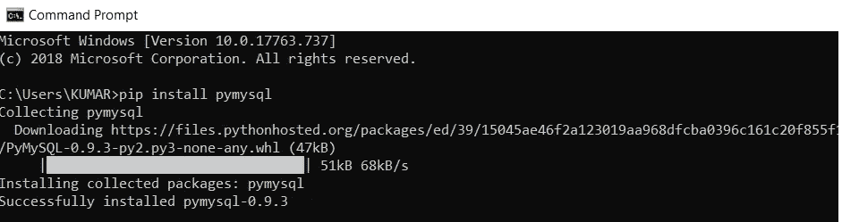

# 从 Python 向数据库中插入记录

> 原文：<https://medium.com/analytics-vidhya/inserting-records-into-a-database-from-python-723ed7f0ae8?source=collection_archive---------9----------------------->

数据分析师/科学家的基本角色之一是从原始数据中提取模式和见解。由于世界上许多政府和企业数据都是在关系数据库中组织的，因此数据分析师/科学家需要知道如何使用这些数据库结构是有意义的。除此之外，更有用的是在 SQL 环境中使用 Pandas 数据框架。

大多数时候，数据分析师/科学家使用 Python 和 R 之类的语言，这些语言在统计分析、可视化和解释方面非常有用。因此，在本文中，我们将学习如何在 SQL 和 Python(pandas)之间搭建桥梁。

如何在 Python 中建立数据库连接并将记录插入数据库

我们可以通过在 Python 和 MySQL 之间建立连接来向 MySQL 数据库发送和接收数据。这里，我们将使用 pymysql 进行数据库连接；尽管数据库连接还有其他方式。

下面是我们连接 pymysql、插入数据、然后从 mysql 提取数据需要完成的主要步骤:


数据库连接过程

MySQL 连接库:pymysql

Oracle 连接库:cx_Oracle

同样的，你也可以查查其他的数据库软件。

如果它不可用，您可以使用 pip 命令安装它，如下所示:



步骤 1:导入 pymysql 模块。

步骤 2:使用 pymysql 的 connect()函数创建到 MySQL 数据库的连接，该函数带有参数 host、user、database name 和 password。

步骤 3:使用 cursor()函数创建一个游标。这将允许我们在编写完 SQL 查询后执行它。

步骤 4:执行所需的 SQL 查询，使用 commit()函数提交更改，并检查插入的记录。请注意，我们可以创建一个名为 sql 的变量，将查询的语法赋给它，然后将 sql 和我们希望作为参数插入的特定数据传递给 cursor.execute()。

然后，我们将使用 commit()提交这些更改。

步骤 5:现在我们完成了，我们应该使用 close()方法关闭数据库连接。

```
##Step 1
import pymysql
## Step 2
try:
    # Connect to the database
    connection = pymysql.connect(host='localhost',
                             user='username',
                             password='*****',
                             db='employee')
## Step3
    cursor=connection.cursor()
    # Create a new record
    sql = "INSERT INTO `employee` (`EmployeeID`, `Ename`, `DeptID`, `Salary`, `Dname`, `Dlocation`) VALUES (%s, %s, %s, %s, %s, %s)"
    cursor.execute(sql, (1009,'Morgan',1,4000,'HR','Mumbai'))
    # connection is not autocommit by default. So we must commit to save our changes.
    connection.commit()
## Step 4
    # Execute query
    sql = "SELECT * FROM `employee`"
    cursor.execute(sql)
    # Fetch all the records
    result = cursor.fetchall()
    for i in result:
        print(i)
except Error as e:
    print(e)
## Step 5
finally:
    # close the database connection using close() method.connection.close()
```