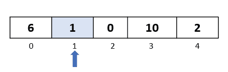

# 插入排序:实现和分析

> 原文：<https://medium.com/analytics-vidhya/insertion-sort-implementation-and-analysis-bd5c1860558a?source=collection_archive---------19----------------------->

插入排序对数组数据结构的作用如下:

*   从数组中的第二个元素开始，迭代到最后一个元素
*   在每次迭代中， ***选择*** 一个元素，将该元素与其左侧的所有元素进行比较。
*   在比较时，每当我们发现一个比我们选择的元素更大的元素时，我们就将这个更大的元素向右移动一步
*   在每次迭代结束时，我们找到一个空位 ***插入*** 我们在迭代开始时选择的元素。

让我们直观地看一下，以便更好地理解。

我们将对以下数组进行排序:

我们有五个元素，从索引 0 到索引 4。

**直通 1**

**步骤 1:** 算法从数组中的第二个元素开始，所以让我们选择索引为 1 的元素。

**第二步:**将选中的元素与其左侧的所有元素进行比较。这里我们只有 1 个元素向左->“6”在索引 0 处。我们来做个比较:6 大于 1 吗？是的。然后根据算法，让我们将它向右移动一个位置:

**步骤 3:** 因为我们在所选元素的左边只有一个元素，所以我们完成了这次传递的比较和移动。现在我们需要找到一个位置来插入我们选择的元素。

正如我们所看到的，索引 0 处的位置变得可用，因为我们将元素“6”从索引 0 移动到了索引 1。因此，让我们在那里插入我们选择的元素:

这就结束了我们的第一次穿越。

**直通 2**

第一步:在第一次遍历中，我们选择了索引为 1 的元素。在此过程中，我们将移动到下一个元素，并选择索引为 2 的元素:

**步骤 2:** 我们现在开始比较过程，我们将所选元素与其左侧的所有元素进行比较。

将所选元素“0”与“6”进行比较，后者是其左侧的第一个元素。由于 6 大于 0，我们将它向右移动一步

将所选元素“0”与其左侧的第二个元素“1”进行比较。由于 1 大于 0，我们将它向右移动一步

**第三步:**我们完成了这次传递的比较和移动。现在是时候将我们选择的元素插回到数组中的可用空位上了。因为我们移动了元素 1 和 6，所以在索引 0 处有一个空位。因此，让我们继续在那里插入我们选择的元素

**直通 3**

**步骤 1:** 现在我们已经掌握了算法，我们知道在这次遍历中，我们将选择索引为 3 的元素。

第二步:让我们开始比较。我们将比较我们选择的元素“10”和它左边的所有元素。

我们首先与元素“6”进行比较。因为“6”是大于 10 的**而不是**，所以我们不把它移到右边。

同样，从我们之前的经历中，我们知道*6 左边的所有元素都小于 6* (因为我们之前做的所有步骤)。这意味着在这个传递中，我们不需要向右移动任何元素。

步骤 3: 我们需要将我们选择的元素插入到数组中的一个可用位置。因为在最后一步中我们没有移动任何元素，所以空白点将与元素在通过之前的位置相同。因此，我们将元素放回那个位置，并继续进行下一次传递。

**直通 4**

**步骤 1:** 我们移动到数组中的下一个元素，选择索引为 4 的元素。请注意，这是数组中的最后一个元素，因此这将是我们最后一次通过

第二步:我们现在开始比较。我们需要比较元素“2”和它左边的所有元素。

让我们从索引 3->“10”的元素开始。由于 10 大于 2，我们将它向右移动一步。

我们现在将选择的元素“2”与索引为 2 的元素进行比较。由于 6 大于 2，我们将 6 向右移动一步

我们现在将选择的元素“2”与索引为 1 的元素进行比较。因为 1 是**而不是**大于 2，所以我们不将其向右移动。

此外，由于我们之前在算法中的遍历和步骤，我们可以肯定地知道“1”左侧的所有元素都将小于“1”。

**步骤 3:** 在我们完成了所有的比较之后，我们现在需要将我们选择的元素插回到数组中的空白处。因为索引 2 处的位置是空的，所以我们在索引 2 处插入我们选择的元素

随着这一遍的结束，我们已经对数组进行了排序！

**重述**

插入排序有点难以理解，因为它有很多步骤，而且它在另一个方向(向左)比较元素，这与其他“向前看”的算法相反，后者比较右边的元素。

让我们再次回顾一下我们所做的:

*   我们对 5 个元素的数组进行了 4 次遍历
*   在每次遍历中，我们选择一个元素
*   我们将选定的元素与其左侧的所有元素进行了比较
*   每当我们发现一个元素大于所选元素时，我们就将该元素向右移动
*   在所有的比较和移动结束时，我们在数组中有一个空位。我们将选定的元素插入到该点，结束我们的传递。

希望现在可以理解为什么它被称为插入排序了！

**用 C#实现**

下面是 C#中插入排序算法的一个实现

运行上面的代码，我们得到以下输出:

**增长复杂性分析**

在跳到涉及变量“N”的数学术语之前，让我们先看看我们在算法中执行了多少运算。

我们对包含 5 个元素的数组执行了以下操作:

1.  4 次**穿越**
2.  1 **比较**和 1 **移动**第一遍操作
3.  第二次通过中的 2 次比较和 2 次移动操作
4.  1 比较，第三次通过时没有移动
5.  第四次通过时的 3 次比较和 2 次移动
6.  我们还在每次传递中执行了 1 次**选择**和 1 次**插入**操作，总共 4 次选择和 4 次插入操作

这给了我们总共 4 次通过+ 7 次比较+ 5 次移动+ 4 次选择+ 4 次插入

或者对我们的 5 个元素的数组总共进行 24 次运算。这更接近于(5)的平方。

现在让我们试着用“N”来推导一个广义的复杂性。

让我们关注最坏的情况——数组中的所有元素都是降序排列的。

对于 1 次遍历，我们将进行大约:1 次选择+ 1 次插入+ (N-1)次比较+ (N-1)次移动

因此，对于(N-1)次通过，我们大约可以做到:

(N-1) * (1 + 1 + (N-1) + (N-1))次运算

如果我们忽略所有的常数，我们会得到这样的结果:

(N) * (N)

这等于(N) (n 的平方)次运算

因此，我们可以说插入排序的最坏情况复杂度是 O(N)或 N 的平方阶。

**总结**

插入排序从第二个元素开始，迭代数组直到最后一个元素。在每次迭代或遍历中，我们选择一个元素，并将其与左边的元素进行比较。每当左侧的元素大于所选元素时，我们就将它们向右移动一步。然后，我们将选择的元素插回到数组的空白处。

在最坏的情况下，整个过程的时间复杂度为 O(N)。