# AirBnb 内部:纽约，为辩论添加数据

> 原文：<https://medium.com/analytics-vidhya/inside-airbnb-new-york-adding-data-to-debate-72032f3f089d?source=collection_archive---------25----------------------->

## 2019 年 9 月-2020 年 9 月纽约 Airbnb 房屋详细分析

AirBn 已经成为人们租赁或租用短期住宿的首选场所。无论你是想在自己的房子里租一个房间，还是想在森林里找一个小木屋，你都可以使用 AirBnb。自 2008 年成立以来，Airbnb 经历了飞速发展，其网站上的租房数量每年都呈指数级增长。Airbnb 成功地颠覆了传统的酒店业，因为越来越多的旅行者，不仅是那些希望物有所值的人，还有商务旅行者，都将 Airbnb 作为他们的首选住宿提供商。

纽约市一直是 Airbnb 最热门的市场之一，截至 2020 年 9 月，已有超过 48，000 个房源。这意味着每平方公里有 40 多所房屋被出租。在纽约的 Airbnb 上！

# **一看数据:**

在本帖中，我们将仔细查看与纽约相关的列表。具体来说，分析中使用了两个主要数据集:列表和日历。

在浏览了这些数据后，我得出了四个针对各种兴趣话题的问题——可用性、成本、普通街道、社区。具体来说，我研究了:

> 纽约最常见的可供出租的 Airbnb 房产类型有哪些？全年这些房产的可用性如何？
> 
> 出租房产的平均价格是多少？房产价格有季节性上涨吗？
> 
> Airbnb 房产在纽约最常见的街道有哪些？纽约最昂贵的街道是什么？邻里群体会影响房产的定价吗？
> 
> 我们可以利用房源数据中的一些特征来预测房产定价吗？影响物业成本的最重要因素是什么？

# **分析:**

## **1)纽约最常见的可供出租的 Airbnb 房产类型有哪些？全年这些房产的可用性如何？**

为了分析纽约最常见的房产类型，使用了列表数据集。下图显示了纽约最常见的 Airbnb 房屋类型。

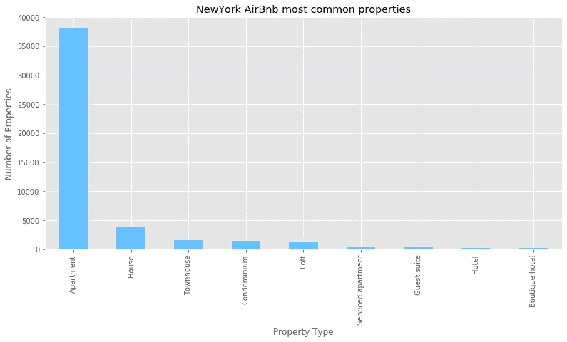

毫不奇怪，公寓和住宅占据了所有房源的绝大多数，其次是联排别墅和共管公寓。纽约共有 36 种可供出租的房产，其中上图中显示的房产类型拥有最多的房源。

为了分析一段时间内可用属性的比例，使用了日历数据集中的内容。以下是房屋可用性分析的结果。

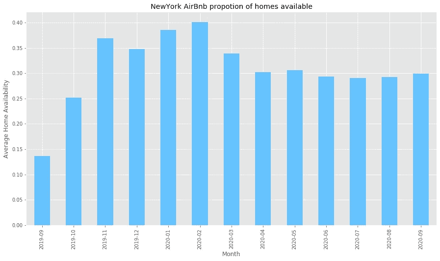

Airbnb 房屋的最高可用性将是在 2020 年 2 月，有 40%的房产可供出租，而最低可用性是在 2019 年 9 月，只有 10-15%的房屋可用。可用性在 2019 年 9 月后大幅增加。2020 年 2 月以后，可利用量将下降 10%。二月份之后，可用性不会有大的起伏，可用性范围在 25–32%之间。

一段时间内可用性的详细分析可以在下图中看到。

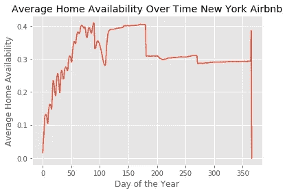

第 1 天对应于 2019 年 9 月 12 日，第 360 天对应于 2020 年 9 月 11 日。

## **2)出租物业的平均定价是多少？房产价格有季节性上涨吗？**

我分析了列表数据集中房屋的价格，并绘制了下图。大多数房产的定价低于 300 美元。事实上，75%的房屋定价低于 175 美元。

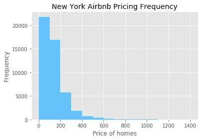

大多数房产的价格在 0-200 美元之间。随着价格的上涨，你可以看到住房频率的下降。纽约房屋的平均价格约为 152 美元，而中间价格和最高价格约为 105 美元和 10，000 美元。

下图显示了一年内的房产价格。从这个情节中有一些有趣的收获。

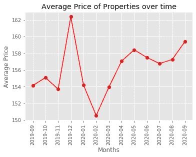

与可用性类似，我们也可以看到列表价格如何随时间变化。最高平均房价将在 2019 年 12 月达到 162 美元以上。最低值将出现在 2020 年 2 月，因为在此期间房屋的可用性最高。从 12 月份持续到 2020 年 2 月，价格将会大幅下跌。此后，价格趋于上升，直到 2020 年 4 月。从 2020 年 4 月到 2020 年 9 月，定价不会有大的波动。

下图提供了价格随时间变化的详细分析。

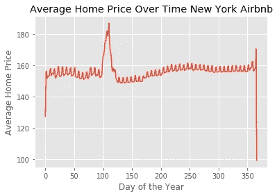

第 1 天对应于 2019 年 9 月 12 日，第 360 天对应于 2020 年 9 月 11 日。

## **3)Airbnb 房产在纽约最常见的街道有哪些？纽约最昂贵的街道是什么？邻里群体会影响房产的定价吗？**

下面你可以看到纽约最常见的 Airbnb 房屋街道。

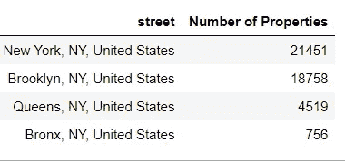

纽约和布鲁克林街的出租房屋数量最多，其次是皇后区和布朗克斯区。

平均价格最高的街道如下表所示。

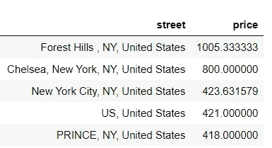

森林山和切尔西主导了纽约房产的定价，平均价格分别为 1005 美元和 800 美元。

通过价格分析邻居组，我绘制了下图

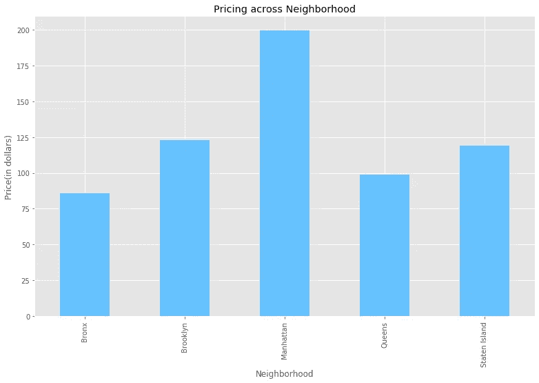

曼哈顿是 Airbnb 房产最贵的社区，平均价格在 200 美元左右。布朗克斯似乎是最便宜的，平均价格约为 80 美元。布鲁克林、皇后区和州立岛的房价都在 100-125 美元之间。

## 4)我们可以使用房源数据中的一些特征来预测房产定价吗？影响物业成本的最重要因素是什么？

在用适当的图形和表格分析了前三个问题之后，基于数据预测房地产的价格是最具挑战性的部分，因为存在大量的列。

清单数据中有 90 多列，选择合适的列来预测价格确实是一项挑战。

我开发了一个**机器学习**模型来预测价格，这个模型的绝对得分中值只有 20 分。由于数据集中存在异常值，此处使用中值绝对误差度量来计算误差，而不是平均值。

根据该模型，影响物业定价的最重要因素如下:

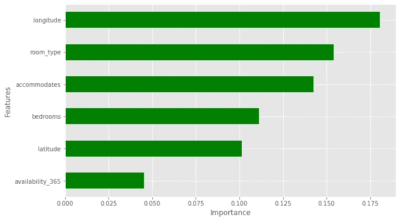

经度是影响价格的最重要因素，这表明在纽约从西到东，房地产的价格存在巨大差异。纬度也是解释纽约南北价格差异的最重要因素之一。

下面是对经度和纬度上的价格分布的一点了解

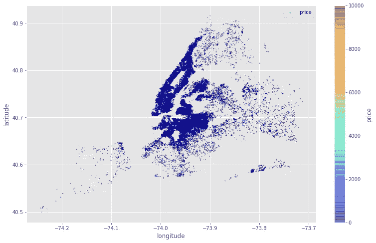

房型是定价的第二重要因素。纽约 Airbnb 提供四种类型的房间:私人房间、酒店房间、合租房间和整个家庭房间。

这里稍微洞察一下不同房型的平均定价。

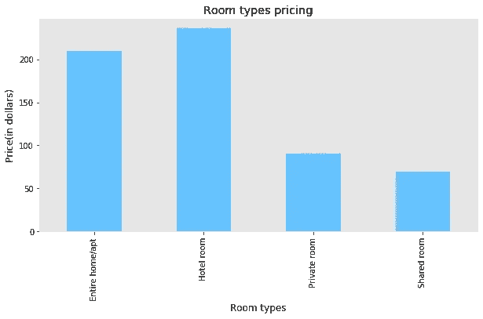

很明显，房价会随着住宿的增加而上涨。卧室的数量也严重影响价格，随后是全年房屋的可用性。

# **结论:**

在这篇文章中，我们了解了 Airbnb 在纽约的定价、可用性、常见的物业类型、常见的街道以及影响物业定价的最重要因素。

1.  我们研究了最常见的房产类型，结果发现是公寓和房子。我们分析了一段时间内房屋的可用性。
2.  然后我们看了一下这些房产的平均价格，大约是 152 美元。我们挖掘出价格是如何随季节或时间变化的。
3.  我们计算了纽约最常见和最昂贵的出租街道。森林山似乎是最昂贵的，而纽约街是 Airbnb 房屋最常见的上市街道。
4.  最后，我们根据房源数据预测了房屋的价格，得出了影响房屋定价的最重要因素。

> 根据你的看法，你认为影响 Airbnb 房产定价的最重要因素是什么？

要了解更多关于这个分析的内容，请点击这里查看我的 Github 链接[。](https://github.com/amitborkar98/AIRBNB-NewYork.git)