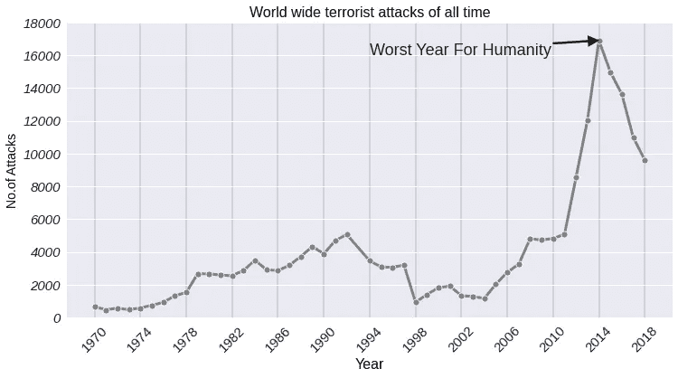
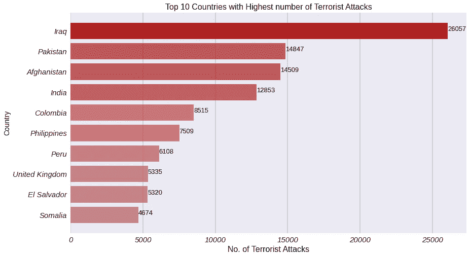
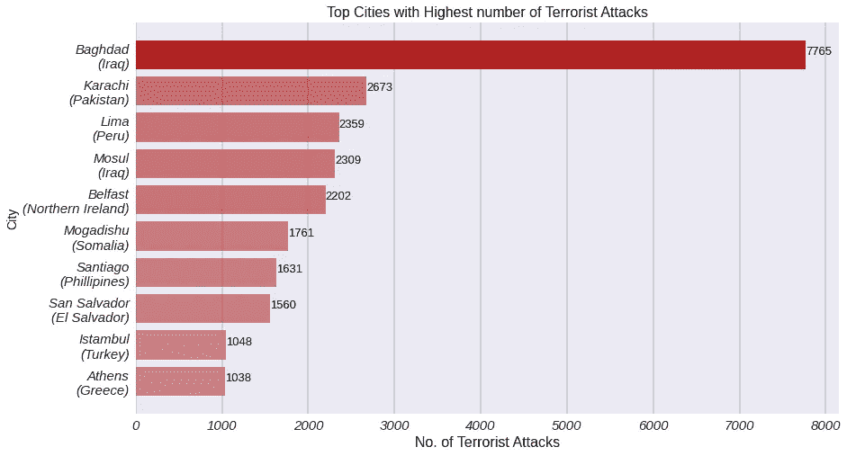
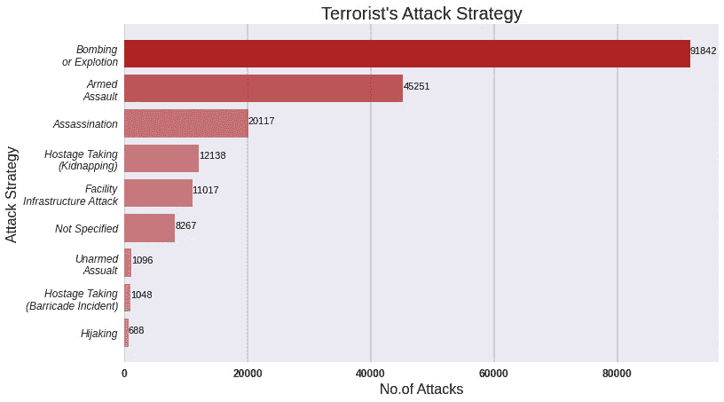
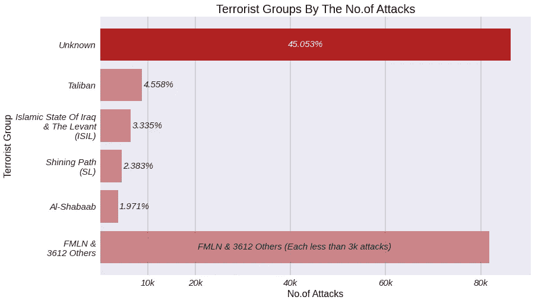
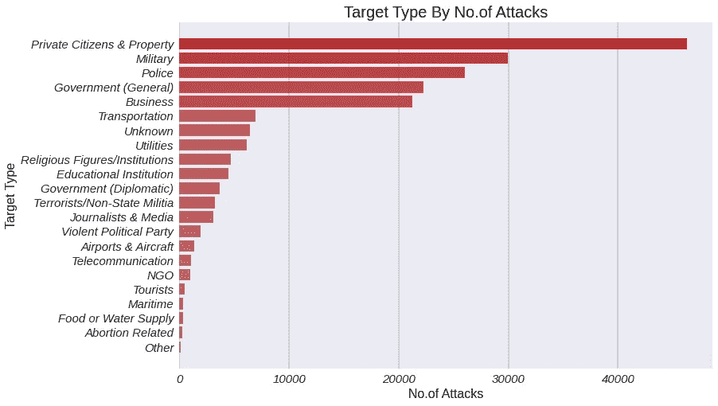

# 数据中的全球恐怖主义

> 原文：<https://medium.com/analytics-vidhya/inside-the-global-terrorism-database-967084386a16?source=collection_archive---------35----------------------->

> 全球恐怖主义数据库(GTD)是一个开源数据库，提供自 1970 年以来世界各地恐怖袭击的信息。在这篇文章中，我使用了 1970 年至 2018 年的数据，因为 2019 年的数据目前只适用于商业许可证持有者。查看他们的官方网站[这里](https://www.start.umd.edu/gtd/access/)。

每个事件都有广泛的信息，包括事件发生的日期和地点、使用的武器、目标的性质、伤亡人数以及个别恐怖主义团体的名称。

现在你会看到许多图表，这将让你对世界各地的全球恐怖主义有很好的认识*(很高兴，2020 年过去了，没有外星人的启示)*。

# 首先，我们来看看每年发生了多少起恐怖袭击事件。

从 1970 年到 1992 年，恐怖袭击逐渐增加。之后是 1998 年的最小值。自 2004 年以来，恐怖袭击的数量显著增加。2014 年，恐怖袭击达到顶峰。这是人类最糟糕的一年，同年[凯拉什·萨蒂亚尔希和马拉拉·优素福·扎伊](https://www.nobelprize.org/prizes/peace/2014/prize-announcement/)获得了诺贝尔和平奖。

# 按区域分列的恐怖袭击

将鼠标悬停在图表上以查看每年的值。

澳大拉西亚和大洋洲、东亚和中亚以及北美的恐怖袭击总数最少。而撒哈拉以南非洲、中东和北非以及南亚名列前茅。

# 恐怖袭击次数最多的国家

直到 2018 年，伊拉克的恐怖袭击次数最多，其次是巴基斯坦、阿富汗和印度。2014 年一年，伊拉克总共发生了 *3934* 起恐怖袭击，总伤亡*30769*(*13965**死亡+16804*)。

*将鼠标悬停在国家/地区上方，查看该特定国家/地区的数据(伤亡人数)。*

# 恐怖袭击次数最多的城市

巴格达(伊拉克首都)是有记录以来恐怖袭击次数最多的地方。它有几乎三倍数量的攻击来自被跟踪的城市卡拉奇。从 2001 年到 2018 年，它已经造成了 77678 人的伤亡(21106 人死亡+56572 人受伤)。

> 注意:超过 1 万次攻击来自城市、城镇或已知区域。以上数据仅来自已知城市。

# 攻击策略

我们可以看到，爆炸是恐怖主义中最广泛的攻击策略。包括手榴弹、弹丸和除核弹以外的其他爆炸。90K 以上的攻击被归类为爆炸或爆炸。

# 恐怖集团

几乎 45%的恐怖袭击来自未知的恐怖组织，也就是 86k 袭击。在那之后，塔利班发生了大约 8700 起恐怖袭击。

# 目标类型

这张图表显示了针对不同目标类型的恐怖袭击数量。大多数袭击是针对私人和财产的。其他常见的目标是军队、警察和企业。

# 注意

以上所有数字都是我根据全球恐怖主义数据库的分析得出的。这篇文章的目的是传播对全球恐怖主义的认识。

查看官方密码本[这里](https://drive.google.com/file/d/19s5evIqkfV8oCVc3XCIW1YELtKSGv6O5/view?usp=sharing)。另一个很酷的数据科学个人项目再见。'和平结束'