# 如何在 GCP 部署逻辑回归模型

> 原文：<https://medium.com/analytics-vidhya/insiders-view-on-logistic-regression-and-how-do-we-deploy-regression-model-in-gcp-as-batch-c62a64563210?source=collection_archive---------2----------------------->

## 业内人士对逻辑回归的看法以及我们如何在 GCP 部署逻辑回归模型作为批量预测…

在过去的二十年里，机器学习已经成为信息技术的支柱之一，并随之成为我们生活中相当重要的一部分，尽管通常是隐藏的。随着越来越多的数据变得可用，有充分的理由相信智能数据分析作为技术进步的必要因素将变得更加普遍。这篇文章将深入探讨逻辑回归和大多数企业面临的一个问题:**预测客户违约**。

# **简介**

逻辑回归是一种回归技术，用于研究因变量为**分类变量时，因变量与一个或多个自变量之间的关系。**与所有回归分析一样，逻辑回归是一种预测分析。逻辑回归用于描述数据，并解释一个因变量与一个或多个名义变量、序数变量、区间变量或比率水平自变量之间的关系。

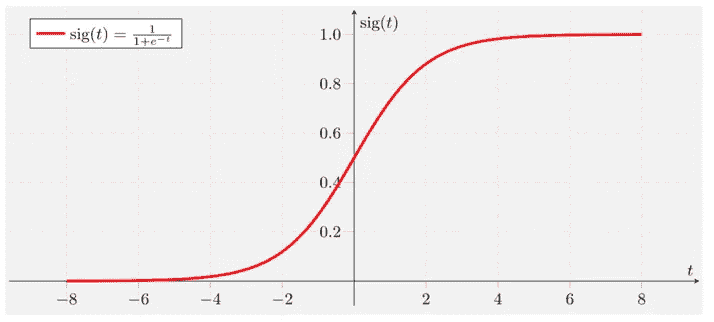

s 形或逻辑曲线

**Logistic** **回归方程**

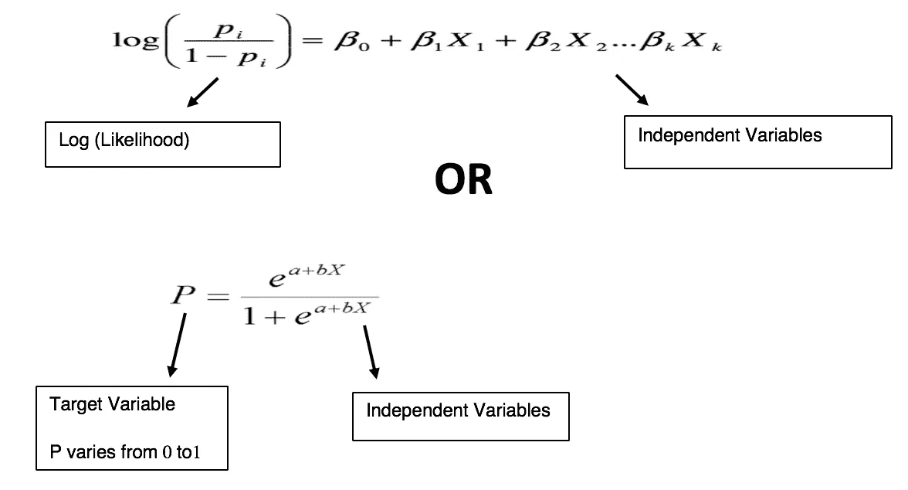

**逻辑回归的类型**

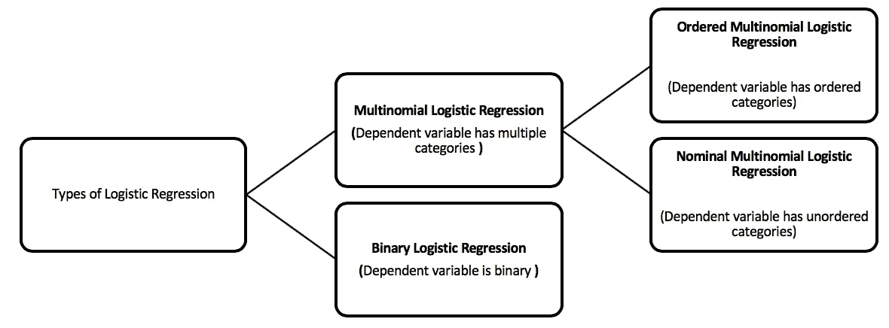

**二元和多项式**

# **为什么是逻辑回归？**

> 为什么不能用 OLS 线性回归技术来建模一个二元因变量？
> 
> 线性概率模型定义为:
> 
> pi =β0 +β1Xi
> 
> 其中 pi =事件发生的概率

## OLS 线性回归不适用于二元目标的两个主要原因是:

1.  **技术问题:违反假设 *—*** 线性回归模型中的二元(即二分)因变量违反以下假设:

—同质性

—误差项的正态性

2.**基本问题:有限概率—**

线性概率模型由下式给出:pi = β0 +β1Xi

—如果 X 没有上界或下界，那么对于β的任何值，都存在 pi > 1 或 pi < 0

— This is contradictory, as the true values of probabilities should lie within the (0,1) interval

***的 X 值。我们如何解决有界概率的问题？***

**2.a)使用赔率而非事件概率—** 赔率定义为:

**赔率**=**pi/1pi**=**事件概率/非事件概率**

*   由于事件的概率范围从 0 到 1，赔率范围从 0 到
*   将概率转换为赔率会移除上限

**2.b)取赔率的自然对数**

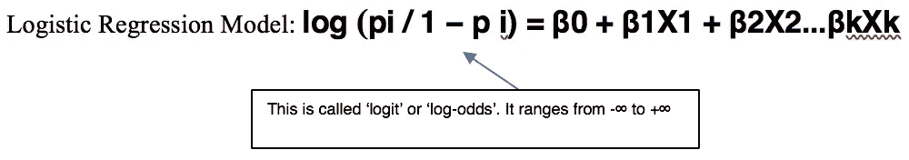

# 需要记住的一些关键要素:

**1)s 形函数**

1.1)逻辑回归模型:

**Z = log(p/1p)=β0+β1X1+β2 x2…βkXk**

1.2)因此，通过以下转换，从 logit(“模型得分”)估计事件概率:

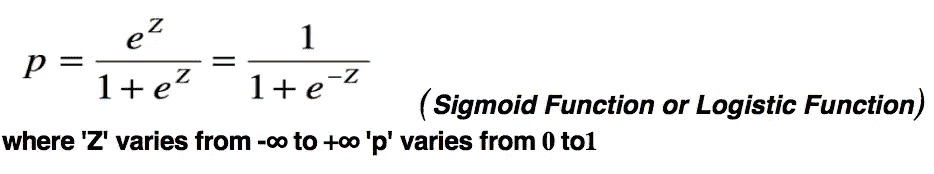

**2)估计方法:MLE**

2.1)构造似然函数，表示所有 *n* 个观测值的因变量 Y 的观测值的似然性

2.2)创建对数似然函数以简化方程

2.3)选择β值以最大化对数似然函数

**3)逻辑回归:一些关键假设**

3.1)因变量必须是分类变量(二元逻辑回归的二分变量)

3.2) P(Y=1)是事件发生的概率

*   因变量将被相应地编码
*   对于二元逻辑回归，第 1 类因变量应该代表期望的结果

3.3)误差项需要独立。逻辑回归要求每个观察都是独立的。

3.4)模型应该很少或没有多重共线性。

3.5)逻辑回归假设独立变量和对数优势呈线性。

3.6)样本量要足够大。

**4)优势比**

预测值的优势比定义为结果优势增加(优势比> 1)或减少(优势比< 1) when the value of the predictor variable is increased by 1 unit.

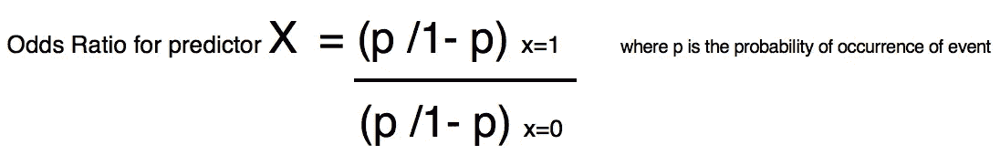

**4.1)的相对量解释**

比值比的解释取决于预测因子的类型:二元或连续

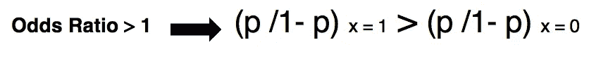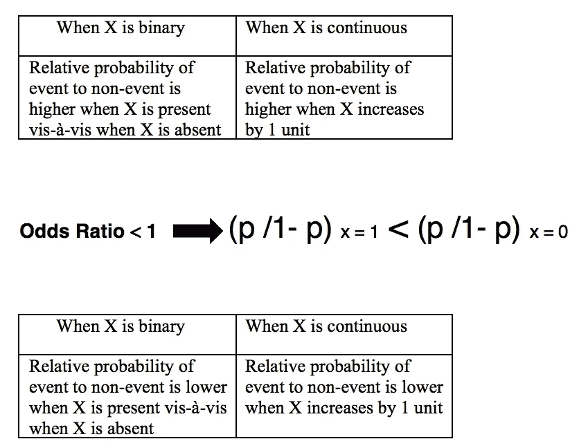

让步比

**5)模型验证的专有技术**

在模型建立的过程中，建模者必须时刻关注模型如何反映系统定义。确定统计软件生成的模型(基于输入数据)在多大程度上是真实世界的准确表示的过程。

为什么需要验证？

**5.1.1)概括**

以确定来自模型的预测值是否可能准确预测未来受试者或未用于开发模型的受试者的反应。

**5.1.2)稳定性检查**

测试模型在一段时间内的持续表现。

**5.1.3)鲁棒性检查**

测试该模型是否是真实世界的适当表示，以及该模型对于其预期用途是否可接受。

**5.2)模型验证的组件**

**5.2.1)采样策略**

*   抽样策略旨在解决使用经验数据进行测试时可能出现的不确定性。
*   示例:交叉验证、引导、样本外

**5.2.2)功率测试**

*   功效测试技术旨在测量模型的拟合优度。
*   示例:分类表、K-S 统计量、AUC 和分类模型的索引

**5.2.3)校准**

*   校准技术旨在评估模型预测与实际(即观察到的)值的匹配程度。
*   示例:分类模型的霍斯默-莱梅休检验

# **不同类型的验证方法**

## 1.分类表(混淆矩阵)

*   实际类别和预测类别的 2x2 矩阵
*   也称为混淆矩阵或列联表
*   主对角线之和(TP + TN)越大，分类准确度越高。

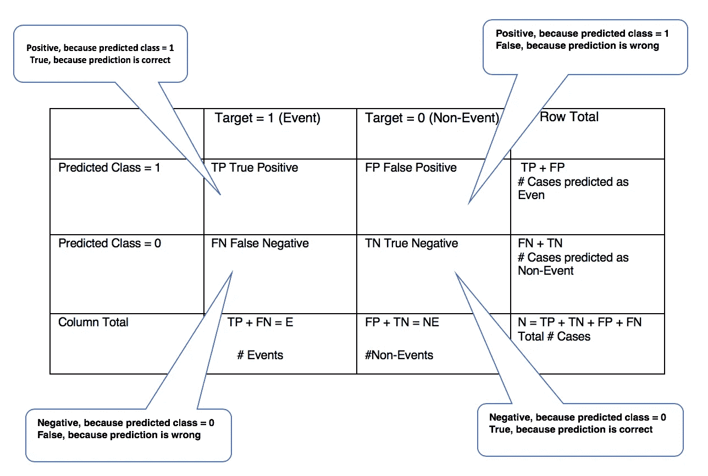

分类/混淆矩阵

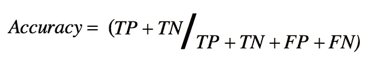

## 2)和谐与不和谐

*   **一致:**如果事件观察比非事件观察具有更高的预测事件概率，则称一对事件和非事件为一致对。
*   **不协调:**如果事件观察比非事件观察具有更低的预测事件概率，则一对事件和非事件被称为不协调对。
*   **并列:**如果事件和非事件观测值的预测事件概率完全相同，则称一对事件和非事件为并列对。

## 3)接收机工作特性(ROC)

ROC 图是一个二维图，其中:

*   真阳性率绘制在 Y 轴上。
*   假阳性率绘制在 X 轴上。

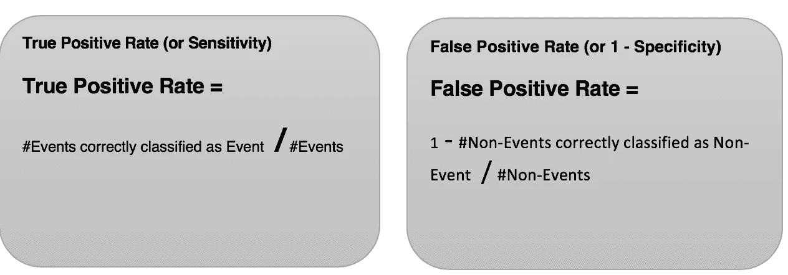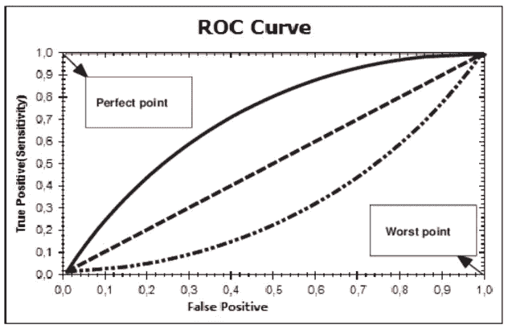

受试者工作特征曲线

## 4)基尼系数

基尼系数是衡量商品(非事件)和商品(事件)之间区别程度的一个尺度。

*   基尼系数是 ROC 曲线和 45 条随机平等线之间面积的两倍
*   基尼系数在 0 和 1 之间变化

基尼= 0 意味着没有歧视

基尼= 1 意味着完全歧视

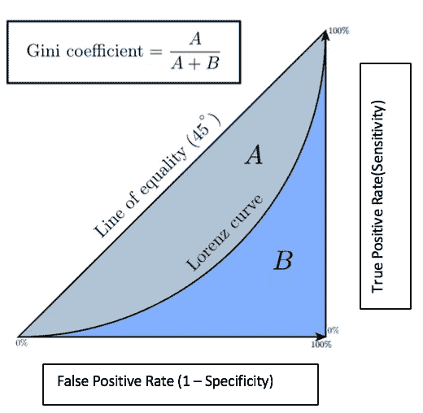

基尼系数

## 5) Kolmogorov-Smirnov 统计量

K-S 统计是事件(货物)的累积上升曲线和非事件(货物)的累积上升曲线之间的最大垂直差异。

KS 曲线如下所示。它是通过绘制人口的累积百分比来绘制的。KS 越好，模型越好。

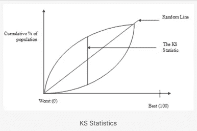

**小心:** — K-S 基于好的和坏的分布上的单个点——累积分布最不同的点。在没有仔细查看发行版的情况下，不应该依赖它。

## 6)十分位数事件率图表

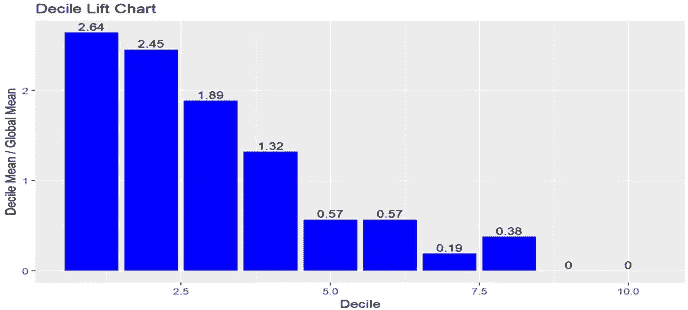

绘制了一个十分位数事件发生率图表，以衡量事件发生率等级是否有序。

*   从十分位数 1 向下移动到十分位数 10，目标平均值(即事件发生率)应该理想地单调下降。
*   从十分位数 1 向下移动到十分位数 10，目标平均值(即事件发生率)应该理想地单调下降。

## 7)霍斯默-莱梅休试验

*   Hosmer - Lemeshow 检验是对二元目标变量的拟合优度检验。
*   与许多其他拟合优度度量不同，它并不侧重于衡量模型的区分能力，而是旨在判断观察值和预测值的匹配程度。

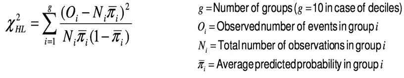

# **实际实施**

到目前为止，您已经了解了业内最常见、最广泛使用的 ML 算法。现在，让我们将 ML 模型应用于银行客户的样本数据集，并在**谷歌人工智能平台**中构建一个端到端的管道。

## **用例:**

目标是根据专门向无银行账户人群提供的信贷额度(贷款)的贷款服务来预测违约概率。预测客户是否会偿还贷款或有困难。

> ***围绕数据理解、清理、验证、特征工程、模型拟合的活动已分别执行。文章的这一部分更具体地针对云中的模型部署。***

## **关于数据:**

*   **SK_ID_CURR —客户 ID**
*   **目标—是否支付**
*   **CNT_CHILDREN —子女数**
*   **金额 _ 收入 _ 合计—总收入**
*   **金额 _ 贷记—每月贷记金额**
*   和收入来源的其他特征。

## **程序:**

1.  数据清理:数据集非常整洁，几乎不需要修改。
2.  EDA:通过查看列名，我注意到有些列的名称非常相似，这意味着可能存在潜在的多重共线性问题。因此，我绘制了一些具有相似名称的特征图，这些图显示了彼此之间的强相关性，这表明需要进行特征选择，因为我打算使用的模型是回归。这里有一个情节:

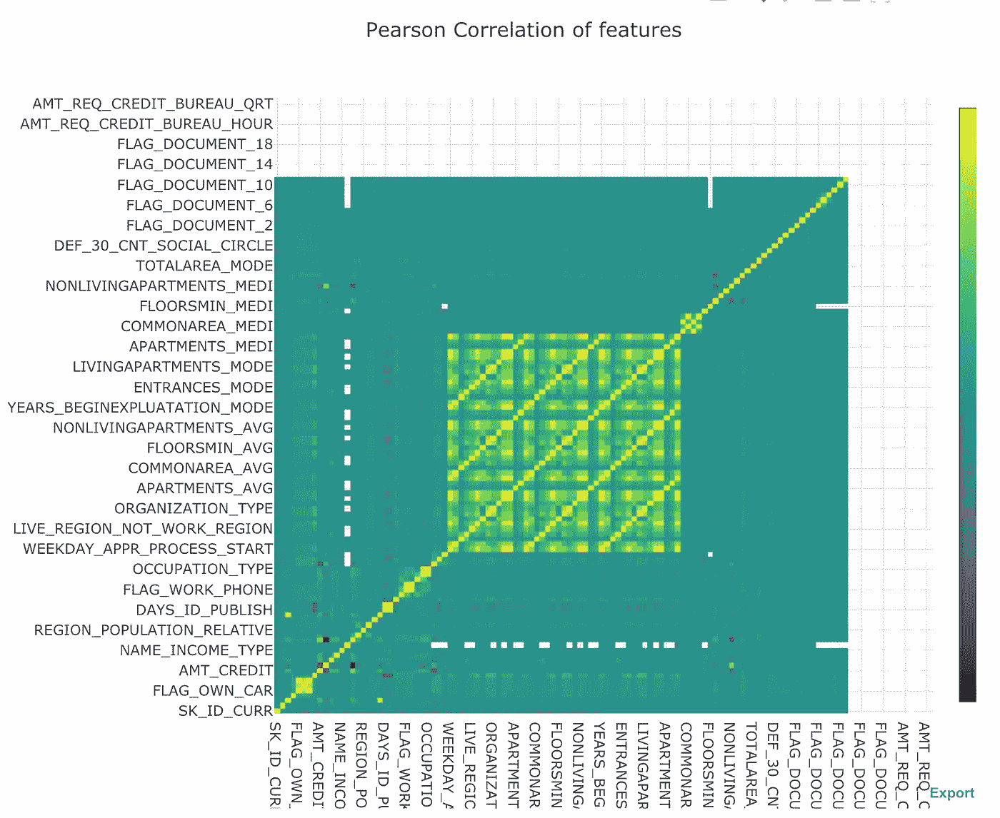

3.特征工程:在拟合我的模型之前，我需要做两件事:移除或合并特征，以及对我的分类特征进行标签编码。

4.一旦模型完成了所有必要的验证，并且我们已经根据训练、测试和验证数据集检查了它的性能。现在是时候部署在 **GCP 人工智能平台作为批量预测**。

# **程序**

1.  将数据集连同 SQL 脚本一起上传到 GCP 桶中。这个 sql 脚本将有助于在云 Sql 中创建表，云 Sql 充当构建模型的数据源。对新数据集的预测也将作为输出存储在云 sql 中。请找到下面的屏幕截图。

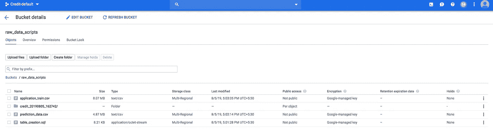

2.一旦我们在云 SQL 中创建了数据库，我们的 Sql 脚本就会创建表。

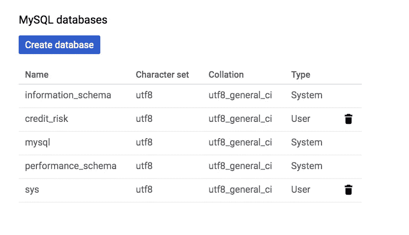

信用风险是我们的数据库

3.现在我们首先运行我们的模型开发脚本并生成一个 pickle 文件。即 Model_development.py

> **完整的脚本在** GitHub **请参考文章底部的链接。**

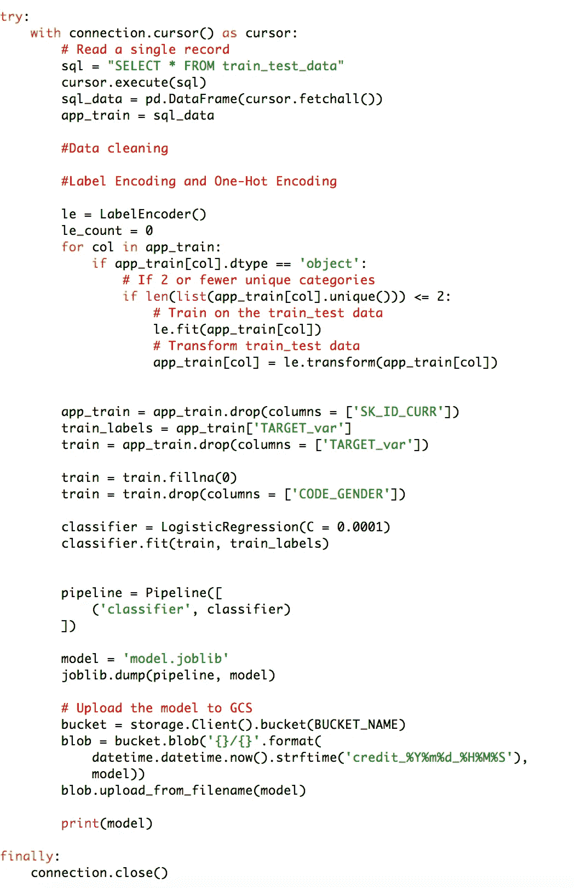

4.现在我们在 AI 平台生成 pickle 文件的镜像，创建模型版本。为此我们将使用 **Bash 命令(参考 GitHub)。**

在创建模型版本时，确保在 GCP 存储桶中指定了 model.joblib 文件所在的目录。

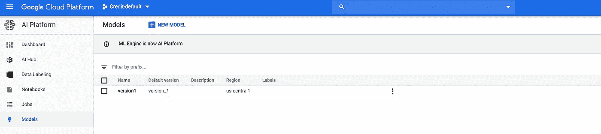

模型(Pickle)图像已创建

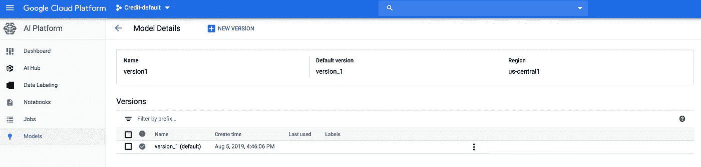

模型版本

5.一旦我们的模型被部署并准备好使用，我们将得到下面的成功消息。

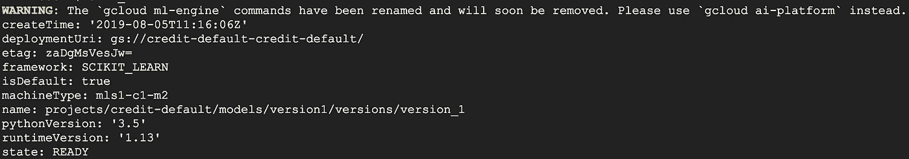

6.我们的最后一步是运行部署脚本。这将摄取新数据，使用来自 AI 平台的模型图像进行预测，并将输出存储在云 Sql 中，如下所示。这就是我们如何在 GCP 平台内获得批量预测。

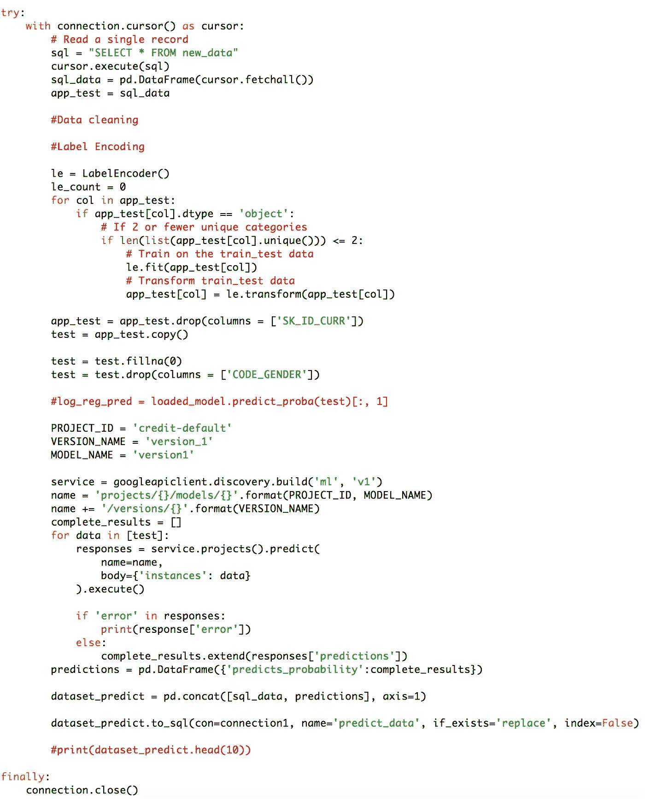

部署脚本

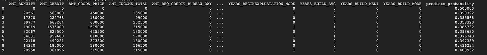

云控制台中的输出

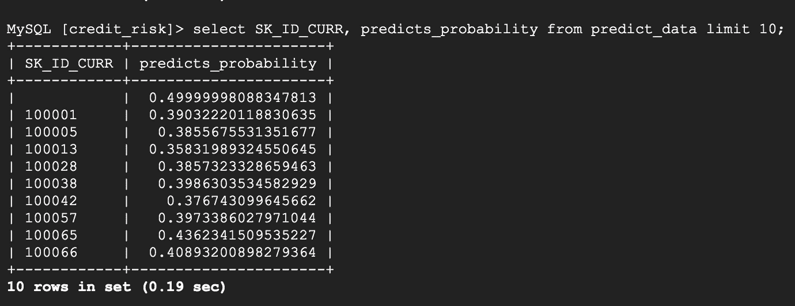

云 Sql 中的示例输出

现在，我们已经建立了模型，并将其部署到 GCP，我们可以运行它，并保证我们的用户数据是安全的。

请随意即兴发挥这种方法。建议总是受欢迎。

完整代码:-[https://github.com/himswamy/GCP_Batch_Prediction.git](https://github.com/himswamy/GCP_Batch_Prediction.git)

链接到 GitHub:-【https://github.com/himswamy/GCP_Batch_Prediction 

# 快乐学习！！