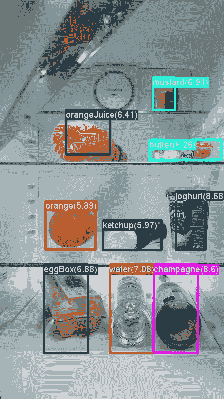

# 洞察对象检测的快速 R-CNN。

> 原文：<https://medium.com/analytics-vidhya/insight-into-faster-r-cnn-for-object-detection-f1e64240eee1?source=collection_archive---------5----------------------->

快速 R-CNN 是由 Ross Girshick，Ren，He 和在 2015 年提出的一种对象检测架构，是使用卷积神经网络的著名对象检测架构之一。它检测并分类图像中的对象，如下所示:

在深入了解更快的 R-CNN 之前，让我们先了解一下 R-CNN、快速 R-CNN 和 RPN，它们都是构建模块…