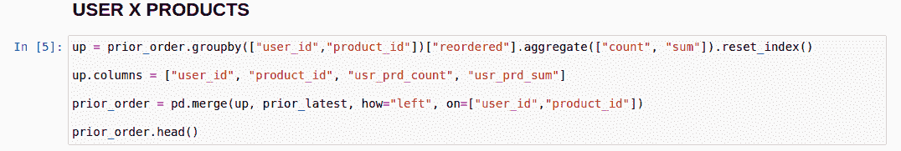

# Instacart 市场篮子分析(Kaggle 竞争)

> 原文：<https://medium.com/analytics-vidhya/instacart-market-basket-analysis-kaggle-competition-856ddd7b08e0?source=collection_archive---------12----------------------->

这个博客是关于我的第一次 Kaggle 挑战。希望这篇博客能让你很好地理解如何解决分类问题。

Instacart 是一家美国公司，提供杂货递送和提货服务。该公司在美国和加拿大开展业务。Instacart 通过[网站](https://en.wikipedia.org/wiki/Website)和[手机应用](https://en.wikipedia.org/wiki/Mobile_app)提供服务。不像其他电子商务网站直接从卖家向客户提供产品。Instacart 允许用户从参与的供应商那里购买产品。这种购物是由私人购物者完成的。

# 概述

1.  问题概述
2.  数据源
3.  数据概述
4.  电子设计自动化(Electronic Design Automation)
5.  特征工程
6.  建模
7.  未来的工作
8.  参考

# 问题概述

该竞赛的主要目的是预测用户的下一个订单中会出现哪些以前购买过的产品。

这个问题与一般的推荐问题有些不同，在这种情况下，我们不是向用户推荐新产品，而是推荐用户以前购买的产品。这是一个有趣的问题，因为这里我们需要找到用户重新排序的行为，这样我们就可以个性化用户的购物车。

# 数据源

Instacart 在 Kaggle 平台上发布了这个问题和数据。
(https://www . ka ggle . com/c/insta cart-market-basket-analysis/data)

# 数据概述

1.  有 6 个 csv 文件。该文件包含以下信息。

*   订单:此表包括所有订单，即优先订单、培训订单和测试订单。它
    有一个主键(order_id)
*   order_products_train:此表包括培训订单。它有一个
    复合主键(order_id 和 product_id ),并指示
    订单中的产品是否为再订购(通过
    再订购变量)。
*   order_products_prior:此表包括以前的订单。它有一个
    复合主键(order_id 和 product_id ),并指示
    订单中的产品是否为再订购(通过
    再订购变量)。
*   产品:本表包括所有产品。它只有一个主键
    (产品标识)
*   过道:此表包括所有过道。它只有一个主键
    (过道 id)
*   部门:本表包括所有部门。它只有一个
    主键(department_id)

# **EDA**

现在让我们稍微研究一下数据。

用户订购数量的频率是多少？通常一个用户下多少订单？

这个图解释了，每个用户的订单数是多少？。在 4、5、6、7 和 8 处有一个高峰，这告诉我们用户通常在每个订单中订购 4 到 8 个产品。

用户是在星期几下的订单？

现在，如果你看到大多数用户喜欢在周末而不是工作日下订单。这是有意义的，因为这些天大多数用户是空闲的，而在其他日子，用户的订单没有周末的订单比例高。

用户在哪个小时下订单？

这个图告诉我们用户下单的首选时间是什么时候？。早上有高峰，然后慢慢降低。在上午 10 点到下午 15 点之间，用户之间的订单比率很高。

上次购买后，用户需要多少天才能下订单？

用户下单后，需要几天才能再次下单？。通常每次下单后都有 7 天的间隔。如果你仔细观察，会发现在第 7 天有一个高峰，之后是第 14 天，然后是月末。用户需要一周时间再次订购。

# **特色工程**

我已经创建了两种类型的特征

1.  用户最新购买
2.  用户 X 产品

**用户最新购买:**

在这个特性中，我计算了用户的最新订单，并检查产品是否被重新订购？如果是，那么我将该产品放入用户的最新订单中。创建这些功能的原因主要是用户订购他们最近订购的产品，如果您看到用户下订单的频率，他们通常在每 7 天、14 天以及月末下订单。

用户最新购买

**用户 X 产品:**

在这个功能中，我试图找到每个产品的用户行为。在这里，我计算了订单总数，以及在所有订单中，用户重新订购了多少次？

用户 X 产品再订购总数和计数

我已经计算出了非常少的特征，但是这些特征很好地说明了用户想要什么？让我举一个例子，如果用户最近购买了一个产品，并且该产品订单计数为 10，再订购计数为 8，现在如果我们查看该产品最近订购的计算机功能，再订购计数很高，因此用户很可能会再次订购该产品。

# **造型**

我们正试图预测用户是否会再次订购该产品？。这使得它成为一个二元分类问题。我们可以使用各种算法来完成二元分类任务。

我用过 XGBoost。对于这项任务来说，这是一个很好的算法，因为它提供了一系列广泛的参数，可以对模型训练过程进行细粒度的控制。为了提高 Kaggle 比赛的分数，这种算法非常有用。

XGBoost 返回概率值，但这是一个二进制分类问题。所以我们需要一个阈值来进行分类，我在这个任务中使用的阈值是 0.2。我引用了这个链接( [threshold detail](https://www.kaggle.com/c/instacart-market-basket-analysis/discussion/34977) )来了解阈值，这样可以最大化分数。

# **评估指标**

Kaggle 评估指标是平均 F1 分。要计算 F1 的平均分数，请使用以下公式(【https://www.kaggle.com/aikinogard/python-f1-score-function】T2)

下面是这段代码的片段。

> 所以，最终的 Kaggle 分数是 **0.34016**
> 
> 公众评分为 0.34016
> 
> 私人得分是 0.33875

这个分数让我进入了排行榜前 10%的前 300 名。

## **未来工作**

计算更多与用户和产品相关的特性，如用户购物车大小、用户的平均订单日等。

在这里，我只使用了一种机器学习算法，但在未来，我想尝试一些深度学习模型，我认为这将大大提高分数。

此外，我期待尝试 Apriori 算法，以获得更多的功能。

我的( [GitHub Repo](https://github.com/tanay5678/Instacart-Market-Basket-Analysis) )带着我的笔记本和代码。

## **参考**

1.  [https://www . ka ggle . com/c/insta cart-market-basket-analysis/discussion/34977](https://www.kaggle.com/c/instacart-market-basket-analysis/discussion/34977)
2.  [https://www . ka ggle . com/errolpereira/xgboost-with-minimal-feature-engineering # Creating-user-product-features。](https://www.kaggle.com/errolpereira/xgboost-with-minimal-feature-engineering#Creating-user-product-features.)
3.  [https://www . ka ggle . com/philippsp/explorative-analysis-insta cart](https://www.kaggle.com/philippsp/exploratory-analysis-instacart)
4.  [https://www.appliedaicourse.com/](https://www.appliedaicourse.com/)