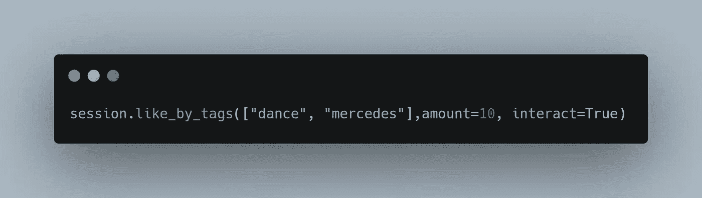

# 使用 Python 和 InstaPy 的 Instagram Bot

> 原文：<https://medium.com/analytics-vidhya/instagram-bot-using-python-and-instapy-70b25ad8e157?source=collection_archive---------11----------------------->

对于像我这样的初学者来说，这是一个有趣的 python 项目，它正在制作一个 **Instagram bot** 来喜欢、评论和关注带有特定标签的个人资料。

我提到了“真正的 Python”的一篇文章，好像我遇到了一些重大错误，我通过谷歌搜索自己解决了这些错误。

这里使用了 **Selenium** 和**页面对象模式**，它们共同作为 InstaPy 的基础。

*确保你也安装了* [*火狐浏览器*](https://www.mozilla.org/en-US/firefox/new/) *因为最新版本的* [*InstaPy 放弃了对 Chrome*](https://github.com/timgrossmann/InstaPy/blob/master/CHANGELOG.md#breaking-changes) *的支持。*

首先，您必须安装 InstaPy:

```
pip install instapy==0.6.8
```

最新版本是 0.6.9，但是每当我试图使用注释时，它就会崩溃。没有注释脚本也能完美工作。

首先，让我们创建一个 Python 文件，并将以下代码放入其中:


用你的替换用户名和密码，运行脚本，这样你就可以进入 Instagram 了。

InstaPy 还做一些其他事情，比如检查你的互联网连接和 Instagram 服务器的状态。我们可以在浏览器或日志中直接观察到这一点:

*加载可能需要一些时间*


首先，我们可以喜欢一些使用`like_by_tags()`标记为`#dance`或`#mercedes`的帖子:



在会话设置后使用它(注释和跟随)

这里，我们给了这个方法一个标签列表，以及每个标签的点赞数量。在这里，我们指示它每个喜欢十个职位。InstaPy 记录它采取的每一个行动。

它提到了它喜欢的帖子及其链接、描述、位置，以及机器人是否对帖子发表了评论或关注了作者。

我们可以用`set_dont_like()`:防止 bot 喜欢不合适的帖子。

> 在运行代码之前，我们必须修改位于**site-packages/insta py/XPath _ compile . py**中的 **xpath_compile.py** 文件中的一些代码，因为 instagram 已经修改了 HTML

## 移除:

```
xpath["like_image"] = {
    "like": "//section/span/button[*[local-name () ='svg']/@aria-label='Like']",
    "unlike": "//section/span/button[*[local-name () ='svg']/@aria-label='Unlike']",
}
```

## 替换为:

```
xpath["like_image"] = {
    "like": "//section/span/button/div[*[local-name()='svg']/@aria-label='Like']",
    "unlike": "//section/span/button/div[*[local-name()='svg']/@aria-label='Unlike']",
}
```

> 如果我们不替换上面的代码，就会导致`instapy: "Invalid Like Element!"`的错误

接下来，你也可以在帖子上留下一些评论。

首先，用`set_do_comment ()`启用注释:

第二，告诉机器人用`set_comments ()`留下什么评论:


这里的百分比表示它将评论的总帐户的百分比

接下来，你可以告诉机器人不仅要喜欢这些帖子，还要关注这些帖子的作者。你可以用`set_do_follow ()`来做:


它将跟随所有帐户% =100

在这之后，你必须使用`set_user_interact ()`:来反映与**用户**界面进行一次**交互**后的实际用户体验。这里的数量是机器人将在一个单独的配置文件中交互的帖子数量。


会话设置

> **重要的**:你必须在呼叫活动之前设置配置，也必须设置交互，这意味着在上述**会话设置**之后，保持**活动**，否则机器人只会喜欢帖子，不会评论或关注。


活动

现在你已经完成了基本的设置，用`end()` : **session.end()** 结束会话是个好主意

经过多次反复试验，这个方法对我完全有效。

这是我的第一篇编码文章，如果你能为它鼓掌，我会非常高兴。

*谢谢，继续加油。*

**我也将很快在**[**GeeksforGeeks**](https://www.geeksforgeeks.org/)**上发表它。**