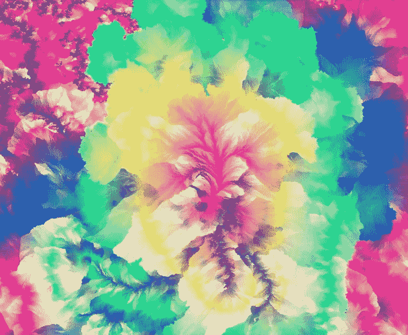
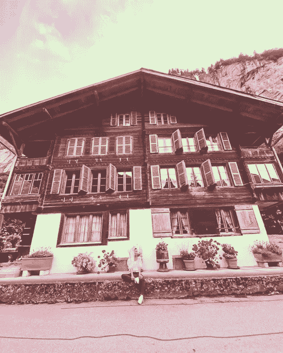
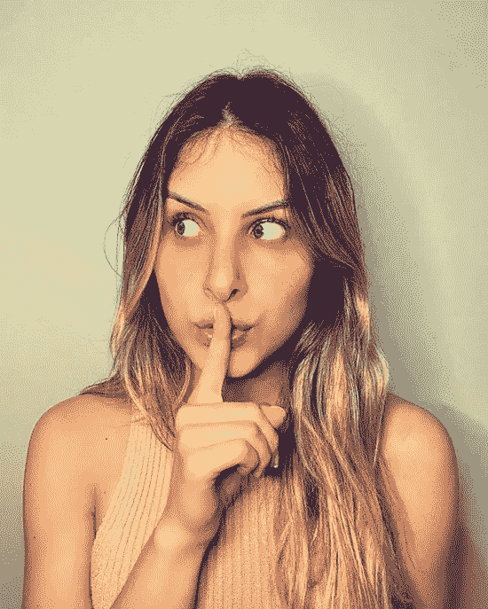
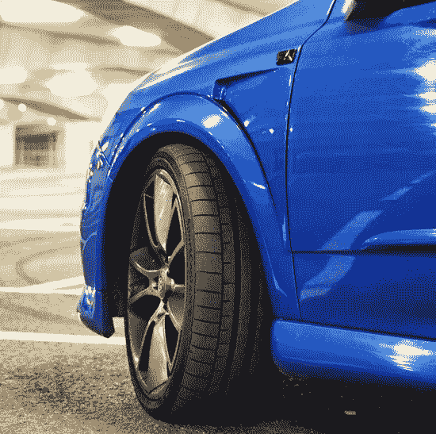
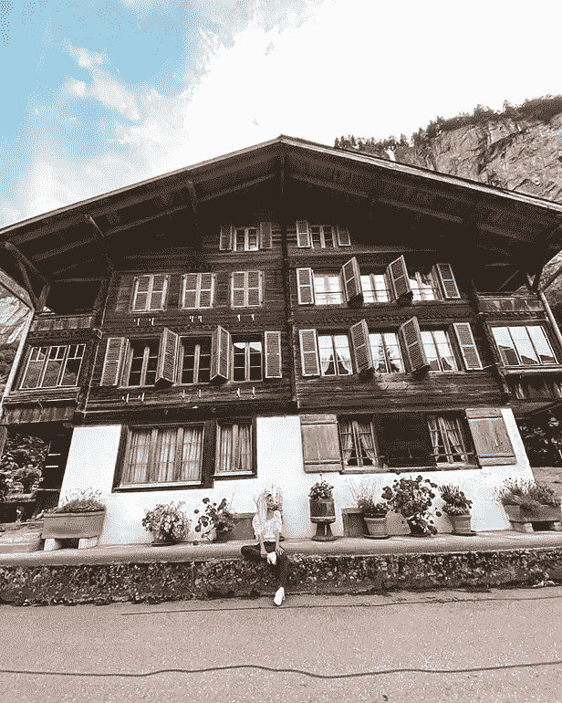
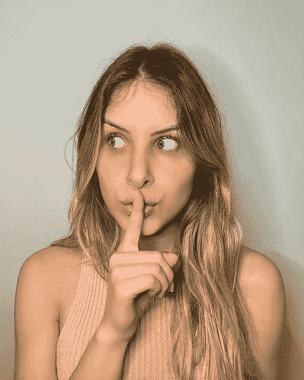

# python 中的 Instagram 过滤器

> 原文：<https://medium.com/analytics-vidhya/instagram-filters-in-python-acc1ee7e67bc?source=collection_archive---------11----------------------->

周末 pytorch 项目，重现 A 应用程序的标志性滤镜。


W illow。佩尔图阿。高保真音响。奶油。面包机。旨在唤起情感的异想天开的名字。去饱和的戏剧性效果和色调的剧烈变化。我说的是 Instagram 滤镜和它们在应用程序中几乎无处不在的使用。这也不仅仅是为了展示——滤镜的使用[与更多的观看次数](https://www.wired.com/2015/05/instagram-filters/)相关。难怪该应用程序会在每篇帖子前将它们放在最前面，鼓励添加柔和的光线或复古的褪色照片来吸引注意力。我们能在应用程序之外重现效果吗？是啊！本文探讨了我如何创建一个名为 [**instafilter**](https://github.com/thoppe/instafilter) 的 python 模块。

## 一朵别的名字的玫瑰

过滤器是什么样子的？让我们来看几个例子:



从左上顺时针方向:未触及，烤面包机，柳树，瓦尔登湖。

在右上方，我们看到一朵彩色的玫瑰和三个独立的过滤器的结果。它们中的每一个都极大地改变了颜色、亮度和饱和度。我们可以学习滤镜的一种方法是通过 [3D LUT](https://en.wikipedia.org/wiki/3D_lookup_table) (查找表)，也就是明确地写下每个 RGB 像素如何变换。虽然这是可行的，但对每个颜色通道使用完整的 8 位空间，需要 3*(2⁸= 50，331，648 位来存储每个滤镜的整个表格！如果我们通过仅采用一些映射并在它们之间进行插值来量化 LUT，则由于量化，所得到的图像通常具有不期望的条带问题。相反，我们来学习一个变换。在转换中，目标是学习一个函数，它接受一个像素的颜色并将其映射到另一种颜色。它也有回报，instafilter 使用的结果模型只有 9K 位，也就是大约 300 个 32 位数字！首先，我们需要建立一个训练集和一个模型。

## 构建训练集

为了建立训练集，我将“未接触”的图像作为参考照片。这来自于 józsef Fejes 的一个项目，他的目标是用每一种可能的 RGB 颜色来创建一幅图像。理论上，我们可以使用一个枯燥的像素网格，这种彩色的玫瑰让我们可以将结果可视化。使用高分辨率照片，我在 Instagram 上运行了每个过滤器，并保存了结果。然而，结果并不完美，因为 Instagram 对图像进行了下采样，并将其保存为 JPEG 格式。然而在实践中，产生的差异足够小，最终结果看起来和应用程序一样好。

我对训练集的第一个想法是训练一个变换:

**f(R，G，B) - > (R '，G '，B')**

也就是说，给定红色、绿色和蓝色通道，学习将它们映射到新的 RGB 颜色的函数。这并不像我希望的那样好，所以我不得不帮助网络。虽然网络只使用 RGB 进行训练，但它必须比我想要收敛的要大得多。相反，我用

**f(R，G，B，L，S) - > (R '，G '，B')**

其中 L 和 S 是亮度和饱和度。从 RGB 计算这些值很简单，但它通过预先做一些工作极大地帮助了网络。这是机器学习的艺术；我可以看到 Instagram 滤镜修改亮度和饱和度，所以我将它们输入到输入功能中。通过给它一些附加信息，网络不必浪费容量自己学习那些特征。

## 训练网络

模型本身非常简单，是一个 4 层完全连接的神经网络:

这是我第一次真正使用 pytorch，我很喜欢它看起来如此自然。像观察常规 python 对象一样观察变量并与它们交互真的很自由。如果您只使用过 tensorflow，请在您的下一个项目中尝试一下。为了训练模型，我借鉴了 [fast.ai](https://www.fast.ai/2018/07/02/adam-weight-decay/) 的想法，使用了带有学习率查找器的 one-cycle。有兴趣可以直接看[培训代码](https://github.com/thoppe/instafilter/blob/master/development/train_new_model/train.py)。

每个模型的训练时间大约为 3 分钟，我的平均损失大约为 0.2。它并不完美，主要是由于我的训练集不完善，但它不需要如此。据我所知，输出与真正的过滤器没有区别。

## 使用 instafilter

自己用 python 模块很简单！首先用 pip 安装它

```
pip install instafilter
```

现在，您可以在自己的代码中使用它，如下所示:

```
from instafilter import Instafilter

model = Instafilter("Lo-fi")
new_image = model("myimage.jpg")

# To save the image, use cv2
import cv2
cv2.imwrite("modified_image.jpg", new_image)
```

我将用几个例子来结束我的演讲:



滤镜从左到右:1977，XPro-II，Lo-Fi



原始图片来源于 Instagram ( [1](https://www.instagram.com/p/CD57045D35V/) 、 [2](https://www.instagram.com/p/CEkataHAi9j/) 、 [3](https://www.instagram.com/p/CEL5JAsJ2SO/) )。

就是这样！如果你喜欢这个或者对 twitter 帖子有任何意见，请告诉我。