# 在 Windows 7 上安装 Cygwin

> 原文：<https://medium.com/analytics-vidhya/install-cygwin-on-windows-7-47100f581783?source=collection_archive---------8----------------------->


## 在 Windows 机上播放 linux 的一种方法

这是我正在使用的惠普笔记本电脑:

选择开始>控制面板>系统

64 位 Windows 7 专业版 SP1

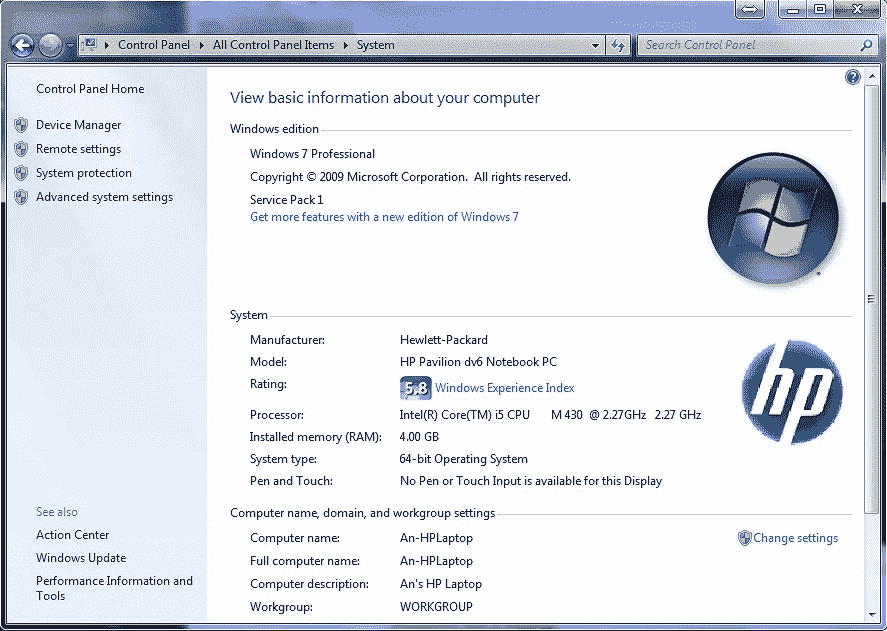

到[https://www.cygwin.com](https://www.cygwin.com/)点击链接 setup-x86_64.exe

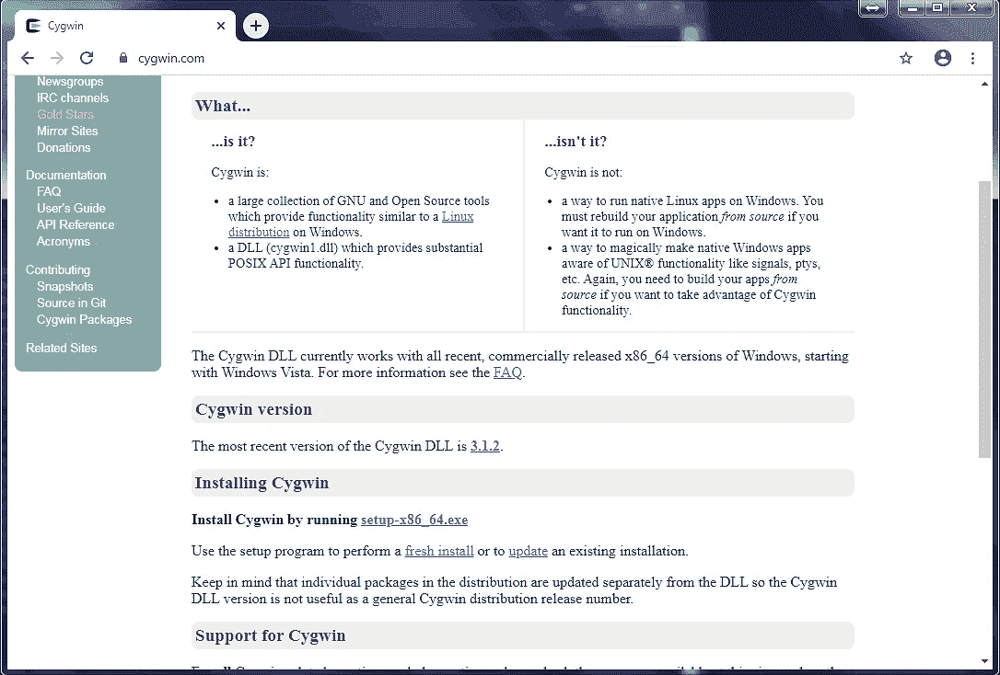

遵循屏幕上的说明。

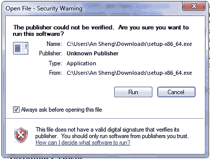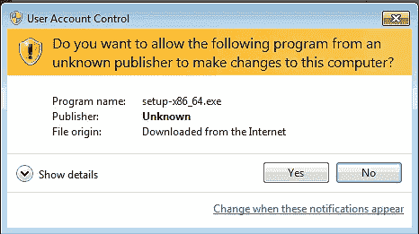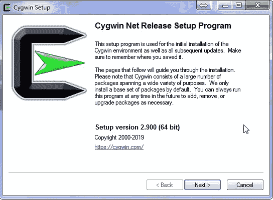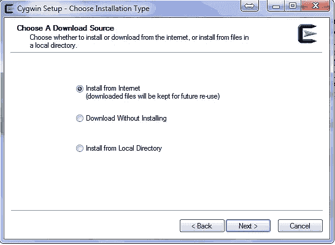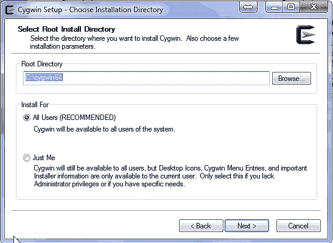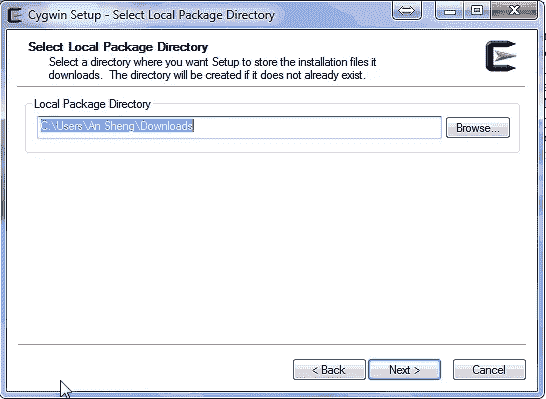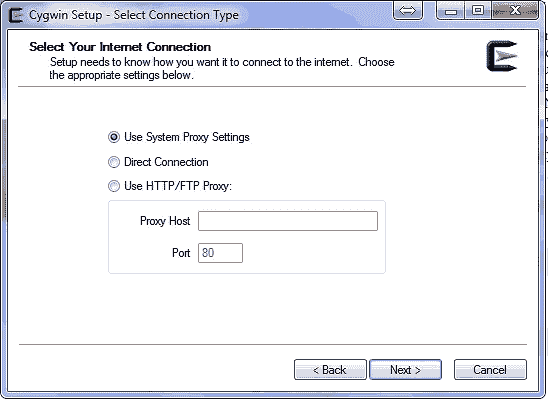

我干脆选一个滑铁卢大学的镜像网站。

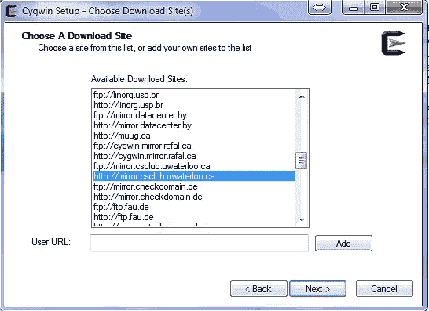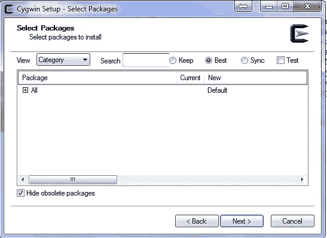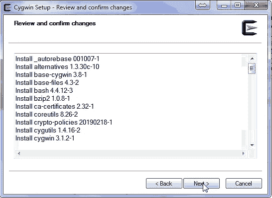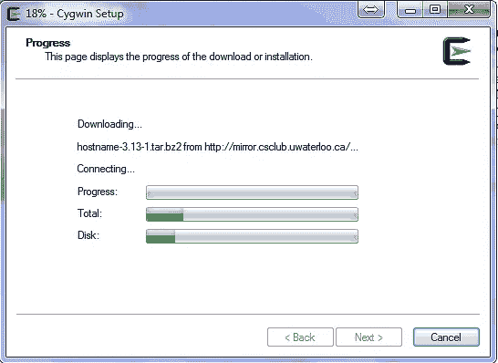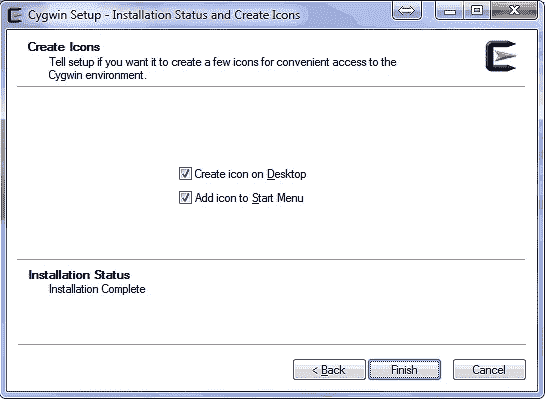

双击 Cygwin 图标启动它。

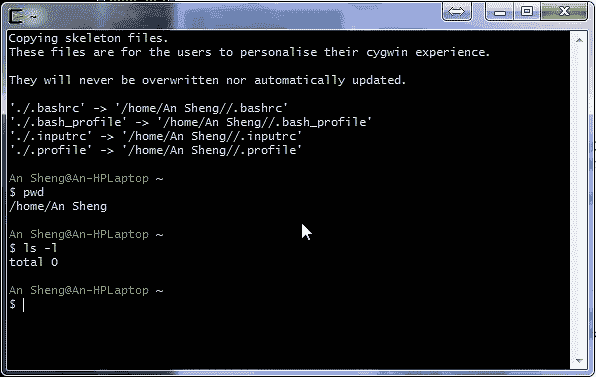

要更改字体大小，请右键单击顶部栏并选择选项…

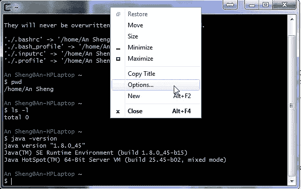

选取文本>选择…

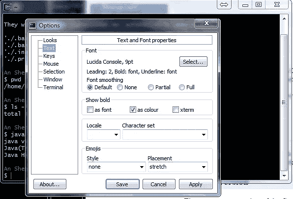

我喜欢 16 号的 Segoe UI Mono。

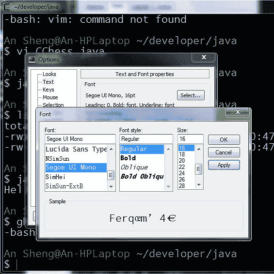

让我们创建一个简单的 Java 程序来展示在 Cygwin 下的工作。

创建子目录。

```
An Sheng@An-HPLaptop ~
$ java -version
java version "1.8.0_45"
Java(TM) SE Runtime Environment (build 1.8.0_45-b15)
Java HotSpot(TM) 64-Bit Server VM (build 25.45-b02, mixed mode)An Sheng@An-HPLaptop ~
$ pwd
/home/An ShengAn Sheng@An-HPLaptop ~
$ ls -l
total 0An Sheng@An-HPLaptop ~
$ mkdir developerAn Sheng@An-HPLaptop ~
$ ls -l
total 0
drwxr-xr-x+ 1 An Sheng None 0 Jan 11 00:42 developer
An Sheng@An-HPLaptop ~/developer
$ mkdir javaAn Sheng@An-HPLaptop ~/developer
$ cd java/
```

创建 Java 源文件 CChess.java:

```
An Sheng@An-HPLaptop ~/developer/java
$ vi CChess.java
```

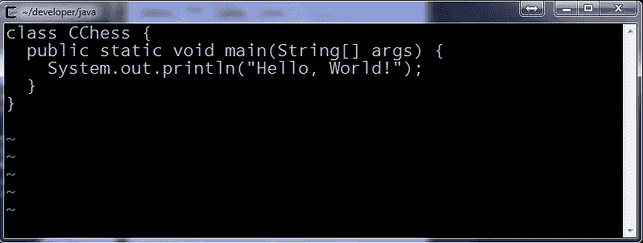

下面是 CChess.java 的代码:

```
class CChess {
  public static void main(String[] args) {
    System.out.println("Hello, World!");
  }
}
```

编译并运行 CChess.java:

```
An Sheng@An-HPLaptop ~/developer/java
$ javac CChess.javaAn Sheng@An-HPLaptop ~/developer/java
$ ls -l
total 2
-rwxr-xr-x 1 An Sheng None 419 Jan 11 11:53 CChess.class
-rw-r--r-- 1 An Sheng None 107 Jan 11 00:47 CChess.javaAn Sheng@An-HPLaptop ~/developer/java
$ java CChess
Hello, World!An Sheng@An-HPLaptop ~/developer/java
$
```

尝试一些其他的 linux 命令，比如 date、cal、cat 和 wc -l。

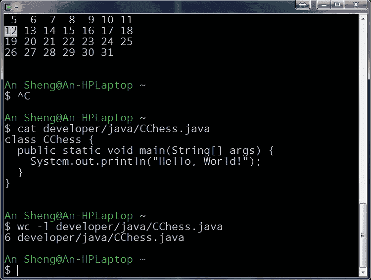

```
$ date
Sun, Jan 12, 2020  5:16:01 PMAn Sheng@An-HPLaptop ~
$ cal
    January 2020
Su Mo Tu We Th Fr Sa
          1  2  3  4
 5  6  7  8  9 10 11
12 13 14 15 16 17 18
19 20 21 22 23 24 25
26 27 28 29 30 31An Sheng@An-HPLaptop ~
$ cat developer/java/CChess.java
class CChess {
  public static void main(String[] args) {
    System.out.println("Hello, World!");
  }
}An Sheng@An-HPLaptop ~
$ wc -l developer/java/CChess.java
6 developer/java/CChess.javaAn Sheng@An-HPLaptop ~
$
```