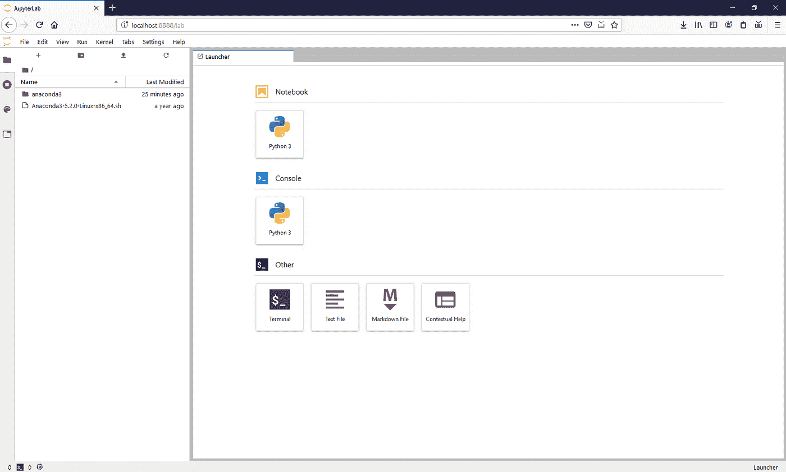
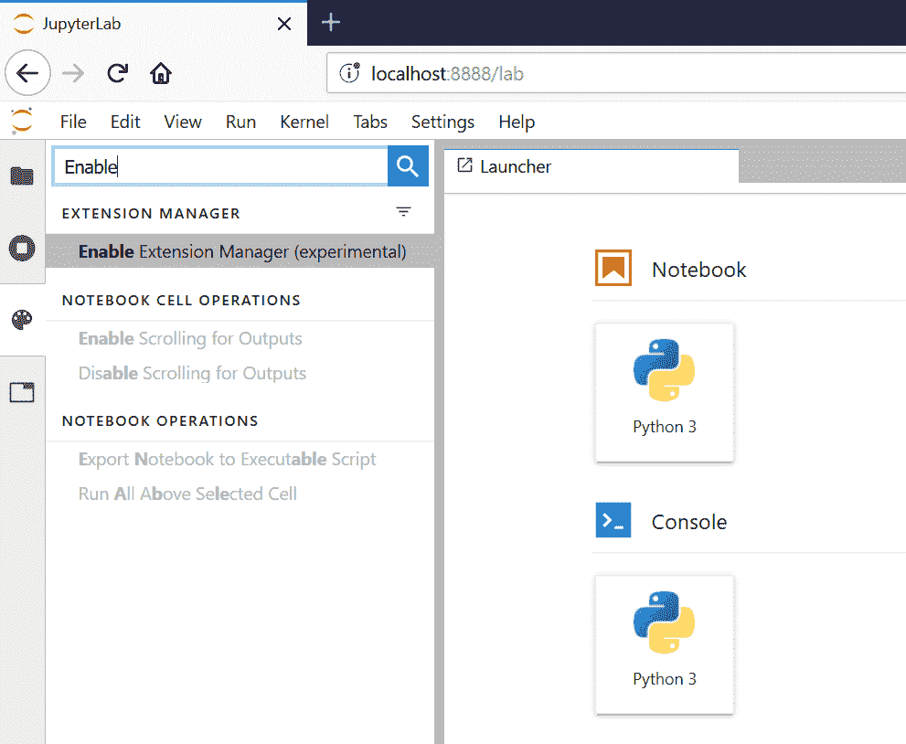
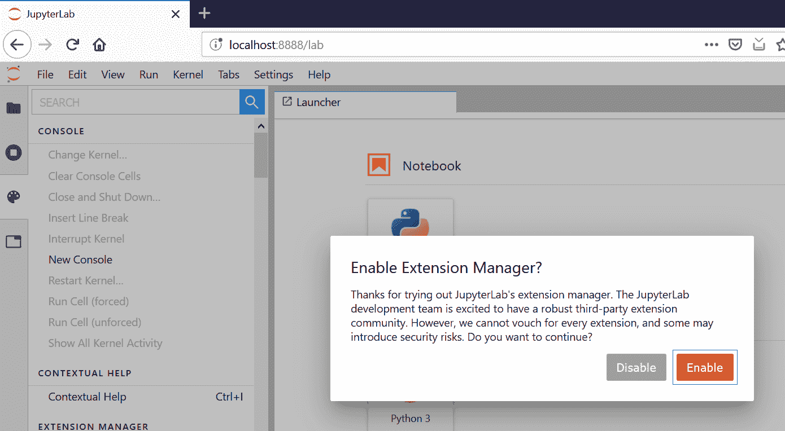
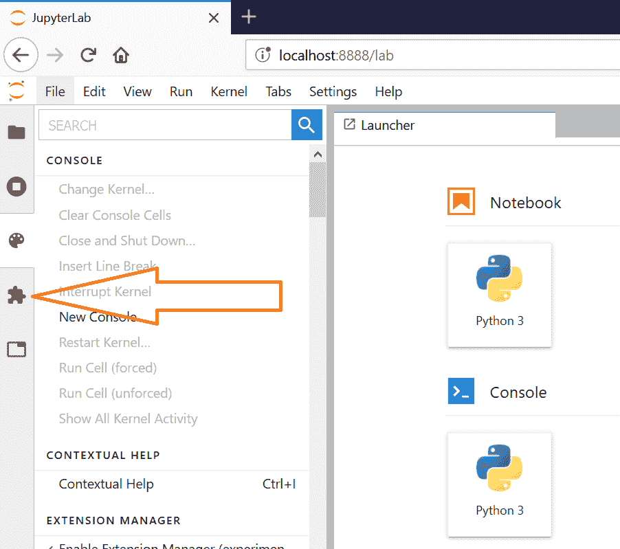
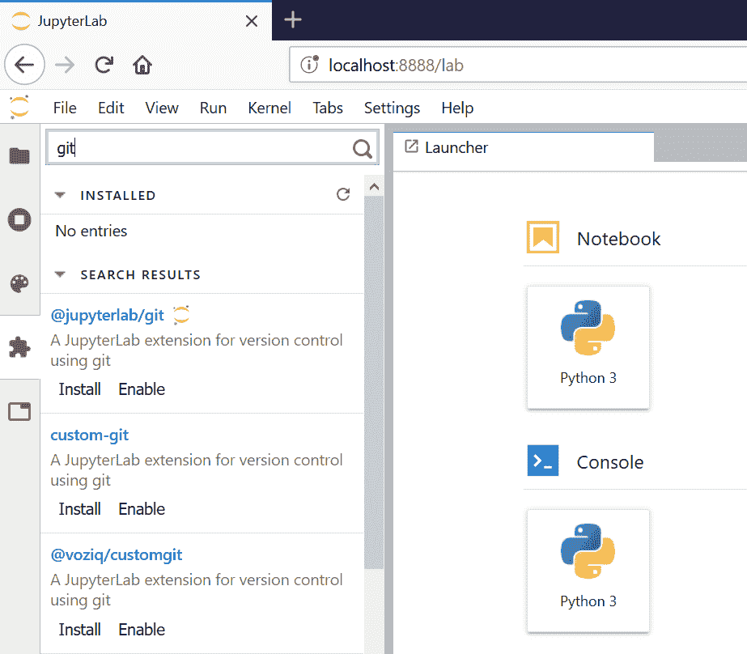
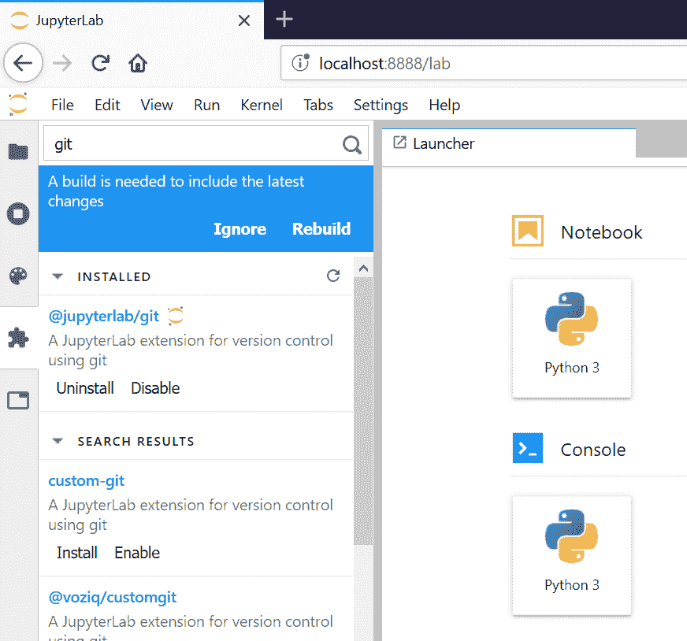
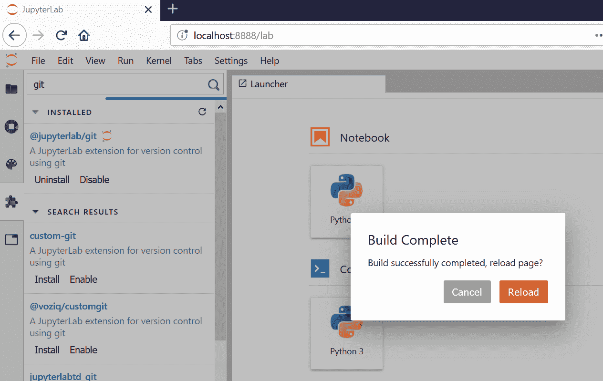
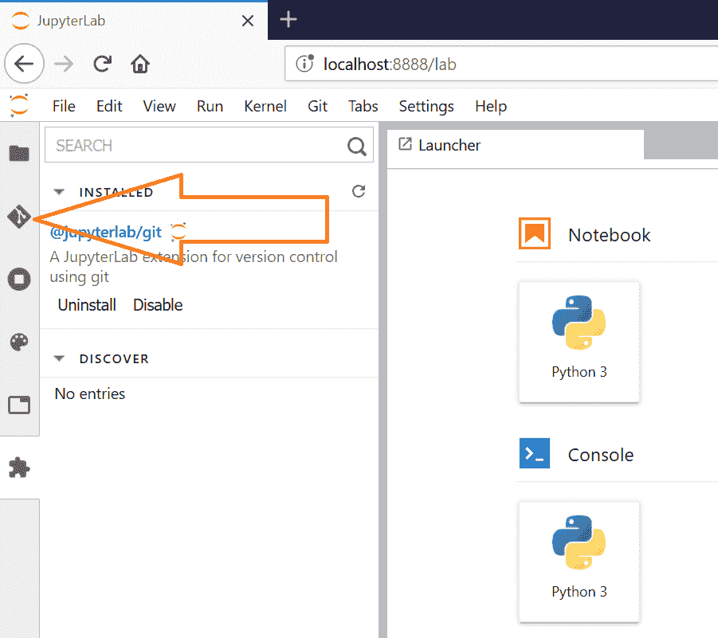

# 在 jupyter 实验室安装扩展

> 原文：<https://medium.com/analytics-vidhya/install-extensions-on-jupyter-lab-3c961a433812?source=collection_archive---------9----------------------->


您可以单独或一起使用 anaconda、spyder、IDLE、sublime、Python、R。

像我一样，几年前，当我开始时，我从头开始使用一切，基本上是使用 Python 控制台。

过了一段时间，你开始发现很多好东西，帮助你完成日常的开发任务，其中之一就是 Jupyter 扩展。

所以，现在你已经安装了 Jupyter 实验室，我们可以开始使用一些有趣的扩展。

由于 Jupyter 实验室扩展是 npm 包，我们需要在安装任何扩展之前安装 npm。

要开始这个过程，只需启动你在上一篇文章中安装的 WSL 版本。并运行此命令

```
(base) :~$ source activate myenv
(myenv) :~$ conda install -c conda-forge nodejs
Collecting package metadata (current_repodata.json): done
Solving environment: done ## Package Plan ##
 environment location: /home/j4c0b1/anaconda3/envs/myenv added / updated specs:
    - nodejs The following packages will be downloaded:
 package                    |            build
    ---------------------------|-----------------
    ca-certificates-2019.9.11  |       hecc5488_0         144 KB  conda-forge
    certifi-2019.9.11          |           py37_0         147 KB  conda-forge
    icu-64.2                   |       he1b5a44_1        12.6 MB  conda-forge
    libuv-1.32.0               |       h516909a_0         882 KB  conda-forge
    nodejs-12.11.1             |       h10a4023_0        14.1 MB  conda-forge
    openssl-1.1.1c             |       h516909a_0         2.1 MB  conda-forge
    ------------------------------------------------------------
                                           Total:        29.9 MB The following NEW packages will be INSTALLED:
 icu                conda-forge/linux-64::icu-64.2-he1b5a44_1
  libuv              conda-forge/linux-64::libuv-1.32.0-h516909a_0
  nodejs             conda-forge/linux-64::nodejs-12.11.1-h10a4023_0 The following packages will be UPDATED:
 ca-certificates    pkgs/main::ca-certificates-2019.8.28-0 --> conda-forge::ca-certificates-2019.9.11-hecc5488_0 The following packages will be SUPERSEDED by a higher-priority channel:
 certifi                                         pkgs/main --> conda-forge
  openssl              pkgs/main::openssl-1.1.1d-h7b6447c_2 --> conda-forge::openssl-1.1.1c-h516909a_0Proceed ([y]/n)? yDownloading and Extracting Packages
icu-64.2             | 12.6 MB   | #################################################################################################################################################################### | 100%
nodejs-12.11.1       | 14.1 MB   | #################################################################################################################################################################### | 100%
libuv-1.32.0         | 882 KB    | #################################################################################################################################################################### | 100%
openssl-1.1.1c       | 2.1 MB    | #################################################################################################################################################################### | 100%
certifi-2019.9.11    | 147 KB    | #################################################################################################################################################################### | 100%
ca-certificates-2019 | 144 KB    | #################################################################################################################################################################### | 100%
Preparing transaction: done
Verifying transaction: doneExecuting transaction: done(myenv) :~$
```

nodejs 和依赖项现在已经安装好了，我们可以开始 Jupyter 实验室了

```
(myenv) :~$ jupyter-lab
[I 12:45:33.473 LabApp] JupyterLab extension loaded from /home/j4c0b1/anaconda3/envs/myenv/lib/python3.7/site-packages/jupyterlab
[I 12:45:33.474 LabApp] JupyterLab application directory is /home/j4c0b1/anaconda3/envs/myenv/share/jupyter/lab
[I 12:45:33.478 LabApp] Serving notebooks from local directory: /home/j4c0b1
[I 12:45:33.479 LabApp] The Jupyter Notebook is running at:
[I 12:45:33.480 LabApp] [http://localhost:8888/?token=b4b772d1fcae0d7b14a8471ce4932dc983fda29d0002582f](http://localhost:8888/?token=b4b772d1fcae0d7b14a8471ce4932dc983fda29d0002582f)
[I 12:45:33.480 LabApp]  or [http://127.0.0.1:8888/?token=b4b772d1fcae0d7b14a8471ce4932dc983fda29d0002582f](http://127.0.0.1:8888/?token=b4b772d1fcae0d7b14a8471ce4932dc983fda29d0002582f)
[I 12:45:33.481 LabApp] Use Control-C to stop this server and shut down all kernels (twice to skip confirmation).
[W 12:45:33.503 LabApp] No web browser found: could not locate runnable browser.
[C 12:45:33.503 LabApp]
 To access the notebook, open this file in a browser:
        file:///home/j4c0b1/.local/share/jupyter/runtime/nbserver-3047-open.html
    Or copy and paste one of these URLs:
        [http://localhost:8888/?token=b4b772d1fcae0d7b14a8471ce4932dc983fda29d0002582f](http://localhost:8888/?token=b4b772d1fcae0d7b14a8471ce4932dc983fda29d0002582f)or [http://127.0.0.1:8888/?](http://127.0.0.1:8888/?)
token=b4b772d1fcae0d7b14a8471ce4932dc983fda29d0002582f
```



现在我们需要激活扩展管理器。



启用后，你会在左边看到一个类似这样的拼图



它已安装、启用并准备好获取新的扩展。

只需搜索您需要的扩展，比如 Git，选择并点击 install



在你点击安装之后，你应该被要求重建。这可能需要一些时间，具体取决于您的系统配置。



重建过程完成后，您应该单击 Reload，您将在左侧菜单中看到该扩展的新选项卡



您可以找到您需要的每个扩展并重复这个过程。

希望有帮助。

> 本文是文章 [*Anaconda，Jupyter，Python，Windows 和 linux…的续篇。*](https://link.medium.com/lHpCQ5dKD0)