# 在 macOS 上安装 Haskell

> 原文：<https://medium.com/analytics-vidhya/install-haskell-on-macos-e5677ab620b5?source=collection_archive---------0----------------------->


## 在我的 macOS High Sierra 上循序渐进

你无法抗拒名为 Haskell 的函数式编程语言的魅力。

macOS Catalina 11.0.1 上 GHC 8.10.1 版的 YouTube 视频

macOS Big Sur 11.0.1 上 GHC 8.10.1 版的 YouTube 视频

享受哈斯克尔的美丽

今天，我将尝试在我的一台 macOS 电脑上安装 Haskell 旧的 High Sierra。请注意，您必须是注册的 Apple 开发人员才能安装命令行工具。

这是我 10 岁的 macOS 高塞拉:

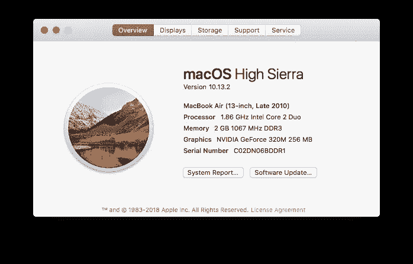

确保我没有 GHCi 和自制软件:

```
an-macair:~ donaldsheng$ ghci
-bash: ghci: command not found
an-macair:~ donaldsheng$
an-macair:~ donaldsheng$ brew install ghc
-bash: brew: command not found
```

首先安装自制软件:

```
ruby -e "$(curl -fsSL [https://raw.githubusercontent.com/Homebrew/install/master/install](https://raw.githubusercontent.com/Homebrew/install/master/install))"
```

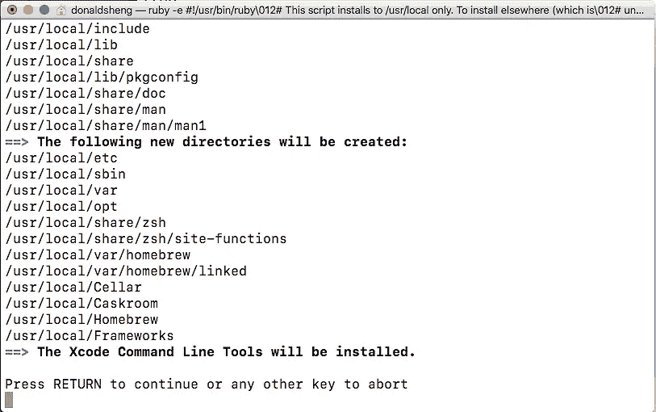

我确实按了回车键。

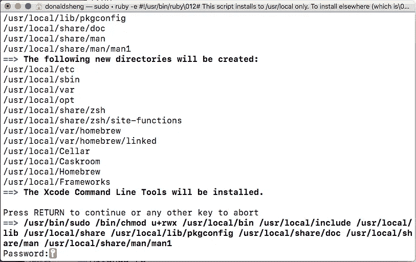

输入登录密码并按下回车键。

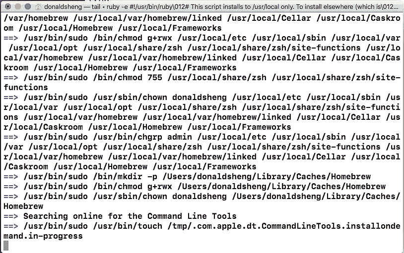

在上面的“命令行工具”上花了大约 20 分钟。


我还点击了安装按钮。


是的，我不得不同意。


然后……失败了。:-(

```
Timed out while loading data from the Apple Software Update server.
==> Installing the Command Line Tools (expect a GUI popup):
==> /usr/bin/sudo /usr/bin/xcode-select --install
Password:
xcode-select: note: install requested for command line developer tools
Press any key when the installation has completed.
```

原因可能是我要用另一种方式为这台老 macOS 安装 CommandLineTools。

```
==> /usr/bin/sudo /usr/bin/xcode-select --switch /Library/Developer/CommandLineTools
Password:
xcode-select: error: invalid developer directory '/Library/Developer/CommandLineTools'
Failed during: /usr/bin/sudo /usr/bin/xcode-select --switch /Library/Developer/CommandLineTools
```

这是正确的方法—转到

https://developer.apple.com/download/more

作为 Apple 开发人员登录。

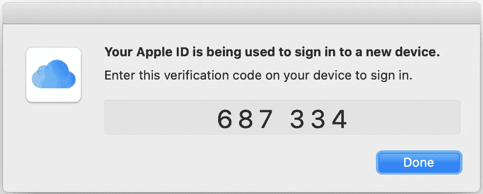

按照屏幕上的说明信任浏览器。我的 macOS 版本是 10.13 所以我搜索了“命令行工具(macOS 10.13)”。

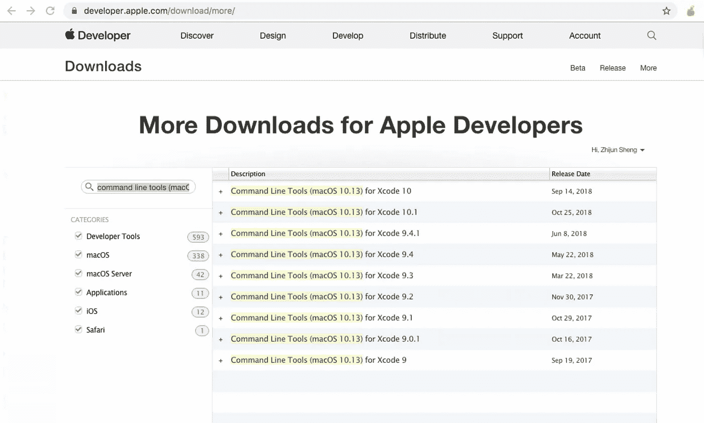

双击最高 Xcode 版本 10.1。

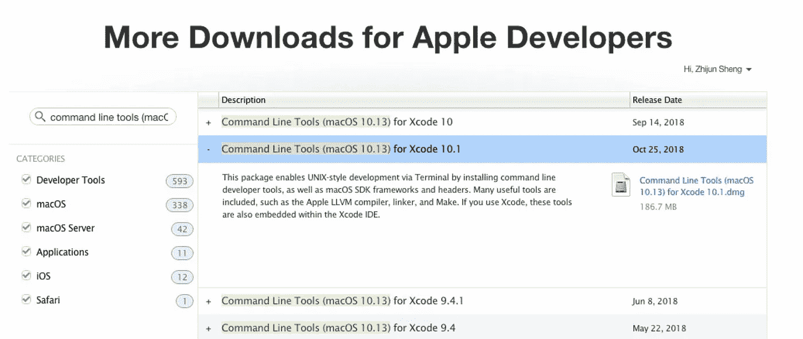

下载 dmg 文件。


在 Finder 中显示它。

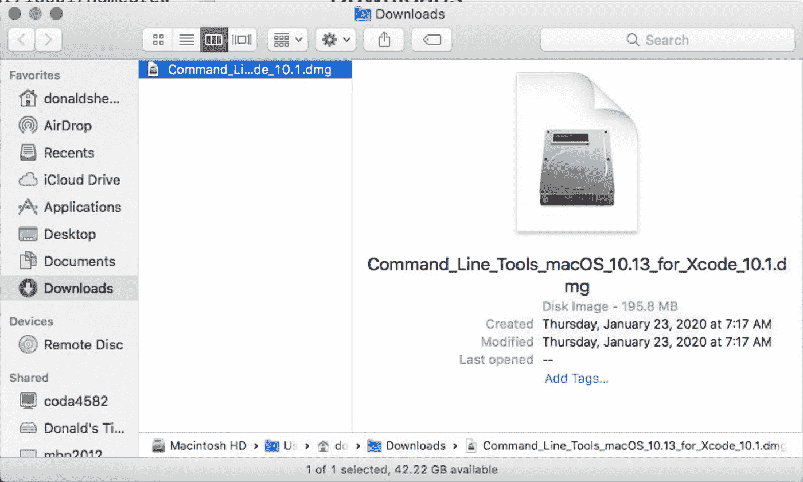

双击下载的 dmg 文件。

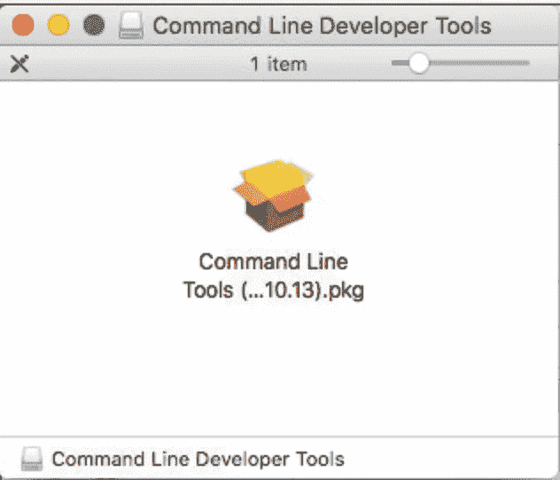

双击该框开始安装。

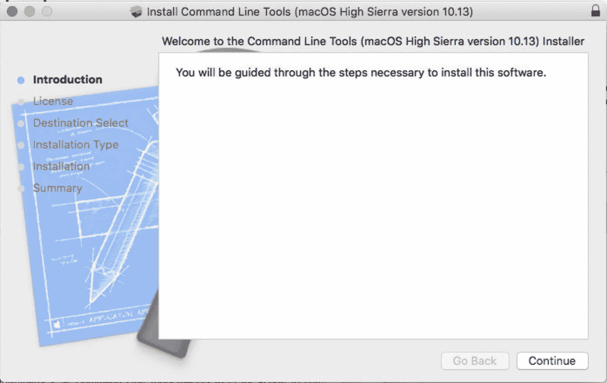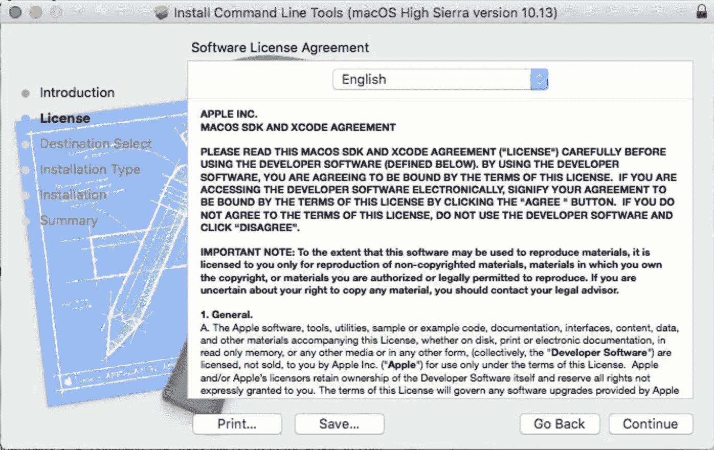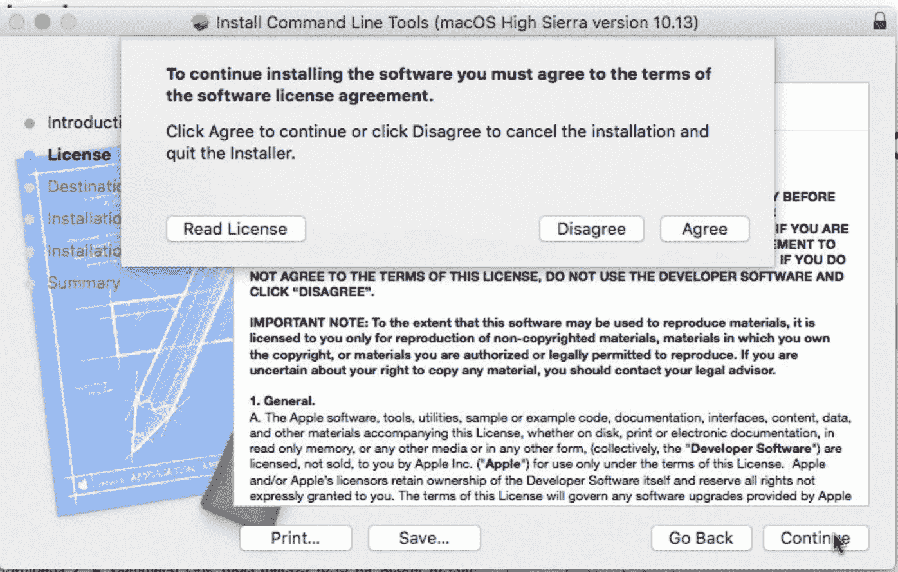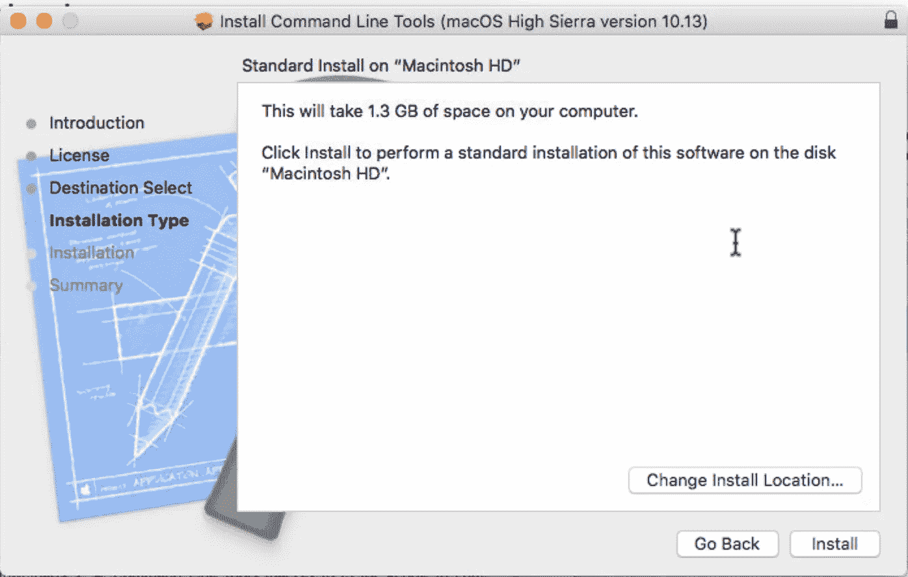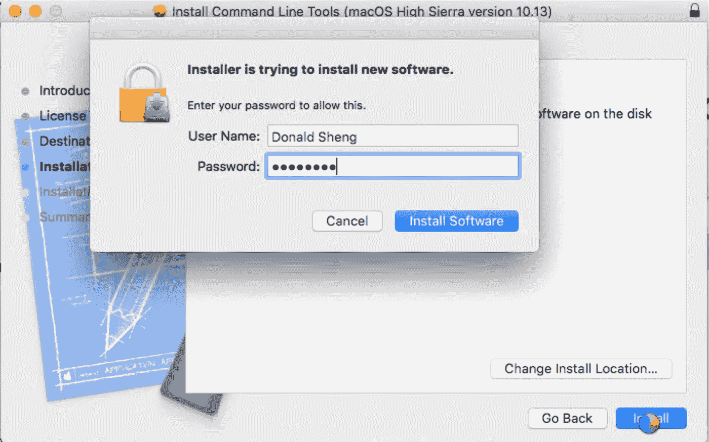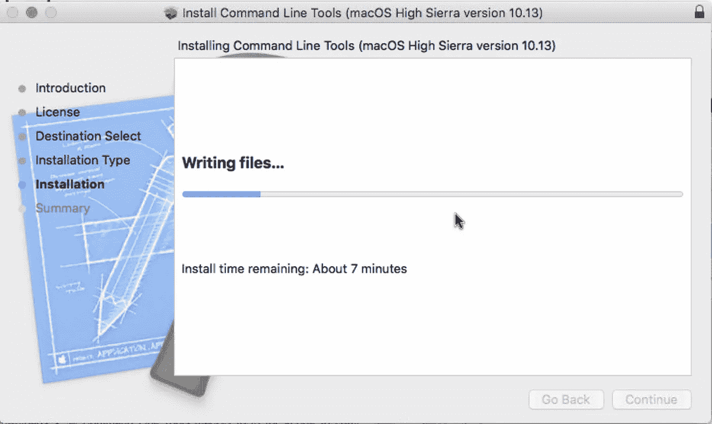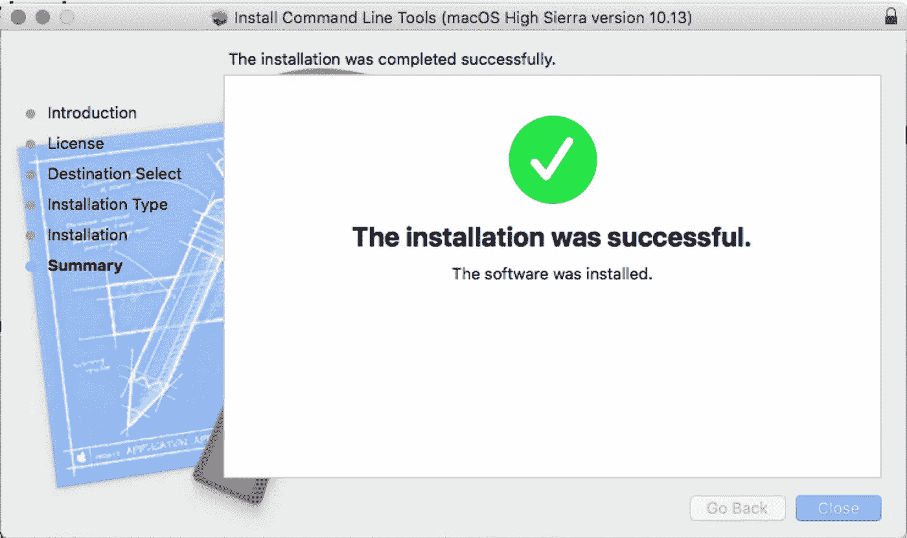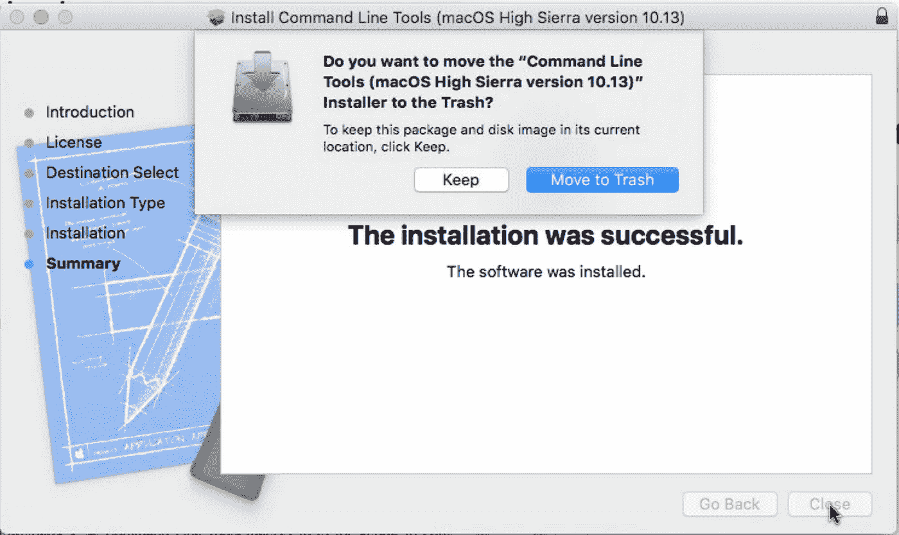

没有必要保存安装文件。所以我简单地点击了“移至垃圾箱”。

最后，我可以重新运行以下命令来安装家酿。

```
an-macair:~ donaldsheng$ ruby -e "$(curl -fsSL [https://raw.githubusercontent.com/Homebrew/install/master/install](https://raw.githubusercontent.com/Homebrew/install/master/install))"
```

这一次它非常有效。

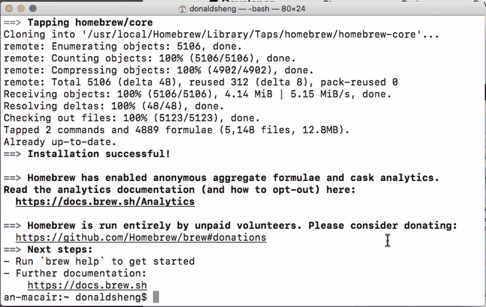

有了家酿，安装 Haskell 很容易。

```
an-macair:~ donaldsheng$ brew install ghc
==> Downloading [https://homebrew.bintray.com/bottles/ghc-8.8.2.high_sierra.bottl](https://homebrew.bintray.com/bottles/ghc-8.8.2.high_sierra.bottl)
==> Downloading from [https://akamai.bintray.com/33/3361eba5ff14c5ee50a90ee1090c0](https://akamai.bintray.com/33/3361eba5ff14c5ee50a90ee1090c0)
############################################################# 100.0%
==> Pouring ghc-8.8.2.high_sierra.bottle.tar.gz
==> /usr/local/Cellar/ghc/8.8.2/bin/ghc-pkg recache
🍺  /usr/local/Cellar/ghc/8.8.2: 6,731 files, 1.5GB
```

确保 Haskell 正常工作:

```
an-macair:~ donaldsheng$ ghci
GHCi, version 8.8.2: [https://www.haskell.org/ghc/](https://www.haskell.org/ghc/)  :? for help
Prelude> pi
3.141592653589793
Prelude> exp 1
2.718281828459045
Prelude> :q
Leaving GHCi.
an-macair:~ donaldsheng$
```

而如果你和我一样热爱数字，可以用 cabal 安装 Haskell 包“数字”。先装 cabal 吧。

```
an-macair:~ donaldsheng$ brew install cabal-install
==> Downloading [https://homebrew.bintray.com/bottles/cabal-install-3.0.0.0_1.hig](https://homebrew.bintray.com/bottles/cabal-install-3.0.0.0_1.hig)
==> Downloading from [https://akamai.bintray.com/72/72616fee2252d33d00e79ecd1778f](https://akamai.bintray.com/72/72616fee2252d33d00e79ecd1778f)
######################################################################## 100.0%
==> Pouring cabal-install-3.0.0.0_1.high_sierra.bottle.tar.gz
==> Caveats
Bash completion has been installed to:
  /usr/local/etc/bash_completion.d
==> Summary
🍺  /usr/local/Cellar/cabal-install/3.0.0.0_1: 7 files, 27.5MB
an-macair:~ donaldsheng$
```

运行`cabal update`从 hackage.haskell.org 下载最新的包列表。

```
an-macair:~ donaldsheng$ cabal update
Downloading the latest package list from hackage.haskell.org
```

假装安装带有 `—-dry`选项的号码:

```
an-macair:~ donaldsheng$ cabal install --dry numbers
Resolving dependencies...
Build profile: -w ghc-8.8.2 -O1
In order, the following would be built (use -v for more details):
 - numbers-3000.2.0.2 (lib) (requires download & build)
```

实际安装号码:

```
an-macair:~ donaldsheng$ cabal install numbers
Resolving dependencies...
Build profile: -w ghc-8.8.2 -O1
In order, the following will be built (use -v for more details):
 - numbers-3000.2.0.2 (lib) (requires download & build)
Downloading  numbers-3000.2.0.2
Downloaded   numbers-3000.2.0.2
Starting     numbers-3000.2.0.2 (lib)
Building     numbers-3000.2.0.2 (lib)
Installing   numbers-3000.2.0.2 (lib)
Completed    numbers-3000.2.0.2 (lib)
Warning: You asked to install executables, but there are no executables in
target: numbers. Perhaps you want to use --lib to install libraries instead.
```

哎呀。好的，没问题——我们确实想安装库。

```
an-macair:~ donaldsheng$ cabal install --lib numbers
Resolving dependencies...
Up to date
```

用 CReal，我们可以显示 100 位数的𝜋.太有趣了！𝜋ℯ𝝀𝜁 😂

```
an-macair:~ donaldsheng$ ghci
GHCi, version 8.8.2: [https://www.haskell.org/ghc/](https://www.haskell.org/ghc/)  :? for help
Loaded package environment from /Users/donaldsheng/.ghc/x86_64-darwin-8.8.2/environments/default
Prelude> import Data.Number.CReal
Prelude Data.Number.CReal> pi :: CReal
3.1415926535897932384626433832795028841972
Prelude Data.Number.CReal> exp 1 :: CReal
2.7182818284590452353602874713526624977572
Prelude Data.Number.CReal> showCReal 100 pi
"3.141592653589793238462643383279502884197169399375105820974944592307816406286208998628034825342117068"
Prelude Data.Number.CReal> :q
Leaving GHCi.
an-macair:~ donaldsheng$
```