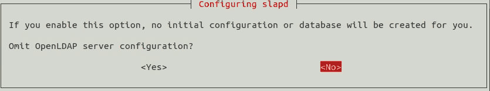
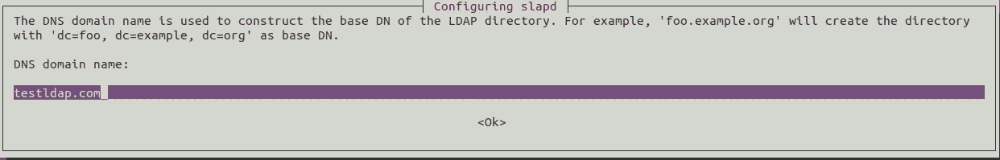
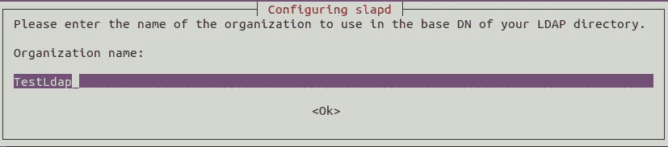
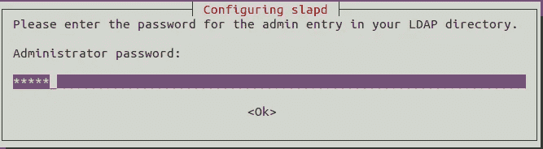
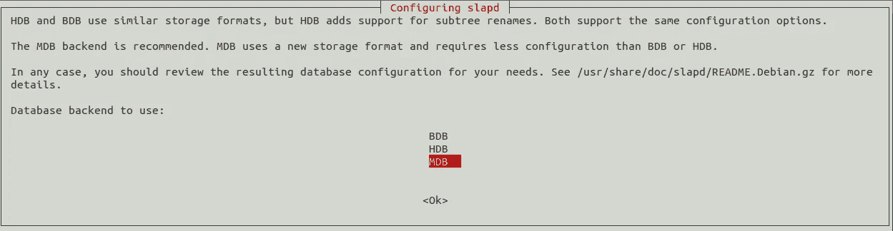
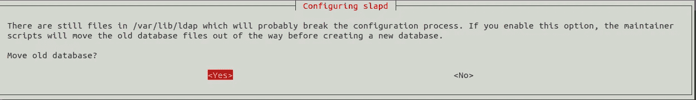
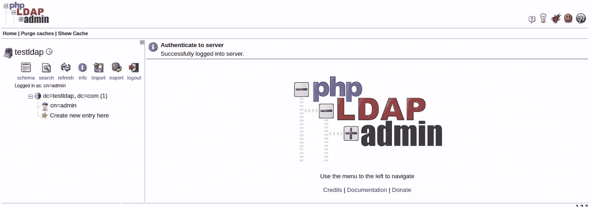

# 在 ubuntu 上用 phpLDAPAdmin 安装 OpenLDAP

> 原文：<https://medium.com/analytics-vidhya/install-openldap-with-phpldapadmin-on-ubuntu-9e56e57f741e?source=collection_archive---------1----------------------->

## 在 ubuntu 18.04 上安装 openLDAP

## 在 ubuntu 18.04 上使用 phpldapadmin UI 配置开放 ldap


迪伦·诺尔特在 [Unsplash](https://unsplash.com?utm_source=medium&utm_medium=referral) 上的照片

> OpenLDAP 是一个开源的快速目录服务器，为网络客户端提供目录服务。客户端应用程序使用**轻量级目录访问协议(LDAP)** 连接到 OpenLDAP 服务器，以访问存储在该服务器上的组织信息。如果有适当的访问权限，客户端可以搜索目录，修改和操作目录中的记录

**注:这篇文章也发表在我的个人博客上。(**[**https://dineshkumarkb . com/tech/install-OpenLDAP-with-phpldapadmin-on-Ubuntu/**](https://dineshkumarkb.com/tech/install-openldap-with-phpldapadmin-on-ubuntu/)**)**

## 步骤 1 —安装 slapd —独立 LDAP 守护程序

```
$sudo apt-get update
$sudo apt-get install slapd ldap-utils
```

在安装过程中，系统会提示您输入管理员密码。请输入一个并记住相同的内容。然后 slapd 会自动安装。

## 步骤 2 —验证 slapd 状态

```
systemctl status slapd
```

## 步骤 3 —安装后配置 openLDAP 服务器

```
sudo dpkg-reconfigure slapd
```

会提示一系列问题。请选择下面提供的选项

1.省略 openLDAP 配置？**否**



2.DNS 域名。输入域名。该域名将用于为您的 openLDAP 服务器创建根 dn(可分辨名称)。例如 testldap.com。您的 dn 将是 dc=testldap，dc=com。



3.组织名称:输入您的组织名称



4.管理员密码。设置与第 1 步相同的管理员密码。



5.数据库:BDB 已被否决。MDB 的读/写能力相对更快。所以我们选择 MDB



6.是否要在清除期间删除数据库？**否**


7.移动旧数据库？**是**



现在，您的 openLDAP 已经配置好，可以使用了。

```
Output:Backing up /etc/ldap/slapd.d in /var/backups/slapd-2.4.45+dfsg-1ubuntu1.5... done.
  Moving old database directory to /var/backups:
  - directory unknown... done.
  Creating initial configuration... done.
  Creating LDAP directory... done.
```

## 步骤 4 —配置 LDAP 客户端

```
sudo nano /etc/ldap/ldap.conf
```

指定我们配置的 openLDAP 服务器的基本 dn 和 URI

```
BASE     dc=testldap,dc=com
URI      ldap://localhost
```

## 步骤 5 —测试服务器

```
ldapsearch -x
```

输出:

```
ldapsearch -x
# extended LDIF
#
# LDAPv3
# base <dc=testldap,dc=com> (default) with scope subtree
# filter: (objectclass=*)
# requesting: ALL
## testldap.com
dn: dc=testldap,dc=com
objectClass: top
objectClass: dcObject
objectClass: organization
o: TestLdap
dc: testldap# admin, testldap.com
dn: cn=admin,dc=testldap,dc=com
objectClass: simpleSecurityObject
objectClass: organizationalRole
cn: admin
description: LDAP administrator# search result
search: 2
result: 0 Success# numResponses: 12
# numEntries: 11
```

## 步骤 6 —安装 phpldapadmin

```
sudo apt install phpldapadmin
```

## 配置 phpldapadmin

```
sudo nano /etc/phpldapadmin/config.php
```

## 相应地设置您的时区。

```
#  $config->custom->appearance['timezone'] = 'Asia/Kolkata';
```

## 设置服务器名称，提供您的 ip 地址，并将隐藏模板警告设置为真。

```
$servers->setValue('server','name','TestLdap LDAP Server');
$servers->setValue('server','host','192.168.1.3');
$config->custom->appearance['hide_template_warning'] = true;
```

默认情况下，启用匿名登录。要禁用它，您需要删除注释字符(两个斜杠)并将 true 改为 false。保存并关闭文件。

```
$servers->setValue('login','anon_bind',false);
```

## 登录到您的 phpldapadmin UI。Ex 192.168.1.3:389



参考资料:

[https://www.openldap.org/](https://www.openldap.org/)