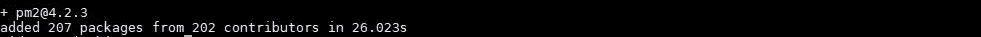

# 在 Linux 中安装 PM2 并运行您的应用程序

> 原文：<https://medium.com/analytics-vidhya/install-pm2-and-run-for-your-application-370962cc07d2?source=collection_archive---------21----------------------->

PM2 或进程管理器 2，是一个开源的生产 [Node.js](https://en.wikipedia.org/wiki/Node.js) 进程管理器，帮助开发人员和开发者在生产环境中管理 Node.js 应用程序。与 Supervisord、Forever、 [Systemd](https://en.wikipedia.org/wiki/Systemd) 等其他进程管理器相比，PM2 的一些关键特性是自动应用程序负载平衡、自动启动应用程序、声明式应用程序配置、部署系统和监控。

按照步骤在您的系统中安装并运行 PM2

1.  安装 PM2—**须藤 NPM I-g PM2**

正在安装 PM2

PM2 安装

2.转到包含应用程序的 server.js 文件的项目文件夹

3.启动服务器— ***pm2 启动 server.js***

PM2 开始了

3.生成启动脚本: **PM2 启动**

要设置启动脚本，请将下面显示的路径复制粘贴到您的系统中

*启动脚本将有助于在每次重启系统时自动启动应用程序。不会有任何人工干预。*

4.保存您的启动脚本— **PM2 保存**

*它将在服务器重启时冻结您的进程列表。现在每次重启服务器，都不需要反复启动节点应用。它将自动启动*

我们可以同时运行多个应用程序。开始和停止其中的任何一个。下面是一些这样做的命令。

1.  **PM2 列表**:将列出所有正在运行的应用程序，它们的 CPU 使用率、ID、名称、状态(运行或停止)
2.  **PM2 取消启动:**将禁用特定应用程序的启动脚本。
3.  **PM2 停止< id > :** 将停止指定 id 的应用程序。我们也可以一次停止所有的应用程序。
4.  **PM2 全部删除:**将停止所有的应用程序并删除启动脚本