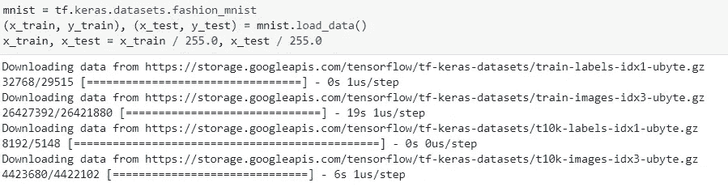
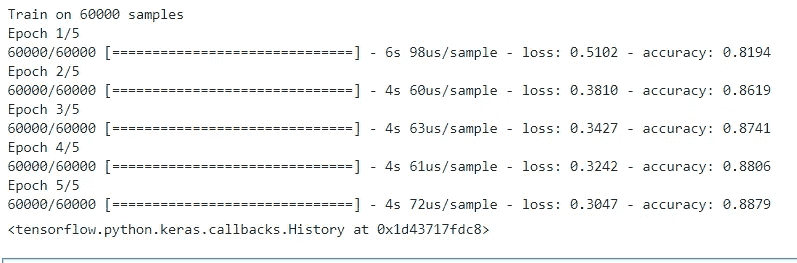
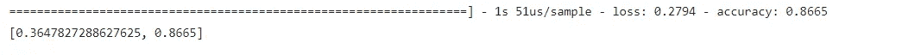
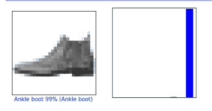
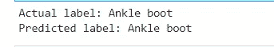

# 在 Anaconda for Windows 10 和 Ubuntu 上安装 TensorFlow 2.0 以及所有软件包

> 原文：<https://medium.com/analytics-vidhya/install-tensorflow-2-0-along-with-all-packages-on-anaconda-for-windows-10-and-ubuntu-86a89ba51983?source=collection_archive---------0----------------------->


Anaconda 使安装 TensorFlow 变得很容易，支持您的数据科学、机器学习和人工智能工作流。

但是，在创建一个新环境来安装 TensorFlow 之后，开始逐个安装所有包是令人沮丧的。在这里，我们将学习如何安装 TensorFlow，并通过将已预安装的软件包克隆到新的 TensorFlow 环境中来利用它们。

我们还将建立张量流，并用 TF 2.0 实现 MNIST 分类……言归正传。

TensorFlow 2.0 专注于简单易用，包括以下更新:

*   使用 Keras 和热切的执行轻松构建模型。
*   在任何平台上的生产中实现强大的模型部署。
*   强大的研究实验。
*   通过清理废弃的 API 和减少重复来简化 API。

TF 2.0 集成了 Keras API。当您安装 TensorFlow Kears 时，它会自动提供。Keras 是一个极其流行的高级 API，用于构建和训练深度学习模型。

注意:如果你是 TensorFlow 的新手，不要担心 TF1.x，只需从 TF2.0 开始，查看 TensorFlow 网站[即可开始。](https://www.tensorflow.org/)

让我们开始安装和设置 TensorFlow 2.0…

# Python 3.6+到 Anaconda

Anaconda with Jupyter 提供了一种更简单的方法来安装和使用 Python。

安装 Anaconda 相对简单。

**1。**下载 Anaconda——点击此[链接](https://www.anaconda.com/distribution/)下载 Anaconda。

类似于`pip`，对于 Anaconda，我们有`conda`来创建虚拟环境和安装包。

安装 Anaconda 后—打开 Anaconda 提示符—

**2。**我们可以直接创建一个包含 TF2 的环境，因为 Anaconda 支持 Tensorflow 2.0.0

Anaconda 附带了一个根环境，名为 base。我们将从中克隆一个新的环境。(基础环境中安装的所有软件包现在都将出现在新环境中)。

> `conda create -n **your-env-name** --clone base`

根据您在基础环境中安装的软件包的数量或大小，完成克隆可能需要一些时间。

克隆完成后，

**3。**激活您的环境

> `conda activate **your-env-name**`

要确认所有软件包都已成功克隆，请运行以下命令

> `conda list -n **your-env-name**`

在开始 TensorFlow 安装之前，我们将更新`pip`

> `pip install --upgrade pip`

**4。**安装张量流 2.0

> `pip install --upgrade tensorflow`

**5。**测试安装

```
python -c “import tensorflow as tf; x = [[2.]]; print(‘Tensorflow Version ’, tf.__version__); print(‘hello TF world, {}’.format(tf.matmul(x, x)))"
```

输出将是(忽略系统消息)，

> Tensorflow 版本 2.0.0
> 
> 你好 TF 世界，[[4。]]

# TensorFlow 2.0 示例:基本分类:对服装图像进行分类

我们将训练一个神经网络模型来对服装图像进行分类，比如运动鞋和衬衫。

本指南使用了 [tf.keras](https://www.tensorflow.org/guide/keras) ，这是一个在 TensorFlow 中构建和训练模型的高级 API。

```
import matplotlib.pyplot as pltimport tensorflow as tflayers = tf.keras.layersimport numpy as npprint(tf.__version__)
```

从`tf`开放数据集中下载 **fashion_mnist** 数据并进行预处理。



为了查看数据，我们将从中绘制几个例子。

```
class_names = ['T-shirt/top', 'Trouser', 'Pullover', 'Dress', 'Coat', 'Sandal', 'Shirt', 'Sneaker', 'Bag', 'Ankle boot']plt.figure(figsize=(10,10))**for** i **in** range(25):
 plt.subplot(5,5,i+1)
 plt.xticks([])
 plt.yticks([])
 plt.grid(**False**)
 plt.imshow(x_train[i], cmap=plt.cm.binary)
 plt.xlabel(class_names[y_train[i]])plt.show()
```


现在接下来要做的是，我们将逐层建立模型**。**

```
model = tf.keras.Sequential()
model.add(layers.Flatten())
model.add(layers.Dense(64, activation='relu'))
model.add(layers.Dense(64, activation='relu'))
model.add(layers.Dense(10, activation='softmax'))model.compile(optimizer='adam',
 loss='sparse_categorical_crossentropy',
 metrics=['accuracy'])model.fit(x_train, y_train, epochs=5)
```

****

**注意:我们只训练了五个时期，因为这个模型只是为了演示。**

**现在让我们在测试数据上测试模型的准确性**

****

**让我们想象一下其中一个预测。**

```
def plot_image(i, predictions_array, true_label, img):
  predictions_array, true_label, img = predictions_array[i], true_label[i], img[i]
  plt.grid(False)
  plt.xticks([])
  plt.yticks([])
  plt.imshow(img, cmap=plt.cm.binary) predicted_label = np.argmax(predictions_array)
  if predicted_label == true_label:
    color = ‘blue’
  else:
    color = ‘red’ plt.xlabel(“{} {:2.0f}% ({})”.format(class_names[predicted_label],
 100*np.max(predictions_array),
 class_names[true_label]),
 color=color)def plot_value_array(i, predictions_array, true_label):
 predictions_array, true_label = predictions_array[i], true_label[i]
 plt.grid(False)
 plt.xticks([])
 plt.yticks([])
 thisplot = plt.bar(range(10), predictions_array, color=”#777777")
 plt.ylim([0, 1])
 predicted_label = np.argmax(predictions_array)
 thisplot[predicted_label].set_color(‘red’)
 thisplot[true_label].set_color(‘blue’)
 predictions = model.predict(x_test)i = 0
plt.figure(figsize=(6,3))
plt.subplot(1,2,1)
plot_image(i, predictions, y_test, x_test)
plt.subplot(1,2,2)
plot_value_array(i, predictions, y_test)
plt.show()
```

****

**如上图所示，“踝靴”的预测概率最高。为了进一步确认，让我们将预测的标签打印为，**

```
predicted_label = class_names[np.argmax(predictions[0])]
print(‘Actual label:’, class_names[y_test[0]]) 
print(‘Predicted label:’, predicted_label)
```

****

**在 TensorFlow 2.0 上有 MNIST 例子的 GitHub 库在这里是。**

# **结论**

*   **我们能够安装 TensorFlow 2.0 以及所有软件包。**
*   **我们还使用 TF 2.0 完成了一个真实的 MNIST 数据分类示例。**

# **参考**

1.  **[tensor flow 2.0 中的新功能](/tensorflow/whats-coming-in-tensorflow-2-0-d3663832e9b8)**
2.  **[训练你的第一个神经网络:基本分类](https://www.tensorflow.org/tutorials/keras/basic_classification)**