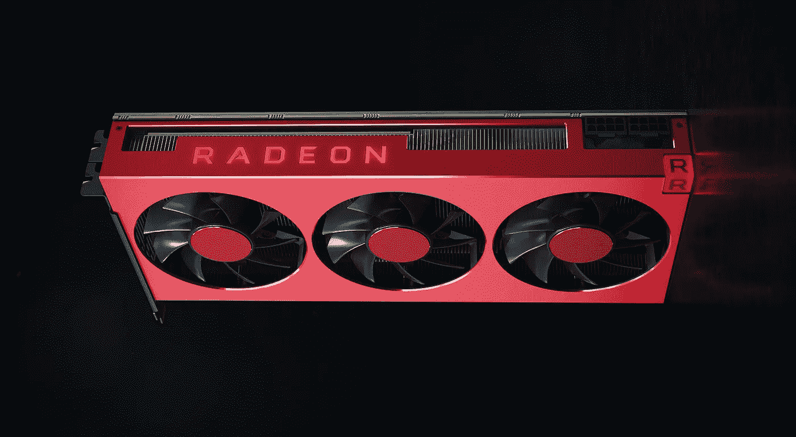

# 为 AMD GPUs 安装 Tensorflow 2 & PyTorch

> 原文：<https://medium.com/analytics-vidhya/install-tensorflow-2-for-amd-gpus-87e8d7aeb812?source=collection_archive---------1----------------------->

AMD 发布了 ROCm，这是一个在 AMD GPUs 上运行 Tensorflow 和 PyTorch 的深度学习驱动程序。因此，我在下面提供了用于 AMD GPUs 的 Tensorflow 和 PyTorch 的安装说明。

在这篇文章中，我指导你从 Ubuntu 上的 Debian repository 安装了 **ROCm (AMD GPU 驱动)**和 **Tensorflow ROCm(兼容 AMD 硬件的版本)**。在这篇文章发表的时候，ROCm 只运行在…