# 在 Windows 10 中安装 TensorFlow-GPU + CUDA，简单易懂。

> 原文：<https://medium.com/analytics-vidhya/install-tensorflow-gpu-cuda-in-windows-10-with-easy-to-follow-instructions-614d79782d26?source=collection_archive---------3----------------------->

安装 CUDA 和 TensorFlow-GPU 可能是一项非常具有挑战性的任务，在本文中，我将展示如何通过几个简单的步骤来安装它。

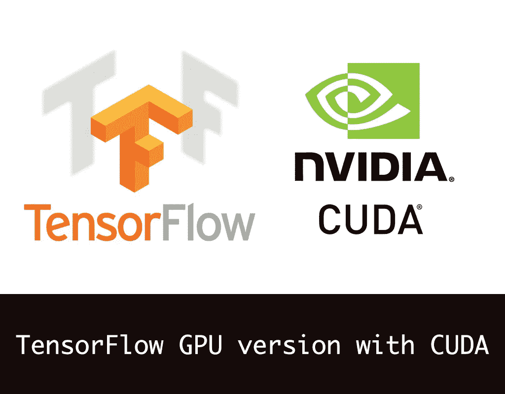

在开始安装之前，我们需要确保您的显卡支持 CUDA。如果不是，那么使用 **GOOGLE COLLAB** 会是一个很好的选择。检查你的显卡是否启用了 CUDA([**链接**](https://developer.nvidia.com/cuda-gpus) )，向下滚动点击**启用了 CUDA 的 Ge-force 和 Titan 产品**。从列表中搜索您的显卡。

如果您不知道您的显卡规格:

1.  转到桌面
2.  右键单击并选择 NVIDIA 控制面板
3.  单击帮助，并从下拉列表中选择系统信息
4.  在项目下，您可以查看您的显卡版本。

查看 TensorFlow 支持的 CUDA 最新版本。点击此[链接](https://www.tensorflow.org/install/gpu) **。**向下滚动至软件要求，查看最新支持的版本。

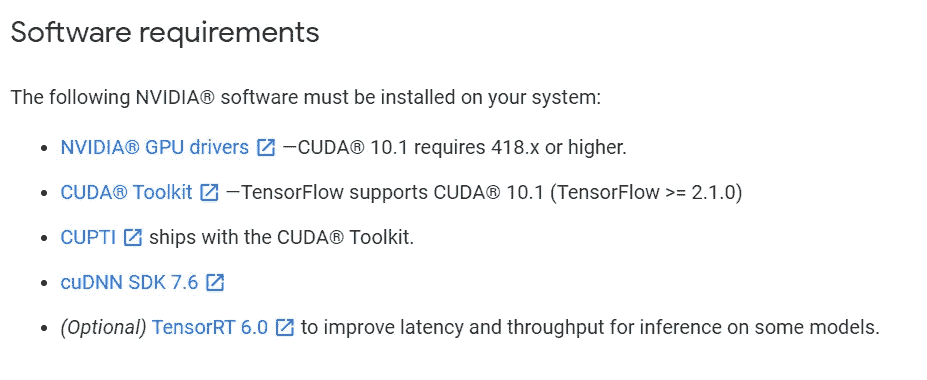

这里 CUDA 10.1 和 cuDNN SDK 7.6 是 TensorFlow 最新支持的版本，你可以暂时忽略其余的东西。

好了，现在我们知道我们必须安装什么了，我们首先需要清除系统中的任何 NVIDIA 程序。这意味着从我们的系统中删除所有 NVIDIA 的安装。

1.  转到**我的电脑/C 盘/程序文件**，删除所有名为 NVIDIA 的文件。

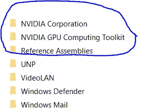

2.再次进入**我的电脑/C 盘/程序文件(x86)** 做同样的事情，删除所有名为 NVIDIA 的文件。

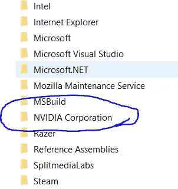

从系统中删除所有文件后，执行重新启动。

现在让我们下载所有需要的软件

1.  我们首先需要下载的是 **Visual Studio** ，因为它是 CUDA 安装的先决条件，没有它我们的安装将会失败。到这个 [**链接**](https://visualstudio.microsoft.com/downloads/) 下载最新的 Visual Studio 社区版。只需遵循默认安装设置，直到您到达第 4 步(选择工作负载)不要选择任何工作负载，只需单击安装。
2.  接下来我们需要下载 **CUDA 工具包(** [**链接**](https://developer.nvidia.com/cuda-toolkit-archive) **)** 。回忆一下 TensorFlow 软件需求中的 CUDA 工具包版本(在撰写本文时，最新支持的版本是 **10.1** ，但是如果 TensorFlow 网站上提到了任何新的支持版本，请继续选择它)。


选择您的操作系统(我选择了 Windows)


选择最新版本(我选择了 10 个)

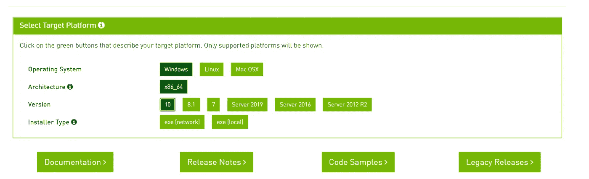

选择安装程序类型 exe(本地)

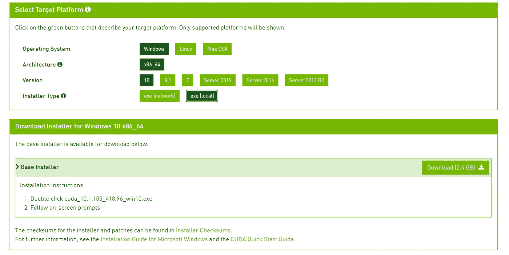

我的下载文件已经准备好了，它是一个 2.4 GB 的文件。我想花点时间说明一下，如果将来有适用于您的规范的补丁，请下载所有补丁，并在安装主工具包后以连续的方式安装它们。

3.安装 CUDA 工具包，并在安装过程中选择所有默认选项。

4.现在我们要从 NVIDIA 下载 **cuDNN zip 文件**([**链接**](https://developer.nvidia.com/cudnn) )。点击 cuDNN 下载。

5.在下载 zip 文件之前，您必须注册并登录 NVIDIA，还要完成一个小调查。

6.最后你会看到这一页。我们的 CUDA 工具包版本是 **10.1** ，因此我们将为 CUDA 10.1 下载 **SDK 版本(您必须下载与您的 CUDA 工具包相同的版本)。**

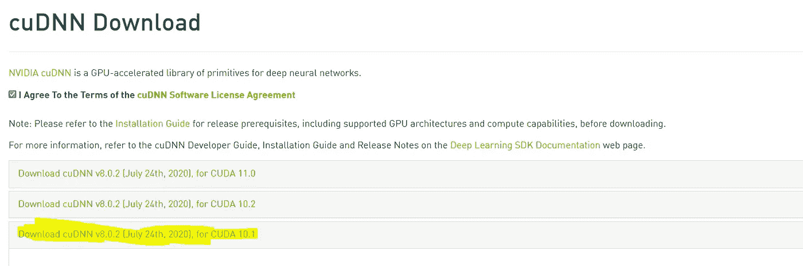

7.解压 zip 文件，你会看到里面有三个文件夹 **bin** ，**包括**和 **lib\x64**

8.转到位于**My Computer \ C Drive \ Program Files \ Nvidia GPU Computing Toolkit \ CUDA \ v 10.1**的 CUDA 工具包安装目录

9.你会在这个目录中找到 **bin** ，**包含**和 **lib\x64** 。我们所要做的就是将 dll 文件从 zip 文件目录复制到 CUDA 安装目录。

10.将 **cudnn64_7.dll** 从 Zip 文件复制到 CUDA 安装目录的 bin 文件中。

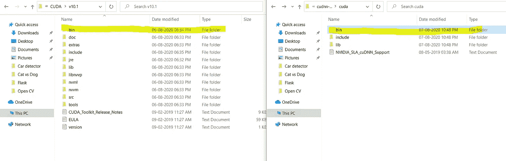

11.将 **cudnn.h** 从 zip 文件复制到 CUDA 安装目录 bin 文件。

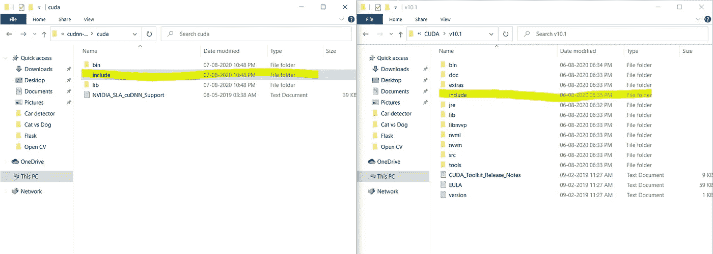

12.将 cudnn.lib 从 zip 文件(lib\x64)复制到 CUDA 安装目录(lib\x64)。

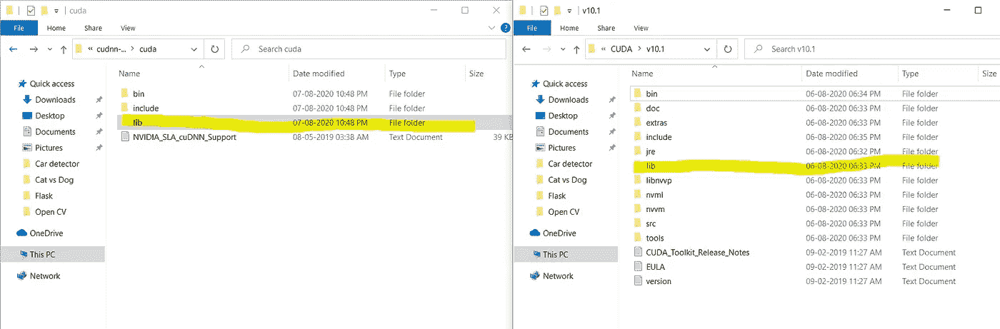

13.打开控制面板— ->系统— ->高级系统设置— ->环境变量

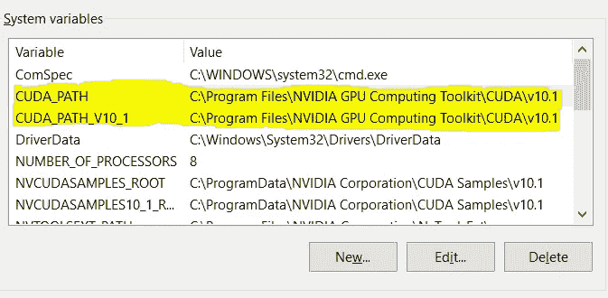

如果您在环境系统变量中看到这两个路径，那么 CUDA 已经成功安装在您的系统中。

1.  安装 Python( [链接链接](https://www.python.org/downloads/))
2.  安装 Pip( [**链接**](https://pip.pypa.io/en/stable/installing/) )

———点击 get-pip.py

———右击并选择另存为

———将文件保存在你的桌面上(移动到任何你喜欢的位置)

3.安装 Anaconda 社区包( [**链接**](https://www.anaconda.com/products/individual) )

现在我们已经安装了 CUDA、Python、Pip 和 Anaconda。我们的最后一步是下载并安装 **tensorflow-gpu** 。始终建议将 TensorFlow 安装在与基础环境不同的环境中。

1.  打开 Anaconda Navigator 并使用 Python 3.6 创建一个新环境

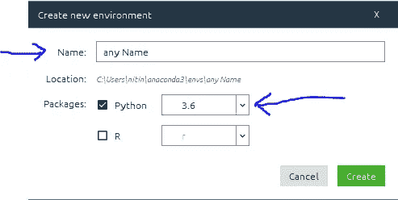

2.创建新环境后，打开 Anaconda 提示符，使用 **conda activate any_Name** 从基础环境切换到新环境

3.使用 pip 命令安装 TensorFlow GPU，`pip install --upgrade tensorflow-gpu`

4.检查 TensorFlow GPU 是否已成功安装在您的系统上。

```
# importing the tensorflow package
import tensorflow as tftf.test.is_built_with_cuda()tf.test.is_gpu_available(cuda_only=False, min_cuda_compute_capability=None)
```

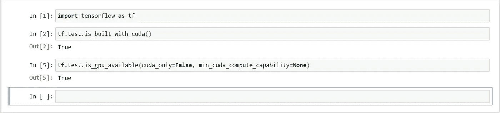

按照所有这些步骤，我们已经成功地在 Windows 10 系统上安装了 tensorflow-gpu 和 CUDA。我一直在我的项目中使用 TensorFlow GPU，并注意到与 CPU 相比，时间明显减少。然而，就结果而言，有一些场景中 CPU 的性能比 GPU 更好，我将在未来的故事中写更多关于这方面的内容。我试图保持这篇文章的简单，以便您在执行安装时可以很容易地理解。