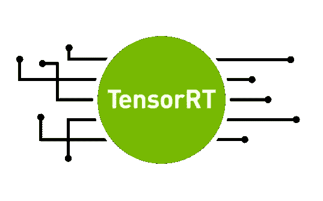

# yolo v3 tensort 安装指南

> 原文：<https://medium.com/analytics-vidhya/installation-guide-of-tensorrt-for-yolov3-58a89eb984f?source=collection_archive---------6----------------------->



**免责声明:**这是我使用 TensorRT，将 yolov3 权重转换为 TensorRT 文件的体验。本文包括 TensorRT(5.0)某个版本的步骤和面临的错误，因此使用其他版本的过程可能会有所不同。

既然您在这里，我希望可以安全地假设您已经使用 Yolov3 构建了一个很棒的对象检测模型，并希望将其投入生产。

现在，您希望让您的模型更好地用于推理——也许尝试减少延迟并增加吞吐量。如果您使用嵌入式计算板，例如 Nvidia Jetson 板，这一步就变得至关重要。

NVIDIA TensorRT 是一个很好的选择。从他们的[网站](https://developer.nvidia.com/tensorrt)，

> NVIDIA TensorRT 是一个高性能深度学习推理平台。它包括一个深度学习推理优化器和运行时，为深度学习推理应用程序提供低延迟和高吞吐量。在推理过程中，基于 TensorRT 的应用程序的执行速度比纯 CPU 平台快 40 倍。

许多描述 TensorRT 及其优点的文章已经存在，所以我想在这里分享安装和程序，因为我花了很多时间才弄明白，所以我希望这篇文章可以帮助别人。

这些是我的系统的规格:

*   GPU: GTX 1080
*   TensorRT 版本:5.0
*   CUDA: 9.0
*   Ubuntu 16.04

让我们开始吧。

我们的目标是将 *yolov3.weights* 转换为 *yolov3.trt* 。我们将通过将其分解为以下内容来实现:

> yolov 3 . weights-> yolo . onnx-> yolov 3 . TRT

因此，我们的步骤将遵循相同的流程:

*   TensorRT 装置
*   Yolov3 至 Onnx 转换
*   onnx-tensorrt 安装和转换

# **tensort 安装**

1.  从这个[链接](https://developer.nvidia.com/nvidia-tensorrt-5x-download)下载 TensorRT tar 文件版本 5.0.2.6。您需要成为 NVIDIA 开发者计划的成员。登录后，同意他们的条款并在 **TensorRT 5.0 GA** 中选择合适版本的 tar 包。
2.  遵循此 [pdf](https://developer.download.nvidia.com/compute/machine-learning/tensorrt/docs/5.0/GA_5.0.2.6/TensorRT-Installation-Guide.pdf) 中的 tar 文件说明。
3.  **重要**:提供该命令中*tensort-5 . 0 . 2 . 6*的绝对路径

```
$export LD_LIBRARY_PATH=$LD_LIBRARY_PATH:/home/path/to/folder/TensorRT-5.0.2.6/lib
```

4.安装后，转到*TensorRT-5 . 0 . 2 . 6/sample*并运行

```
$make -j8
```

5.上述命令将在 *TensorRT-5.0.2.6/bin* 文件夹中创建一些文件。

6.在命令下运行。

```
$./sample_mnist
```

7.您的输出应该如下所示:

```
[I] Building and running a GPU inference engine for MNIST
[I] Input:
@@@@@@@@@@@@@@@@@@@@@@@@@@@@
@@@@@@@@@@@@@@@@@@@@@@@@@@@@
@@@@@@@@@@@@@@@@@@@@@@@@@@@@
@@@@@@@@@@@@@@@@@@@@@@@@@@@@
@@@@@@@@#-:.-=@@@@@@@@@@@@@@
@@@@@%=     . *@@@@@@@@@@@@@
@@@@% .:+%%%  *@@@@@@@@@@@@@
@@@@+=#@@@@@# @@@@@@@@@@@@@@
@@@@@@@@@@@%  @@@@@@@@@@@@@@
@@@@@@@@@@@: *@@@@@@@@@@@@@@
@@@@@@@@@@- .@@@@@@@@@@@@@@@
@@@@@@@@@:  #@@@@@@@@@@@@@@@
@@@@@@@@:   +*%#@@@@@@@@@@@@
@@@@@@@%         :+*@@@@@@@@
@@@@@@@@#*+--.::     +@@@@@@
@@@@@@@@@@@@@@@@#=:.  +@@@@@
@@@@@@@@@@@@@@@@@@@@  .@@@@@
@@@@@@@@@@@@@@@@@@@@#. #@@@@
@@@@@@@@@@@@@@@@@@@@#  @@@@@
@@@@@@@@@%@@@@@@@@@@- +@@@@@
@@@@@@@@#-@@@@@@@@*. =@@@@@@
@@@@@@@@ .+%%%%+=.  =@@@@@@@
@@@@@@@@           =@@@@@@@@
@@@@@@@@*=:   :--*@@@@@@@@@@
@@@@@@@@@@@@@@@@@@@@@@@@@@@@
@@@@@@@@@@@@@@@@@@@@@@@@@@@@
@@@@@@@@@@@@@@@@@@@@@@@@@@@@
@@@@@@@@@@@@@@@@@@@@@@@@@@@@

[I] Output:
0:
1:
2:
3: **********
4:
5:
6:
7:
8:
9:
```

8.在终端上，运行 python3，然后尝试:

```
import tensorrt
```

如果它没有给出错误，那么 tensorrt 安装完成。

> **可能出现的问题**(以后可能会出现几次):
> 
> ImportError: libnvinfer.so.5:无法打开共享对象文件:没有这样的文件或目录
> 
> **解决方案:**
> 
> $ export LD _ LIBRARY _ PATH = $ LD _ LIBRARY _ PATH:/home/PATH/to/folder/TensorRT-5 . 0 . 2 . 6/lib

希望 TensorRT 安装成功并正常工作。

# Yolov3 至 Onnx 转换

1.  转到文件夹:*TensorRT-5 . 0 . 2 . 6/samples/python/yolo v3 _ onnx*
2.  在 python2 和 3 上都安装 onnx==1.2.2。(否则用 onnx==1.4.1 尝试)
3.  使用 python2 运行

```
$python yolov3_to_onnx.py
```

它将下载 *yolov3.weights* 并在成功运行后输出 *yolov3.onnx* 。您可以根据自己的需要修改 *yolov3_to_onnx.py* 文件。

# **Onnx 到 TensorRT 的安装和转换**

*   我在 onnx-tensorrt 转换时遇到了 protobuf 问题，文件在*tensor rt-5 . 0 . 2 . 6/samples/python/yolo v3 _ onnx 中给出。*
*   所以我选择了另一种方式，尝试了这个存储库。对于我的 TensorRT 版本，我使用的是 v5.0 branch。
*   我主要是按照他们 [github](https://github.com/onnx/onnx-tensorrt/tree/v5.0) 和[这里](https://devtalk.nvidia.com/default/topic/1060735/jetson-nano/how-to-install-onnx-tensorrt-and-how-to-solve-can-not-find-quot-dirver_types-h-quot-error/)的指示。

```
$ git clone — recursive [https://github.com/onnx/onnx-tensorrt.gi](https://github.com/onnx/onnx-tensorrt.git)t
$ cd onnx-tensorrt
$ git checkout v5.0
$ mkdir build
$ cd build
$ cmake .. -DCUDA_INCLUDE_DIRS=/usr/local/cuda/include -DTENSORRT_ROOT=/home/agnext/Documents/TensorRT-5.0.2.6 -DGPU_ARCHS="61"
```

> **可能的问题:** onnx 不包含 CMakeLists.txt 文件
> 
> **解决:**https://github.com/NVIDIA/TensorRT/issues/17
> 
> **可能的问题**:找不到 Protobuf 编译器
> 
> **解决方案:** sudo apt-get 安装 protobuf-compiler

继续执行以下命令:

```
$ make -j8
$ sudo make install
$ cd ..
$ sudo python3 setup.py install
```

> **可能的问题**:无法执行“swig”:没有这样的文件或目录
> 
> [**解决方案**](https://github.com/certbot/certbot/issues/34#issuecomment-63769817) : sudo apt-get 安装 swig
> 
> **可能的问题:** NvOnnxParser.h:26:21:致命错误:NvInfer.h:没有这样的文件或目录
> 
> [**解**](https://github.com/onnx/onnx-tensorrt/issues/59) **:**
> 
> 1.在 TensorRTx.x.x.x/include 中找到 NvInfer.h
> 
> 2.在 onnx-tensorrt 中，在 setup.py 内部，
> 
> INC _ DIRS =["/path/to/file/TensorRT-5 . 0 . 2 . 6/include "]
> 
> **问题:** x86_64-linux-gnu-g++:错误:build/libnvonnxparser.so:没有这样的文件或目录
> 
> **解决:** [链接](https://github.com/onnx/onnx-tensorrt/issues/126#issuecomment-537892082)
> 
> 对*libnvonnxparser _ runtime . so*做同样的事情

*   运行这个来检查安装是否顺利。

```
$ onnx2trt -h
```

*   最后，将 onnx 文件转换为 tensorrt。

```
$ onnx2trt yolov3.onnx -o yolov3.trt
```

你会在文件夹中看到一个文件 *yolov3.trt。*

我希望我能节省你的一些时间。感谢阅读。

:)