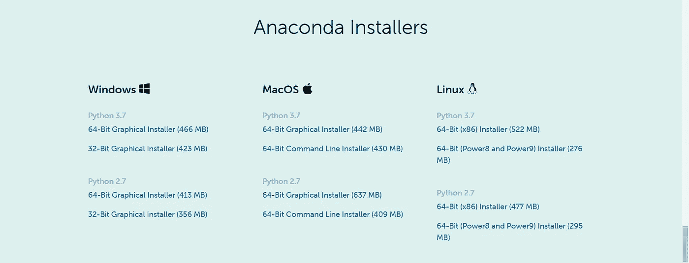
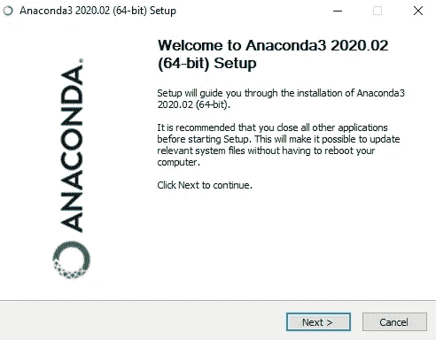
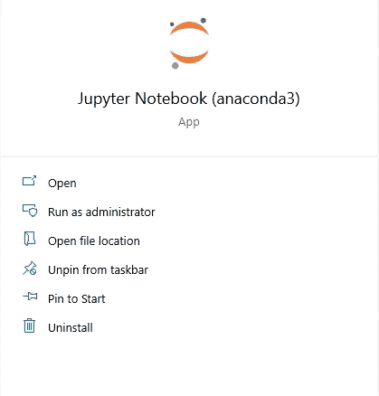
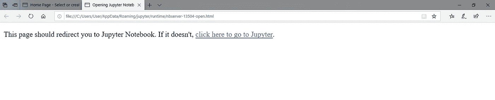

# Python 的安装

> 原文：<https://medium.com/analytics-vidhya/installation-of-python-e12476f83b9?source=collection_archive---------35----------------------->

在这里，我们将看到 python 初学者一步一步的安装。

**Python 是什么？**

Python 是一种跨平台编程语言，这意味着它可以在 windows、LINUX、Mac OS 等多种平台上运行，甚至已经移植到 Java 和。net 虚拟机。它是免费和开源的。

**如何运行 Python？？？**

运行 python 最简单的方法是使用 Jupyter IDE。顺便问一下，这是什么 IDE？？？

***集成开发环境*** *: IDE 使程序员能够融合编写计算机程序的不同方面。它还提高了编程的效率。*

我使用 python 的 Anaconda 发行版。基本上 Anaconda 是一个 python 和 R 发行版。它提供了数据科学所需的一切(python ),

水蟒包括，

1.核心 python 编程

2.100 多个 python 库

3.Spyder，Jupyter IDE/编辑

第一步:

从 https://www.anaconda.com/products/individual[下载蟒蛇最新版本](https://www.anaconda.com/products/individual)

第二步:

运行安装程序，在您的计算机上安装 anaconda

第三步:

打开木星笔记本。

用于保存文件的扩展名是。ipynb

第四步:

现在，您已经准备好编写和保存代码了。

*快乐编码……😊😊😊*