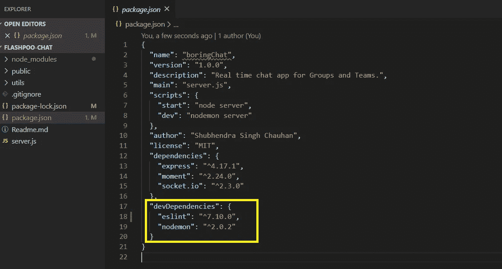

# 在现有的 JavaScript 代码上安装和使用 ESLint

> 原文：<https://medium.com/analytics-vidhya/installing-and-using-eslint-on-your-existing-javascript-code-8ee1f6c45821?source=collection_archive---------12----------------------->

# 为什么是林挺？🤔

Javascript 是一种很棒的语言，但是，由于它很灵活，所以有可能会写出糟糕的代码，让自己陷入困境。Javascript 是一种动态语言，它是松散类型的，这意味着有很多可能出错，所以 ESLint 非常有用，因为***它分析你的代码而不执行它*** *。*
ESLint 是一个*代码质量工具*，它的工作是扫描你的项目文件并指出潜在的问题。问题可以是不严重的，如格式化，也可以是严重的，如试图引用不存在的函数。
现在，ESLint 在这个领域并不孤单，还有其他工具，如 **JSHint** 和 **JSLint** 。所有这些工具都试图解决同一个问题，但是最近几年，社区已经开始转向 ESLint。这是因为 ESLint 在跟上 ES6 和 ES7 的最新功能方面做得更好，而其他工具没有那么好的集成，所以社区已经开始远离它们。


# 安装和设置🎯

有两种方法可以安装 ESLint ***全局地或在你的特定项目中*** 。在全球范围内安装更容易，但在 ESLint 的官方网页上，他们建议不要在全球范围内安装，而应该在每个项目中本地安装，主要原因是这样更容易与其他开发人员就单个项目进行协作，并且有不同的规则(规则是应用于代码的样式约定)。ESLint 是一个包，我们用 NPM 安装它。

对于本教程，我使用我的*现有的*项目 [**存储库**](https://github.com/withshubh/FlashPoo-Chat) 作为示例存储库。主分支将拥有原始代码，我将使用“ [linted](https://github.com/withshubh/FlashPoo-Chat.git) ”分支来安装并使用 ESLint lint 代码。我假设您的系统上已经安装了 *git* 和*节点*。我已经在我的系统上克隆了存储库，并将分支切换到“linted”。


让我们安装 ESlint 并将其保存为开发人员依赖项。我们使用 ESLint 作为开发者依赖，因为你的项目的代码不依赖于 ESLint，相反，当你开发你的项目时，你想使用它，当你发布项目时，它不需要 ESLint。

```
npm install eslint --save-dev 
```

安装完成后，打开 **package.json** 文件，您会在“ **devDependencies** ”下看到 ESLint 的更新条目。



现在，有趣的部分来了，在我们真正开始使用 ESLint 来查找和修复林挺错误之前，先设置 ESLint。我们将通过设置一个配置文件来实现这一点。该过程将逐步通过一系列的问题或偏好，最后，它将创建一个名为 **.eslintrc.{js，yml，json}的配置文件。**

由于我们已经在注册表中托管了 ESLint，我们将使用`npx`(推荐给使用 NPM 版本`5.2.0`或更高版本的用户)或者您可以使用`./node_modules/.bin/eslint`
来初始化配置，运行:

```
npx eslint --initOr./node_modules/.bin/eslint --init
```

ESlint CLI 向导将会出现并询问我们如何配置它。你可以根据自己的喜好选择不同的选项。我想用 ESLint 来**检查语法，发现问题，强制代码风格。**


我已经在我的项目中使用了 javascript 模块，所以我将选择第一个选项。(如果您的项目安装了 babel，那么您肯定需要选择这个选项。如果你正在做一个项目，比如 React、Vue、Angular e.t.c，它们都使用 babel，所以你需要选择这个选项。)


我还没有在我的项目中使用过这些框架，所以我不会选择任何一个。


我没有在我的项目中使用 TypeScript，所以我将选择 No！


我的项目是基于节点的，所以我将选择第二个选项。


现在，我们将看到定义项目代码风格的选项。我将选择**第一个选项**，它将列出由 Airbnb 和 Google 等热门公司创建的风格。选择**第二个选项**将引导您回答一系列问题，这些问题将定义您自己的定制风格定义。或者您可以选择**最后一个选项**来检查另一个项目中的 javascript 文件，并在您的项目中采用相同的规则。


我会选择 Airbnb 风格指南，这是流行的风格指南之一。


最后一步是选择您想要的**格式。eslintrc** 文件。我选择了 javascript 格式。


选择你想要的文件格式后，向导会询问你是否要安装 Airbnb 依赖关系？简单地说，点击“Yes”，然后 ESlint 将启动并安装所有必要的依赖项，并生成一个`.eslintrc.js`配置文件。


我们已经完成了 ESLint 的安装和配置文件的设置。

# 运行 ESLint

## a.检查语法和发现问题

您可以检查单个文件或目录中所有文件的语法和错误。
要检查上**单个文件，**只需运行:

```
npx eslint filename.js 
```

为了检查一个目录中的多个文件您需要指定一个类似`public/**/*.js`的模式，然后 ESLint 将在公共目录以及子目录中的所有文件中查找错误，命令将是:

```
npx eslint public/**/*.js
```

下面的屏幕截图显示了当我使用以下命令对单个文件运行 ESLint 时，它抛出的林挺错误和警告列表:

```
npx eslint server.js
```


## b.解决问题和加强风格

我们使用 ESLint 来查找代码中的错误和警告，现在我们想使用 ESLint 来修复这些错误，但在此之前，下面的截图显示了我在使用 ESLint 修复错误之前的代码外观。


糟糕的造型！

让我们运行命令**修复错误，并使用 ESLint 执行 Airbnb 风格指南**:

```
npx eslint server.js --fix
```

酷！ESLint **修复了 82 个错误**，但我们仍然有 1 个警告，这是因为它被认为是避免在`console`上使用方法的最佳实践。此类消息被认为是用于调试目的，因此不适合发送给客户端。


因此，要修复这个警告，我们必须改变 ESLint 配置文件`.eslintrc.js`中的规则。我将在我的 ESlint 配置文件中添加一个新规则`'no-console': 0,`，它将允许所有的控制台语句，并且不会抛出警告。将这条规则添加到我们的配置文件将允许在整个项目中使用控制台语句，并且不会抛出任何错误。如果您明确希望允许一个控制台语句，那么您可以在当前行添加注释:
:

```
console.log(someThing); /* eslint-disable-line no-console */
```

…或者上一行:

```
/* eslint-disable-next-line no-console */
console.log(someThing);
```


将这条规则添加到我们的配置文件后，我们将再次运行 ESLint 来检查警告/错误，瞧！！没有错误和警告！🤩


代码看起来比使用 ESLint 之前干净多了。


## **在您的项目中设置 ESLINT 规则**

在项目中为 ESLint 定义规则，以通知 ESLINT 您要添加或删除的规则类型。您可以在配置文件的 rules 部分修改/设置您的规则。你可以定义尽可能多的规则，你可以在他们的官方文档 [ESLINT 规则文档](https://eslint.org/docs/rules/)上阅读更多关于 ESLINT 规则的内容。

**奖励:**您可以将 ESLint 链接到您的 javascript 项目编译器:

*   转到您的`package.json`文件，在文件的脚本段中，添加以下内容

```
script:{
    "lint":"eslint"
}
```

**注:***“lint”只是一个普通的词，你可以用任何你觉得舒服的词*

*   在根项目中，您可以使用

```
npm run lint
```

> ESLINT 有助于提高生产率，根据标准编写代码，并在代码库违反风格指南规则时标记错误。通过这篇文章，你应该能够将 ESLINT 集成到你的 Javascript 项目中。