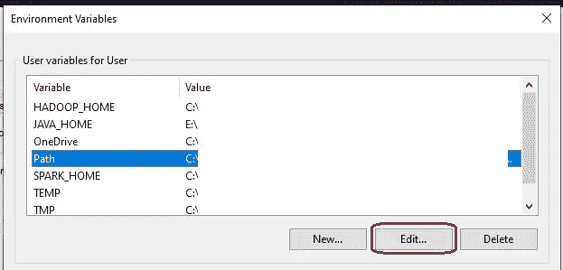

# 在 Windows 机器上安装和使用 PySpark

> 原文：<https://medium.com/analytics-vidhya/installing-and-using-pyspark-on-windows-machine-59c2d64af76e?source=collection_archive---------0----------------------->

## 简化了安装步骤(并且在一定程度上实现了自动化…)

以下步骤已经在两种不同的 Windows 10 笔记本电脑上进行了尝试，两种不同的 Spark 版本(2.x.x)和 Spark **3.1.2** 。


图片来源:[https://upload . wikimedia . org/Wikipedia/commons/thumb/f/F3/Apache _ Spark _ logo . SVG/1280 px-Apache _ Spark _ logo . SVG . png](https://upload.wikimedia.org/wikipedia/commons/thumb/f/f3/Apache_Spark_logo.svg/1280px-Apache_Spark_logo.svg.png)

# 安装先决条件

> PySpark 需要 Java 版本 7 或更高版本和 Python 版本 2.6 或更高版本。

1.  **Java**

要检查 Java 是否已经可用并找到它的版本，请打开命令提示符并键入以下命令。

```
java -version
```

如果上面的命令输出如下，那么您已经有了 Java，因此可以跳过下面的步骤。

```
java version "1.8.0_271"
Java(TM) SE Runtime Environment (build 1.8.0_271-b09)
Java HotSpot(TM) 64-Bit Server VM (build 25.271-b09, mixed mode)
```

Java 有两个包: **JRE** 和 **JDK** 。在两者之间使用哪一个取决于你是想只使用 Java 还是想为 Java 开发应用程序。

你可以从甲骨文网站[下载其中任何一个。](https://www.oracle.com/java/technologies/javase-jre8-downloads.html)

> 你是想运行 Java 程序，还是想开发 Java 程序？如果您想运行 Java 程序，但不想开发它们，请下载 Java 运行时环境，或 JRE
> 
> 如果你想为 Java 开发应用程序，下载 Java 开发工具包，或 JDK。JDK 包含 JRE，因此您不必分别下载两者。

**对于我们的例子，我们只想使用 Java，因此我们将下载 JRE 文件**。
1。根据您的 Windows 是 32 位还是 64 位，下载 Windows x86(如[jre-8u271-windows-i586.exe](https://www.oracle.com/java/technologies/javase-jre8-downloads.html#license-lightbox)或 Windows x64([jre-8u271-windows-x64.exe](https://www.oracle.com/java/technologies/javase-jre8-downloads.html#license-lightbox))版本 2。该网站可能会要求注册，在这种情况下，你可以使用你的电子邮件 id
3 注册。下载后运行安装程序。

**注**:以上两个`.exe`文件需要管理员权限才能安装。

如果您没有机器的管理员权限，请下载`.tar.gz`版本(例如[jre-8u271-windows-x64.tar.gz](https://download.oracle.com/otn/java/jdk/8u271-b09/61ae65e088624f5aaa0b1d2d801acb16/jre-8u271-windows-x64.tar.gz))。然后，解压缩下载的文件，你就有了一个 Java JRE 或 JDK 安装。
你可以使用 [7zip](https://www.7-zip.org/download.html) 解压文件。解压`.tar.gz`文件将得到一个`.tar`文件——使用 7zip 再解压一次。
或者您可以在 cmd 中运行以下命令来提取下载的文件:

```
tar -xvzf jre-8u271-windows-x64.tar.gz
```

记下 Java 的安装位置，因为我们稍后将需要该路径。

2. **Python**

使用蟒蛇安装-[https://www.anaconda.com/products/individual](https://www.anaconda.com/products/individual)

使用以下命令检查 Python 的版本。

```
python --version
```

如果您已经使用 Anaconda 安装了它，请在 Anaconda 提示符下运行上面的命令。它应该给出如下所示的输出。

```
Python 3.7.9
```

**注意** : Spark 2.x.x 不支持 Python 3.8。请安装 python 3.7.x，更多信息请参考[本 stackoverflow 问题](https://stackoverflow.com/questions/62208730/pyspark-2-4-5-is-not-compatible-with-python-3-8-3-how-do-i-solve-this)。Spark 3.x.x 支持 Python 3.8。

# 脚本安装

以下步骤可以作为批处理文件编写脚本并一次性运行。脚本已在下面的演练后提供。

# 获取火花文件

从 [Apache spark 下载](https://archive.apache.org/dist/spark/)网站下载所需的 Spark 版本文件。获取' spark-x.x.x-bin-hadoop2.7.tgz '文件，例如[spark-2 . 4 . 3-bin-Hadoop 2.7 . tgz](https://archive.apache.org/dist/spark/spark-2.4.3/spark-2.4.3-bin-hadoop2.7.tgz)。

Spark 3.x.x 也附带了 Hadoop 3.2，但是这个 Hadoop 版本在编写 Parquet 文件时会导致错误，所以建议使用 Hadoop 2.7。

> 对所选 spark 版本的剩余步骤进行相应的更改。

您可以使用 7zip 解压文件。解压`.tgz`文件将得到一个`.tar`文件——使用 7zip 再解压一次。或者，您可以在 cmd 中对下载的文件运行以下命令来提取它:

```
tar -xvzf spark-2.4.3-bin-hadoop2.7.tgz
```

# 把所有东西放在一起

## 设置文件夹

在您选择的位置为 spark 安装创建一个文件夹。如`C:\spark_setup`。

提取 spark 文件并将文件夹粘贴到选择的文件夹:`C:\spark_setup\spark-2.4.3-bin-hadoop2.7`

## 添加 winutils.exe

从这个 [GitHub 库](https://github.com/steveloughran/winutils)下载对应 Spark 和 Hadoop 版本的 winutils.exe 文件。

我们正在使用 Hadoop 2.7，因此从`hadoop-2.7.1/bin/`下载 winutils.exe。

在下面的路径中复制并替换这个文件(创建`\hadoop\bin`目录)

*   `C:\spark_setup\spark-2.4.3-bin-hadoop2.7\bin`
*   `C:\spark_setup\spark-2.4.3-bin-hadoop2.7\hadoop\bin`

## 设置环境变量

我们必须设置下面的环境变量，让 spark 知道所需的文件在哪里。

在开始菜单中输入“环境变量”并选择“**编辑系统环境变量**


点击“**环境变量…** ”


添加'**新…** '变量


1.  变量名:`SPARK_HOME`
    变量值:`C:\spark_setup\spark-2.4.3-bin-hadoop2.7`(设置文件夹路径)
2.  变量名:`HADOOP_HOME`
    变量值:`C:\spark_setup\spark-2.4.3-bin-hadoop2.7\hadoop`
    或
    变量值:`%SPARK_HOME%\hadoop`
3.  变量名:`JAVA_HOME`
    变量值:设置为 Java 安装文件夹，如`C:\Program Files\Java\jre1.8.0_271`
    根据上面安装的版本在“程序文件”或“程序文件(x86)”中查找。如果您使用的是`.tar.gz`版本，请将路径设置为解压缩的位置。
4.  变量名:`PYSPARK_PYTHON`
    变量值:`python`
    该环境变量是确保涉及 python 工作器的任务(如 UDF)正常工作所必需的。参见[本栈溢出岗位](https://stackoverflow.com/questions/56213955/python-worker-failed-to-connect-back-in-pyspark-or-spark-version-2-3-1)。
5.  选择'**路径**变量，点击'**编辑…【T38]'**



点击'**新建** ' ，添加火花仓路径，如`C:\spark_setup\spark-2.4.3-bin-hadoop2.7\bin`或`%SPARK_HOME%\bin`


已经设置了所有必需的环境变量。

**可选变量**:如果您想在 Jupyter 笔记本上使用 PySpark，请设置以下变量。如果没有设置，PySpark 会话将在控制台上启动。

1.  变量名:`PYSPARK_DRIVER_PYTHON`
    变量值:`jupyter`
2.  变量名:`PYSPARK_DRIVER_PYTHON_OPTS`
    变量值:`notebook`

# 脚本安装

编辑并使用下面的脚本来(几乎)自动化 PySpark 设置过程。

> 没有自动化的步骤: **Java & Python 安装**，以及**更新“路径”变量**。
> 
> 在运行脚本之前安装 Java 和 Python，并在运行脚本之后编辑“Path”变量，如上面的演练中所述。

针对所需的 spark 版本和安装路径对脚本进行更改。保存为`.bat`文件，双击运行。

# 在 Windows 上以独立模式使用 PySpark

如果下面的命令不起作用，你可能需要在上述步骤后重启你的机器。

## 命令

每个命令都在单独的 Anaconda 提示符下运行

1.  **部署 Master** `spark-class.cmd org.apache.spark.deploy.master.Master -h 127.0.0.1` 打开浏览器，导航到: [http://localhost:8080/。这是 SparkUI。](http://localhost:8080/.)
2.  **正在部署工人** `spark-class.cmd org.apache.spark.deploy.worker.Worker spark://127.0.0.1:7077` SparkUI 将显示工人状态。


3. **PySpark 外壳** `pyspark --master spark://127.0.0.1:7077 --num-executors 1 --executor-cores 1 --executor-memory 4g --driver-memory 2g --conf spark.dynamicAllocation.enabled=false`

根据机器配置调整`num-executors`、`executor-cores`、`executor-memory`和`driver-memory`。SparkUI 将显示 PySparkShell 会话列表。

在运行上面的 pyspark 命令之前，在第三个 anaconda 提示符中激活所需的 python 环境。

如果您已经设置了`PYSPARK_DRIVER_PYTHON`和`PYSPARK_DRIVER_PYTHON_OPTS`环境变量，上面的命令将打开 Jupyter Notebook 而不是 pyspark shell。

# 供选择的

运行以下命令，使用计算机上的所有可用资源启动 pyspark (shell 或 jupyter)会话。在运行 pyspark 命令之前，激活所需的 python 环境。

`pyspark --master local[*]`

如果任何步骤出错或者你面临任何问题，请在评论中告诉我。