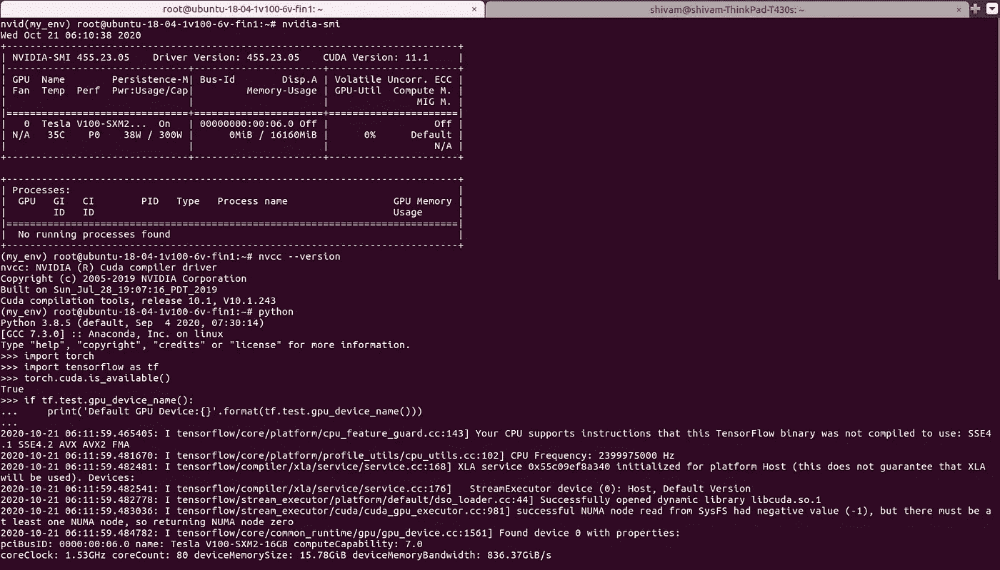
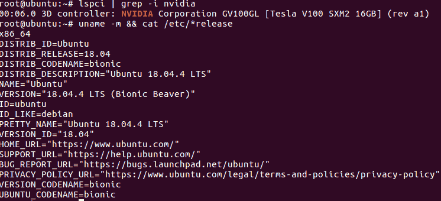

# 在 Ubuntu 上安装任何版本的 CUDA，在 GPU 上使用 Tensorflow 和 Torch

> 原文：<https://medium.com/analytics-vidhya/installing-any-version-of-cuda-on-ubuntu-and-using-tensorflow-and-torch-on-gpu-b1a954500786?source=collection_archive---------2----------------------->

安装 Cuda，然后安装两个主要的深度学习库即 Tensorflow 和 Pytorch 并在 GPU 上运行仍然是一项艰巨的任务。AWS 和其他 GPU 提供商为机器提供了所有已安装的库，但通常情况并非如此。

我们的目标是在 Ubuntus 上运行下图，让 nvidia-smi，nvcc-version，torch.cuda.is_available()，tf.test.gpu_devic_name() 都正常工作。



在本文中，我们将看到如何安装任何版本的 CUDA，并让它与 Pytorch 和 Tensorflow 一起运行。我特别展示了兼容 Tensorflow 和 Pytorch 的安装 CUDA 10.1。

让我们先来看看在您的系统上安装 CUDA 的先决条件。

## 1.先决条件说明

1.1 使用以下工具验证您是否拥有支持 CUDA 的 GPU:

```
**lspci | grep -i nvidia**
```

它列出了您系统上的 Nvidia GPU。检查一下 https://developer.nvidia.com/cuda-gpus 上的[。如果列出来了，说明你的 GPU 是支持 CUDA 的。另外，看，这是计算能力。。我的 GPU 具有 7.0 的计算兼容性](https://developer.nvidia.com/cuda-gpus)

1.2 检查 Linux 版本

Linux 有许多版本，一些发行版支持 CUDA:要确定您运行的发行版和发行版号，请在命令行中键入以下内容。

```
**uname -m && cat /etc/*release**
```

我对最后两个命令的输出如下所示。我的 GPU 是特斯拉 V100。



1.3 验证系统是否安装了 gcc。

许多系统都预装了 GCC。使用 **gcc - version** 检查您的系统上是否安装了 gcc。如果没有安装，请使用以下命令。

```
sudo apt-get install manpages-dev
sudo apt-get update
sudo apt install build-essential
sudo apt-get install manpages-dev
```

1.  4 验证正确的内核头

您的系统正在运行一些内核版本。在安装和重建库的时候，Cuda 需要相同内核版本的内核头文件和开发包。例如，如果您的系统运行的是内核版本 3 . 17 . 4–301，则还必须安装 3 . 17 . 4–301 内核头文件和开发包

当前运行的内核的内核头文件和开发包可以用下面的命令安装，其中 **uname -r** 给出了系统上当前的内核版本。

```
**sudo apt-get install linux-headers-$(uname -r)**
```

## **2。安装 CUDA 工具包**

如果我们在这里，您现在已经具备了在您的系统上安装 CUDA 的所有先决条件。让我们开始安装吧。

可以使用两种不同的安装机制来安装 CUDA 工具包:特定于发行版的包(RPM 和 Deb 包)，或者独立于发行版的包(runfile 包)。独立于发行版的包的优点是可以在更广泛的 Linux 发行版上工作，但是不更新发行版的本地包管理系统。特定于发行版的软件包与发行版的本地软件包管理系统相连接。建议尽可能使用特定于发行版的包。出于我们的目的，我们将使用一个特定于发行版的包。

你可以在这里[https://developer.nvidia.com/cuda-toolkit-archive](https://developer.nvidia.com/cuda-toolkit-archive)找到与任何 CUDA 版本相关的文档。我特别为 CUDA 版本 10.1 做了这件事。

```
 #download desired version of CUDA, 10.1 in my case. 2.1 wget https://developer.download.nvidia.com/compute/cuda/repos/ubuntu1804/x86_64/cuda-repo-ubuntu1804_10.1.105-1_amd64.deb

2.2 sudo dpkg -i cuda-repo-ubuntu1804_10.1.105-1_amd64.deb

2.3 sudo apt-key adv --fetch-keys             https://developer.download.nvidia.com/compute/cuda/repos/ubuntu1804/x86_64/7fa2af80.pub2.4 sudo apt-get update
```

对大多数人来说，下一行是棘手和令人困惑的。因为它安装了最新的 CUDA 版本，如果你不想要最新版本的 Cuda，就不要使用它。
**sudo apt-get 安装 cuda** (不用，用下面一个)

```
2.5 sudo apt-get install cuda-10-1
```

如果您现在使用 nvidia-smi 或 nvcc 版本，它们将无法工作，因为它们尚未添加到 bashrc 中。现在更新 bashrc。

将下面几行添加到您的 bashrc 中。

```
export PATH="/usr/local/cuda-10.1/bin:$PATH"
export LD_LIBRARY_PATH="/usr/local/cuda-10.1/lib64:$LD_LIBRARY_PATH"
```

在那之后，

```
source .bashrc
```

试试吧，nvidia-smi 或者 nvcc——现在版本。如果它们中的任何一个现在不工作，尝试重新启动系统。会有用的。

我们现在需要安装 Pytorch 和 TensorFlow。我们可以使用 pip 或 conda 环境。如果不想手动安装 CuDNN，不如用 anaconda。它自动安装 CuDNN，省去了很多麻烦。我将使用 anaconda 来安装 Tensorflow 的和 Pytorch 的 GPU 版本。

现在安装 anaconda。我特意点了这个链接[https://www . digital ocean . com/community/tutorials/how-to-install-anaconda-on-Ubuntu-18-04-quick start](https://www.digitalocean.com/community/tutorials/how-to-install-anaconda-on-ubuntu-18-04-quickstart)

现在使用 conda 创建一个类似的环境并激活它:

```
conda create --name my_env python=3
conda activate my_env
```

在这个环境即 my-env 中，安装适当版本的 Tensorflow 和 GPU。

```
conda install pytorch torchvision cudatoolkit=10.1 -c pytorch
conda install tensorflow-gpu
```

它将安装 PyTorch 和 TensorFlow。要检查它们是否工作:现在打开 python 终端，并在其中导入 TensorFlow 和 torch。现在，做:

```
torch.cuda.is_available()
```

如果它返回真，火炬能够使用 GPU。现在检查 TensorFlow。如果以下命令显示 GPU 名称，则 Tensorflow 也可以使用 GPU。

```
print (tf.test.gpu_device_name())
```

现在，nvidia-smi、nvcc 版本都可以工作，事实上，torch 和 Tensorlfow 也可以使用 GPU。如何使用 docker 在 GPU 上训练深度学习模型，敬请关注。