# 在 Windows 上安装 CUDA 和 cuDNN

> 原文：<https://medium.com/analytics-vidhya/installing-cuda-and-cudnn-on-windows-d44b8e9876b5?source=collection_archive---------1----------------------->

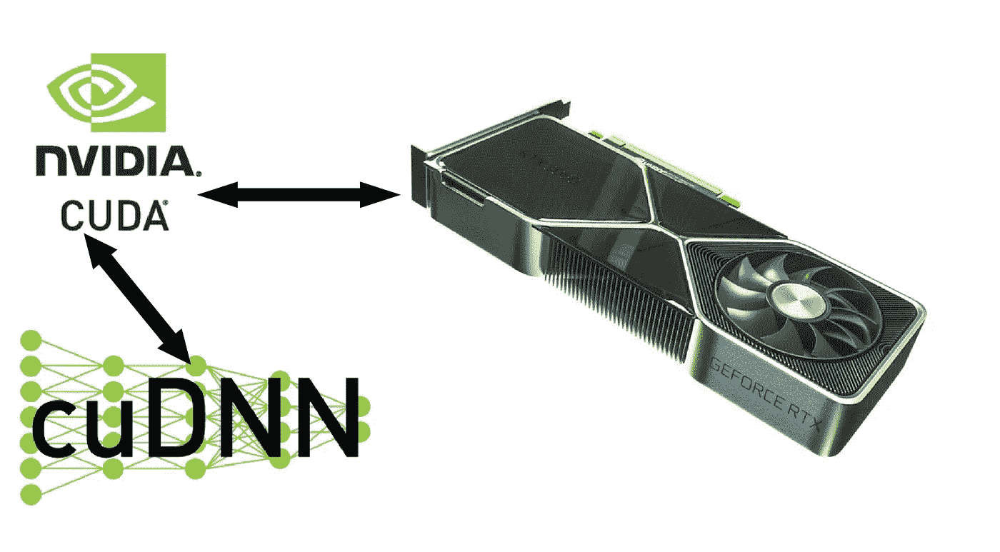

像 Tensorflow 和 OpenCV 这样的库是为与 GPU 一起工作而优化的。为了让这些库与 GPU 通信，我们安装了 CUDA 和 cuDNN，前提是 GPU 与 CUDA 兼容。根据 GPU 的架构和型号，CUDA 有不同的版本。
因此，在安装 CUDA 的过程中，我们需要首先找到适合我们机器的 GPU 的版本。

## 寻找合适的版本

*   支持 Cuda 的 GPU 及其版本可以在这里找到:([https://docs . NVIDIA . com/cuda/cuda-installation-guide-Microsoft-windows/index . html](https://docs.nvidia.com/cuda/cuda-installation-guide-microsoft-windows/index.html))
*   根据您的 TensorFlow 版本，从该网站查找合适的 Cuda 版本:([https://www.tensorflow.org/install/gpu](https://www.tensorflow.org/install/gpu))。在我的例子中，Cuda 版本是 10.1
*   现在根据你的 Cuda 版本找到一个合适的 cuDNN 版本，通过这个链接下载:([https://developer.nvidia.com/rdp/cudnn-archive](https://developer.nvidia.com/rdp/cudnn-archive))。在我的例子中，cuDNN 版本是 7.6.5

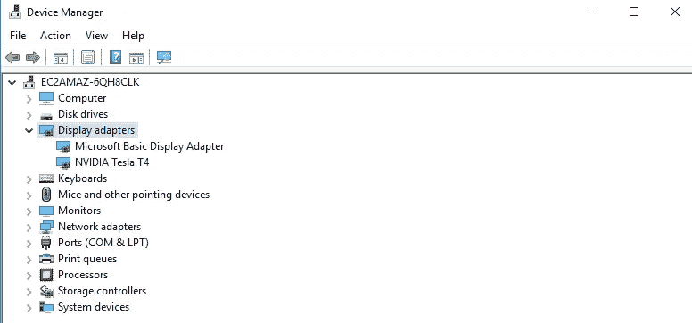

# 安装步骤

## 1.卸载所有 CUDA 安装

转到已安装的程序，搜索所有安装 CUDA 的地方。如果它们的版本不符合您的要求，请卸载所有的版本。

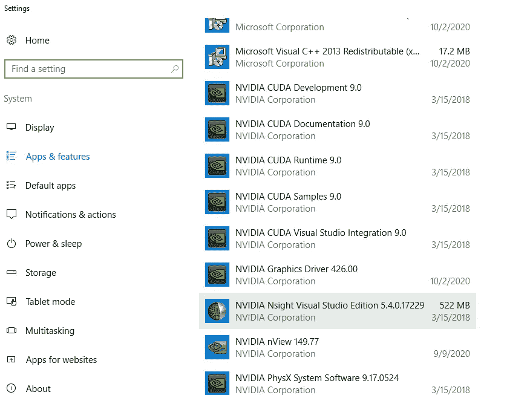

## 2.为 nsight 安装 visual studio community edition 19

转到此链接并下载最新的社区版 visual studio:[https://visualstudio.microsoft.com/downloads/](https://visualstudio.microsoft.com/downloads/)
默认安装所有并检查 c++选项卡:-

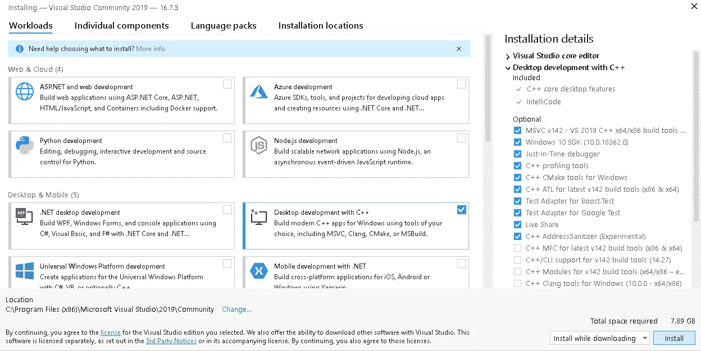

## 3.下载并安装 CUDA 工具包

下载并遵循所有默认程序，并在安装后检查环境变量

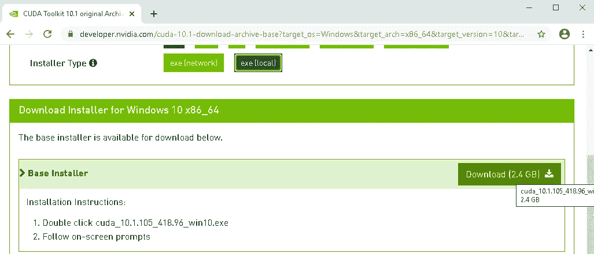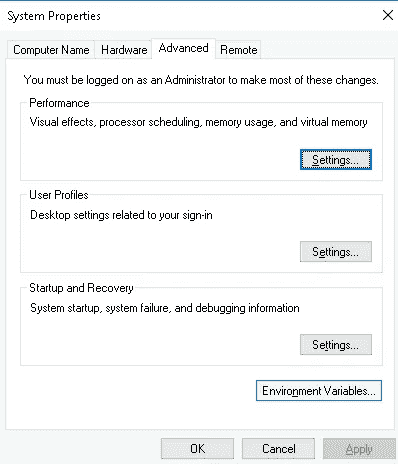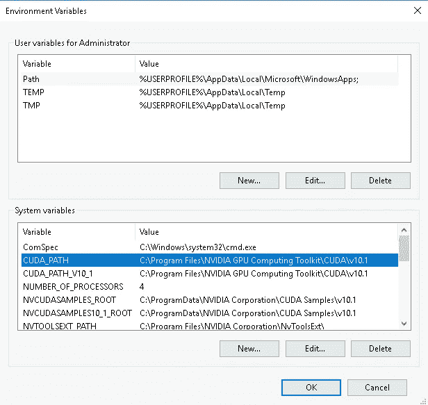

## 4.登录并下载 cuDNN

为了下载 cuDNN，我们需要在 NVIDIA 网站上注册我们的账户:[https://developer.nvidia.com/rdp/cudnn-archive](https://developer.nvidia.com/rdp/cudnn-archive)。
下载并提取符合您合适的 Cuda 版本并满足 Tensorflow 要求的版本。
我的情况是 10.1 CUDA 7 . 6 . 5。

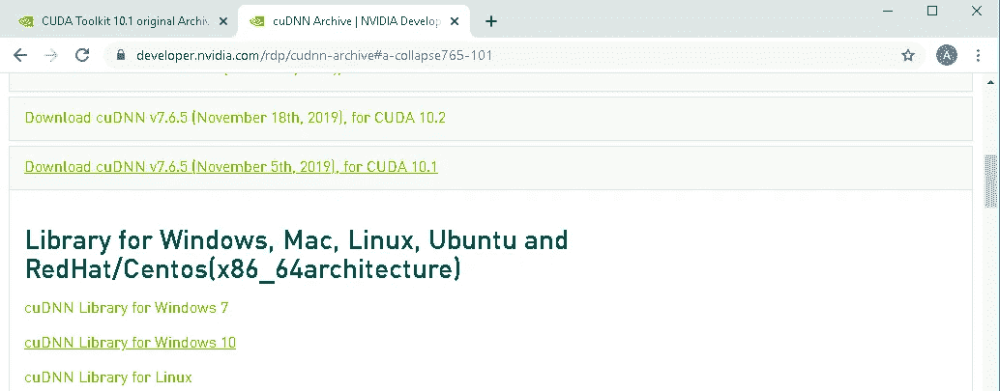

## 5.安装 cuDNN

*   在我的例子中，找到 CUDA 安装文件夹:C:\ Program Files \ NVIDIA GPU Computing Toolkit \ CUDA \ v 10.1 \
*   与后来下载的 cuDNN 文件夹并排打开文件夹 v10.1。
*   我们只需要将各自的文件从 cuDNN 复制到 CUDA 安装文件夹中。从 bin 到 bin，包含到包含，lib/x64 到 lib/x64。只需将 cudnn 文件夹中的文件拖放到 CUDA 的相应文件夹中

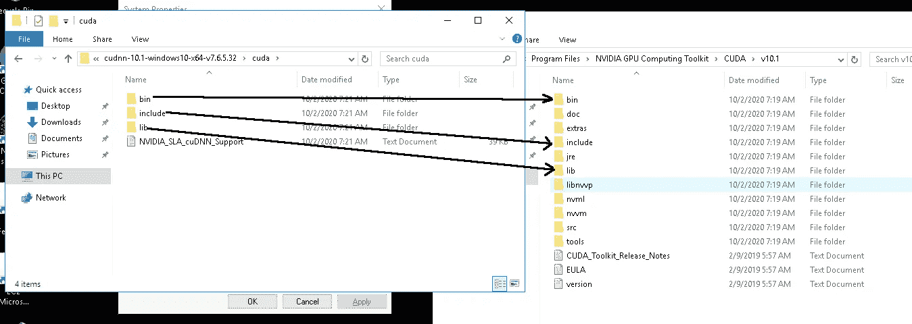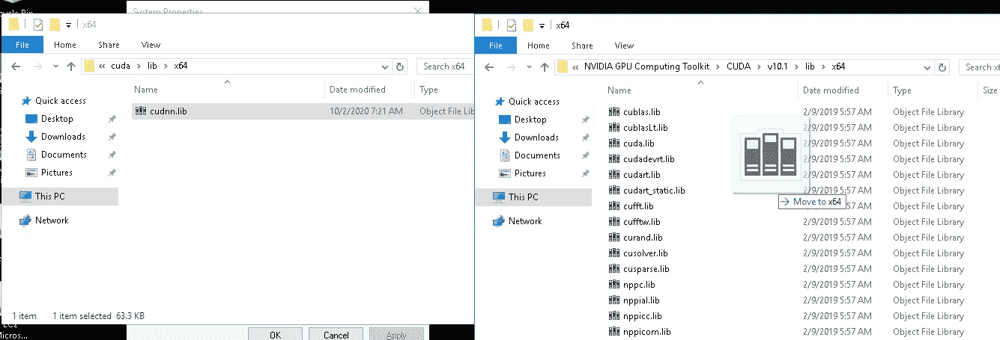

*   我们的 cuDNN 现在也安装了

安装现已完成。

## 确认我们的安装

假设您已经安装了 python 和 TensorFlow，现在我们将在命令提示符下测试 Tensorflow 是否正在通过 Python 访问 GPU。

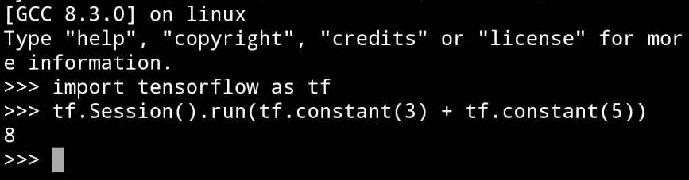

恭喜，我们现在可以访问我们的 GPU 了，让我们预热一下吧！！！

# 结论

CUDA 和 cuDNN 的安装非常简单，但检查适合我们的 GPU 和 Tensorflow 的版本是主要任务。还有一个问题是“路径”，我们需要检查在安装过程中系统环境变量中的路径设置是否正确。如果这些事情都考虑到了，那么我们就可以走了。