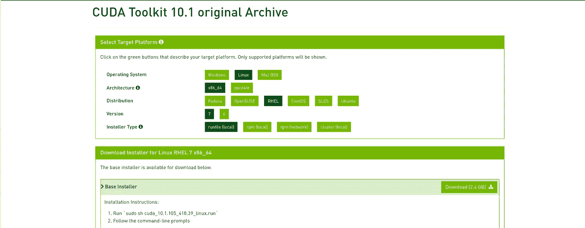
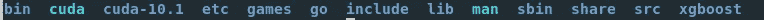
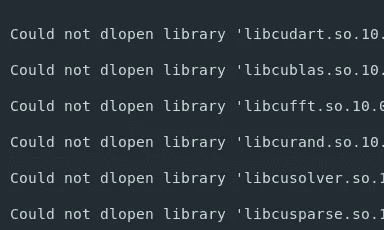
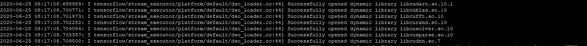
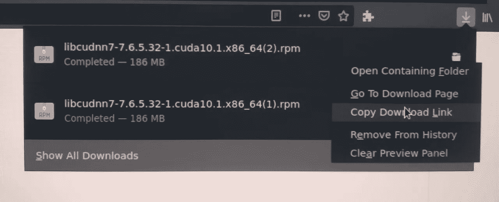
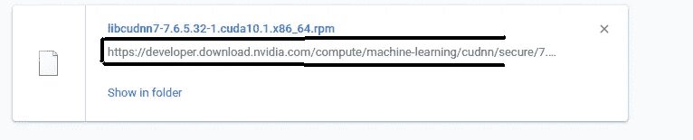

# 如何在红帽企业版 Linux (rhel7)和 Ubuntu 上安装 CUDA

> 原文：<https://medium.com/analytics-vidhya/installing-cuda-on-red-hat-linux-and-ubuntu-dda69cd5ab9c?source=collection_archive---------3----------------------->

在我们的机器上安装 CUDA 总是一件艰难的工作，即使我们已经做了很多次。有时候会碰巧给 TensorFlow 安装了错误版本的 CUDA。很多时候，我们会搞不清楚我们的安装有什么问题。

是的，我们都去过那里。这就是为什么人们说，“不要碰 CUDA，除非你知道你在做什么”


所以我在这里介绍了在 rhel7 上安装 CUDA-10.1(支持 tf 2.x)的步骤。而且也可以用于 Ubuntu。

**第一步:登录英伟达**

从 [Nvidia-Home](https://developer.nvidia.com/) 完成您的档案注册，并使用您的凭证登录。

**第二步:下载 CUDA-10.1 运行文件(本地)**

1.  进入此页面— [下载运行文件](https://developer.nvidia.com/cuda-10.1-download-archive-base?target_os=Linux&target_arch=x86_64&target_distro=RHEL&target_version=7&target_type=runfilelocal)。



2.右键单击下载，然后单击“复制链接位置/地址”
3。通过以下方式在您的计算机上执行运行文件

**第三步:环境变量**

**检查安装:**

步骤 2 必须已经安装了 CUDA-10.1。您可以通过以下方式检查二进制文件和库

```
ls /usr/local
```

输出应该如下所示。



**检查版本:**

您可以通过以下方式检查当前的 CUDA 版本

```
nvcc -V
```

或者

```
cat /usr/local/cuda/version.txt
```

**检查库:**

1.  执行此命令检查 TF 库之间的冲突。

```
pip3 freeze |grep tensorflow
```

如果同时显示 TensorFlow 和 TensorFlow-GPU，卸载 TensorFlow，保留 TensorFlow-GPU。

2.运行这个 python 脚本来检查 GPU 访问

如果它返回 **FALSE，**那么寻找这个错误“无法打开库”，如果它在那里，问题的原因是由于 CUDA 变量。



图书馆问题

3.确保所有上述 CUDA 库都在这个目录中

```
ls /usr/local/cuda-10.1/lib64/
```

**分配变量:**

如果所有的库都在那里，将目录指定为 CUDA_HOME。

如果您是远程机器上的用户之一，每次会话都会删除您每次分配的本地变量。所以您应该在 bash_profile 中编写这些更改。

```
nano /home/UserName/.bash_profile
```

然后将这些行添加到。bash_profile

并执行以下操作来保存更改

```
source /home/UserName/.bash_profile
```

执行完这些步骤后，您将获得 tf.test.is_gpu_available()的“成功打开的动态库”。



如果您收到任何错误“无法打开库 libcudnn.so.7”，请按照以下步骤操作。

**步骤 4:安装 libcudnn 7**

进入此页面— [cuDNN](https://developer.nvidia.com/rdp/cudnn-download) 并下载适用于 CUDA 10.1 的**cud nn v 7 . 6 . 5**

并从您的浏览器获取下载链接



对于 Firefox



对于 Chrome

并执行这些命令

在成功安装 cuDNN 之后，您就可以在 GPU s 上训练您的模型了🤟🤙

别忘了重启你的机器，它需要刷新一下:)