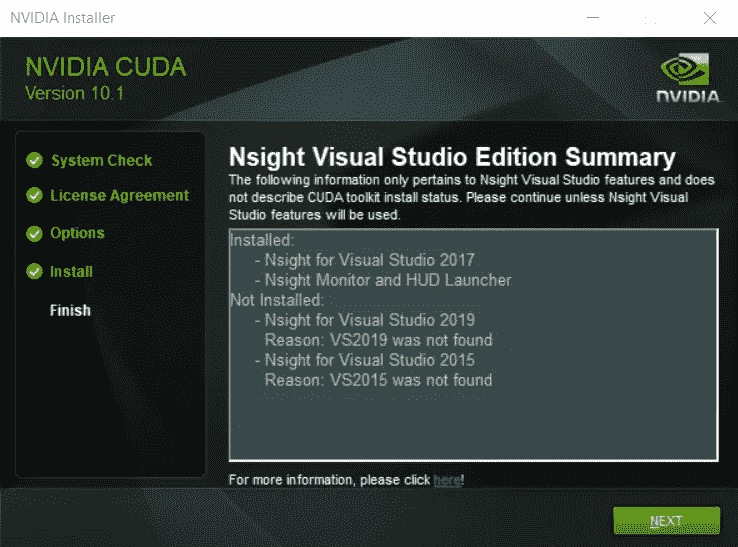
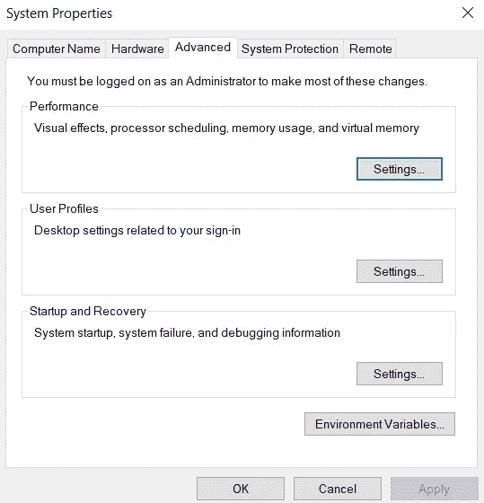
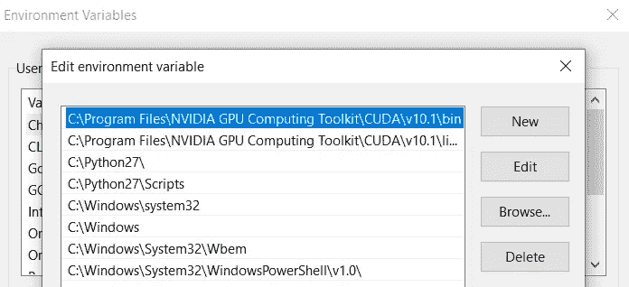
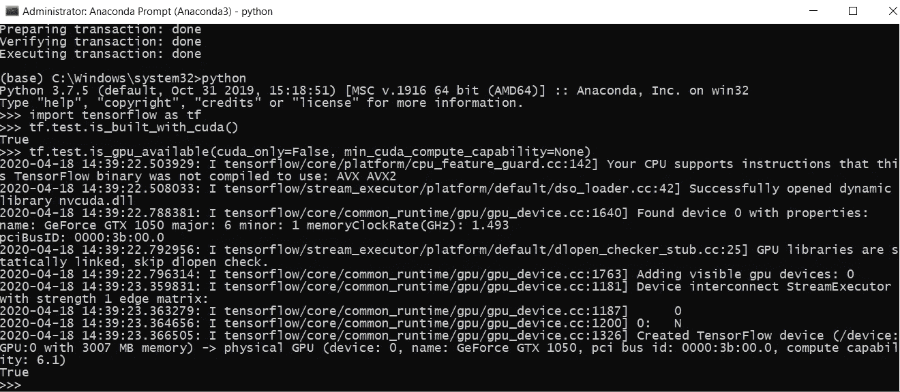

# 在 Windows 10 上使用 TensorFlow 安装 cuDNN for GPU 支持

> 原文：<https://medium.com/analytics-vidhya/installing-cudnn-for-gpu-support-with-tensorflow-on-windows-10-aff10c6c9929?source=collection_archive---------4----------------------->


NVIDIA 开发者博客

我在这个平台上写东西已经有一段时间了，好像已经快忘记了😛但是我又来了，我有一堆写得很长的帖子，我会以更短的时间间隔发布，而且不仅仅是安装的东西，我保证😛

所以当我在攻读计算机科学硕士学位时，我不得不写一篇学期论文(唉，我讨厌它们！)关于并行编程的一些现代用法。就在那时，我偶然发现了深度神经网络 CUDA(或 **cuDNN** )。现在这听起来可能不太现代，但对于像我这样的初学者来说，它仍然是相当陌生的(相信我，我总是一个初学者)。

CuDNN 实际上是一个流行的库，可以与 Tensorflow、Pytorch 和 Caffe 等许多现代深度学习框架一起使用，以利用计算机上的 GPU。因此，这篇文章假设你的电脑已经有一个支持 NVIDIA CUDA 的 GPU。

*注意:如果你有一个 AMD 的 GPU，这个帖子不会工作。你可以改试试* [*这个*](https://towardsdatascience.com/train-neural-networks-using-amd-gpus-and-keras-37189c453878) *出来。*

您还需要 Visual Studio Express 社区版 2017 或更高版本，CUDA 才能在您的计算机上正常工作。

# 从 CUDA 开始

所以让我们从[这里](https://developer.nvidia.com/cuda-toolkit)下载用于 Windows 10 的 CUDA 工具包开始吧。为了稳定起见，我安装了 10.1 版本，但 10.2 是当前提供的版本。这也是需要检查的，因为我们需要检查它与我们安装的 TensorFlow 版本的兼容性。



用于 Windows 10 的 Nvidia CUDA 工具包安装程序中的一个步骤

它执行所有的系统检查，也检查必需品。所以如果你之前忘了安装 Visual Studio，这个安装程序会再次提醒你！此外，坚持使用安装程序中的所有默认选项。我们不想定制任何东西。

有时，会打开一个 Nvidia GeForce 体验窗口，并提示您注册 Nvidia。如果你现在想的话，可以跳过这一步。我继续并注册了，因为下载 cuDNN 需要注册。

# 安装 cuDNN

下一步是为 CUDA 10.1 下载相应的 cuDNN 包。你会在这里找到。对我来说，这个版本就是 7.6.5.32。为了确保安全，您可以随时查看 [TensorFlow](https://www.tensorflow.org/install/gpu) 网站来检查 GPU 的版本兼容性。

解压 cuDNN 文件。路径应该是这样的:

```
<someUserPath>\cudnn-10.1-windows10-x64-v7.6.5.32\cuda
```

让我们称这个路径为 a。现在，我们只想使用这个包中的 3 个文件。从上面路径中的`bin`文件夹开始。复制`cudnn64_7.dll`文件。

现在走下面这条路(姑且称之为 B 路):

```
C:\Program Files\NVIDIA GPU Computing Toolkit\CUDA\v10.1
```

在这里你会找到另一个`bin`文件夹。将此文件粘贴到此文件夹中。

同样，从路径 A 的 include 文件夹中复制`cudnn.h` ，粘贴到路径 b 的 include 文件夹中，再次，从路径 A 的`lib\x64`文件夹中复制`cudnn.lib`，粘贴到路径 b 的相应文件夹中

# 检查环境变量

在 Windows 10 中，通过进入*控制面板→系统和安全→系统→高级系统设置*来完成此操作。

当窗口打开时，进入*高级*选项卡，点击底部的*环境变量*按钮。



然后，您需要转到“系统变量”选项卡中的 Path 变量，并双击以查看如下内容:



`bin`和`libnvvp`各应有一条路径。现在我们已经成功安装。

# 计算机编程语言

如果你还没有安装 python，在这里获得它[。我有 3.7.5 版本，它与 TensorFlow 2.1.0(我将使用它)兼容。继续之前，请在此处](https://www.python.org/downloads/)检查您的兼容性[。](https://www.tensorflow.org/install/pip)

# 蟒蛇

Anaconda 是一个流行的数据科学实践平台。它捆绑了一些令人惊叹的编辑器和 ide，以及预装的各种基本机器学习库(适用于大多数版本)。

我们将确保我们的代码不会影响系统上的其他文件或安装。所以我们将使用虚拟环境进行实验。这篇文章温和地介绍了虚拟环境。

**注意:**你不必按照那个环节安装。我们将在`virtualenv`中使用 Anaconda。

我之前写过一篇关于在 Ubuntu 上安装 Anaconda 的文章。现在，对于 windows，你所需要的就是从[这里](https://www.anaconda.com/products/individual#windows)下载安装程序并运行它。所有的依赖都得到了照顾。

# 张量流

[TensorFlow](https://www.tensorflow.org/) 是 Google 推出的一个强大的机器学习平台。它是许多领先组织用于机器学习开发的最常用平台之一，并且易于上手。它有数以千计的机器学习算法可以作为软件包使用，因此它为用户节省了大量时间。

我们想在 GPU 支持下使用 TensorFlow。对于没有 GPU 的人，可以安装标准的 TensorFlow。

1.  **创建并激活虚拟环境**

首先在您想要的文件夹中打开一个 Anaconda 提示符。您可以通过从 Windows 开始打开提示符，然后导航到您的文件夹来完成此操作。

现在使用命令创建一个虚拟环境

```
conda create --name mygpuenv
```

这里，`mygpuenv`是我的虚拟环境的名称。您可以选择任何其他名称。

下一步是使用命令引导这个新创建的环境

```
conda activate mygpuenv
```

从现在开始，你会看到每个以`(mygpuenv)`开头的提示，直到你取消它。

**2。安装张量流**

现在，我们将在这个环境中安装带有 GPU 支持的 TensorFlow，使用命令

```
conda install -c anaconda tensorflow-gpu
```

这一步让我安装了 2.1.0 版。

我们需要检查 python 安装是否在环境中使用了`tensorflow-gpu`。为此，通过以下命令启动 python 提示符，然后按 enter 键。

```
python
```

现在键入下面这段代码，并在每一行后按 enter 键。

```
>>> import tensorflow as tf
>>> tf.test.is_built_with_cuda()
```

这应该会返回`true`。

然后，

```
>>> tf.test.is_gpu_available(cuda_only=False, min_cuda_compute_capability=None)
```

在返回`true`之前，这可能会给你一些警告，但是不用担心。您的输出应该如下所示。



确保 TensorFlow 使用 GPU

哒哒！您现在已经成功安装了 cuDNN，并准备将其与 TensorFlow 一起使用，以加速您的机器学习模型。

在此之后，我将发布另一个帖子来演示加速。你可以在此期间尝试一下。模型或程序的任何部分都没有变化。

*…*

*鸣谢* [*乔安妮·麦显杰*](https://towardsdatascience.com/@jkitson) *默介*[发帖](https://towardsdatascience.com/installing-tensorflow-with-cuda-cudnn-and-gpu-support-on-windows-10-60693e46e781) *为所有的帮助。*